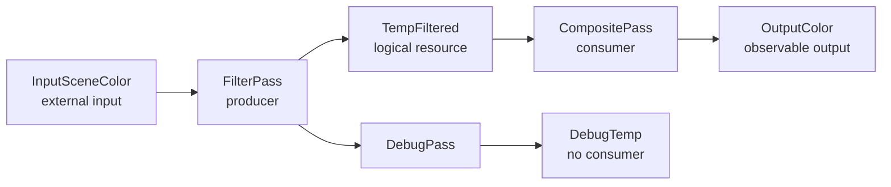
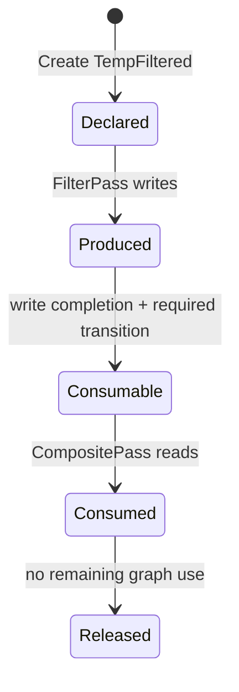
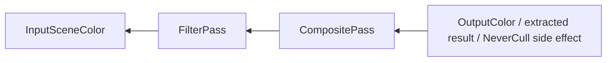
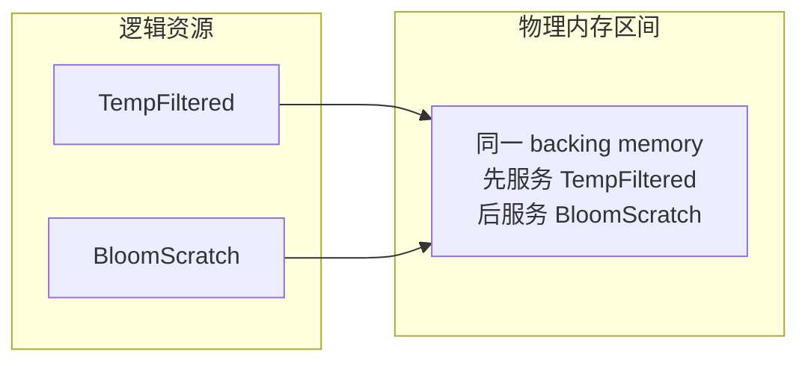
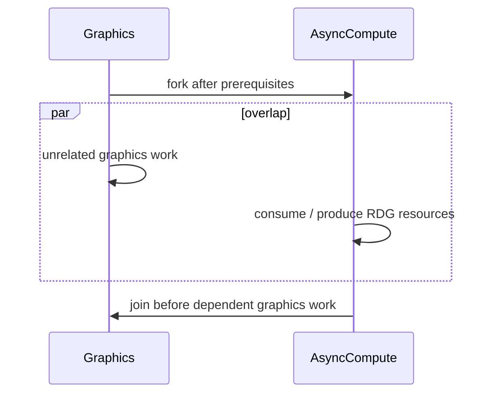
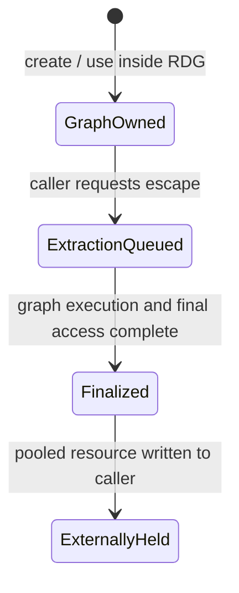
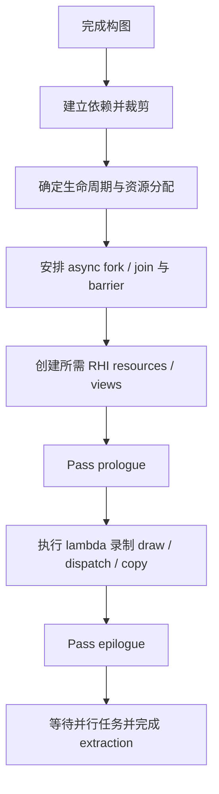
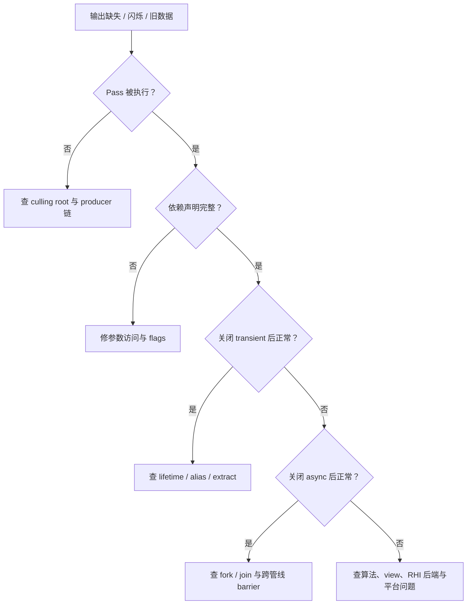

# 05 RenderGraph：把局部声明编译成一帧可执行计划

> **源码版本**: UE5.7  
> **前置阅读**: 01（渲染架构总览）、03（三线程模型）、04（RHI 抽象层）  
> **当前状态**: ✅ 完成（Codex 最终事实回归通过，2026-06-25）  
> **验证记录**: 见同目录 `05_RenderGraph_CoverageMatrix.md`

---

## 这一篇要解决的困惑

第一次读 RDG 代码时，最容易带入一种“顺序命令表”心智模型：代码先 `AddPass(A)`，再 `AddPass(B)`，于是 A 应当先执行；创建一张纹理，于是显存应当已经存在；Pass lambda 里写了 UAV，于是系统应当自然知道谁依赖谁。

这里需要精确区分两件事。`AddPass(A)` 再 `AddPass(B)` 确实建立了候选节点的基本构图顺序，RDG 并不会把整张图当成可以任意拓扑重排的无序集合；但这个顺序本身不能证明 B 声明了对 A 结果的读取，也不能替代裁剪根、资源生命周期、跨管线同步和 barrier 契约。RDG 可以裁掉无贡献节点、并行录制合法区间、合并 render pass，并为 Graphics / AsyncCompute 建立 fork / join，但这些能力都受构图顺序、资源访问和管线约束共同限制。

RDG 接收的首先不是 GPU 命令，而是**关于这一帧的局部声明**：某个 Pass 想读什么、写什么、在哪条管线执行、执行时录制什么命令。等图构建完成后，RDG 才从全帧视角回答更大的问题：哪些工作真的有用，谁必须等谁，资源何时需要物理内存，什么时候可以复用，状态转换放在哪个边界，最终怎样落到 RHI command list。

因此，本章不把 RDG 教成一组 API，也不把 `Compile()` 的调用顺序当作主线。真正要建立的是一台帧内编译器的过程模型：

> **声明产生候选图，依赖赋予图语义，裁剪确定必要工作，生命周期决定物理资源占用，barrier 把逻辑先后变成 GPU 可执行约束，Execute 才把计划交给 RHI。**

如果这个模型成立，许多常见现象就不再反直觉：Pass 被裁掉不是“没调用”，而是它没有通向可观察结果；临时纹理共用显存不是“资源混了”，而是它们的物理占用区间不重叠；barrier 不写在 lambda 里，不是同步消失了，而是同步责任被提升到图编译器。

---

## 本篇边界

RDG 位于渲染线程构图代码与 RHI 命令录制之间。

| 本章负责解释 | 本章不展开 |
|---|---|
| Pass 与资源如何形成依赖图 | 某个阴影、后处理或 Nanite 算法怎样计算 |
| 资源从逻辑句柄到物理分配的生命周期 | D3D12 / Vulkan / Metal 如何编码具体 barrier |
| 裁剪、异步、alias、barrier 如何共同形成执行计划 | 游戏线程怎样产生场景状态 |
| external / extract 怎样改变所有权边界 | GPU 完成命令后的硬件流水线细节 |

04 章已经解释 RHI resource、view、transition 和 command list。这里关心的是：**RDG 为什么知道要创建哪些 RHI 对象，又为什么知道 transition 应该出现在哪里。**

---

## 先把反复出现的过程标签安顿好

这些词不是互不相干的术语，而是同一条编译流水线上的状态标签。

| 标签 | 进入前 | 发生了什么 | 离开后 | 谁负责 |
|---|---|---|---|---|
| graph | 只有局部渲染意图 | Pass、资源与访问被记录并连成依赖 | 得到可分析的候选工作集 | RDG builder |
| pass | 只有一次算法调用意图 | 变成带参数、flags、lambda 的图节点 | 可以被依赖、裁剪和调度 | 声明者提供事实，RDG管理节点 |
| resource lifetime | 只有逻辑资源描述 | 首次需要与最后一次需要被确定 | 得到可分配、释放、复用的占用区间 | RDG 编译器 |
| dependency | 两个 Pass 都接触资源，但先后尚未成立 | 读写关系产生 producer / consumer 约束 | consumer 不会越过必要 producer | 参数声明 + RDG 推导 |
| culling | 所有 Pass 都只是候选 | 从可观察结果反向保留生产链 | 无贡献节点不进入执行计划 | RDG 编译器 |
| barrier | 逻辑访问顺序已知，但 GPU 状态约束尚未落地 | 访问状态、管线与所有权交接被编译到边界 | RHI 可执行安全 transition / fence | RDG 决策，RHI 落地 |
| execute / recording | 已有裁剪后的 Pass、分配、barrier 与 fork/join 计划 | RDG 创建所需 resource/view，执行 lambda，并将合法集合录入局部或主 RHI command list | 平台无关 RHI work 按依赖与集合边界汇合 | RDG Execute 驱动；ParallelPassSet/recorder 生产命令 |
| platform consumption | RHI work 已录制并按确定顺序汇合 | translate/context 消费工作，backend 形成平台命令包，Queue Submit 交给目标队列 | GPU 异步消费；匹配最后 consumer 的 completion evidence 关闭目标使用 | RHI/backend/queue/GPU 分阶段推进 |
| extract | 图内资源原本只服务本次 Execute | 调用方声明执行后仍要持有结果 | 资源成为图输出，底层 pooled resource 回填图外 | 调用方请求，RDG完成交接 |

后文会沿着唯一的 Filter 主线，反复追问四件事：**前一状态是什么、谁改变了它、为什么要这样改变、改变失败时画面和调试证据会怎样。** 为了避免把不同问题压成一条“Pass 顺序”，还要同时维护三条正交坐标轴：

| 坐标轴 | 本章中的固定问题 |
|---|---|
| 责任轴 | 调用方声明什么，RDG 编译什么，allocator 管理什么，RHI 接收什么 |
| 数据轴 | 图句柄、参数元数据、依赖边、编译账本、物理 backing 与命令分别处于哪种形态 |
| 生命周期轴 | 句柄可引用、图语义有效、物理内存占用和 GPU 最后消费分别何时结束 |

三条轴不能相互替代：持有句柄不证明已有 backing，算出 last use 不证明 GPU complete，Pass 在 CPU 上完成录制也不证明平台 queue 已接管。

---

## 一张临时过滤纹理怎样走完整张图

用一个贯穿案例承载全章：

1. `InputSceneColor` 已经存在，作为外部纹理注册进 RDG。
2. `FilterPass` 读取它，并写入图内临时纹理 `TempFiltered`。
3. `CompositePass` 读取 `TempFiltered`，把结果写入帧输出 `OutputColor`。
4. 调试工具还创建了 `DebugTemp`，但没有任何可观察输出读取它。
5. 某个可选路径希望在图执行后继续使用 `TempFiltered`，于是请求 extract。



同一张 `TempFiltered` 在不同阶段并不是同一种“东西”：

- 创建后，它只是带描述符和名字的图内逻辑资源。
- 参数绑定后，它成为 Filter 的写目标和 Composite 的读来源。
- 裁剪后，它所在的生产链被确认必须执行。
- 生命周期编译后，它得到首次 acquire 与最后 release 的区间。
- barrier 编译后，它的写后读交接被放到 Pass 边界。
- Execute 时，它才真正对应可被 RHI 使用的资源与 view。
- 如果被 extract，Execute 结束后底层 pooled resource 才交到图外持有者手中。

本章所有机制，都可以看成在回答这张纹理“现在处于什么状态、谁有权对它做什么”。

---

下面三节解释声明怎样成为可编译事实。阅读重点仍是状态变化：先看输入是什么，再看 RDG 得到了什么可分析数据，最后看这些数据怎样服务于裁剪、生命周期、屏障与执行。符号只用于定位责任边界。

## 实现深挖一：RDG 操作的是图内句柄，不是立即可用的 RHI 资源

在跟踪流程之前，必须先搞清楚一件事：当 Renderer 代码写 `FRDGTextureRef GBufferA = GraphBuilder.CreateTexture(...)` 时，`GBufferA` **不是一张 GPU 纹理**。它是一个句柄（handle）——一个"我承诺将来会有这么一张纹理"的占位符。

这是 RDG 一切能力的前提，值得停下来想清楚为什么。

在 Unity 的传统顺序式用法中，`new RenderTexture(...)` 或 `GetTemporaryRT()` 常让调用方较早获得可操作的纹理对象，但具体原生资源何时创建、是否延迟以及怎样池化仍受 Unity 版本和后端实现影响。这里真正需要比较的是责任模型：RDG 的 `CreateTexture()` 明确只创建图内逻辑身份，不承诺此刻已有独立显存；物理 backing 要等图编译掌握必要性和生命周期后再决定。

为什么要这样推迟？因为只有当 RDG 看到**整帧所有 Pass**之后，它才知道：

- 这张纹理到底有没有 Pass 用它？没人用就根本不分配（死资源消除）。
- 它的"活跃区间"是从第几个 Pass 到第几个 Pass？知道了区间，就能让区间不重叠的两张纹理复用同一块显存（别名分配）。
- 它在每个 Pass 里是被读还是被写、用作 SRV 还是 UAV 还是 RenderTarget？知道了这些，才能自动插入正确的状态转换屏障。

这三件事都要求"先看全貌再决定"。如果 `CreateTexture` 当场就分配显存，这些全局优化全都做不了。所以 RDG 的第一个设计决策就是：**资源的声明（句柄）和资源的实体（RHI 资源）分离，实体延迟到掌握全图信息后再落地。**

`FRDGTexture` / `FRDGBuffer` 这些句柄对象本身从哪来？它们由 `FRDGBuilder` 内部的注册表（`Textures`、`Buffers`，是 `TRDGHandleRegistry` 类型）分配，每个分配出来的句柄带一个紧凑的整型索引 `FRDGTextureHandle`。整个 builder 生命周期里，代码层面传来传去的都是这个轻量指针，GPU 侧的实体由 builder 统一管理。这和 01 篇讲 SceneProxy 时的思路一脉相承：**用一个可以安全跨阶段传递的轻量描述符，代理一个生命周期受控的重量级实体。**

句柄上还挂着两个关键的状态位，后面整篇都会用到（`FRDGViewableResource`）：

- `bProduced`：有没有任何 Pass 写过它。一个从没被写过、却被人读的资源是 bug（读到的是垃圾），RDG 的校验层会抓这个。
- `bExternal` / `bExtracted`：它是不是"从图外导入的"或"要导出到图外的"。这两个标记决定了它不能被裁剪、不能被当成 transient 临时资源——稍后第六节展开。

理解了"句柄≠资源"，我们就能进入第一个真正的机制：Renderer 怎么告诉 RDG "我这个 Pass 要用哪些句柄"。

---


## 实现深挖二：参数结构体怎样变成可遍历的资源访问契约

Pass 参数结构解决的是一个普通 C++ 指针无法解决的问题：运行时必须知道结构体里哪些字段是 RDG texture、buffer、SRV、UAV、uniform buffer 或 render-target binding，它们位于什么偏移，并表达什么访问类型。

`BEGIN_SHADER_PARAMETER_STRUCT` 与各类 `SHADER_PARAMETER_RDG_*` 宏会在编译期生成成员元数据；`FShaderParametersMetadata` 保存字段类型、偏移、数组规模和资源类别；`FRDGParameterStruct` 再把“参数内存”与“布局元数据”配成可遍历视图。RDG 因而不需要理解任意 C++ 对象，只需枚举一份稳定的资源访问清单。对于无法由固定字段完整表达的动态访问集合，还必须通过显式 access arrays 登记资源、范围和访问类型；lambda 内部遍历了一个数组，不等于图编译器自动看见这些访问。

```text
C++ 参数字段
    -> 静态成员元数据（类型、偏移、数量）
    -> 运行时参数视图（参数内存 + 元数据）
    -> texture / buffer / view / binding 访问记录
```

这套元编程的实现内部会把成员串成可收集的编译期描述，并在布局阶段按资源类别组织；但这些宏细节不改变教学主线。真正重要的后置状态是：**原本隐藏在 C++ 字段中的资源引用，已经变成 RDG 可以枚举、验证和编译的访问事实。**

这也是 lambda 中隐藏资源访问危险的原因。若算法实际读写的资源没有进入参数契约，RDG 就无法可靠建立 producer / consumer、生命周期、裁剪关系和 barrier。需要定位实现时，最小锚点是 `FShaderParametersMetadata`、`FRDGParameterStruct` 与参数枚举逻辑，而不是宏展开顺序。

---

## 实现深挖三：AddPass 如何把局部意图登记为候选图节点

现在 Renderer 的 `Render()` 函数开始一个接一个调 `AddPass`。每一次调用，表面上看是"注册一个延迟执行的 Pass"，实际上 RDG 当场就干了不少活：分配 Pass 对象、存住 lambda、扫描参数结构体登记资源访问、建立生产者依赖。我们逐个看。

### 参数结构体从哪来：帧分配器

调 `AddPass` 之前，调用方先 `auto* Params = GraphBuilder.AllocParameters<FMyPass::FParameters>()` 拿到一个清零的参数结构体，填好里面的纹理句柄。这个结构体的内存来自 RDG 的**帧分配器** `FRDGAllocator`：

```cpp
template <typename ParameterStructType>
ParameterStructType* FRDGBuilder::AllocParameters() {
    return Allocators.Root.Alloc<ParameterStructType>();
}
```

这是一个 bump allocator（线性分配器）——它内部攥着大块内存，每次分配只是把指针往前推一下，几乎零开销。整个 builder 的生命周期里，所有 Pass 对象、参数结构体、临时数组都从这里分配，到 `Execute()` 结束后整块释放。这和 03 篇里 RHI 命令链表用 `FMemStackBase` 是同一种思路：**渲染是天然的"一帧一批、批量产生批量销毁"，用线性分配器比一次次 malloc/free 高效得多，也没有碎片。** 这也解释了为什么参数结构体必须用 `AllocParameters` 而不能自己在栈上定义——它的生命周期必须活到 `Execute()`，而你的栈帧早就退了。

### AddPass：分配 Pass 对象、捕获 lambda

`AddPass` 会把参数、flags 和 lambda 交给内部节点构造逻辑：

```cpp
using LambdaPassType = TRDGLambdaPass<ParameterStructType, ExecuteLambdaType>;
FRDGPass* Pass = Allocators.Root.AllocNoDestruct<LambdaPassType>(
    MoveTemp(Name), ParametersMetadata, ParameterStruct,
    OverridePassFlags(NameString, Flags), MoveTemp(ExecuteLambda));
Passes.Insert(Pass);
SetupParameterPass(Pass);
```

三件事：从帧分配器造一个 `TRDGLambdaPass`、插进 `Passes` 注册表（得到一个 `FRDGPassHandle`，本质是数组下标）、调 `SetupParameterPass` 扫描资源。

`TRDGLambdaPass`是个模板类，模板参数是"参数结构体类型"和"lambda 类型"。lambda 被 `MoveTemp` 进它的成员 `ExecuteLambda`原样存着——**这就是"延迟执行"的物理含义：lambda 不是被立刻调用，而是作为一个对象成员存活在 Pass 里，等 `Execute()` 时才被 `Pass->Execute()` 触发。** 这里有个编译期断言限制 lambda 捕获不超过 1024 字节，提醒你别在 lambda 里按值捕获大块数据。

### TaskMode：Pass 能力、Builder 模式与并行录制集合

TaskMode 不能被简化成“lambda 签名决定线程”。它首先描述 Pass 需要的 command-list 能力和执行约束；是否并行录制，还要由 Builder 的 ParallelExecute 模式和编译结果决定。

执行模型应拆成四层：

| 层级 | 决定什么 | 不决定什么 |
|---|---|---|
| Pass 能力合同 | lambda 可使用哪类 command-list 能力，是否带特殊执行约束 | 不单独指定固定 OS 线程 |
| Builder ParallelExecute 模式 | 本次图执行是否允许收集并行录制候选 | 不保证每个候选都独占 worker |
| ParallelPassSet 与 task events | 哪些满足边界条件的候选组成集合，集合任务何时完成 | 不改变依赖、barrier 或逻辑 pipeline |
| queued command lists | 局部命令列表怎样等待前置事件并按确定顺序汇合 | task 完成不等于 queue submit 或 GPU complete |

命令列表参数类型仍是能力护栏，但是否进入 ParallelPassSet，还要共同考虑 Builder 模式、Pass flags、render-pass 边界、依赖和编译结果。不要建立 Inline、Await、Async 三种“线程归宿”，也不要假设所有任务只在 Execute 末尾统一等待；某个 pass set 的 task event 必须在其 queued command list 并回主时间线之前完成。

Pass 的另一个属性——它属于 RDG 的 Graphics 还是 AsyncCompute 逻辑管线——来自 `ERDGPassFlags`：`Pipeline = EnumHasAnyFlags(Flags, AsyncCompute) ? AsyncCompute : Graphics`。

### ERDGPassFlags：声明 Pass 的性质

`AddPass` 的第三个参数是 `ERDGPassFlags`，它告诉 RDG 这个 Pass 的基本性质，为裁剪、管线归属和执行约束提供输入：

| Flag | 含义 |
|------|------|
| `Raster` | 光栅化 Pass，走 graphics 管线，会有 BeginRenderPass/EndRenderPass |
| `Compute` | 计算 Pass，走 graphics 管线 |
| `AsyncCompute` | 将计算 Pass 归入 RDG 的 AsyncCompute 管线，使编译器能够建立跨管线 fork / join；是否映射到独立物理 queue 并真实并发，取决于平台、RHI 后端和运行时条件 |
| `Copy` | 拷贝命令 |
| `NeverCull` | 把无法通过普通 RDG 资源输出建模、但确实不可省略的副作用声明为裁剪根；不能替代 external registration、访问声明或同步契约 |
| `SkipRenderPass` | RenderPass 的 begin/end 由用户自己管，只能配 `Raster`，且禁用 Pass 合并 |
| `NeverMerge` | 这个 Pass 不与相邻 Pass 合并 RenderPass |
| `NeverParallel` | 这个 Pass 绝不甩到渲染线程之外 |

`NeverCull` 只负责表达不可省略的副作用；资源访问和同步仍必须如实声明。

### SetupParameterPass：冻结声明语义，并在编译使用前完成资源登记

`SetupParameterPass` 会使用参数遍历能力，把资源字段转换成具体访问意图：它对参数结构体调 `EnumerateTextures` / `EnumerateBuffers`，对每个资源成员，根据它的 `UBMT_*` 类型翻译成一个**具体的访问意图**——一对 `(FRDGTexture*, ERHIAccess)`：

- `UBMT_RDG_TEXTURE_SRV` → 这张纹理被以 `ERHIAccess::SRVGraphics`（或 Compute）读取；
- `UBMT_RDG_TEXTURE_UAV` → 以 `ERHIAccess::UAVCompute` 读写；
- `UBMT_RENDER_TARGET_BINDING_SLOTS` → 里面的纹理被以 `RTV` / `DSV` 写入。

（`ERHIAccess` 就是 03 篇讲过的那套资源状态位标志。RDG 在这里把"shader 参数声明"翻译成"GPU 资源状态需求"——这是连接 RDG 和 RHI 屏障系统的关键一跳。）

每登记一个访问，`SetupPassResources` 做几件事：把这个访问记进 Pass 的 `TextureStates`（这个 Pass 对这张纹理的状态需求）、给纹理的 `ReferenceCount` 加一、合并子资源状态；**如果这是个写访问，就把 `Texture->bProduced = true`**——这张纹理现在有生产者了。

更重要的是建依赖。`SetupPassDependencies`对每个被访问的资源，调 `AddCullingDependency`：它查这张资源上"上一个写它的 Pass"（`LastProducers`），如果存在，就 `AddPassDependency(上一个生产者, 当前Pass)`——在当前 Pass 的 `Producers` 列表里记一笔。然后如果当前访问是写，就把"上一个生产者"更新成当前 Pass。

这就是 01 篇说的"自动推导依赖"的真身：**没有任何全局分析，依赖是在录制时一边走一边建的**。每张资源记着"我最后被谁写过"，下一个碰它的 Pass 就自动连一条边到那个写者。读者连到最近的写者，写者更新自己为最新写者。一条 `Pass A 写 X → Pass B 读 X`，在 B 录制的瞬间就变成了 `B.Producers += A`。等所有 Pass 录完，这张依赖图就已经在内存里建好了，`Compile()` 直接拿来用。

```
录制 Pass A（写 GBufferA）→ GBufferA.LastProducer = A
录制 Pass B（写 GBufferB）→ GBufferB.LastProducer = B
录制 Pass C（读 GBufferA, GBufferB, 写 SceneColor）
        → 查 GBufferA.LastProducer = A → C.Producers += A
        → 查 GBufferB.LastProducer = B → C.Producers += B
        → SceneColor.LastProducer = C
```

录制阶段到此结束。当 `Render()` 里最后一个 `AddPass` 返回，RDG 手里攥着的是：一个 `Passes` 数组（每个 Pass 带 lambda、资源状态清单、生产者列表）、一堆只有描述没有实体的资源句柄。这是一张完整的依赖图，但还没有任何 GPU 工作发生。下一步 `Execute()` 把它编译成现实。

---


## 第一阶段：声明只建立候选图

### 创建资源：先声明身份，不承诺立即分配

图内创建纹理或 buffer 时，RDG 记录的是描述符、名字、flags 和逻辑句柄。此时最重要的状态变化是：

```text
渲染意图中的“一张临时纹理”
    -> 图里可被引用、比较和追踪的逻辑资源
```

它还不必拥有独立显存。RDG 故意延迟物理分配，因为构图尚未结束，它还不知道三个关键事实：

- 生产它的 Pass 会不会被裁掉；
- 它真正从哪次访问开始、到哪次访问结束；
- 它能否与其他不重叠的临时资源复用物理内存。

这是一项所有权拆分：**渲染功能代码拥有“我要什么资源”的描述权，RDG 拥有“何时以及用哪块物理资源满足它”的调度权。** 如果功能代码把 RDG 句柄误当成随时可访问的 RHI 资源，就会绕过这份契约，validation 常会在非法生命周期或未声明访问处报错。

External resource 的起点不同。它在进图前已经有图外持有者和底层 pooled / RHI 资源，注册只是给它增加一个本帧图内身份。RDG 获得本帧访问和同步的管理权，却没有获得销毁其图外身份的权力。

### 参数结构：把隐藏访问变成编译器能读的事实

Pass lambda 最终会录制 draw、dispatch 或 copy，但 RDG 不能等到 lambda 执行时再猜依赖，因为那时裁剪、分配和 barrier 计划都已经需要完成。因此资源访问必须提前进入参数结构。

参数元数据完成的状态变化是：

```text
“这段算法大概会用某些纹理”
    -> “这个 Pass 明确以某种访问方式使用这些 RDG 资源”
```

Texture、buffer、SRV、UAV、render target、depth stencil、uniform buffer 中嵌套的资源，都通过 metadata 变成可枚举访问。它既服务 shader 绑定，也服务图分析，但教学重点不是宏名字，而是这份承诺：**lambda 只能消费参数声明已经暴露给 RDG 的资源关系。**

回到案例，FilterPass 的参数若声明 `InputSceneColor` 为读、`TempFiltered` UAV 为写，RDG 才能把 Filter 识别为 `TempFiltered` 的 producer。CompositePass 声明读取 `TempFiltered` 后，consumer 才成立。如果 Composite 在 lambda 中偷偷访问一张未写入参数的纹理，图中就没有这条边：轻则 validation 报错，重则在不同 GPU、异步或 transient 配置下出现偶发旧数据、闪烁或设备错误。

### AddPass：把执行意图封装成可编译节点

`AddPass` 不等于“现在执行”。它把 event name、参数、Pass flags 和 lambda 封装成节点，并把节点加入候选图。

Pass 在这一刻发生两次责任分离：

- **声明者负责局部真相**：访问哪些资源、属于 Graphics 还是 AsyncCompute、执行体做什么。
- **RDG 负责全局后果**：节点是否保留、何时分配资源、前后插入哪些同步、是否可以并行录制。

所以，源码中的添加顺序只是构图顺序，不自动构成全部 GPU 依赖。真正有约束力的是资源访问和显式语义。反过来，若两个 Pass 没有数据或管线约束，仅凭它们在 C++ 中相邻，不应把“必须串行”当作设计保证。

Pass flags 也不是性能标签。把一个需要 raster attachment 的 Pass 标成 compute，或把必须产生外部副作用的工作忘记标为不可裁剪，会改变编译器对管线、裁剪和 render pass 边界的判断。错误 flags 的调试后果通常不是某行 API 失败，而是整段工作被安排到错误语义环境。

---

## 第二阶段：依赖让候选节点获得因果关系

### producer / consumer 不是名字，而是一次状态交接

当 FilterPass 写 `TempFiltered`，它成为当前内容版本的 producer；当 CompositePass 随后读取，Composite 成为 consumer。依赖表达的不是“函数 A 排在函数 B 前”，而是：

> Composite 要读取的内容，只有 Filter 完成写入后才存在。



这条边至少承担三项工作：

1. 裁剪时，保留 consumer 就必须追溯并保留 producer。
2. 生命周期上，资源不能在 producer 与最后 consumer 之间被释放或复用。
3. 同步上，写后的读必须获得正确的状态转换与跨管线等待。

RDG 会按资源状态追踪最近生产者。新写入会建立对必要先前访问的约束；跨 Graphics / AsyncCompute 时，还要处理另一条管线上的读取与写入交接。这里的设计理由是让“内容版本”而非“源码邻接”成为排序依据。

### 一条边缺失时，为什么 bug 常常不稳定

如果资源访问没有进入参数元数据，图仍可能在某些配置下“碰巧正确”：Pass 添加顺序暂时一致、GPU 没有重叠执行、物理内存尚未被复用。开启 async compute、parallel execute 或 transient 后，隐藏依赖才暴露。

因此，遇到仅在某个平台、某个 CVar 或 RenderDoc 捕获外出现的闪烁，不要先假设算法随机。先问：

- consumer 是否声明了真实读取？
- producer 是否声明了真实写入？
- 访问类型是否足以让 RDG 推导正确状态？
- 跨管线时是否存在可见的 fork / join 关系？

这比从 lambda 内部逐条检查 shader 数学更接近根因。

---

## 第三阶段：裁剪把“写过代码”变成“本帧需要”

构图结束时，所有普通 Pass 仍只是候选。RDG 先识别可观察结果，再沿 producer 链反向保留必要节点。

常见裁剪根包括图外可观察的 external / extracted 资源，以及明确要求 `NeverCull` 的 Pass。可以把过程理解成一次反向可达性分析：



在贯穿案例中，`OutputColor` 可观察，因此 CompositePass 必须保留；Composite 读取 `TempFiltered`，所以 FilterPass 也必须保留。`DebugTemp` 没有 consumer，也没有跨图输出，DebugPass 对本帧结果无贡献，可以被裁掉。

裁剪前后的关键状态是：

```text
所有声明节点 = 候选工作集
    -> 从裁剪根反向遍历 producer
必要节点 = 执行工作集；其余节点 = 不执行
```

设计理由不是单纯节省一次 dispatch，而是让上层渲染功能可以声明可选路径，而不必手工同步维护“谁最终使用了它”。但这也带来明确责任：**有图外副作用却没有资源输出的 Pass，必须让副作用对编译器可见。** 若忘记不可裁剪语义，表现会是“AddPass 明明执行到了，lambda 却从未运行”。正确调试入口是检查裁剪根和依赖链，而不是在 lambda 里继续加断点。

`NeverCull` 也不应成为修复依赖错误的胶带。它只能表达“这个 Pass 的价值无法由普通资源输出完整描述”，不能替代缺失的资源声明。滥用会掩盖死工作，扩大资源生命周期，并让图失去优化空间。

---

## 第四阶段：生命周期把逻辑资源变成有限占用区间

裁剪确定哪些 Pass 真执行后，RDG 才能计算资源的有效引用。`TempFiltered` 的生命周期不是从 `CreateTexture` 到函数结束，而是从第一个实际需要它的执行点，到最后一个实际需要它的执行点。

```text
Create handle        First producer use                Last consumer use
     |                         |                                |
逻辑存在但未占用  -> acquire / allocate -> 保持可访问 -> release / 可复用
```

这里要区分三种“活着”：

1. **句柄活着**：C++ 构图代码仍持有 FRDG 引用。
2. **图语义活着**：未裁剪 Pass 仍需要该资源的内容。
3. **物理占用活着**：底层内存当前不能交给其他 transient 资源。

RDG 优化的是后两者，而不是根据局部变量作用域猜测。引用计数和 Pass 状态帮助确定首次、最后使用；extracted 资源会额外保持一次图末需求，因为它必须活到交接完成。

物理 backing 还要经过 eligibility 决策。满足资源类型、描述、flags、平台能力和图边界条件的资源，才进入 transient allocator；external、extracted、受限描述或平台不支持的资源会走 pooled fallback 或其他后备路径。因此“RDG 资源”不等于“必然 transient”，没有发生 alias 也不代表编译失败。

Filter/Bloom 的 acquire 与 deallocate 账本可以写成：

| 资源 | Acquire fence | Deallocate fence | 含义 |
|---|---|---|---|
| `TempFiltered` | Filter 首次必要使用前 | Composite 最后消费及相关跨管线 join 之后 | 这段 backing 在区间内不可交给别的逻辑资源 |
| `BloomScratch` | Bloom 首次必要使用前 | Bloom 最后必要消费之后 | 只有 acquire 不早于前一资源安全 deallocate，才可能复用 backing |

这里的 fence 是 transient allocator 编译出的区间边界，不是“全 GPU 已空闲”的全局 fence。它证明的是这次图计划已经把旧占用与新占用排序开；不能据此推导其他 queue、其他资源或整帧 GPU 工作已经完成。

### Transient alias：复用的是内存，不是逻辑身份

假设 `TempFiltered` 在 Composite 后不再使用，而后续 Bloom 阶段创建 `BloomScratch`。若两者描述兼容、物理占用区间不重叠，transient allocator 可以让它们在不同时段占用同一块内存。



所有权没有混淆：两个 RDG 资源仍有不同名字、描述和依赖；只是 RDG 在确认前一个内容已经不可观察后，把物理存储交给后一个资源。完整的 alias transition 是一次身份交接：旧资源身份结束，旧内容不再可观察；同一 backing 被绑定到新资源身份；新资源以其声明的初始访问进入后续 Pass。它不复制旧内容，也不允许旧句柄继续读取这块已经改名的物理区域。

如果生命周期被错误缩短，后一个资源可能覆盖仍在使用的内容；如果被错误拉长，画面通常正确，但 transient 峰值上升。调试时禁用 transient 或扩展生命周期，若问题消失，应回到依赖和最后使用点查根因，而不是把“永久关闭 alias”当作修复。

### AsyncCompute：生命周期不再等于线性 Pass 编号

Graphics 与 AsyncCompute 可以重叠。一个 async Pass 的逻辑位置可能在两个 graphics Pass 之间，但它的 GPU 执行区间会从 fork 延伸到 join。因此资源是否可释放，不能只看“后面的 Pass 编号已经到了”。



fork 前，async 工作还不能开始；join 前，graphics consumer 不能假设 async 输出已经完成。跨管线资源的物理生命周期必须覆盖真实重叠区间。把 AsyncCompute 理解成“另一张独立 Pass 列表”会漏掉所有权交接；更准确的模型是：**同一依赖图被映射到两条管线，并在必要边界建立等待。**

若关闭 AsyncCompute 后问题消失，优先检查跨管线读写声明和 join 位置。若只看到性能下降而画面正确，则检查资源区间是否被保守拉长、并行是否被不必要依赖压扁。

---

## 第五阶段：barrier 把逻辑因果变成 GPU 可执行边界

依赖回答“谁必须先于谁”，barrier 回答“前一种访问怎样安全交给后一种访问”。两者相关，但不是同一个概念。

FilterPass 把 `TempFiltered` 作为 UAV 写入，CompositePass 把它作为 SRV 读取。图语义已经知道 Filter 是 producer、Composite 是 consumer；GPU 还需要一个状态交接，使写入完成并以读取所需的访问状态可见。

为什么 barrier 不应由 Pass lambda 自己维护？因为单个 lambda 看不到全局事实：

- 它不知道自己是否会被裁剪；
- 不知道真正的下一个 consumer 在哪条管线；
- 不知道资源是否要 alias 给另一个逻辑资源；
- 不知道多个访问能否合并 transition；
- 不知道 render pass、并行录制和 fork / join 会怎样改变边界。

所以 RDG 把 barrier 编译到 Pass 的 prologue / epilogue 或跨管线批次。prologue / epilogue 首先是逻辑边界：表示进入或离开某个访问区间时必须成立的状态与等待；它们不要求最终编码为“一 Pass 一条独立 barrier”。兼容 transition 可以归并到一个代表 Pass 或批次的护栏中，只要每个被代表 Pass 的语义边界仍得到满足。可以用 `TempFiltered` 的局部账本理解：

| 时刻 | 内容状态 | 访问责任 | 同步责任 |
|---|---|---|---|
| Filter 进入前 | 尚无有效过滤结果 | Filter 准备写 | prologue 保证可写状态 |
| Filter lambda 后 | 结果已被命令描述为写入 | Filter 的局部工作结束 | producer 边界可开始写后交接 |
| Composite 进入前 | consumer 即将读取 | Composite 只负责读取算法 | prologue 完成读取所需 transition / wait |
| Composite 执行后 | 本次读取完成 | 若无后续使用可结束生命周期 | epilogue 可承接后续访问或释放 |

若后端支持 split transition，可以把 begin 靠近 producer、end 靠近 consumer；这不是把 barrier “随意挪动”，而是在保持语义的前提下利用二者之间的工作隐藏同步成本。RDG 决定语义边界，RHI 决定如何编码到平台命令。

UAV overlap 也必须按真实访问区域判断。假设 Filter A 写 `TempFiltered` 的 tile 0，Filter B 写互不重叠的 tile 1，且后续只在统一 join 后读取；若资源范围、算法和平台合同都能证明两次写无冲突，overlap 可以减少不必要序列化。反过来，下面两类依赖不能靠 overlap 消除：

- **WAR**：Pass B 要覆盖一段 UAV，而 Pass A 仍需先读取旧内容；B 必须等待 A 的读完成。
- **WAW**：Pass B 覆盖 Pass A 写过的同一区域，最终内容依赖写入顺序；必须保留确定的 producer 顺序。

因此“都是 UAV”或“dispatch 看起来独立”都不是 overlap 条件。调用方或编译器必须能证明访问区域不冲突，或者真实依赖已经由其他边表达；否则 overlap 只会把正确性问题变成时序性闪烁。

Barrier 错误的调试后果通常分三类：

- **访问声明错**：状态转换方向错误或缺失，表现为旧数据、闪烁、validation / GPU validation 报告。
- **管线归属错**：跨 Graphics / AsyncCompute 的等待不完整，问题只在异步开启时出现。
- **生命周期错**：alias 过早或过晚，前者破坏内容，后者增加内存。

因此“barrier 有问题”只是症状分类，根因往往要向前追到参数访问、依赖或生命周期。

---

## 第六阶段：external 与 extract 明确图的所有权边界

### External：图外已有资源临时接受 RDG 管理

External resource 在注册前已经有图外所有者和底层资源。注册后，它获得 RDG 句柄，参与本帧依赖、状态追踪和 barrier 编译；Execute 结束后，它仍属于原来的图外生命周期。

```text
图外 pooled / RHI resource
    -> RegisterExternal：增加图内身份与本帧访问管理
    -> Execute：RDG 编排本帧访问
    -> 图结束：图外所有者继续持有
```

RDG 拥有的是**本帧调度权**，不是资源的最终所有权。图内外访问状态还需要在入口和出口衔接。若 external 的初始或最终访问假设不对，错误常出现在图边界：图内看似正确，下一帧或图外消费者却读到错误状态。

### Extract：先声明逃逸，再在 Execute 结束后交接

Extract 解决相反方向的问题：资源起初按图内生命周期管理，但调用方希望图执行后继续持有它。

它不是“立刻把 FRDGTexture 变成永久纹理”。Queue extraction 首先记录一项图末义务：

1. 该资源成为可观察输出，生产链不能被裁剪。
2. 生命周期必须延长到图末交接点。
3. 图内最后访问后，需要过渡到约定的最终访问状态。
4. Execute 完成必要并行任务后，把底层 pooled resource 写回调用方的输出位置。



这里的所有权变化很精确：排队时只是**承诺未来交接**，不是立即交接；Execute 结束并完成相关任务后，图外持有者才拿到可长期保存的 pooled resource。FRDG 句柄本身仍不应被带到图外使用。图外所有权成立只证明资源引用已经完成图边界交接，不证明 GPU producer 已完成写入，也不证明所有 GPU consumer 已完成读取；复用、CPU 读取或销毁仍需与最后消费者匹配的完成证据。

如果忘记 extract，图内句柄在 Execute 后没有合法图外生命；如果过度 extract，本可短命的资源会活到图末、成为裁剪根并失去部分 transient 优化。调试时看到某张纹理“莫名不被裁剪”或内存区间过长，应检查它是否被注册为 external、排队 extract，或被其他图边界机制观察。

---

## Execute：计划落到 RHI，但责任不会倒流

完成依赖、裁剪、生命周期、异步区间和 barrier 编译后，Execute 才把图变成实际命令流。概念顺序可以压缩为：



这一阶段的 owner 是 `FRDGBuilder` 及其执行/并行录制协调对象；输入是裁剪后的 Pass 集、resource allocation、barrier、fork/join 和 extraction 计划；输出是已创建的 RHI resources/views、已录制并按图约束汇合的 RHI work，以及完成图边界引用交接的 extracted outputs。下一消费者是 RHI translate/context 与平台后端。Pass 参数、lambda 捕获、局部 command lists 和被引用资源必须覆盖各自录制与汇合期；extracted pooled resource 可以越过图边界，但其 GPU 内容是否完成仍由下游最后 consumer 的完成证据判断。

执行一个 Pass 时，通常先提交 prologue barrier，必要时开始 render pass 或切换 pipeline，再调用 lambda 录制节点自己的 RHI 工作，随后结束 render pass 并提交 epilogue barrier。

注意责任没有因为进入 Execute 而倒流：lambda 仍只负责局部算法命令，不重新接管整张图的资源分配和跨 Pass 同步。并行执行改变的是 CPU 录制、任务等待以及局部 command list 的汇合方式，不改变参数声明和依赖语义，也不改变后续 RHI translate、平台命令形成与 platform queue 提交的完成深度。

以 Filter 链旁边两个互不依赖的后处理 Pass 为例，完整的并行录制状态是：

1. 编译器先判断它们是否是 parallel pass candidates；需要特殊能力、跨越不兼容 render-pass 边界或具有阻断依赖的 Pass 不进入同一集合。
2. 相邻且边界兼容的候选组成 ParallelPassSet，每个集合获得自己的录制任务与 task event。
3. worker 在独立 command list 上录制各集合；task event 完成只证明局部 CPU 命令已经产生。
4. 这些 command lists 进入 queued lists，等待各自事件和前置依赖。
5. RDG 按 construction order、barrier 与 pass-set 边界把它们确定地汇合到主时间线；完成顺序可以不同，汇合后的逻辑顺序不能随机变化。

Immediate 调试模式可以缩短声明到执行之间的距离，帮助定位依赖延迟构图或并行录制偶然时序的代码；它改变正常编译和调度条件，不能作为正常执行模型，也不能据此推导 command-list 单例或线程归属。

---

## 统一编译账本：同一份访问事实怎样支撑全部决策

依赖、裁剪、生命周期、alias、barrier 与 AsyncCompute 不是六个彼此独立的开关。它们消费的是同一份资源访问事实，只是回答不同问题。对每个保留下来的资源版本，RDG 最终需要建立以下安全证明：

| 账本栏位 | 回答的问题 | 失败表现 |
|---|---|---|
| 存活根 | 哪个外部结果、extraction 或必要副作用需要它 | producer 链被裁掉 |
| producer / consumer | 哪次写产生内容，哪些读写继续消费它 | 旧数据、隐藏依赖 |
| 子资源使用区间 | 哪个 mip / slice / plane 首次和最后被使用 | 过早复用或过度占用 |
| 管线区间 | Graphics 与 AsyncCompute 在哪些区间持有访问权 | fork / join 不完整 |
| 相邻访问状态 | 前一个合法访问怎样交给下一个访问 | barrier 缺失或冗余 |
| 图边界 | 进入图前和离开图后由谁持有 | external / extract 状态错误 |

生命周期必须落到资源版本、子资源与管线，而不只是整张纹理。Graphics 已经结束访问，并不自动证明 AsyncCompute 也结束；整张纹理仍存在，也不代表每个 mip 都处于同一访问状态。Transient alias 同样需要“不重叠证明”：描述兼容只是候选条件，真正决定能否复用的是所有相关子资源和管线的物理占用区间已经结束。

AsyncCompute 是 RDG 的逻辑管线。编译器可为它建立 fork / join 和跨管线 transition；平台是否提供独立物理 compute queue、是否真实并发、是否获得性能收益，由 RHI 后端和运行时条件决定。fork 太早会延长资源存活并减少 alias，join 太早会失去重叠，join 太晚则可能增加资源压力。

Barrier 编译比较的是同一子资源的相邻合法访问。兼容状态可以延续或合并；不兼容状态需要 transition；跨管线、UAV 顺序和 alias 身份切换还需要对应的同步语义。Split transition 允许 begin 与 end 分离以隐藏等待，但 begin / end 之间仍禁止非法访问；UAV overlap 只在不存在真实排序依赖时减少序列化，不会替调用方补上隐藏依赖。

并行录制与 GPU 执行顺序是两个层次。worker 可以并行录制合适的 Pass 批次，但图依赖、barrier、render-pass 合并与管线交接仍约束后续交接。完成深度必须逐层区分：Pass lambda 返回；ParallelPassSet 的 CPU 录制任务完成；queued command lists 按确定顺序汇入 RHI 时间线；RHI work 被 translate 并形成 platform command lists；platform queue 接管命令；GPU 越过资源的最后消费者。RDG Execute 完成只覆盖其图执行与 RHI 录制交接责任，不是通用的 Queue Submit 或 GPU Completion 证据。

External 与 Extract 是相反方向的契约。External 把图外物理资源的一段本帧访问管理权交给 RDG；Extract 则先登记“图内结果需要逃逸”，在图执行收尾时把 pooled resource 引用回填给图外持有者。上一帧 extract、下一帧 external 可以形成历史资源，但跨帧持有的是图外资源，不是 FRDG 句柄。

### 过滤案例 Variant A：未 extract，形成具体 alias 区间

基础路径中，FilterPass 写 `TempFiltered`，CompositePass 读取它。Composite 完成后，`TempFiltered` 没有后续 consumer，物理占用区间结束。随后 BloomPass 创建描述兼容的 `BloomScratch`：

```text
TempFiltered : [Filter write -------- Composite read]
BloomScratch :                                      [Bloom write ---- Bloom combine]
```

两段不重叠时，编译器才有条件让两个逻辑资源复用 transient backing memory。它们的句柄、内容身份和访问状态始终不同；复用的是底层存储区间。

### 过滤案例 Variant B：extract 改变裁剪根和 alias 机会

若调试工具请求 extract `TempFiltered`，它会成为可观察输出之一，producer 链必须保留，生命周期延长到图末交接点：

```text
TempFiltered : [Filter write ------------------------------ graph-end extraction]
BloomScratch :                                      [Bloom write ---- Bloom combine]
```

此时两段发生重叠，原来的 alias 机会消失或改变。排队 extract 只建立未来交接义务；Execute 收尾完成后，图外持有者才获得 pooled resource。因而“extract 后 bug 消失”也可能是生命周期和内存布局被改变，不等于 shader 算法已经正确。

### 过滤案例 Variant C：mip 访问说明子资源粒度

令 FilterPass 只写 `TempFiltered` 的 mip 0，DownsamplePass 读取 mip 0 并写 mip 1，CompositePass 只读取 mip 0：

| 子资源 | producer | consumer | 最后使用 |
|---|---|---|---|
| mip 0 | FilterPass | DownsamplePass、CompositePass | CompositePass |
| mip 1 | DownsamplePass | 后续低分辨率效果 | 该效果的最后 consumer |

这时“TempFiltered 仍然活着”不是足够精确的判断。mip 0 与 mip 1 拥有不同访问序列、barrier 和最后使用点；能否局部转换或复用取决于资源描述、API 能力和 RDG 对子资源范围的表达。

### 编译结果验收

回到过滤案例，编译完成后应能回答：谁让链条存活、谁生产和消费每个内容版本、每个子资源何时占用物理存储、哪些管线持有访问权、相邻状态需要什么 transition、external / extract 在图边界如何交接。只有这些答案同时成立，候选声明集合才变成有安全证明的执行计划。

## 一条完整调试路线：过滤结果偶发闪烁

假设 `TempFiltered` 在部分机器上偶发黑块，RenderDoc 捕获时反而不容易复现。不要一开始就钻进 shader。按编译阶段逆推：

### 第一步：确认 Pass 是否进入执行工作集

- 在 RDG event / dump / profiler 中确认 FilterPass 和 CompositePass 是否存在。
- 若 FilterPass 被裁掉，检查输出是否通向 external / extracted 结果，或该 Pass 是否只有未声明副作用。
- 不要先加 `NeverCull` 掩盖问题；先确认依赖链为什么断。

### 第二步：确认内容版本的 producer / consumer

- Filter 的写访问是否在参数中声明？
- Composite 的读访问是否指向同一个 RDG 资源与正确 subresource？
- 是否有 lambda 内隐藏访问，使 RDG 看不到真实边？

开启 RDG validation 或资源 clobber 后问题更稳定，往往说明声明与实际访问不一致。

### 第三步：隔离生命周期与 alias

- 暂时禁用 transient resources 或扩展生命周期。
- 若问题消失，检查最后 consumer 是否缺失、资源是否被过早复用。
- 若只是内存峰值异常，检查不必要的 extract、external 边界或过度保守依赖。

### 第四步：隔离跨管线同步

- 关闭 AsyncCompute，看问题是否消失。
- 若只在异步开启时出错，检查跨管线写后读、fork 前置条件和 join consumer。
- 再关闭 parallel execute，区分 GPU 管线同步与 CPU 命令录制时序问题。

### 第五步：检查 barrier 的症状，不把它当作孤立根因

- transition 日志或 GPU validation 是否显示访问状态不匹配？
- 错误发生在 producer epilogue、consumer prologue，还是 alias ownership 切换？
- 回到前面确认访问类型、Pass flags 和生命周期是否正确，因为 barrier 编译依赖这些输入。

### 第六步：用 Immediate mode 缩短声明到执行的距离

若 Immediate mode 下错误消失或更容易定位，说明问题可能依赖全图裁剪、延迟分配、并行或生命周期压缩。它提供的是对照组，不是最终修复。



这条路线的核心不是记住 CVar，而是每次只撤掉一个编译器能力，观察哪一种状态转换被破坏。

---

## Unity 读者怎样迁移心智模型

Unity SRP RenderGraph 可以作为概念入口：都鼓励 Pass 声明资源使用，再由框架推导生命周期和同步。但不要把旧 `CommandBuffer` / `GetTemporaryRT` 的顺序模型平移过来。

更可靠的迁移方式是逐项对应设计问题：

| 旧顺序式直觉 | RDG 心智模型 |
|---|---|
| 调用顺序足以证明数据关系 | 构图顺序提供基本排列；资源访问、裁剪结果和管线约束决定哪些节点保留及需要什么同步 |
| 创建临时纹理就是分配显存 | 创建逻辑身份，物理分配在编译后决定 |
| Pass 写了代码就一定运行 | 只有通向可观察结果或显式副作用的节点被保留 |
| barrier 属于每个 Pass 的手工细节 | Pass 声明访问，图编译器安排跨节点同步 |
| 函数返回后资源就结束 | 图语义的最后使用和跨图交接决定生命周期 |

UE 特别值得注意的是 Graphics / AsyncCompute 的 fork/join、transient aliasing、并行命令录制，以及 external / extraction 的明确图边界。它们都要求读者把“源码顺序”升级为“状态和所有权随图变化”。

---

## 主线回顾

把贯穿案例压缩一遍：

1. `InputSceneColor` 从图外注册，图外所有权不变，RDG 接管本帧访问编排。
2. `TempFiltered` 被创建为逻辑资源，还没有承诺独立物理内存。
3. FilterPass 与 CompositePass 通过参数元数据声明写和读，形成 producer / consumer。
4. `OutputColor` 可观察，裁剪从它反向保留 Composite 与 Filter；无消费者的 DebugPass 被移除。
5. 编译器根据未裁剪访问确定 `TempFiltered` 的首次和最后使用，安排 transient 分配与可能的 alias。
6. 若 Filter 在 AsyncCompute、Composite 在 Graphics，RDG 建立 fork / join 和跨管线等待。
7. 写后读状态交接被编译到 producer / consumer 边界，而不是塞进 lambda。
8. Execute 分配资源、创建 view、提交 barrier、运行 lambda，并在末尾完成 extraction。
9. 若请求 extract，`TempFiltered` 从纯图内资源变成图输出，生命周期延长到交接点，底层 pooled resource 才写回图外。

RDG 的核心价值因此不是减少样板代码，而是把原本分散在人脑里的全帧问题变成可验证的编译问题：

> **功能代码声明局部真相；RDG 根据整张图决定必要工作、资源所有权区间和同步，并录制平台无关 RHI work；RHI context/backend 再形成平台命令包，Queue Submit 交给目标队列，GPU 按依赖消费。**

下一篇进入 GPUScene 时，会看到另一种长期数据系统：它管理跨帧稳定槽位与 GPU 可读场景镜像。和本章的短命帧图资源相比，GPUScene 更强调持久身份；两者共同点仍然是先分清数据身份、所有权和消费时机，再谈具体 API。
