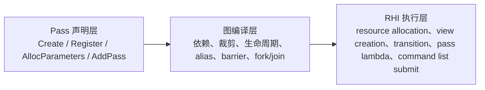
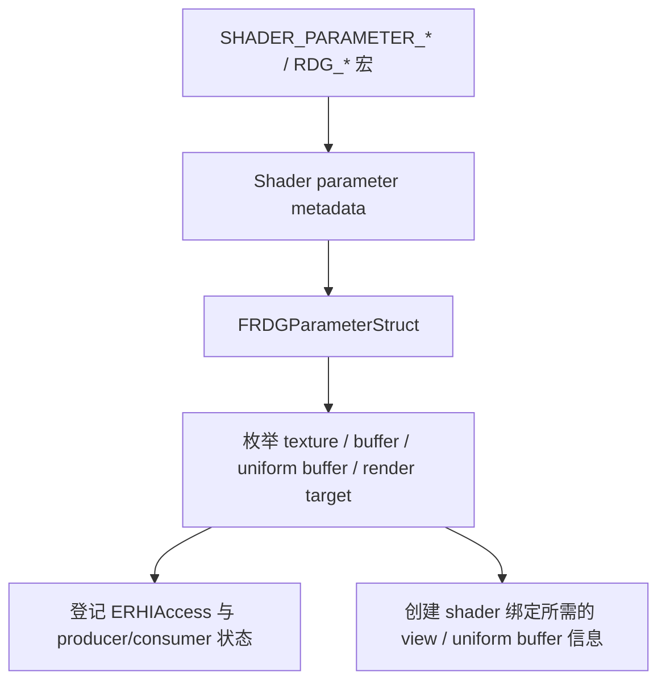
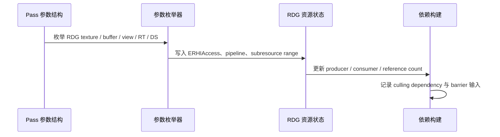
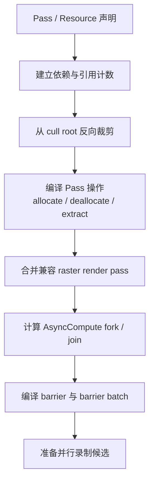
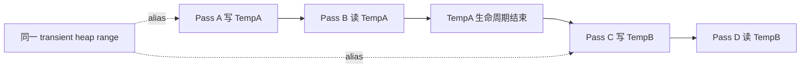
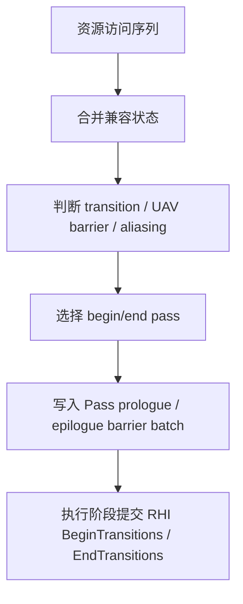
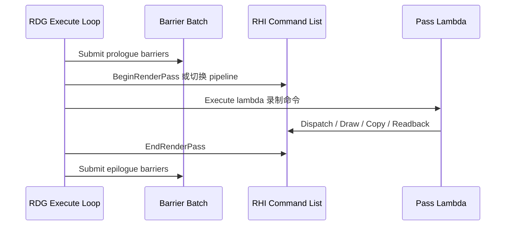
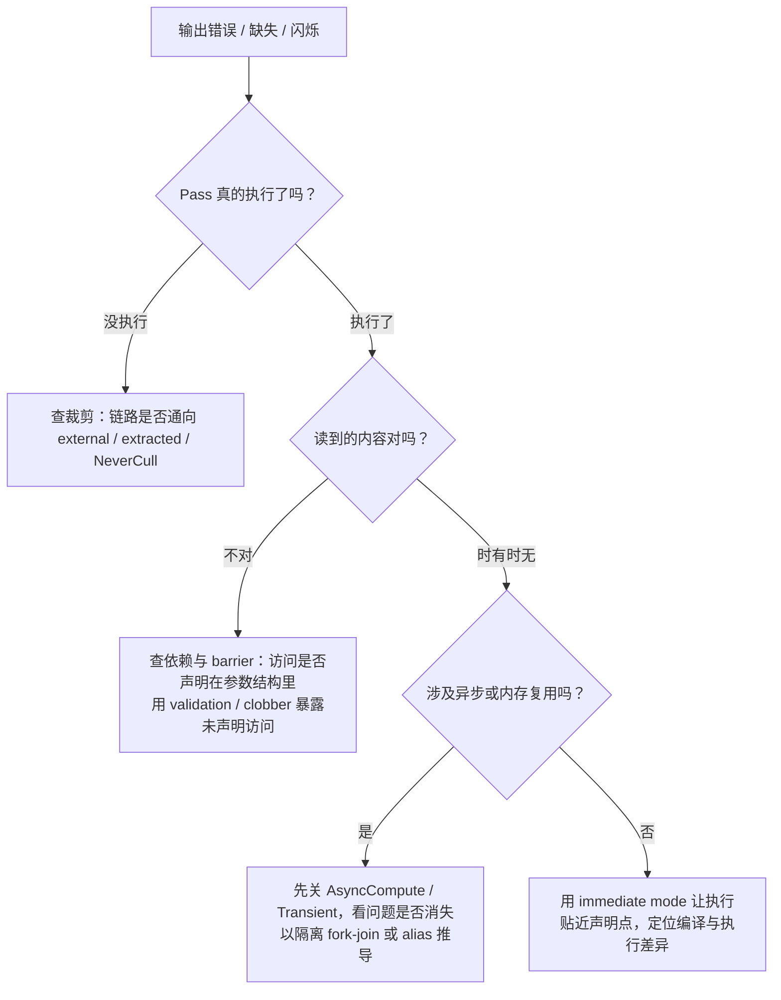
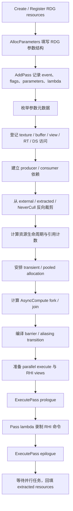

# 01 渲染架构总览

> **源码版本**: UE5.7  
> **前置阅读**: 无（本篇是起点）  
> **当前状态**: ✅ 完成（Codex 最终事实回归通过，2026-06-25）  
> **验证记录**: 见同目录 `01_Architecture_CoverageMatrix.md`

---

Unity TA 第一次读 UE 渲染时，最容易误判的是：以为 UE 只是把 Unity SRP 那条“Camera -> Culling -> DrawList -> CommandBuffer”的路换成了更长的 C++ 函数栈。

真正难的不是找到第一个函数，而是理解 UE 为什么不能让 Game Thread 直接把当前世界画出去。Game Thread 手里是会变化的 UObject 世界；Renderer 需要的是跨帧稳定的场景数据库；一帧渲染需要的是当前 View 的可见集合和 Pass 计划；RHI 需要的是平台无关的 GPU 命令；D3D12、Vulkan、Metal 后端只认识自己的原生命令。每一层都在把上一层的数据改造成下一层能稳定消费的形态。

本篇只回答一个主问题：

**当 Game Thread 已经算完这一帧的世界状态后，UE 怎样把“从这个相机渲染这个世界”变成 GPU 能执行的命令？**

先给出一句压缩模型：UE 渲染不是让 Game Thread 直接画，而是把两类输入分开整理，再在 Renderer 内汇合。

- **视图请求**：相机、Viewport、ShowFlags 变成“这一帧从哪里看”的请求。
- **对象数据**：可变的游戏对象变成 Renderer 侧的持久场景。
- **汇合**：两者在可见性阶段相遇，压成本帧工作集，再依次变成 RDG/DrawCommand 执行计划、RHI 命令、平台后端命令。

整篇就是带着金属球，把这两条流从 Game Thread 一路跟到 GPU。

为了避免后面被类型名淹没，先把整条路压成四次“换形”：

1. **请求成形**：Game Thread 把 Camera、Viewport、ShowFlags 和输出目标冻结成一帧视图请求。
2. **场景成形**：Component 不再以 UObject 形态被 Renderer 读取，而是变成 Proxy / SceneInfo，进入 Renderer 维护的持久场景。
3. **工作集成形**：本帧 View 查询持久场景，把“场景里有什么”压成“这个 View 这一帧要处理什么”。
4. **命令成形**：Renderer 把工作集组织成 Pass/资源计划与 mesh draw，再降到 RHI 和平台后端命令。

这四步不是四个函数，也不保证各占一个线程。它们描述的是四种数据状态，以及控制权何时从上一层交给下一层。后文遇到任何类型，都可以先问：它属于哪一次换形？谁拥有它？它成立的前提是什么？失败后会在哪一层留下症状？

为了让这条模型落到具体对象上，本篇一直跟同一个例子走：

> **贯穿案例**：关卡里有一个红色、偏粗糙的金属球。它是一个 `UStaticMeshComponent`，主相机这一帧正看着它。我们关心的不是金属材质的 BRDF，而是它的数据怎样从 Game Thread 的 Component 走到 Renderer，再走到 GPU draw。

---

## 本篇边界

01 是全景入口，职责是走通主路径和模块边界，不提前讲完后续专题。它必须讲透：

- UE 为什么把渲染拆成 Engine、Renderer、RenderCore、RHI、平台后端几层。
- Game Thread 如何发起一帧渲染，但不直接执行渲染。
- Engine 如何通过 `IRendererModule` 接口进入 Renderer，而不是直接依赖具体 renderer 实现。
- `FScene` 为什么是跨帧持久场景，`FSceneRenderer` 为什么是一帧执行对象。
- Component 的渲染数据如何进入 Renderer 侧场景，再被本帧可见性筛选。
- RDG、MeshDrawCommand、RHICommandList、平台后端在主路径上的职责边界。

它只点到这些后续内容：

- Component -> Proxy -> SceneInfo 的完整生命周期、Transform 更新、销毁延迟清理属于第 02 篇。
- Render Thread / RHI Thread / Frame sync / RenderCommandPipe 细节属于第 03 篇。
- RHI 资源生命周期、PSO、Shader Binding、barrier 原语属于第 04 篇。
- RDG 编译、transient aliasing、async compute、extract/external 语义属于第 05 篇。
- GPUScene buffer layout 和增量上传策略属于第 06 篇。
- MeshDrawCommand 排序键、缓存键、合批、Instance Culling 属于第 07 篇。
- `FDeferredShadingSceneRenderer::Render` 内每个 Pass 的算法属于第 08-15 篇。

因此本篇不会展开 GBuffer 通道格式、Nanite cluster culling、VSM page marking、Lumen surface cache、BackBuffer present 或帧同步。它们会在主路径中出现，但这里只说明“这一步为什么需要它”和“结果交给哪里”。

---

## 本篇必须能回答

读完这一篇，你应该能用自己的话回答下面几个问题。它们既是学习目标，也是后面每个小节要落地的点：

- 为什么 Game Thread 不直接调用 GPU，也不让 Renderer 直接读 `UPrimitiveComponent`？
- `FSceneViewFamily`、`FSceneRenderer`、`FScene`、`FViewInfo` 各自解决什么问题，为什么不能合成一个对象？
- `RenderCore` 为什么既不是 Renderer，也不是 RHI，却要单独存在？
- 金属球怎样从 `UStaticMeshComponent` 一路变成 `FPrimitiveSceneProxy`、`FPrimitiveSceneInfo`、可见性结果、`FMeshDrawCommand`，最后落到 `FRHICommandList`？
- RDG 和 MeshDrawCommand 为什么同时存在，它们各自把“画金属球”变成了什么？
- 如果金属球没画出来，应该沿哪些数据形态往回查，而不是先去翻材质参数？

读后文时，先给这些名字带上一张“概念护照”。重点不是背类型，而是把 owner、data、control、lifetime 和 debug question 放在一起：

| 概念 | 它保存什么 | 谁维护 / 生命周期 | 它控制什么 | 成立条件与调试问题 |
|------|------------|-----------------|------------|--------------------|
| `FSceneViewFamily` | 一帧从哪些 View 看哪个 Scene、画到哪个目标的请求 | Game Thread 构造，交给 Renderer；只服务本次渲染请求 | 决定本帧渲染请求的外部边界，不保存可见性结果 | Scene、View、输出目标必须配对；先查请求是否指向正确场景和目标 |
| `FScene` | Primitive、Light、空间索引、缓存 draw 数据等 Renderer 侧稳定状态 | Renderer / 渲染线程上下文跨帧维护 | 提供“场景里有什么”的可查询事实 | Proxy/SceneInfo 的更新必须先被吸收；对象缺席时不要先查本帧 pass |
| `FSceneRenderer` | 本帧怎样使用 ViewFamily 查询 Scene、组织 View、可见性和 Pass 的执行状态 | Renderer 为本帧创建，用完即结束 | 控制这一帧渲染算法的推进 | 必须基于正确 ViewFamily 和已更新 Scene；它不是场景数据库 |
| `FViewInfo` | Renderer 侧 View 工作区：visibility maps、动态 mesh 收集和 Pass 临时状态 | 随本帧 `FSceneRenderer` 存活 | 把一个 View 的查询结果传给后续阶段 | 依赖正确的 Scene 与视图参数；目标 Primitive 是否被标可见是关键断点 |
| RDG | Pass、资源读写和执行依赖 | 本帧声明、编译、执行 | 决定 GPU 工作按什么资源依赖发生 | Pass 输出必须被需要且依赖成立；查 Pass 是否存在、被裁剪或未执行 |
| `FMeshDrawCommand` | 某个 mesh 在某个 pass 中提交所需的近 RHI draw 描述 | 静态内容可缓存，本帧再筛选；动态内容按帧收集 | 决定一条可见 mesh draw 如何进入 pass | 依赖 visibility、pass relevance 和 command 构建；查 draw 是否进入提交集合 |
| `FRHICommandList` / 平台后端 | 平台无关 GPU 命令及其后端翻译 | 命令录制与提交阶段维护 | 把 Renderer 意图落实为 GPU 操作 | 到这里已不理解 Component 或 ViewFamily；查 draw 是否录制、提交并被后端接收 |

表里最重要的边界是：`FScene` 回答“长期有什么”，`FViewInfo` 回答“这个 View 当前选中了什么”，`FSceneRenderer` 回答“这一帧怎样推进”，RDG 与 MeshDrawCommand 回答“选中的工作怎样被组织”，RHI 回答“怎样落到 GPU”。把这些职责合在一个对象里，会把跨帧状态、本帧临时状态和平台命令绑成同一生命周期，既难并发，也无法让多个 View 复用同一个场景。
---

## 先按数据形态看五层

UE 的渲染模块名很多，但第一遍不要背模块名，先看每层接收什么、输出什么。一帧渲染不是一条单线，而是两条流在 Renderer 内汇合：

```text
视图请求流
  Camera / Viewport / ShowFlags
    -> FSceneViewFamily               一帧要看哪个场景、哪些 View、画到哪里
    -> FSceneRenderer / FViewInfo     本帧执行对象和 Renderer 侧视图工作区

对象数据流
  UStaticMeshComponent
    -> FPrimitiveSceneProxy           Engine -> Renderer 的渲染数据桥
    -> FPrimitiveSceneInfo
    -> FScene                         Renderer 侧持久场景数据库

汇合点
  FScene + FViewInfo
    -> visibility maps                当前 View 中哪些对象要画
    -> RDG Pass / FMeshDrawCommand    本帧 GPU 工作和 mesh draw 描述
    -> FRHICommandList                跨平台 GPU 命令
    -> D3D12 / Vulkan / Metal command 平台后端命令
```

后面说“红色金属球穿过整条路径”时，指的是对象数据流先进入 `FScene`，再在当前 ViewFamily 生成的 `FViewInfo` 下被筛选和提交。金属球不会变成 ViewFamily；ViewFamily 是这一帧的相机请求，金属球是被这个请求查询的场景对象。

这里有一个贯穿全章的必要条件：**对象流必须先形成可查询的持久状态，视图流才能在本帧把它选进工作集。** 如果金属球仍停留在 Game Thread Component，或者 SceneInfo 还只是待处理更新，后续 visibility、BasePass 和 RHI 都没有机会“补救”它。反过来，即使金属球已经在 `FScene` 中，错误的 ViewFamily、被裁掉的 visibility、缺失的 MeshDrawCommand 也会让它在更晚阶段消失。架构分层的调试价值，就在于每一层都能证明上一层产物是否已经满足下一层条件。

这条数据流对应五个职责层：

| 层 | 输入 | 输出 | 边界意义 |
|----|------|------|----------|
| Engine | `UWorld`、Viewport、Camera、Component、材质资产、用户设置 | `FSceneViewFamily` 和场景对象更新请求 | 整理游戏世界和本帧视图，不直接产生 GPU 命令 |
| Renderer | `FSceneViewFamily` 和 Renderer 侧 `FScene` | `FSceneRenderer`、可见性结果、Pass 计划、MeshDrawCommand | 决定这一帧画什么、按什么渲染算法画 |
| RenderCore | Renderer 和其他模块对渲染基础设施的需求 | `IRendererModule`、渲染命令投递、`FRenderResource`、RDG、Shader 基础设施 | 提供公共机制，不决定具体场景内容 |
| RHI | 平台无关的 GPU 操作请求 | `FRHICommandList`、`FRHIResource`、`IRHICommandContext` | 隔离 D3D12/Vulkan/Metal，Renderer 不直接碰平台 API |
| 平台后端 | RHI 抽象命令和资源 | 原生 graphics API 命令 | 执行 PSO 设置、资源绑定、draw/dispatch，不理解 UE 场景语义 |

如果你带着 Unity 的概念进来，可以先用下面这张映射表对齐方向。它只帮你找到“大概落在哪一层”，不是严格等价——每条都标出了 UE 的关键差异，后文会逐个展开。

| Unity 侧熟悉的东西 | UE 大致对应 | 关键差异（后文展开） |
|----|----|----|
| Camera + 一次 render request | `FSceneViewFamily` | UE 先把视图请求冻结成请求包，不等于一份完整渲染计划 |
| `CullingResults` | 当前 View 的 visibility maps | UE 静态 mesh 更依赖注册时缓存，每帧只做筛选 |
| `RendererList` / per-frame draw 列表 | `FScene`（持久）+ `FViewInfo`（本帧） | UE 把“场景里有什么”和“这一帧画什么”拆成两个对象 |
| `CommandBuffer` / SRP RenderGraph | RDG Pass 计划 + `FMeshDrawCommand` | UE 用两套计划：RDG 管 Pass/资源，MeshDrawCommand 管单次 mesh draw |
| 底层图形 API（你通常碰不到） | RHI + 平台后端 | UE 让 Renderer 面向 RHI 录命令，后端再翻译到 D3D12/Vulkan/Metal |
| （无对应概念） | `RenderCore` | 多模块共享的渲染基础设施层，是 Unity 读者最难定位的一层 |

知道了每层接收什么、输出什么，下一个问题自然是：UE 为什么要拆出这么多层，而不让 Game Thread 直接把世界画出来？

---

## 为什么 UE 要分这么多层

这套分层不是为了“看起来架构清晰”，而是为了同时解决三个具体问题。

第一，线程安全。Game Thread 可以改 Component，Render Thread 可以准备渲染。如果 Renderer 直接读 UObject，就要在高频路径上加锁，或者承担对象生命周期风险。

第二，模块隔离。Engine 需要知道“有一个 Renderer 接口”，但不应该知道 `FDeferredShadingSceneRenderer`、八叉树、GPUScene 或 cached draw list 这些实现细节。Renderer 可以读取 Engine 提供的 Proxy/Component 接口，但不能把 Renderer 私有数据结构塞回 Engine。

第三，缓存和扩展性。UE 的 Renderer 侧场景不是每帧从零开始的临时列表，而是跨帧维护的 `FScene`。静态 mesh 可以在加入场景或更新时预先沉淀一部分 draw 决策，每帧再按当前 View 筛选。Unity SRP 公开层常让你围绕 `CullingResults` / `RendererList` 建立心智模型；UE 需要先接受“持久场景数据库 + 帧内执行计划”这一层。

这三个问题决定了五层之间的依赖方向：Engine 只朝 Renderer 提需求，不反向依赖；Renderer 借公共机制工作，但不直接碰平台 API。而把“公共机制”从 Renderer 里单独抽出来的那一层，正是五层里最难定位的 `RenderCore`。

---

## 最容易看不懂的一层：RenderCore

五层里，Unity 读者第一次最难定位的就是 `RenderCore`，因为它不对应任何一个 Unity 概念。它的正面角色是 UE 渲染系统的公共运行时底座：凡是多个模块都需要、但又不属于某一种场景渲染算法的机制，都会放在这里。它让 Engine、Renderer、Slate、Niagara、材质系统和插件可以共享同一套渲染基础设施，而不是互相依赖私有实现。

它把“渲染系统必须共用的规则和工具”从具体 Renderer 中抽出来：

- **公共接口**：`IRendererModule` 让 Engine 可以说“请渲染这个 ViewFamily”，而不用知道 `FDeferredShadingSceneRenderer`、`FViewInfo` 或可见性内部结构。
- **渲染线程投递**：`ENQUEUE_RENDER_COMMAND` 和渲染命令调度机制让 Engine、Renderer、插件都能把工作送到渲染线程上下文。
- **渲染资源生命周期**：`FRenderResource`、`InitRHI`、`ReleaseRHI` 等契约让 CPU 侧对象以统一方式拥有或释放 RHI 资源。
- **帧内图和 Shader 基础设施**：RDG、shader 参数宏、global shader、vertex factory 等机制让多个渲染子系统用同一套方式声明资源、shader 参数和 pass 关系。

有了这个正面角色，边界也就清楚了。红色金属球这一帧是否可见、进入哪一个 mesh pass、BasePass 是否写 GBuffer、Lumen 或 VSM 是否插入分支，这些不是 `RenderCore` 的决策，而是 `Renderer` 的场景渲染职责。`RenderCore` 也不负责把 draw 翻译成 D3D12/Vulkan/Metal 原生命令，那是 RHI 和平台后端的职责。

所以一帧主路径可以这样理解：`Renderer` 借助 `RenderCore` 提供的工具组织工作。`Renderer` 决定金属球要不要画、在哪个 pass 画；`RenderCore` 提供如何把渲染命令投到正确线程、如何管理渲染资源生命周期、如何用 RDG 描述 pass 与资源关系、如何表达 shader 参数的公共规则；RHI 再把这些工作落成平台无关的 GPU 命令。

把红色金属球放进这条路里看，会更容易抓住 `RenderCore` 的边界。Engine 通过 `IRendererModule` 说“请渲染这个 ViewFamily”，这是公共接口；Renderer 把真正执行包装成 `ENQUEUE_RENDER_COMMAND`，这是公共线程投递规则；BasePass、阴影或后处理用 RDG 描述自己读写哪些资源，这是公共帧内图规则；Shader 参数、global shader、vertex factory 也靠公共声明和绑定机制协作。可是这些公共机制本身并不判断金属球是否在相机里、是否进入 BasePass、是否使用 Nanite 或 Lumen 分支。那些判断仍然属于 Renderer 的场景渲染算法。

因此调试时可以把 `RenderCore` 问题和 Renderer 问题拆开：如果命令没有进入渲染线程上下文，优先看 render command 投递；如果 BasePass 这个 RDG Pass 被裁剪或资源依赖不对，优先看 RDG 声明和消费关系；如果金属球根本没进可见集合，那不是 `RenderCore` 在决定“不要画它”，而是 Renderer 的场景、View 和可见性路径没有把它推进到提交集合。

如果没有 `RenderCore`，两个坏结果会同时出现。Engine、Slate、Niagara、材质系统和插件等只想使用渲染基础设施的模块，会被迫依赖 `Renderer` 的私有实现；而 `Renderer` 自己也会把线程投递、资源生命周期、RDG、Shader 元数据和场景渲染算法揉成一团。UE 把它拆出来，是为了让“公共渲染机制”和“具体场景渲染算法”分开演进。

这个分层也给调试提供了分叉点：如果 ViewFamily 没进入 Renderer，查模块接口交接；如果命令没到渲染线程，查 render command 路由；如果 Pass 被裁剪或资源依赖不对，查 RDG；如果金属球没进可见集合，查 Renderer 的场景和可见性；如果 RHI draw 没发出去，再往 RHI / 后端查。不同问题不要混在一个“渲染没画”里。

---

## Game Thread 先生成一帧视图请求

一帧开始时，Game Thread 手里有游戏世界、相机、Viewport、ShowFlags 和输出 RenderTarget。它此刻不应该画红色金属球，而是要把“这帧从哪里看、看哪个场景、画到哪里”打包成稳定请求。

这个阶段不要先背调用顺序，先看它冻结出的产物：

```text
Game Thread 当前状态
  相机 / Viewport / ShowFlags / 输出目标
    -> FSceneViewFamily
        一帧要看哪个 Scene、有哪些 View、画到哪个 RenderTarget
    -> IRendererModule::BeginRenderingViewFamily(...)
        把这份视图请求交给 Renderer
```

`FSceneViewFamily` 是这一步的关键产物。它不是完整渲染计划，也不是场景对象列表。它包含一个或多个 `FSceneView`、目标 `FSceneInterface`、输出 `RenderTarget`、`EngineShowFlags`、时间、ViewExtensions 等“一帧视图族”的信息。红色金属球此时还没有被判定可见；ViewFamily 只是告诉 Renderer：这一帧要从哪些 View 看哪一个 Scene。

为什么要先做 ViewFamily？因为 Render Thread 执行时不能临时回 Game Thread 查询相机、Viewport、ShowFlags 或输出目标。这些一帧级信息必须在 Game Thread 上冻结成请求，才能跨到渲染侧。

这里要注意一个边界：`FSceneViewFamily` 有 `Scene` 指针，但不是把 `UWorld` 交给 Renderer 随便读。它通过 `FSceneInterface` 指向 Renderer 可使用的场景接口，最终让 Renderer 拿到 `FScene`。从这一刻开始，Renderer 只应该看已经整理好的视图请求和 Renderer 侧场景数据。

---

## Engine 在这里把请求交给 Renderer

`BeginRenderingViewFamily` 不是“开始画 GPU”的意思，而是 Engine 把 ViewFamily 交给 Renderer 的边界。到这里，Renderer 要先保证 Game Thread 积累的渲染相关更新已经送出，再创建本帧执行对象，并把真正的 render 节点包装成渲染线程命令。

交接阶段可以按四步理解：

```text
FSceneViewFamily
  -> 发送帧末渲染更新
  -> FSceneRenderBuilder 创建 FSceneRenderer
  -> builder 记录一个 render node
  -> ENQUEUE_RENDER_COMMAND 把 render node 送到渲染线程上下文
```

帧末更新这一步很重要。Game Thread 这一帧可能新增 Component、修改 Transform、改材质参数或销毁对象。Renderer 在真正组织本帧之前，需要先把这些 pending update 送往渲染侧。否则后续 `FSceneRenderer` 看到的 `FScene` 可能还是旧状态。

然后 `FSceneRenderBuilder` 根据 ViewFamily 创建具体的一帧 renderer：deferred 路径会得到 `FDeferredShadingSceneRenderer`，mobile 路径会得到 `FMobileSceneRenderer`。这里容易混淆两个对象：

```text
FScene
  Renderer 侧持久场景数据库，跨帧存在

FSceneRenderer
  本帧执行对象，持有 ViewFamily、Views 和本帧临时执行状态
```

`FSceneRenderer` 不是场景数据库。它更像“这帧查询和执行 `FScene` 的工作对象”。真正跨帧保存 Primitive、Light、cached draw command、GPUScene 等数据的是 `FScene`。所以如果金属球已经注册到场景里，它属于 `FScene`；如果这一帧主相机要不要画它，则是 `FSceneRenderer` 和它的 `FViewInfo` 在这一帧要解决的问题。

最后，builder 记录的 render node 不会在 Game Thread 直接执行。它被包装进渲染命令，进入渲染线程上下文之后，才会创建 RDG builder、调用 render function，并在末尾执行图。这个设计把“本帧要执行什么”和“在哪个线程上下文执行”分开，避免 Engine/Renderer 在 Game Thread 上直接碰 GPU 工作。

如果这一段出问题，常见现象是：ViewFamily 生成了，但 Renderer 没接到；帧末更新没送出，导致对象状态滞后一帧或多帧；render command 没执行，导致 RDG 图根本没建立。它们不是材质问题，也不是 BasePass 算法问题，而是交接边界的问题。

---

## 渲染命令把执行权跨到渲染线程上下文

UE 不把“调用 Renderer”简单等同于“马上在当前线程跑 Renderer”。它会把要在渲染线程上下文执行的工作包成 render command。对本篇来说，只需要先建立三个事实：

- `ENQUEUE_RENDER_COMMAND` 包装的是一个将在渲染线程上下文消费的 lambda。
- render command 内会拿到可用的 RHI command list 环境。
- `FRDGBuilder` 和真正的 `RenderViewFamily_RenderThread` 调用发生在这个上下文里，而不是 Viewport draw 那一层。

这也是为什么 Game Thread 不能把 Component 指针一路传到 GPU 命令。Game Thread 的 UObject 世界是活的，会继续变化；Render Thread 消费的是通过命令边界冻结下来的渲染数据和请求。

第 03 篇会深入 Render Thread、RHI Thread、RenderCommandPipe、Fence 和 Frame sync。本篇只需要记住：**BeginRenderingViewFamily 是 Engine -> Renderer 的请求交接；render command 是执行权跨到渲染线程上下文的边界。**

---

## Component 必须先变成稳定场景数据

到目前为止，我们只解释了“这一帧从哪里看”。红色金属球作为对象本身，还要走另一条路径进入 Renderer 侧场景。

如果 Renderer 直接读 `UStaticMeshComponent`，问题马上出现：Game Thread 可能在同一帧继续改 Transform、材质或可见性；Component 的 UObject 生命周期也不归 Render Thread 管。UE 的做法是把 Component 的渲染相关状态提取成 Renderer 可消费的对象：

```text
UStaticMeshComponent
  -> CreateSceneProxy()
  -> FPrimitiveSceneProxy
  -> FPrimitiveSceneInfo
  -> FScene
```

`FPrimitiveSceneProxy` 是 Engine -> Renderer 的渲染数据桥。它不是整个 Component，也不是可随便回读 UObject 的代理。它保存 Renderer 需要的、可以跨线程消费的渲染数据，例如网格资源引用、材质相关引用、渲染标志，以及后续在渲染线程侧写入的 Transform/Bounds 状态。

`FPrimitiveSceneInfo` 是 Renderer 侧管理外壳。Proxy 更像“这个 Primitive 能被怎样画”的数据桥，SceneInfo 则把它放进 Renderer 的场景管理系统里：空间索引、dense arrays、GPUScene、cached draw command、静态 mesh 缓存等都需要一个 Renderer 私有的容器来管理。这样 Engine 不需要知道 Renderer 内部有哪些索引结构，Renderer 也不用把这些私有状态塞回 Component。

添加路径与其说是一串调用，不如说是金属球的渲染数据沿着三个所有权阶段往前交接——每跨一格，谁来读写这份数据就换了一次手：

```text
[阶段 1] Game Thread 添加 Primitive
  -> 创建 Proxy
  -> 创建 SceneInfo
  -> 投递 AddPrimitiveCommand
  （此后 Game Thread 不再触碰 Proxy）

[阶段 2] 渲染线程上下文消费 AddPrimitiveCommand
  -> 设置 Transform / Bounds
  -> 创建渲染线程资源
  -> 把 SceneInfo 排进 PrimitiveUpdates
  （此时还只是“排队中”，不在可查询场景里）

[阶段 3] FScene::Update
  -> 批量吸收 PrimitiveUpdates
  -> 进入 Renderer 持久场景结构
  （到这里金属球才成为可见性能查到的稳定条目）
```

这个顺序有两个重点。

第一，`CreateSceneProxy()` 失败或返回空，Renderer 侧就没有这个对象。后续可见性、MeshDrawCommand、BasePass 都不会凭空找到它。

第二，SceneInfo 被创建并不等于它已经进入可见性可查询的稳定场景。它先进入 `PrimitiveUpdates`，等 `FScene::Update` drain 后，才真正合入 `FScene` 的持久结构。这个“先排队、再批量提交”的模型让 Renderer 可以统一处理增删改，而不是每个 Component 更新都立刻修改复杂的场景索引。

第 02 篇会把 Proxy 具体持有什么、Transform 更新如何跨线程、销毁为什么要延迟清理全部展开。本篇只需要记住：**Component 不能直接被 Renderer 热路径读取；它必须先变成 Proxy/SceneInfo，并在 `FScene::Update` 中进入持久场景。**

---

## OnRenderBegin 让 FScene 吸收变化

当 render command 真正进入渲染线程上下文后，Renderer 不能马上做可见性。它要先让 `FScene` 吸收 Game Thread 已经排队的场景变化。

可以把 `OnRenderBegin` 理解成这一帧 Renderer 的“开场同步点”：

```text
进入 render command
  -> 创建 FRDGBuilder
  -> RenderViewFamily_RenderThread
  -> FSceneRenderer::OnRenderBegin
      -> FScene::Update
          -> drain PrimitiveUpdates
          -> 更新 Renderer 侧场景结构
```

`FScene::Update` 做的事情很多，但在 01 的边界内，我们只关心它的架构意义：它把“排队的场景变化”变成“本帧可查询的稳定场景状态”。红色金属球如果是这一帧新加入的对象，只有这一步之后，后续可见性才有机会在 `FScene` 的 Primitive 列表、空间索引和静态 mesh 数据里看到它。

这也是 `FScene` 和 `FSceneRenderer` 的差别再次出现的地方。`FScene` 是被更新的持久数据库；`FSceneRenderer` 是驱动这次更新和随后渲染流程的本帧执行对象。把这两者混在一起，会导致调试时找错方向：对象没有进 `FScene`，不是 `FViewInfo` 的问题；对象进了 `FScene` 但没有被当前相机看到，才轮到 visibility 阶段。

---

## 为什么视图请求还要变成 Renderer 工作区

`FSceneViewFamily` 只是 Engine 侧传来的视图请求。Renderer 真正跑可见性和 pass 编排时，需要更贴近内部数据结构的视图对象，这就是 `FViewInfo`。

`FViewInfo` 可以理解为 `FSceneView` 的 Renderer 工作区版本。它继承了相机矩阵、view rect、show flags 等视图输入，同时增加 Renderer 私有状态，例如：

- 当前 View 的 `PrimitiveVisibilityMap`。
- 当前 View 的 `StaticMeshVisibilityMap`。
- dynamic mesh 收集结果。
- pass setup、GPUScene、HZB、view uniform buffer 等后续阶段需要的临时状态。

为什么这些不能放在 `FSceneViewFamily` 或 Engine 侧？因为它们依赖 Renderer 私有的 `FScene` 索引。`PrimitiveVisibilityMap` 和 `StaticMeshVisibilityMap` 的 bit 位对应 `FScene` 内部 Primitive / StaticMesh 的索引，不应该暴露给 Engine。Engine 负责描述“这一帧要看哪里”；Renderer 负责把这个请求变成“本帧具体哪些内部对象要参与绘制”。

这一步之后，红色金属球不再只是“场景中有一个 Primitive”。Renderer 可以用当前 View 的 frustum、show flags、遮挡信息和场景索引，判断它这一帧是否进入提交集合。

到这里，两条输入终于具备汇合条件：`FScene` 负责回答“Renderer 侧稳定保存了什么”，`FViewInfo` 负责回答“当前 View 要怎样查询它”。下一步的可见性，就是把这两个答案压成“这一帧到底画哪些对象”。

---

## 可见性把持久场景压成本帧工作集

`FScene` 可能保存大量 Primitive，但某个 View 某一帧只画其中一部分。红色金属球已经在 `FScene` 里有了 SceneInfo 和可能的缓存 draw command；它是否真正被画，要等可见性阶段把“场景里有什么”压缩成“本帧画什么”。

输入可以理解为：

```text
FScene:
  Primitives / PrimitiveSceneProxies / StaticMeshes / cached draw data

FViewInfo:
  view matrices / frustum / show flags / visibility bit arrays
```

输出是：

```text
PrimitiveVisibilityMap:
  哪些 Primitive 对当前 View 可见

StaticMeshVisibilityMap:
  哪些 static mesh 候选对当前 View 可见

dynamic mesh 收集结果:
  本帧需要从 Proxy 收集出来的 FMeshBatch

visible mesh draw commands:
  后续 MeshPass 可以消费的命令集合
```

这一步不能被缓存完全替代。缓存命令只能说明“这个 mesh 在某个 pass 中可以怎样画”，不能说明“当前相机这一帧应该画它”。可见性阶段把跨帧场景数据库和当前相机连接起来。

对 Unity 读者来说，可以把这一步和 `CullingResults` 的职责做类比，但不能一一对应。UE 的静态 mesh 路径更强调注册/更新时沉淀 draw command，每帧可见性负责筛选和准备提交；动态 mesh 才更接近“本帧收集、本帧转换”。

如果红色金属球没有画出来，可见性是一个关键断点：它可能没有进入 `FScene`，也可能进入了 `FScene` 但当前 View 的 `PrimitiveVisibilityMap` 没有标记它。前者要回查 Component/Proxy/SceneInfo/FScene 更新链；后者要查 frustum、occlusion、show flags、owner visibility 或场景指针是否正确。

---

## Render() 是一帧依赖骨架

现在进入 `FDeferredShadingSceneRenderer::Render`。这个函数很长，但它不是函数清单，而是一帧依赖骨架。它大致沿下面的依赖推进：

```text
OnRenderBegin / scene update
  -> BeginInitViews / visibility
      -> dynamic primitive collection
          -> GPUScene dynamic upload
              -> PrePass / depth inputs
                  -> BasePass / SceneTextures
                      -> lighting / shadows / Lumen / volumes
                          -> translucency
                              -> post processing / cleanup
```

顺序背后的原因比函数名更重要。

没有 scene update，Renderer 侧场景可能没有吸收金属球的增删改。没有可见性，后面不知道金属球是否属于当前 View。没有 dynamic primitive / GPUScene 上传，shader 可能读不到本帧需要的动态场景数据。没有深度，HZB、遮挡和部分屏幕空间效果没有输入。没有 BasePass 写出的 SceneTextures/GBuffer，延迟光照没有消费对象。没有 SceneColor，后处理没有输入。

Nanite、Lumen、Virtual Shadow Maps、MegaLights 会在这条骨架上插入自己的条件分支。本篇只需要知道它们消费已有视图、场景、深度、可见性或 SceneTextures，并把结果写回本帧资源。内部算法留给 Part 3 / Part 4。

这样理解 Render() 的好处是调试时不会被长函数淹没。你不是在背“第几个函数调用了谁”，而是在问：当前阶段需要的输入是否已经由上游阶段生成？如果没有，问题应该往上游查；如果有，再看当前阶段如何消费。

---

## 为什么一帧渲染需要两套执行计划

一帧渲染里有两类“计划”很容易混淆：RDG Pass 计划和 MeshDrawCommand。

RDG 解决的是 Pass 与资源关系。Renderer 在某个阶段告诉 RDG：

```text
我要添加一个 Pass
它读哪些 RDG texture / buffer
它写哪些 RDG texture / buffer
执行时运行哪一个 lambda
```

RDG 在 `Execute()` 时统一编译和执行图：

```text
AddPass 阶段:
  记录 Pass、参数结构、资源读写关系

Compile / Execute 阶段:
  推导依赖顺序
  裁剪无用 Pass
  计算资源生命周期
  插入资源状态转换
  执行 Pass lambda
```

如果没有 RDG，每个 Pass 都要手写临时 render target 生命周期、barrier、跨队列同步和资源别名关系；系统组合越多，错误越难定位。RDG 让 Renderer 先声明意图，再统一编排资源和执行顺序。第 05 篇会展开编译、barrier、transient aliasing 和 async compute；本篇只保留它的主路径角色。

MeshDrawCommand 解决的是 mesh draw 本身。即使 RDG 已经知道“这里有一个 BasePass”，它仍然需要知道某个 mesh draw 的 pipeline state、shader binding、vertex/index buffer、primitive id、draw 参数等。UE 用 `FMeshDrawCommand` 表达这个层级。

静态 mesh 的路径可以概括成：

```text
注册 / 更新阶段:
  FPrimitiveSceneInfo::AddStaticMeshes
  -> FMeshBatch / FStaticMeshBatch
  -> FMeshPassProcessor
  -> FMeshDrawCommand 缓存

每帧阶段:
  visibility maps
  -> 筛选可见 cached commands / 收集 dynamic mesh
  -> DispatchPassSetup
  -> BuildRenderingCommands
  -> RHICmdList draw / dispatch
```

所以 RDG 和 MeshDrawCommand 不是二选一，而是同一帧里两个不同粒度的计划：

| | RDG Pass 计划 | MeshDrawCommand |
|----|----|----|
| 回答的问题 | 这一帧有哪些 Pass、资源怎么流动 | 一个可见 mesh 在某个 pass 里怎样变成接近 RHI 的 draw |
| 粒度 | 帧级：Pass 与资源依赖 | 单次 draw：pipeline state、shader binding、buffer、draw 参数 |
| 金属球落在哪 | BasePass 这个 Pass 本身 | 金属球对应的那条可见 mesh draw |

红色金属球如果进入 BasePass，它同时处在这两个计划里：BasePass 是 RDG/renderer 阶段，金属球对应的可见 draw 是 MeshDrawCommand。

调试时也要分开看。假设金属球没有出现在 BasePass 结果里，可以先拆成三个断点：

```text
BasePass 这个 RDG Pass 是否存在并执行?
  -> 否：先查 Pass 是否被裁剪、资源输出是否被消费、Graph 执行是否走到这里

BasePass 执行了，金属球的 visible draw 是否进入该 Pass?
  -> 否：回查 visibility、pass relevance、cached/dynamic MeshDrawCommand 构建

visible draw 已进入 Pass，RHI 是否真的录到 draw?
  -> 否：继续查 RHICmdList 录制、Submit 和平台后端
```

这三个断点对应三种不同的“没画出来”。RDG Pass 被裁剪，说明资源图认为这个 pass 没有必要或没有输出被消费；MeshDrawCommand 没进 pass，说明可见性、mesh pass 过滤或 command 构建有问题；RHI draw 没录到 command list，则已经跨过 Renderer 计划层，要往 RHI 命令录制或平台后端查。不要把它们都压成一句“BasePass 有问题”。

---

## RHI 把 Renderer 的意图变成跨平台 GPU 命令

当 Pass lambda 或 MeshDrawCommand 真正提交时，它们最终写入 `FRHICommandList`。到这一步，系统已经不再用 Actor、Component、ViewFamily、BasePass 这些高层语义表达工作，而是进入 GPU 命令层：

```text
设置 graphics / compute pipeline
绑定 shader 参数、uniform buffer、SRV/UAV、sampler
绑定 vertex/index buffer
发 Draw / DrawIndexed / Dispatch
处理资源状态转换
```

RHI 的职责是让 Renderer 面向一套跨平台接口录制命令，再由平台后端翻译。以 indexed draw 为例，可以把路径理解成：

```text
FRHICommandList::DrawIndexedPrimitive
  -> 直接执行到当前 IRHICommandContext
     或记录一个 draw command 节点
  -> IRHICommandContext::RHIDrawIndexedPrimitive
  -> D3D12 / Vulkan / Metal 后端实现
  -> 原生 draw indexed 命令
```

这条边界让 Renderer 仍然控制渲染算法和命令内容，但不直接绑定 D3D12/Vulkan/Metal。平台后端只看到抽象后的 GPU 操作，不需要理解 `FScene`、`FViewInfo`、材质图或 BasePass 的高层意义。

第 04 篇会深入 RHI 资源、PSO、shader binding、barrier 和后端选择。本篇只需要记住：RHI 是 Renderer 和平台 API 之间的命令/资源抽象边界。

---

## 红色金属球穿过整条路径

现在不再按函数名复述，而是按四次换形检查金属球每一步“变成了什么”。

### 1. 请求成形：先说明这一帧要看什么

`UGameViewportClient::Draw` 构建 `FSceneViewFamily`，把 Camera、Viewport、ShowFlags、Scene 和输出目标组合成一帧请求，再通过 `IRendererModule::BeginRenderingViewFamily` 交给 Renderer。此时金属球还不是请求的一部分；请求只定义“用哪些 View 查询哪个 Scene”。

这一阶段成立的条件，是 ViewFamily 指向金属球所属的 `FScene`，并带着有效 View 与输出目标。若这里配错，后面即使场景数据库里完整保存着金属球，本帧也会查询错误的世界或把结果写到错误目标。

### 2. 场景成形：把游戏对象变成 Renderer 可长期查询的记录

金属球最初是 Game Thread 上的 `UStaticMeshComponent`。加入场景时，它通过 `CreateSceneProxy()` 生成 Renderer 可消费的 `FPrimitiveSceneProxy`，并由 `FPrimitiveSceneInfo` 承担注册与场景索引关系。`AddPrimitiveCommand` 把这次变化送到渲染线程上下文，SceneInfo 先进入待处理更新；到 `FSceneRenderer::OnRenderBegin` 触发 `FScene::Update` 后，这次变化才被吸收进 `FScene` 的持久结构。

这一阶段发生了真正的所有权边界转换：Game Thread 继续拥有并修改 Component；Renderer 不回头读取这个可变 UObject，而是维护自己的 Proxy / SceneInfo / `FScene` 状态。成立条件是 Proxy 有效、更新命令被执行、Scene 更新被吸收。任何一个条件失败，金属球都不会成为 visibility 可以查询的 Primitive。

### 3. 工作集成形：持久存在不等于这一帧要画

Renderer 根据 ViewFamily 创建本帧 `FSceneRenderer`，并把 `FSceneView` 扩展成 `FViewInfo`。随后可见性阶段用当前 View 查询 `FScene`，把跨帧场景压成本帧工作集，结果落在 `PrimitiveVisibilityMap`、`StaticMeshVisibilityMap` 以及相关动态 mesh 收集中。

这一步的关键边界是：`FScene` 中“有金属球”只证明它可被查询，不证明当前 View 要提交它。视锥、遮挡、ShowFlags、pass relevance 等条件会继续缩小工作集。如果金属球在 Scene 中却没有进入 visibility，问题属于“当前 View 如何选择场景”，还没有进入 RDG 或 RHI。

### 4. 命令成形：把选中的工作变成 GPU 可执行内容

`Render()` 按数据依赖骨架推进。BasePass 等阶段通过 RDG 声明 Pass、资源读写和执行关系；金属球对应的可见 mesh 则通过 MeshDrawCommand 表达 pipeline state、shader binding、buffer 与 draw 参数。Pass 执行时，这些 draw 被录入 `FRHICommandList`，再由平台后端翻译成 D3D12、Vulkan 或 Metal 原生命令。

这一阶段有两个独立条件：BasePass 这个 Pass 必须存在并执行；金属球的 draw 必须进入这个 Pass。前者由 RDG 的资源依赖决定，后者由 visibility、pass relevance 与 MeshDrawCommand 构建决定。两者都成立后，才轮到 RHI 命令录制与后端提交。

---

## Worked Case：红色金属球为什么突然消失

假设场景原本正常，修改金属球后它从主相机画面中消失。不要从“材质坏了”开始猜，而要逐层收窄断点。

### 症状 A：所有 View 都看不到，Scene 调试信息里也没有它

这说明失败发生在**场景成形**之前或之中。先确认 `CreateSceneProxy()` 是否返回有效 Proxy，再确认 SceneInfo 是否进入待更新队列，最后确认 `FScene::Update` 是否已经吸收更新。若对象根本不在 `FScene`，visibility、BasePass、RDG 和 RHI 都不是第一现场。

### 症状 B：对象在 `FScene`，另一个 View 能看到，主 View 看不到

这把问题收窄到**请求成形或工作集成形**。检查主 ViewFamily 是否查询正确 Scene、View 参数是否正确，以及目标 Primitive 在主 View 的 visibility maps 中是否可见。因为另一个 View 已经证明场景注册和基础 draw 数据存在，不应回退到 Component 生命周期重新排查。

### 症状 C：visibility 已可见，但 BasePass 没有这条 draw

这说明持久场景和 View 选择都已通过，问题位于**mesh pass 选择 / MeshDrawCommand**。检查 pass relevance、静态缓存命令或动态 mesh 收集是否为金属球生成了可提交 draw。此时“BasePass 纹理有没有创建”不是首要问题，因为缺的是对象级命令，而不是 Pass 级资源。

### 症状 D：BasePass 有 draw，RHI 捕获里却没有对应提交

问题已越过场景、可见性和 MeshDrawCommand，进入**命令录制 / 提交边界**。检查 Pass 是否实际执行、命令是否录入 `FRHICommandList`，以及平台后端是否接收。只有在这些条件也成立后，才继续查资源绑定、shader 或平台 API 层。

这个 worked case 的价值不是给出一串固定函数，而是建立“证据会排除哪些层”的方法：

```text
不在 FScene
  -> 排除 visibility / RDG / RHI，回查场景成形

在 FScene，但当前 View 不可见
  -> 排除对象注册，回查请求与工作集

当前 View 可见，但无 MeshDrawCommand
  -> 排除场景与 visibility，回查 mesh pass 选择

Pass 有 draw，但无 RHI 提交
  -> 排除 Renderer 上游，回查命令录制与后端
```

函数名只是断点路标；真正决定排查顺序的是数据状态、所有权边界和成立条件。

---
## 主路径压缩回顾

把整篇压回最小模型，就是两条输入流在 Renderer 内汇合。

```text
视图请求流:
  Camera / Viewport / ShowFlags / RenderTarget
    -> FSceneViewFamily
    -> FViewInfo

对象数据流:
  UStaticMeshComponent
    -> FPrimitiveSceneProxy
    -> FPrimitiveSceneInfo
    -> FScene

汇合后的本帧工作:
  FScene + FViewInfo
    -> visibility maps
    -> RDG Pass 计划 + MeshDrawCommand
    -> FRHICommandList
    -> D3D12 / Vulkan / Metal backend
    -> GPU
```

这张图故意不按函数名展开。函数名适合定位断点，数据形态才适合建立架构心智模型。`FSceneViewFamily` 解决“这一帧从哪里看”；`FScene` 解决“Renderer 侧稳定保存了什么”；`FViewInfo` 解决“当前 View 如何查询这个场景”；visibility 解决“这一帧画哪些对象”；RDG 和 MeshDrawCommand 分别解决“Pass/资源如何组织”和“可见 mesh 如何提交”；RHI 和后端解决“跨平台命令如何落到 GPU”。

---

## 下一篇如何接上

读完 01 后，下一步先看第 02 篇。01 只把 `Component -> Proxy -> SceneInfo -> FScene` 作为主路径上的桥说明清楚；02 会把这个桥落到一个具体 Component 的完整生命周期：Proxy 具体持有什么、Transform 更新如何跨线程、`FPrimitiveSceneInfo` 如何注册/移除、销毁为什么需要延迟清理。

然后再进入第 03 篇，渲染命令、Render Thread、RHI Thread、Frame sync、Fence 和 Flush 才会有具体对象可挂靠。换句话说，01 解决“整条路怎么走”，02 解决“对象怎么进入这条路”，03 解决“这条路跨线程时如何安全运行”。


# 02 从 Component 到 SceneProxy

> **源码版本**: UE5.7  
> **前置阅读**: 01（渲染架构总览）必读；03（三线程模型与渲染命令）可在本篇后回读  
> **当前状态**: ✅ 完成（Codex 最终事实回归通过，2026-06-25）  
> **验证记录**: 见同目录 `02_SceneProxy_CoverageMatrix.md`

---

## 一个 Unity 心智模型会在这里出错

Unity 读者看一个可渲染对象时，最自然的心智模型是：`GameObject` 上挂 `Transform`，旁边挂 `MeshRenderer` / `MeshFilter`，渲染器每帧从这些组件里拿 mesh、材质和矩阵去画。这个模型迁到 UE 会立刻出问题。

UE 的 Render Thread **不会**在绘制阶段直接读 `UPrimitiveComponent`，也不会每帧临时回到 `UObject` 世界去问“这个组件现在的 mesh 和材质是什么”。如果你带着 Unity 的模型来调试 UE——物体没出现、移动不更新、删除后崩溃——你会习惯性地从“渲染器为什么没读到组件的最新状态”开始查，而这条线索在 UE 里从一开始就是错的。

原因不是 UE 喜欢多绕一层。而是 UE 把“游戏侧可变对象”和“渲染侧稳定场景”切成了两套生命周期：

- Game Thread 这一侧，组件随时可能被蓝图、C++、加载流程、异步编译改写或销毁；
- Render Thread 那一侧，渲染器需要一份跨帧稳定、可剔除、可缓存、可安全销毁的场景数据。

如果让 Render Thread 直接读 live `UObject`，要么得加锁把两条线程互相拖住，要么会读到半更新或已经释放的状态。UE 的解法是：**先把组件摘成一份渲染侧快照，再由 Renderer 给这份快照分配索引、做空间登记、维护缓存状态。** 从此渲染侧只认这份快照，不回头看组件。

01 篇已经建立了 Proxy 概念和创建时序的全局印象。本篇不重复全局架构，而是把这条“对象桥”深入到可维护、可调试的生命周期。我们跟一把**可移动的 StaticMesh 椅子**走完整条路：它在游戏侧是 `UStaticMeshComponent`；进入 Renderer 后变成 `FPrimitiveSceneProxy` 快照与 `FPrimitiveSceneInfo` 登记卡，最后登记进 `FScene` 的紧凑数组、空间八叉树和静态网格批次里。之后移动它、换材质、删除它，也都不会直接改这份快照，而是经由 dirty 标记和渲染命令，汇聚到同一个提交点。

本篇要回答的核心问题只有一个：

> **一个 `UPrimitiveComponent`，怎样跨过 Game Thread / Render Thread 边界，成为 Renderer 可查询、可剔除、可提交、可安全销毁的场景 Primitive？**

---

## 先建立心智模型：三个对象、一条状态线

在跟流程之前，先把本篇会反复出现的几个名字压成一条状态线。读这张图时，重点不是“有几个类”，而是**每一步里数据归谁所有、谁能改它**：

```text
Game Thread / Engine 模块
  UPrimitiveComponent          游戏逻辑可改的 UObject 组件（真相源）
        |
        | CreateSceneProxy()   摘出一份渲染快照
        v
  FPrimitiveSceneProxy         给 Renderer 看的只读快照（Engine 定义）
        |
        | new FPrimitiveSceneInfo(...)   给快照套一张登记卡
        v
  FPrimitiveSceneInfo          Renderer 私有的场景登记卡（Renderer 定义）
        |
        | render command -> PrimitiveUpdates   交出所有权，排队
        v
Render Thread / Renderer 模块
  FScene 紧凑数组 / PrimitiveOctree / StaticMeshes
                               Renderer 跨帧维护的场景数据库
```

这三个核心对象各解决一个所有权问题：

| 形态 | 所在线程 / 模块 | 它解决的问题 |
| --- | --- | --- |
| `UPrimitiveComponent` | Game Thread / Engine | 游戏侧可变状态，允许蓝图、C++、加载流程随时修改 |
| `FPrimitiveSceneProxy` | GT 创建、RT 消费 / Engine 定义 | 把 Renderer 需要读的状态镜像成一份不再回读 `UObject` 的快照 |
| `FPrimitiveSceneInfo` | GT 创建、RT 管理 / Renderer 定义 | 保存 Renderer 私有的索引、缓存、八叉树、光照交互、GPUScene 等登记状态 |
| `FScene` 数据结构 | Render Thread / Renderer | 给可见性、GPUScene 上传、draw 收集提供跨帧稳定的输入 |

### 为什么是 Proxy 和 SceneInfo 两层，而不是一个对象

最容易困惑的是：既然都是“渲染侧的对象描述”，为什么要拆成 Proxy 和 SceneInfo 两层？

关键在于它们处在**相反的依赖方向**上。

- **Proxy 定义在 Engine 模块**。它的职责是让形形色色的 Component 都能把自己的渲染数据“交出来”。Engine 不应该知道 Renderer 内部有八叉树、有紧凑数组、有 Nanite bin。
- **SceneInfo 定义在 Renderer 模块**。它的职责是让 Renderer 管理这份快照在场景里的位置：八叉树 id、紧凑索引、缓存的 draw command、Nanite / 光追 / Lumen 等子系统的注册关系。

如果把 Renderer 的私有字段塞进 Proxy，Engine 就反向知道了 Renderer 的实现细节，依赖方向被破坏；如果让 Renderer 直接去读 Component，又破坏了线程和生命周期边界。两层结构让依赖保持单向：SceneInfo 可以持有并包裹 Proxy，Proxy 不必知道 SceneInfo 的内部。

所以更准确的心智模型是：

```text
Proxy   = “这把椅子给 Renderer 看的一份快照。”
          它回答：mesh 是什么、材质是什么、这个 View 里走哪些路径、有哪些静态/动态元素。

SceneInfo = “Renderer 管理这份快照的登记卡。”
          它保存：这份快照在 FScene 里的索引、缓存、和各子系统的注册关系。
```

这两个对象通常一一对应，但**不是继承关系**，也不是“同一职责的两个名字”。

---

## 本篇边界

本篇只讲一件事：**Component 到 Renderer 场景数据库的对象桥接。** 它必须讲清五个问题：

- Proxy 和 SceneInfo 为什么分成两层，各自解决哪个所有权问题。
- Proxy 的虚函数体系，怎样让 Renderer 用统一方式询问不同的 Component 子类。
- 静态网格的“注册时缓存”和动态网格的“每帧收集”，为什么要分开。
- Transform dirty 和 RenderState dirty，为什么是两条不同的更新路径。
- Proxy 销毁为什么必须延迟到 Render Thread 的安全点。

下面这些主题本篇只点到，深入归后续篇：

| 主题 | 本篇怎么处理 | 深入出处 |
| --- | --- | --- |
| render command 投递、RenderCommandPipe、fence、帧同步 | 只把它当作“跨线程提交”的黑盒 | 03 ThreadModel |
| GPUScene buffer layout、PrimitiveID、增量上传 | 只说椅子会成为它的上游输入 | 06 GPUScene |
| `FMeshBatch` → `FMeshDrawCommand`、排序、合批、PSO | 只交付到 `FMeshBatch` 这一层 | 07 MeshDrawCommand |
| 可见性如何用 bounds、octree、show flag、遮挡 | 只说椅子已成为可被查询的输入 | 08 Visibility |
| Nanite cluster、page、material binning 内部机制 | 只说椅子可能走 Nanite proxy | 16 Nanite |

所以本篇的终点不是 GPU draw，而是：**椅子已经成为 `FScene` 里稳定的 primitive 数据，后续可见性、GPUScene 和 MeshDrawCommand 章节会继续消费它。**

---

## 本篇读完，你应该能回答

带着这几个问题往下读，读完应该都能答上来：

- 渲染器要画一把椅子时，它读的是组件、Proxy、还是 `FScene` 里的数据？
- `CreateSceneProxy()` 返回 `nullptr` 意味着什么？它和“被剔除了”有什么区别？
- 为什么 Render Thread 收到 add 命令后，椅子还没真正进入场景？真正入场发生在哪一步？
- 一个静态网格的几何，是每帧从组件取，还是注册时就缓存好了？由谁决定？
- 把椅子拖到桌子旁，引擎到底改了什么、没改什么？为什么不直接改 Proxy 的矩阵？
- 删除椅子时，谁负责断引用、谁负责撤销场景关系、谁负责最终 `delete`？

---

## 入场总览：五步，才真正进入场景

椅子从组件变成场景 primitive，要走五步。先看一遍全景，再逐步深入。每一步的关键都不是“调了哪个函数”，而是**数据现在是什么形态、归谁、下一步去哪里**：

```text
① GT 提出注册请求      组件说“我要进渲染场景”，但还没有任何渲染对象
② GT 摘成快照+登记卡    创建 Proxy 快照和 SceneInfo 登记卡，打包成 add 命令
③ RT 初始化但只入队     在 RT 上写入 transform、建 RT 资源，把 SceneInfo 排进待提交队列
④ FScene::Update 提交   统一分配索引、写入紧凑数组、插入八叉树、缓存静态批次——这才算真正入场
⑤ 成为 draw 收集输入    椅子成为可见性和 MeshDrawCommand 章节的上游数据
```

注意第 ③ 步：很多人以为“Render Thread 收到命令 = 物体进场景了”。在 UE5.7 里不是。**真正入场是第 ④ 步的 `FScene::Update()`**，原因后面会讲清楚。

为了让后面的细节不退化成函数名列表，可以把椅子的生命周期看成一张持续更新的“状态账本”：

| 阶段 | 当前权威数据 | 谁拥有修改权 | Renderer 此时能做什么 | 还不能做什么 |
| --- | --- | --- | --- | --- |
| 注册前 | Component 的 mesh、材质、transform、flags | Game Thread | 什么也不能做；场景里还没有它 | 不能剔除、不能收集 draw、不能上传 GPUScene |
| Proxy / SceneInfo 已创建 | Proxy 保存内容快照；add 命令保存空间参数；SceneInfo 尚无场景身份 | GT 只能继续改 Component；已打包对象等待 RT 接管 | 只能等待命令执行 | 不能把 SceneInfo 当成已入场对象 |
| RT 初始化并入队 | Proxy 已有 RT 空间状态和资源；SceneInfo 位于 `PrimitiveUpdates` | Render Thread | 能在统一提交点处理它 | 仍不能用 `PackedIndex` 查询，因为索引尚未分配 |
| `FScene::Update()` 后 | `FScene` 的数组、八叉树、SceneInfo 缓存成为渲染侧权威状态 | Renderer / Render Thread | 可见性、静态批次、GPUScene 上游都能消费 | Game Thread 不能直接修改 Proxy 或场景数组 |
| 移除排队后 | Component 已断开引用；Renderer 仍持有待撤场对象 | Render Thread | 只能按顺序撤关系和释放资源 | GT 不能假设对象已物理删除 |

这张表的关键不是“谁先调用谁”，而是**权威状态发生了迁移**：注册前，Component 是真相源；创建快照后，内容被复制或引用到 Proxy；正式入场后，Renderer 只相信自己的场景数据库；删除时，GT 先放弃控制权，RT 再完成最后清理。

---

## 第一步：组件只是“提出注册请求”

椅子注册时，入口是 `UPrimitiveComponent::CreateRenderState_Concurrent`。这个名字容易让人以为它会立刻创建 GPU 资源。实际上它做的事很克制：只是让组件**开始进入渲染侧注册流程**。

它先更新 Bounds，再检查这个组件该不该加入场景。Bounds 必须在这一步先更新——因为后面 `FScene` 的空间查询、可见性、遮挡、光照和若干缓存都依赖世界包围体。如果椅子还拿着旧 Bounds，Renderer 即使知道它有 mesh，也无法可靠判断它占据世界中的哪块空间。

检查通过，才向 `FScene` 提交“这个 primitive 需要进入渲染场景”的请求。**此时还没有 Proxy、没有 SceneInfo，更没有写入 `FScene`。** 跨线程快照要到下一步才创建。

如果组件不该渲染——被隐藏、detail mode 不允许、没有 render state——流程就停在这里。

> **调试路标｜物体完全没出现，先查这一层**：组件有没有进入 `CreateRenderState_Concurrent`？`ShouldComponentAddToScene()` 是否为真？如果这一层就没过，后面的 Proxy / SceneInfo / 可见性都不用查。

---

## 第二步：Game Thread 把组件摘成快照

请求进入 `FScene` 后，仍在 Game Thread，但开始把游戏侧对象整理成 Renderer 能持有的数据。对我们的 StaticMesh 椅子来说，这一步要做三件事：创建 Proxy 快照、创建 SceneInfo 登记卡、把它们打包成一条 add 命令。

### 快照可能根本创建不出来：`nullptr` 的含义

创建 Proxy 之前，UE 会先排除“无法安全创建快照”的情况。椅子的快照会在下列任一情况下创建失败，返回 `nullptr`：

- `StaticMesh` 为空；
- StaticMesh 仍在异步编译；
- `RenderData` 为空或尚未初始化；
- PSO 预缓存策略要求等 PSO 准备完成；
- Nanite 已启用但当前不允许走 Nanite，又没有可用的 fallback mesh；
- LOD 资源为空或无顶点。

这里有一个对调试极重要的概念：**返回 `nullptr` 不是“画一个默认物体”，而是“当前没有一份安全的渲染快照，Renderer 干脆不登记它”。** 所以一个刚导入、仍在编译、PSO 还没准备好、或 Nanite fallback 不可用的 mesh，可能短时间不可见。这不是后续 draw 阶段“漏画”，而是**入场阶段主动拒绝了不完整数据**——它和“物体进了场景但被剔除”是完全不同的失败，查的地方也不同。

资源齐备后，椅子会按条件创建 `Nanite::FSceneProxy` 或传统 `FStaticMeshSceneProxy`。两者都是 `FPrimitiveSceneProxy` 的子类，后续走同一条 add / update / delete 生命周期。

### 快照里放什么、不放什么

传统 StaticMesh proxy 的构造，会从组件摘取一批描述：StaticMesh 渲染数据、材质相关性、LOD / section、阴影与主通道标志、WPO / Nanite 相关标志、编辑器调试状态等。它通常**引用**重资源，而不是复制整份几何。

这里要分清三类数据，因为它们的“定稿时机”不同：

```text
Proxy 构造时算出的轻量描述:
  pass relevance、材质相关性、LOD / section、shadow / lighting / debug flags

Proxy 引用（不复制）的重资源:
  StaticMesh RenderData、material interface、Nanite resources、BodySetup

不在构造时定稿的空间状态:
  Transform、WorldBounds、LocalBounds、AttachmentRootPosition
```

为什么 Transform 不在构造时写成最终渲染位置？因为 UE 把“内容快照”和“空间状态写入”刻意拆成了两个阶段。add 命令会把 RenderMatrix、WorldBounds、LocalBounds、AttachmentRootPosition、PreviousTransform 捕获进去；真正写入 Proxy 要等 Render Thread 执行命令时调用 `Proxy->SetTransform(...)`。记住这个拆分，后面讲“移动椅子”时会再用到它。

用椅子的具体数据代入，就能看出这个拆分解决了什么问题：mesh、材质槽和“是否投射阴影”回答的是**这把椅子是什么渲染对象**；transform、bounds 和 previous transform 回答的是**这一刻它在哪里**。前一类变化通常让旧快照失效，后一类变化在满足条件时可以沿用旧身份。若把两类数据混在一个可随时被 GT 改写的对象里，Renderer 就无法判断一次变化究竟只需移动空间索引，还是必须重建静态批次、材质相关性和专项管线登记。

### SceneInfo 在 GT 就和 Proxy 一起创建

紧接着，Game Thread 上就 `new` 出 `FPrimitiveSceneInfo`，并把 Proxy 的 `PrimitiveSceneInfo` 指针指回这张登记卡。

这里有一个常见误解需要纠正：**UE5.7 中 SceneInfo 不是“Render Thread 收到 Proxy 之后才创建”的；它在 GT 的 add 路径里随 Proxy 一起创建。** Render Thread 后面只是接管它、提交它。

这一步结束时，椅子的状态是：

```text
UStaticMeshComponent
  └─ FStaticMeshSceneProxy / Nanite::FSceneProxy   （快照已就绪）
       └─ FPrimitiveSceneInfo                       （登记卡已就绪）
            └─ AddPrimitiveCommand                  （打包好，等待进入 Render Thread）
```

它已经被打包，但还没有真正入场——没有紧凑索引、没有持久索引、没有八叉树 id，也没加入 `Scene->StaticMeshes`。

---

## 第三步：Render Thread 初始化快照，但只是“入队”

打包好的 add 命令被投递到 Render Thread。它在 RT 上按顺序做三件事：

```text
① Proxy->SetTransform(...)              把空间状态写进 Proxy
② Proxy->CreateRenderThreadResources()  让子类有机会建 RT 端资源
③ AddPrimitiveSceneInfo_RenderThread()  把 SceneInfo 排进待提交队列
```

第 ① 步 `SetTransform` 把 LocalToWorld、WorldBounds、LocalBounds、ActorPosition 写入 Proxy，并触发 transform 变化相关的更新——这正是第二步里被推迟的“空间状态写入”。第 ② 步是 Proxy 子类准备 RT 资源的入口；很多子类这里是空实现，但生命周期上保留了这个安全点。

最容易误读的是第 ③ 步 `AddPrimitiveSceneInfo_RenderThread`。它的名字像“把 primitive 加进场景”，但在 UE5.7 里它只做一件小事：检查这个 SceneInfo 还没有紧凑索引，然后把它通过 `PrimitiveUpdates` 排队。此刻 SceneInfo **仍不属于** `FScene` 的紧凑数组，也没有八叉树 id。

为什么不在这里直接插入场景？因为“真正入场”不是写一个字段，而是**一组必须保持一致的状态修改**：紧凑数组、类型偏移表、持久 id 映射、空间八叉树、velocity、distance field、Lumen、光追、静态网格缓存，都可能同时被牵动。UE 把这些变化收束到一个统一的提交点 `FScene::Update()`，让后续可见性和 draw 收集看到的，永远是同一个一致版本的场景。

`FScene::Update()` 开头还会先等待外发的 RHI command list 完成，再去修改 proxy 和场景数组。本篇不展开这背后的线程模型（那是 03 篇的事），但它解释了为什么 `FScene::Update()` 是本章的“安全提交点”：它不是“又一个被调用的函数”，而是 Renderer 在 Render Thread 上统一兑现 add / update / delete 的地方。

---

## 第四步：`FScene::Update()` 才是真正入场

`FScene::Update()` 把 `PrimitiveUpdates` 排干后，先把命令分成 added、removed、deleted、transform、instance 等几类，再集中维护 `FScene` 的持久结构。对第一次入场的椅子，它先分配两种索引。这里不能只记“有两个 id”，而要记住它们分别服务两种完全不同的数据形态：

```text
PackedIndex       FScene 热路径 packed arrays 的下标。
                  可见性、遮挡、PrimitiveTransforms / PrimitiveBounds 等并行数组都用它。
                  add/remove 为了保持紧凑可能 swap，所以它不是跨帧稳定句柄。

PersistentIndex   本次注册生命周期内稳定的 primitive 句柄。
                  它来自带洞的持久 id 分配器，适合给“每个 primitive 一份跨帧状态”的系统做直接索引。
                  它不是当前 FScene primitive packed arrays 的下标；需要访问 packed arrays 时仍要映射回 PackedIndex。
```

这个区别非常重要。`PackedIndex` 回答的是“这个 primitive 现在在 `FScene` 的紧凑场景数组第几格”；`PersistentIndex` 回答的是“在这个注册生命周期里，我怎样稳定地追踪同一个 primitive”。GPUScene、Virtual Shadow Map cache、某些调试或跨帧 bitset 会偏爱稳定句柄，并在需要读取 scene-side packed data 时映射回当前 `PackedIndex`；但可见性循环、bounds 读取、proxy 指针读取、transform 更新这些 `FScene` 热路径数组本身仍然按 `PackedIndex` 直接下标。

一个最小 add / remove / swap 例子可以把这两个索引钉住：

| 时刻 | Packed arrays 视角 | Persistent 视角 | 调试含义 |
| --- | --- | --- | --- |
| A、B 都在场 | A 在 packed 槽 0，B 在 packed 槽 1 | A、B 各有稳定句柄 | 热路径按 packed 槽遍历 |
| A 被删除 | B 可能被换到 packed 槽 0 | B 的稳定句柄不变 | 跨帧记录不能把旧 packed 槽当身份 |
| C 新入场 | C 拿到当前可用 packed 槽 | C 获得自己的稳定句柄 | 新对象不要继承旧对象的调试结论 |

所以看一份 primitive 是否“还是同一个”，先问 persistent 句柄；看这一帧要从哪个数组读 transform、bounds、proxy，才问当前 `PackedIndex`。

分配好后，SceneInfo 和 Proxy 被写入一组**并行 packed arrays**。这一步不是简单地“把 SceneInfo 指针放进 `FScene`”，而是 Renderer 对热路径字段做了一次选择性 SoA 转化：把全 primitive 循环里最常读的列拆出来，让不同 pass 只读自己需要的数据，不必把整个 `FPrimitiveSceneInfo` 的重状态拖进 cache。

| 这类数组保存 | 例子 |
| --- | --- |
| 对象指针 | `Primitives`、`PrimitiveSceneProxies` |
| 空间状态 | `PrimitiveTransforms`、`PrimitiveBounds`、`PrimitiveOcclusionBounds` |
| 热标志 / ID | `PrimitiveFlagsCompact`、`PrimitiveVisibilityIds`、`PrimitiveOcclusionFlags`、`PrimitiveComponentIds` |
| 专项紧凑数据 | ray tracing primitive flags / data、octree node index 等 |

所以 `FScene` 同时保留两种看待同一个 primitive 的方式：

```text
SceneInfo / Proxy         单个 primitive 的生命周期、资源、缓存和子系统注册状态
FScene packed arrays      全场景线性遍历时的热字段列，统一由 PackedIndex 对齐
```

这不是把 SceneInfo 的所有字段都 SOA 化。留在 `FPrimitiveSceneInfo` 里的，是更适合“按单个 primitive 处理”的重状态：静态 mesh 列表、cached mesh draw command 信息、Nanite bins、光照交互、间接光缓存、Lumen / distance field / ray tracing 相关注册状态等。换句话说，`SceneInfo` 仍是 FScene 管理 primitive 的对象外壳；`FScene` 只把 visibility、occlusion、GPUScene 上传前置输入、ray tracing 紧凑状态这类热字段拆出来按列访问。

空间查询还有第三种形态。`FScene` 的八叉树并不直接塞完整 `FPrimitiveSceneInfo`，也不直接查询上面的 packed arrays；它使用一个轻量的 `FPrimitiveSceneInfoCompact`，里面只放 SceneInfo 指针、Proxy 指针、bounds、draw distance、visibility id 和 compact flags。这样八叉树能快速做空间 / frustum 查询，而线性 visibility 或 GPUScene 路径仍然可以走 packed arrays。两套结构并行存在：**octree 负责空间索引，packed arrays 负责线性热遍历**。

另外 `TypeOffsetTable` 会按 proxy 类型维护分段，方便某些遍历只在某一类 proxy 的索引范围内进行。它仍然依赖 `PackedIndex` 的紧凑排列，不是另一套稳定 id。

数组位置确定后，登记卡才真正去各子系统“报到”：创建或更新间接光相关状态、插入空间八叉树、写 bounds / flags / visibility id / occlusion bounds / component id、登记 reflection / lightmap / 动态间接阴影等关系。到这一步，椅子才成为 `FScene` 中可被空间查询和可见性阶段使用的 primitive。

对 StaticMesh，还要多做一件事：把稳定几何交给后续 draw 收集路径。`FPrimitiveSceneInfo::AddStaticMeshes` 会对每个 SceneInfo 调 Proxy 的 `DrawStaticElements`，收集出这个 primitive 的静态批次（`FStaticMeshBatch` / `FMeshBatch`），存进 SceneInfo 自己的 `StaticMeshes` / `StaticMeshRelevances`，再把这些 batch 的指针挂到全局的 `Scene->StaticMeshes`。如果需要缓存，它还会触发 MeshDrawCommand、Nanite material bins、光追 primitive 的缓存更新。

注意，这条 static mesh 路径不是刚才那次 `FScene` packed arrays 的 SOA 拆分。它是另一条整理动作：**SceneInfo 内部 per-primitive mesh 列表 → 场景级 static mesh 候选 / cached draw command**。前者解决“全 primitive 热字段怎么按列遍历”，后者解决“这个 primitive 能贡献哪些稳定 mesh，后续 MeshPass 怎样复用”。把这两条混在一起，会误以为 `StaticMeshes` 也是 `FScene` primitive SOA 的一列；实际上它仍然以 SceneInfo 为归属，只是被场景级 draw list 引用和缓存。

入场完成后，椅子的状态可以这样理解：

```text
Proxy      已有 transform、bounds、RT 资源，能回答 Renderer 的提问
SceneInfo  已有 PersistentIndex / PackedIndex，成为 FScene 的管理单位
FScene 数组/八叉树   已能被可见性、GPUScene、遮挡、光照交互使用
StaticMeshes         已成为第 07 篇 MeshDrawCommand 的上游输入
```

本篇不展开 `FMeshBatch` 怎样变成 `FMeshDrawCommand`（那是 07 篇）。这里只要抓住一点：**对稳定的 StaticMesh，很多 draw 输入不是每帧从组件摘取，而是在注册/更新阶段就沉淀到了 Renderer 侧场景里。** 这正是下一节虚函数体系要解释的分界。

### Worked case：同一把椅子，为什么“已入队”和“已入场”表现不同

假设椅子的 add 命令已经在 Render Thread 执行，Proxy 也完成了 `SetTransform`，但断点停在下一次 `FScene::Update()` 之前。此时你能看到一个有效 Proxy 和 SceneInfo，却仍然不该期待 BasePass 找到它：SceneInfo 没有可用于 packed arrays 的 `PackedIndex`，八叉树里没有它的 compact 记录，静态批次也还没通过 `DrawStaticElements` 沉淀下来。

等 `FScene::Update()` 提交后，同一个对象才同时获得三种可消费身份：

1. **线性遍历身份**：`PackedIndex` 让 bounds、transform、flags 等热数据能按列读取；
2. **空间查询身份**：八叉树里的 compact 记录让可见性按 bounds 找到它；
3. **绘制候选身份**：SceneInfo 保存的静态批次让后续 mesh pass 有稳定输入。

这三个身份必须一起建立，才叫“入场”。因此调试时发现 Proxy 存在，只能证明快照创建成功；发现 add command 执行，只能证明 RT 接管成功；只有确认 `FScene::Update()` 已建立索引、空间记录和必要缓存，才能证明 Renderer 数据库真正接受了它。

---

## 插曲：Renderer 只向快照提问——Proxy 的虚函数体系

走到这里，椅子已经入场。在继续讲“移动、换材质、删除”之前，先停下来认识一套**贯穿全程的接口**——它是理解后续所有 pass 怎么消费这个对象的钥匙，刚才第四步的 `DrawStaticElements` 也属于它。

Proxy 不是一包静态字段，而是 Renderer 用来**询问具体 primitive 子类的接口面**。Renderer 不知道这个对象原本是 `UStaticMeshComponent`、`UInstancedStaticMeshComponent` 还是 `USkeletalMeshComponent`；它只知道自己能向 Proxy 提三类问题：

| Renderer 问的问题 | 提问入口 | 答案用途 |
| --- | --- | --- |
| 这个 View 里它该走哪些路径？ | `GetViewRelevance(View)` | static / dynamic / shadow / custom depth / editor 等 relevance |
| 它有哪些可缓存的稳定 mesh？ | `DrawStaticElements(PDI)` | 注册或静态更新时产出静态批次 |
| 它这一帧有哪些临时 mesh？ | `GetDynamicMeshElements(...)` | 可见性阶段按 View 收集动态元素 |

这三类提问，恰好划出了“注册时缓存”和“每帧收集”的分界线。

普通 StaticMesh 椅子的主体几何，通常是 **static relevant**。它在注册时通过 `DrawStaticElements` 一次性交出稳定批次；之后每帧的可见性只是去筛这些已缓存的数据，而不必回头问组件。反过来，编辑器调试形状、view-dependent 绘制、动态变形、临时线框这类**真正每帧才知道**的内容，才需要走 `GetDynamicMeshElements` 每帧生成。

接口契约对这条边界规定得很直接：

- `DrawStaticElements` 只在 `GetViewRelevance` 声明了 static relevance 时才有意义；
- `GetDynamicMeshElements` 只在声明了 dynamic relevance 时才会被调用；
- 动态收集路径**明确禁止在 Render Thread 解引用 `UObject`**——Game Thread 的状态必须提前镜像到 Proxy 上。

这也是 UE 和 Unity / SRP 在“暴露给用户的工作模型”上差异最大的地方。Unity SRP 常让你每帧围绕 `CullingResults` / `RendererList` 组织绘制；UE 的 StaticMesh 路径则把可缓存的对象描述**提前沉淀**到 `FScene`，每帧主要把“场景里有什么”筛成“当前 View 要画什么”。这不是说 UE 没有动态路径，而是动态路径只服务那些真正每帧才知道的内容。

> **调试路标｜不要只问“`DrawStaticElements` 被调用了吗”**。按这个顺序问：
> 1. `GetViewRelevance` 声明的是 static 还是 dynamic？
> 2. 若是 static：注册/静态更新时 `AddStaticMeshes` 有没有产出批次？
> 3. 若是 dynamic：可见性阶段有没有进入 `GetDynamicMeshElements`？
> 4. Proxy 在这些函数里有没有回读 `UObject`？有，就是线程边界写错了。

### 同一条生命周期，不同的快照内容

虚函数体系还解决了另一个问题：StaticMesh、Nanite、Instanced、Skeletal 看起来像四套完全不同的数据，但 Renderer 不能给它们各写一套入场、移动、删除生命周期。UE 的设计不是“把所有东西压成同一个字段表”，而是让所有 Proxy 都回答同一组渲染问题，至于回答这些问题需要什么数据，由子类自己保存。

先不要从类名看，先从 Renderer 的提问看。一份 Proxy 快照大致由五类内容组成：

```text
Proxy 快照内容
  = 几何表示
  + 选择结构
  + 材质 / Pass 合约
  + 运行时变化状态
  + 专项管线入口
```

**几何表示**回答“这个 primitive 最终能拿什么形状去画”。StaticMesh 的 `RenderData` 是已经面向渲染准备好的资产数据：LOD、section、顶点 / 索引缓冲、vertex factory 所需布局、材质槽映射，以及距离场、card、光追等可选表示。它不是每个组件独有的一份“当前状态”，而更像资产侧可共享的渲染成品，Proxy 只是引用它，并在注册时把可缓存部分变成 static mesh 批次。

Nanite 的 resources 也属于资产侧渲染成品，但它和传统 StaticMesh `RenderData` 的组织目标不同。传统路径更像“LOD + section + 顶点索引缓冲”，Renderer 后面围绕 mesh batch 和 mesh pass 消费它；Nanite resources 则是给 Nanite 管线消费的层级 cluster / page / material 组织。它回答的不是“第几个 LOD 的第几个 section 交出一个普通静态批次”，而是“哪些 Nanite 资源、材质分组和后续 binning 输入可以交给 Nanite 管线”。所以 Nanite 不是 StaticMesh 多了几个 flag，而是同一份 primitive 生命周期下，几何提交契约换成了另一套管线入口。

**选择结构**回答“有多少候选，怎样选”。传统 StaticMesh 的选择结构主要是 LOD 和 section；InstancedStaticMesh 还多了一层 instance：同一个基础网格被放置很多次，每个 instance 有自己的 transform、bounds、custom data、剔除距离或 GPU LOD 相关状态；SkeletalMesh 则要在 LOD、section、骨骼影响、隐藏 section、当前 pose 之间选择。这里的差异不是语法差异，而是 multiplicity 和 mutability 的差异：Instanced 的核心问题是“一个几何源对应很多份放置”；Skeletal 的核心问题是“资产拓扑稳定，但最终顶点流由当前姿态和变形状态决定”。

**材质 / Pass 合约**回答“这个 primitive 能进哪些渲染路径”。材质槽、material relevance、shadow、WPO、custom depth、distance field、debug view 等状态不是装饰信息；它们决定 `GetViewRelevance`、`DrawStaticElements`、`GetDynamicMeshElements` 后面会声明哪些 pass、能不能缓存、需不需要动态收集。如果这层合约错了，几何资源本身可能完全正常，但物体仍然不会进目标 pass。

**运行时变化状态**回答“哪些东西会随组件、实例或动画变化”。StaticMesh 的基础几何通常稳定，移动主要改变 transform / bounds；Instanced 的基础几何也稳定，但 instance 列表可能增删、重排或更新 transform；SkeletalMesh 的 `FSkeletalMeshRenderData` 是资产侧 LOD / section / skin weight 等渲染布局，而 `MeshObject` 是每个组件自己的运行时变形状态，用来把 pose、morph、deformer、skin cache、velocity 等变化转成渲染线程能消费的顶点流或 vertex factory 状态。把这两者混成一个“skeletal render data”会丢掉关键区别：一个偏资产拓扑，一个偏当前组件的变形结果。

**专项管线入口**回答“这个 primitive 是否还要被 Nanite、GPUScene、光追、distance field、skin cache 等系统登记”。这些入口不改变共同生命周期，但会改变入场后需要维护哪些子系统关系。也正因为有这些入口，RenderState dirty 往往不能靠改一个字段解决：换 mesh、换材质、切 Nanite/fallback、改变 skinning 能力，都可能让旧快照的专项登记关系整体失效。

这样再看各子类，比较才有意义：

| Proxy 子类 | 几何表示是什么 | 稳定部分 / 变化部分 | 因此怎样回答 Renderer |
| --- | --- | --- | --- |
| `FStaticMeshSceneProxy` | 传统 StaticMesh 渲染资产：LOD、section、顶点 / 索引缓冲、vertex factory 输入、材质槽，以及可选距离场 / 光追表示 | 基础几何和 section 通常稳定；transform、材质覆盖、pass relevance 或部分调试状态可能变化 | 适合在注册或静态更新时交出可缓存 static mesh 批次，每帧主要做可见性和 pass 筛选 |
| `Nanite::FSceneProxy` | Nanite 专用资源：cluster / page / material 分组及后续 binning 所需输入 | 资产资源稳定；可见 cluster、streaming page、材质 binning 等由 Nanite 管线按视图和资源状态处理 | 仍是 primitive proxy，但几何提交交给 Nanite 管线，不等价于普通 StaticMesh section 批次 |
| `FInstancedStaticMeshSceneProxy` | 一个基础 StaticMesh 渲染资产 + 多个 instance 的场景数据 / buffer | 基础几何稳定；instance transform、bounds、custom data、增删和 GPU LOD / cull 状态变化 | 一个 Proxy / SceneInfo 管很多份放置，核心是把 per-instance 数据交给剔除、GPUScene 和 draw 路径 |
| `FSkeletalMeshSceneProxy` | SkeletalMesh 资产侧 render data + 每组件 `MeshObject` 运行时变形状态 | LOD / section / skin weight 等资产布局较稳定；pose、morph、deformer、skin cache、velocity 随帧变化 | 拓扑和材质合约来自资产 render data，最终可画顶点流由 `MeshObject` 的当前变形状态提供 |

这张表的重点不是记住四个子类的字段，而是记住分类目的：**同一条生命周期让 Renderer 能统一 add / update / delete；不同快照内容让每类 primitive 保留自己最自然的数据形态。** 如果强行把它们压成一个扁平结构，StaticMesh 会失去注册时缓存的优势，Instanced 会表达不出“大量放置”的问题，Skeletal 会把资产拓扑和当前姿态混在一起，Nanite 会被迫伪装成传统 section 批次。反过来，如果每类 primitive 都有自己的生命周期，Renderer 又无法统一维护 `FScene` 索引、八叉树、GPUScene、光追和销毁顺序。

所以，生命周期始终是同一条：

```text
CreateSceneProxy
  → new FPrimitiveSceneInfo
  → AddPrimitiveCommand
  → PrimitiveUpdates
  → FScene::Update
  → AddToScene / AddStaticMeshes（或每帧 dynamic 收集）
```

子类差异只决定：它用什么几何表示、选择结构和运行时状态来回答这条生命周期里的统一提问；以及它入场后要不要登记到 Nanite、光追、distance field、skin cache 等专项系统。

把同一条生命周期换成三个局部镜头：

- Instanced：一份基础网格仍是共享几何，但“这一棵草”的 transform、custom data、可见性状态来自 instance 记录；查缺失时先分清是基础网格坏了，还是某个 instance 没同步。
- Skeletal：资产侧 LOD / section 是稳定描述，当前 pose、deformer、skin cache 是每组件运行时结果；查姿态错误时不要把资产拓扑和当前变形当成同一层。
- Nanite：primitive 仍按同一条 add / update / delete 入场，但几何提交问题要落到 Nanite 专项入口和材质分组是否建立，而不是期待普通 static section 批次。

> **调试路标｜分两层看一个 primitive**。第一层是共同生命周期：Proxy 是否创建、SceneInfo 是否入队、`FScene::Update()` 是否分配索引、是否插入八叉树。第二层问快照内容是哪一类坏了：资产侧几何表示缺失吗？LOD / section / instance / pose 选择结构错了吗？材质和 pass 合约没声明目标路径吗？per-instance 或 skinning 运行时状态没有同步吗？Nanite、光追、distance field、skin cache 这类专项入口没有建立或已经失效吗？只查第一层，会漏掉“Proxy 有了但子类资源不全”；只查子类字段，又会误以为每种 proxy 都有完全不同的注册生命周期。

---

## 第五步：椅子怎样成为 draw 收集的输入

以一把被选中的 Movable StaticMesh 椅子为例：椅子主体的稳定网格可以在注册 / 静态更新时沉淀成静态候选；编辑器选中轮廓、调试轴或视图相关辅助线不能长期缓存，只能在当前 View 需要时走动态收集。排查“主体可见但高亮不见”时，先查 dynamic relevance 和 `GetDynamicMeshElements`；排查“主体本身没进 BasePass”时，先回到静态批次、可见性和 pass relevance。

椅子进入 `FScene` 之后，Renderer 在绘制阶段**仍然不会回读组件**。后续 draw 收集看到的输入只来自两类地方，区别在“时间点”：

```text
静态输入（注册/静态更新时就沉淀好）:
  SceneInfo.StaticMeshes / StaticMeshRelevances
    → Scene.StaticMeshes
    → 每帧可见性按 View 筛出可见的静态候选

动态输入（当前 View 需要时才现取一帧）:
  Proxy.GetDynamicMeshElements(...)
    → View.DynamicMeshElements
    → 每帧按 View 计算 pass relevance
```

两条路都从 Proxy / SceneInfo 出发，但静态路在注册阶段就把稳定 `FMeshBatch` 沉淀进了 SceneInfo 和场景的静态网格容器，每帧只需问“当前 View 要不要消费这些已有候选”；动态路则只在当前 View 需要时才向 Proxy 现取一帧临时 mesh element，适合选中高亮、调试绘制、视图相关绘制这类不能长期缓存的内容。

仍以椅子为例：椅子主体的 LOD/section/material slot 在注册时已经足以形成稳定批次，因此适合走 static 路；但当编辑器要求画选中轮廓、碰撞线框或某种依赖当前 View 的调试几何时，这部分结果直到本帧视图确定后才知道，适合走 dynamic 路。**static / dynamic 不是“物体会不会移动”的同义词，而是“这份 mesh 描述能否跨帧缓存”的契约。** 一把 Movable 椅子的主体几何仍可贡献稳定 static mesh batch；移动时更新的是它的空间状态，而不是每帧重新向 Component 索取全部几何。

这个 worked case 也给出一个条件判断：若某份绘制数据只依赖长期稳定的资产与 Proxy 内容，就应尽量在注册或静态更新时沉淀；若它依赖当前 View、当前调试模式或每帧变化的生成结果，就必须在动态收集时产生。选错路径的后果也不同：把真正动态的数据塞进静态缓存，会得到过期结果；把稳定数据全部放到动态路径，则会把可复用工作变成逐 View、逐帧重复工作。

这一步的结果**还不是**最终 GPU draw。它只是把“这个 primitive 能怎样贡献 mesh”整理成后续 MeshPass 能消费的输入。07 篇会接着讲 `FMeshBatch` 怎样被 MeshPassProcessor 转成 `FMeshDrawCommand`，以及排序、合批和 PSO 怎样发生；本篇只需把上游边界讲清：**draw 收集的输入来自 `FScene` 和 Proxy，不来自 live 组件。**

> **调试路标｜物体没进 pass，按静态/动态分叉**：
> - 静态物体没进 BasePass：先查 SceneInfo 有没有静态批次、当前 View 是否把它们判为可见、pass relevance 是否允许进入对应 mesh pass——**不要马上查 RHI**。
> - 动态物体没出现：查 `GetViewRelevance` 是否声明 dynamic relevance、动态收集是否真的调到了 Proxy、Proxy 是否已提前镜像了它要用的游戏侧状态。

---

## 运行时变化（一）：移动椅子，不是直接改矩阵

椅子注册完成后，玩家把它拖到桌子旁边。这里最容易犯的错，是以为 Game Thread 会找到 Proxy，然后直接改它的 `LocalToWorld`。UE 不这么做——Proxy 的所有权已经交给了 Render Thread，**Game Thread 不能直接写它**。

那移动到底改了什么？Game Thread 调 `UActorComponent::MarkRenderTransformDirty`，设一个 transform dirty 标记，并请求帧末更新。帧末统一处理时有一个**优先级**很关键：先看 render state 是否 dirty，只有在“旧 render state 不需要重建”时，才去处理 transform、dynamic data、instance data。

```text
RenderState dirty 优先:   旧 Proxy 本身可能已经无效 → 先 remove + add 重建
Transform dirty 其次:    同一份 Proxy 仍能代表这个物体 → 只更新空间状态
```

为什么要这个优先级？因为如果旧 Proxy 已经要销毁了，再给它排一条 transform 更新不仅没意义，还可能把更新发给一个即将退出场景的对象。

确认只是 transform 变化后，组件先更新 Bounds，再请求场景更新这个 primitive 的变换。这里先把一个容易混在一起的词拆开：**Mobility 在本章不是编辑器里的标签，而是组件给 Renderer 的缓存承诺。** Static / Stationary / Movable 告诉引擎：这个对象的位置和渲染关系有多稳定，哪些关系可以按“长期不变”来沉淀，哪些关系必须准备好频繁更新。

对 `UStaticMeshComponent` 的 transform 更新，UE5.7 采用一条很保守的规则：**只有 Movable 的 StaticMesh 才允许在原 Proxy / SceneInfo 身份上更新空间状态；非 Movable 的 StaticMesh，移动会触发整段重建（remove + add），而不是轻量矩阵更新。** 这里的“非 Movable”包括 Static 和 Stationary；本节说的是 StaticMeshComponent 的 transform update 规则，不把 Light 的 Stationary 语义混进来。

为什么要这样分？因为位置在 Renderer 里不是一个孤立矩阵。非 Movable 对象的价值，正是让 UE 可以把许多关系按稳定场景来处理：Static 对象可能绑定静态光照和构建数据；StaticMesh 的稳定几何会在注册/静态更新时沉淀成 static mesh batches 和 cached draw command 输入；光照交互、空间索引、运行时虚拟纹理、distance field、Lumen、光追等子系统也会围绕“这个 primitive 的场景关系已经稳定”建立登记。对这类对象强行只改矩阵，就等于要求所有依赖它位置、bounds、缓存键或构建数据的系统都支持局部补丁；只要有一个系统没有同步，渲染侧就会出现“bounds 是新的、缓存还是旧的”这类难查问题。

Movable 则反过来。它从一开始就承认自己会移动，因此引擎不能把它当成静态世界的一部分来依赖；移动时要保留同一份 Proxy / SceneInfo 身份，只把空间状态同步到 Renderer 的各个索引和缓存入口。它的稳定态渲染可能少拿一些静态缓存收益，但每次移动不需要把对象拆掉重建。

所以这里的分叉不是“要不要改矩阵”这么小，而是两种设计合同：

| 路径 | 触发条件 | 保留什么 | 重新做什么 | 直接影响 |
| --- | --- | --- | --- | --- |
| 轻量 transform 更新 | StaticMesh 是 Movable，且旧 Proxy 内容仍有效 | 同一个 Proxy、SceneInfo、资源引用、已建立的静态批次 / draw 缓存身份 | 只提交新的 transform、bounds、previous transform，并同步空间相关系统 | 适合每帧或频繁移动，成本集中在空间状态更新 |
| transform 触发重建 | StaticMesh 不是 Movable，却发生移动 | 不保留旧 Proxy / SceneInfo 身份 | remove 旧 primitive，再按当前位置 add 一次，重新建立登记和缓存关系 | 成本明显更高，但避免静态假设被局部改坏 |
| RenderState 重建 | mesh、材质、pass relevance、proxy 子类选择等内容失效 | 不保留旧 Proxy 内容 | destroy + create render state，重走入场五步 | 用于“旧快照已经不是同一个渲染对象”的变化 |

我们的椅子是 **Movable**，所以走轻量路径。这里的“轻量”不是“只改一个矩阵字段”，而是**不重建 Proxy / SceneInfo 的局部场景空间提交**。Game Thread 捕获一组新的空间参数：

```text
WorldBounds、LocalBounds、LocalToWorld、
AttachmentRootPosition、PreviousTransform、PrimitiveSceneProxy
```

这些参数可能先被批量积累，也可能直接投递一条 transform 更新命令。Render Thread 执行后，把它排进 `PrimitiveUpdates`——终点仍然是 `FScene::Update()`。在这条路径里，UE 不会重新 `CreateSceneProxy()`，不会重新 `CreateRenderThreadResources()`，也不会因为移动这把 Movable 椅子而重新生成它的 StaticMesh proxy；它只是把“同一个 primitive 现在位于新的空间位置”提交给 Renderer。

`FScene::Update()` 处理 transform 更新时，把这次移动当成一次**场景空间状态提交**，而不是单字段写入：必要时先把 SceneInfo 从旧的空间关系里移出，再按新 bounds 加回；更新 velocity / previous transform；调 `Proxy->SetTransform(...)`；写 `PrimitiveTransforms[PackedIndex]`；并更新 distance field、Lumen、光追 group bounds 等所有依赖空间状态的系统。对 StaticMesh 这种使用 proxy primitive uniform buffer 的静态元素，轻量路径的关键就是：**静态 draw 输入的身份可以保留，矩阵和 bounds 通过已有 Proxy / SceneInfo 的空间状态推进。**

所以“移动 Movable 椅子”的真实含义是：

```text
GT 不写 Proxy。
GT 只捕获新的空间状态。
RT 把 transform 命令排进 PrimitiveUpdates。
FScene::Update 在一个安全点，统一同步 Proxy、紧凑数组、八叉树、velocity 和各子系统。
```

（`r.WarningOnRedundantTransformUpdate` 和 `r.SkipRedundantTransformUpdate` 只影响“冗余 transform 更新”的告警或跳过策略，不改变上面这条生命周期。）

---

## 运行时变化（二）：换材质 / 换 mesh，旧快照整个作废

Transform dirty 的前提是“同一份 Proxy 仍然有效”。**RenderState dirty 表示相反情况：旧快照的内容已经不能代表这个组件了。** 典型触发：

- 换 StaticMesh 资源；
- 换材质集合；
- 改变会影响 pass relevance、静态批次或缓存 draw command 的渲染标志；
- 非 Movable StaticMesh 被移动（见上一节）。

这时 UE 不去给旧 Proxy 打局部补丁，而是做一次**完整的销毁+重建**：

```text
RecreateRenderState_Concurrent
  = DestroyRenderState_Concurrent   → RemovePrimitive   → 旧 Proxy / SceneInfo 退出 FScene
  + CreateRenderState_Concurrent    → AddPrimitive      → 用当前组件状态重新走一遍入场五步
```

为什么宁可整段重建，也不局部更新？因为这类变化可能牵动材质相关性、静态批次、draw command 缓存、光照交互、资源引用，甚至 proxy 子类的选择。UE 没有要求每个 Renderer 子系统都支持对旧 Proxy 做任意局部补丁；remove + add 更可控——旧 SceneInfo 先从所有索引和缓存里撤干净，新 SceneInfo 再按完整流程重新进入。

这也解释了一个常见的性能差异：**只移动 Movable 物体通常走轻量 transform 更新；而移动非 Movable StaticMesh、换 mesh、换会影响缓存的材质或渲染开关，则会触发完整重建。** 知道这个分界，就能解释“为什么有些改动很便宜，有些改动会卡一下”。

可以用一个很实用的判据区分 Transform dirty 与 RenderState dirty：

> **变化之后，旧 Proxy 是否仍能诚实回答 Renderer 的三个问题——有哪些稳定 mesh、有哪些本帧动态 mesh、能进入哪些 pass？**

若答案仍然成立，只是对象换了位置，那么保留 Proxy / SceneInfo 身份并提交空间状态即可。若换材质导致 pass relevance、WPO、阴影或缓存资格变化，换 mesh 导致 LOD/section/资源引用变化，或者 proxy 子类选择发生变化，旧 Proxy 的回答已经失真，就必须重建。这个判据比背一张“哪些属性调用哪个 dirty 函数”的清单更可靠，因为它直接对应快照契约。

---

## 运行时变化（三）：删除椅子——断引用、撤关系、再删除

椅子被删除时，Game Thread **不能立刻 `delete Proxy`**。原因很直接：Render Thread 的命令队列里可能还有持有 Proxy 指针的命令在排队；`FScene` 里也还有八叉树、静态网格缓存、光照交互、GPUScene、Lumen、光追等一堆注册关系。直接删掉，这些地方就全成了悬空指针。

所以删除被拆成三段责任清晰的工作：

```text
① GT 断引用    DestroyRenderState_Concurrent → RemovePrimitive
               取出 Proxy/SceneInfo，调 ReleaseSceneProxy
               —— 只清空组件侧的引用，不释放 Proxy 对象本身
② RT 撤关系    remove 命令在 RT 执行：把 delete 排进 PrimitiveUpdates，
               再 DestroyRenderThreadResources 释放 RT 资源
③ RT 删对象    FScene::Update 撤销所有场景关系后，才真正 delete
```

特别注意第 ① 步里的 `ReleaseSceneProxy`：它断开的是 **Game Thread 侧的引用**（清空组件的 `SceneProxy` 指针、处理 always-visible 引用计数），**不是释放 proxy 对象**。把这一步误读成“已经删了”，是删除相关 bug 的常见根源。

真正的撤场和删除发生在 `FScene::Update()`：它把 SceneInfo 标记为待删，从紧凑数组和类型偏移表里移除，撤销 velocity、attachment、LOD parent、运行时虚拟纹理等关系，再调 `RemoveFromScene` 销毁光照交互、移除八叉树元素、释放 lightmap / GPUScene 分配、移除静态网格 / 缓存 draw command / Nanite bin / 光追 primitive 等缓存关系，并释放持久索引映射、更新 distance field / Lumen / 光追状态。这些全部撤干净后，才在末尾的 setup task 里真正 `delete Proxy` 和 `delete SceneInfo`（HitProxy 引用还会另走 `BeginCleanup` 延迟清理）。

一句话概括这条所有权边界：

> **组件负责断开 Game Thread 侧引用；Render Thread 负责按顺序撤销 Renderer 的注册关系；最终 Proxy 和 SceneInfo 由 Renderer 在 `FScene::Update()` 的安全阶段删除。**

这条顺序还揭示了两个不同的“已经删除”：组件侧 `SceneProxy == nullptr` 只表示 **GT 已经放弃访问权**；`FScene::Update()` 完成撤场并执行最终 delete，才表示 **Renderer 生命周期结束**。两者之间的窗口不是异常，而是跨线程系统为了保证排队命令和场景索引安全而保留的过渡态。调试 use-after-free 时，先问是谁越过了这条权利边界：是 GT 在断引用后仍保存 Proxy 指针，还是某个 Renderer 子系统在 `RemoveFromScene` 后仍保留 SceneInfo / cache 关系。

---

## 把整条生命周期复述一遍

现在你已经理解了每一步，把椅子的进场、更新、退场压成同一条状态机来巩固：

```text
A. GT 发起注册
   CreateRenderState_Concurrent → UpdateBounds → ShouldComponentAddToScene → AddPrimitive

B. GT 摘成快照 + 登记卡
   BatchAddPrimitivesInternal
     → CreateSceneProxy()  （FStaticMeshSceneProxy 或 Nanite::FSceneProxy，可能返回 nullptr）
     → new FPrimitiveSceneInfo
     → 打包 AddPrimitiveCommand

C. RT 初始化 Proxy，但只入队
   AddPrimitiveCommand
     → Proxy->SetTransform → Proxy->CreateRenderThreadResources
     → AddPrimitiveSceneInfo_RenderThread → PrimitiveUpdates.EnqueueAdd

D. RT 在 FScene::Update 中统一提交（真正入场）
   FScene::Update
     → 等待外发 RHI command list
     → 分配 PersistentIndex / PackedIndex
     → 写并行数组 / 维护 TypeOffsetTable
     → AddToScene（八叉树 / bounds / flags / 子系统）
     → AddStaticMeshes（DrawStaticElements → 静态批次 → draw 收集输入）

E. 运行时变化
   Movable transform dirty:
        GT 捕获 transform/bounds → RT 排 update 命令 → FScene::Update 同步空间状态
   非 Movable StaticMesh transform:
        remove + add，避免静态缓存合同被局部更新破坏
   RenderState dirty:
        remove + add，旧快照内容作废，重走一遍入场

F. 移除
   DestroyRenderState_Concurrent → RemovePrimitive → ReleaseSceneProxy（断 GT 引用）
     → RT EnqueueDelete + DestroyRenderThreadResources
     → FScene::Update → RemoveFromScene → delete Proxy / delete SceneInfo
```

读源码时要抓的是这条**状态线**，而不是去背函数名。每一步都问自己三个问题：数据现在属于哪个线程？它处于 Component、Proxy、SceneInfo 还是 `FScene` 形态？下一步它要进入队列、索引、还是缓存？

把这三个问题升级成一套章节级检查法，就是：

1. **What**：当前数据形态是什么——live Component、快照、登记卡、待提交更新，还是已入场数据库？
2. **Why**：这一层隔离了什么风险——并发读 UObject、半更新场景、缓存失配，还是悬空引用？
3. **Owner / data / control**：谁拥有对象，谁能写数据，谁只持有排队请求？
4. **Boundary / conditions**：何时允许局部更新，何时必须重建；何时能缓存，何时必须逐帧生成？
5. **Debug value**：当前阶段应当存在什么证据——有效 Proxy、待提交记录、场景索引、静态批次，还是撤场完成标记？

只要每一段状态转移都能回答这五项，SceneProxy 就不再是一组难记的类名，而是一套可以预测成本、定位断点并解释失败模式的对象同步协议。

---

## 一条可调试的主线

如果 primitive 没出现、移动不更新、删除后残留，**按“数据形态”倒查，比随机搜函数名稳定得多**——每一步对应的都是一次状态转移，哪一步没把上一种形态交给下一种，问题就大概率在那里。

**症状一：完全没出现**

```text
CreateRenderState_Concurrent 进了吗?
  → ShouldComponentAddToScene 为真吗?
  → CreateSceneProxy 返回 nullptr 吗?
       （mesh 空 / 仍在编译 / RenderData 未初始化 / PSO 等待 / Nanite fallback 不可用 / LOD 无顶点）
  → 创建了 SceneInfo 并 enqueue AddPrimitiveCommand 吗?
  → AddPrimitiveSceneInfo_RenderThread EnqueueAdd 了吗?
  → FScene::Update 分配 PackedIndex 了吗?（FScene packed arrays 靠它下标）
  → PersistentIndex 是否建立并能映射回 PackedIndex?（跨帧句柄不是 packed array 下标）
  → AddToScene 插入 octree compact 元素并写 bounds / flags 了吗?
  → AddStaticMeshes / DrawStaticElements 产出静态批次了吗?
  → GetViewRelevance 声明了 static 或 dynamic relevance 吗?
```

**症状二：出现了，但移动不更新**

```text
MarkRenderTransformDirty 触发了吗?
  → 帧末是否被 RenderState dirty 截走（优先重建）?
  → 组件是 Movable 吗?（Movable 走轻量空间提交；非 Movable StaticMesh 会 remove + add 重建）
  → 是否投递了 transform 更新命令?
  → RT 是否把它 Enqueue 进 PrimitiveUpdates?
  → FScene::Update 是否调 Proxy->SetTransform 并更新 PrimitiveTransforms[PackedIndex]?
```

**症状三：删除后残留或崩溃**

```text
DestroyRenderState_Concurrent 是否调 RemovePrimitive?
  → ReleaseSceneProxy 是否只断 GT 引用，没被误当成 delete?
  → RT remove 命令是否 EnqueueDelete?
  → DestroyRenderThreadResources 是否在 RT remove 命令中调用?
  → FScene::Update 是否 RemoveFromScene，撤掉八叉树 / 静态缓存 / 光照交互 / 子系统?
  → 最终 delete 是否发生在 FScene::Update 末尾的 setup task，而不是 GT 立即 delete?
```

---

## 下一篇怎样接上

到这里，椅子已经从 `UStaticMeshComponent` 变成了 Renderer 侧稳定的场景数据：Proxy、SceneInfo、紧凑数组、空间八叉树和静态网格批次。它可以被可见性系统查询，也能作为 GPUScene 和 MeshDrawCommand 的上游输入。

后续章节会沿这条数据继续走：

| 后续篇 | 接着讲什么 |
| --- | --- |
| 03 ThreadModel | 本篇的 add / update / remove 命令怎样跨线程投递、执行、同步 |
| 06 GPUScene | `FScene` 里的 primitive / instance 数据怎样上传成 shader 可读的 buffer |
| 07 MeshDrawCommand | 本篇收集出的 `FMeshBatch` 怎样按 MeshPass 变成可提交的 `FMeshDrawCommand` |
| 08 Visibility | `FScene` 的 bounds、flags、八叉树和缓存数据怎样被当前 View 筛成“这一帧画什么” |

本篇的核心结论：

> **UE 不让 Render Thread 直接读组件。Game Thread 创建 Proxy 快照和 SceneInfo 登记卡，Render Thread 通过 `FScene::Update()` 把 add / update / delete 统一提交到 Renderer 场景结构；后续可见性和 draw 收集，只消费这些渲染侧数据。**


# 03 三线程模型与渲染命令

> **源码版本**: UE5.7  
> **前置阅读**: 01（渲染架构总览）；推荐先读 02（从 Component 到 SceneProxy）  
> **当前状态**: ✅ 完成（质量完成 / 复审完成 / Codex 最终完成，2026-06-28）  
> **验证记录**: 见同目录 `03_ThreadModel_CoverageMatrix.md`

---

03 之所以会比 01、02 难，是因为它开始讨论“工作怎样跨线程推进”。01 建立了 Game Thread、Render Thread、RHI、GPU 的责任分层，02 建立了 Component、Proxy、SceneInfo 与 `FScene` 的所有权边界；本章要解释的是：当 GT 上的状态已经变化，而 RT、RHI、GPU 仍在消费旧状态时，新状态怎样沿着这些边界安全前进。

本章先不让这些名字直接承担解释。先把问题放回一个具体场景：

> 场景里已经注册了一个 Primitive。玩家移动它时，Game Thread 立刻知道 Component 的新 Transform；Renderer 侧可能还在使用上一帧稳定的 Proxy、SceneInfo 和 draw 数据；RHI/GPU 甚至可能还在处理更早提交的命令。UE 要做的是：让游戏世界继续往前走，同时让渲染侧在安全时间点收到这次移动，并最终让后续 draw 使用新位置。

这条更新会经历一条状态换手过程。每一步都不是“同一条命令换了一个名字”，而是产物、消费者与完成条件发生了变化：

```text
GT 上的 Component 当前状态
  -> 一份随命令移动的数据快照
  -> 一段等待 RT 上下文执行的 CPU task
  -> RT 拥有的场景更新待办
  -> 帧级渲染中录制出的 RHI command list
  -> submit 把已录制列表交给 RHI 时间线
  -> 平台后端把 GPU 工作放入 GPU queue
  -> fence / frame sync 用进度点约束生产者领先消费者的距离
```

这条线贯穿整篇。后文会把 UE 名字逐个贴到这条线上：

```text
Component 当前状态
  -> UpdateParams
  -> ENQUEUE_RENDER_COMMAND(UpdateTransformCommand)
  -> FRenderCommandDispatcher
  -> FRenderCommandList / FRenderThreadCommandPipe / TaskGraph / inline
  -> RenderThread named thread
  -> PrimitiveUpdates
  -> FRHICommandListImmediate
  -> FRHICommandListExecutor::Submit
  -> FFrameEndSync / FRenderCommandFence
```

读这篇时始终问三件事：

```text
当前数据装在哪里?
现在由哪条时间线拥有和修改?
下一步只是交出去，还是对方已经执行完成?
```

如果这三件事清楚，`task`、`pipe`、`fence` 这些名字就会变成路标；如果这三件事不清楚，名字会堆在一起，读者只能靠猜测反推含义。

---

## 先用一条生产者—消费者链放稳新词

本章的调度词都在回答同一组问题：谁生产了一份工作或数据，谁将在何时消费，它等待在哪里，交接动作是否已经等于消费完成。先把这条链放稳，再看 UE 名字：

```text
producer produces work/data
  -> task packages executable CPU work
  -> queue holds work for an identified consumer
  -> pipe batches and forwards render commands to the RT timeline
  -> command list records ordered GPU work without executing it yet
  -> submit transfers recorded work to the RHI/backend timeline
  -> GPU queue is consumed asynchronously by the GPU
  -> fence exposes a progress point that another timeline may wait for
```

这些词不能互换。`task` 回答“哪段 CPU 工作可被调度”，`queue` 回答“它在等谁消费”，`pipe` 回答“一批 render command 怎样进入 RT 时间线”，`command list` 回答“GPU 工作怎样被有序记录”，`submit` 回答“记录结果何时交给下一层”，`fence` 回答“等待方需要确认消费者推进到哪里”。

### Work 与 task：一段可以稍后执行的 CPU 工作

在本章里，先把 **work** 想成“一段 CPU 逻辑”。这段逻辑可以是：

- 在 RT 上把一个 transform update 排进 `PrimitiveUpdates`。
- 在 worker 上录制一段 RHI draw commands。
- 在 RHI 时间线上把一条 command list 翻译到后端 context。
- 在等待链完成后触发一个 fence event。

**task** 是生产者把一段 CPU work 交给调度系统后的载体。消费者可能是某个 named thread，也可能是带特定逻辑标签和所有权的 worker。它通常带着三类信息：

1. 要执行的函数或 lambda。
2. 这段函数需要的输入数据，比如命令捕获的快照。
3. 它依赖谁、完成后通知谁。

UE 需要 task，是因为“生成工作”和“执行工作”经常不在同一个时间点，也不一定在同一个线程。Game Thread 可以在本帧生成一段渲染工作；Render Thread 稍后执行；某些 RHI 翻译工作可以交给高优先级 worker；某些并行 draw 录制任务可以等所有子列表完成后再汇回主列表。

用贯穿案例看会更稳：同一个 Primitive 在一帧里被移动了两次。GT 第一次移动时会捕获一份 transform/bounds 快照，并生成一段“到 RT 上更新这个 Primitive 渲染状态”的 work；第二次移动又捕获另一份快照，并生成另一段 work。进入调度系统后，它们就是两份 task：每份 task 都携带自己那次移动的输入数据、执行函数和依赖关系。

这说明 task 的关键身份是“带着输入数据和依赖关系的 CPU 工作单元”。它可以稍后在 RT 上执行，也可以作为 RHI 时间线上的翻译任务被 worker 承载。调试时要把断点现象转成进度问题：哪一次移动对应的 task 已经被哪个时间线消费了。如果第二次移动的 task 还在等待，画面可能仍然显示第一次移动后的状态。

调试时看到 task，先问它在逻辑时间线里的位置：

```text
这个 task 属于哪条逻辑时间线?
它在等哪个 prerequisite?
它完成后会推进哪个 event 或队列?
```

例如 RHI `Tasks` 模式下，逻辑上仍然是 RHI 时间线的工作，执行载体可以是 TaskGraph worker。即使 threaded rendering 关闭，RHI submit 里的 task 和依赖关系仍然存在，相关任务会被排到 render thread local queue 这类更贴近当前推进路径的位置。

### Queue：面向明确消费者的等待处

**queue** 是 task 或命令在消费者尚未执行前的等待位置。它不只是一个容器；它把工作绑定到一条消费路径。理解 queue 时重点看三件事：

- 谁可以往这里放工作。
- 谁负责消费这里的工作。
- 这里的顺序和依赖怎样保持。

本章会遇到几类 queue。Render Thread 主队列承载普通 render command task；`RenderThread_Local` 是 RT 在等待或嵌套推进时显式使用的本地队列；RHI task pipe 内部也会维护 RHI 时间线上的任务顺序；GPU queue 则是平台后端提交后由 GPU 稍后消费的队列。

UE 需要 queue，是因为多条时间线要并行推进，但共享数据的修改点必须有顺序。GT 可以继续生成命令，RT 按自己的队列消费；RT 可以提交 RHI command list，RHI 时间线按依赖翻译；GPU 可以在更晚时间执行。

把 queue 放进实际场景：一个 worker 正在批量生成 500 个 Primitive 的 transform 更新命令。这 500 段 work 会先交给一个明确的消费方，而共享 Renderer 场景的修改仍然回到拥有者时间线。等待的位置就是 queue 的意义：命令排好顺序，等拥有对应时间线的一方来消费。

因此看 queue 时，第一问题是“这个等待处属于谁”。RT 主队列属于 RT 时间线，里面的 render command 会在 RT 上下文消费；GPU queue 属于平台后端提交后的 GPU 消费路径；`RenderThread_Local` 属于 RT 等待场景中的本地推进路径。归属不同，能证明的进度也不同。

调试时看到“卡住”，queue 的问题通常有三种：

- 工作还没有进入目标 queue。
- 工作在 queue 里，但前置依赖没有完成。
- 消费 queue 的线程或逻辑时间线没有推进。

这比只看某个函数是否调用过更可靠，因为 UE 的很多等待通过队列和事件依赖表达。

### Pipe：批量完成“生产 render command”到“RT 可消费”的交接

**pipe** 在本章里专指 render command 的投递通道。生产者可以连续写入多条要在 RT 上下文执行的 CPU work；pipe 保存这批命令的顺序和批次边界，并在合适时机把它们变成 RT 可消费的工作。写入 pipe 只完成了交接准备，只有 RT 回放对应 work 后，Renderer 状态才真正改变。

UE 需要 pipe，是因为 render command 的来源不只 Game Thread 单点调用。编辑器、异步 worker、批量生成路径、单线程调试、线程化渲染都希望共用 `ENQUEUE_RENDER_COMMAND` 这一类入口。没有 pipe 或类似机制，每条命令都直接争抢 RT 主队列，会让批量生成、运行时模式切换和调试形态都更难控制。

本章会看到两个层次：

- 显式 `FRenderCommandPipe`：某些系统指定的一条 command 通道。
- 主 `FRenderThreadCommandPipe`：普通 render command 的默认入口。

继续用 500 个 transform 更新命令的例子。queue 解决“这些命令在哪里等、由谁按序消费”；pipe 解决“这一批命令怎样被运到 RT 时间线”。如果每个 worker 生成一条命令就立刻争抢 RT 主队列，调度开销和时序观察都会变得碎。pipe 给 UE 一个中间通道：先接住一批 render command，再按当前运行模式启动、回放或转交。

所以 pipe 更像“有策略的运输通道”，queue 更像“有归属的等待处”。调试时这两个问题要分开问：命令有没有进入某个等待队列，是 queue 问题；命令是否仍在 pipe 里等待批量启动或回放，是 pipe 问题。

pipe 的调试含义很直接：`ENQUEUE_RENDER_COMMAND` 调用发生了，只说明命令交给了 render command 系统；它可能先进入 pipe，稍后再回放到 RT；也可能因为运行模式被校验后退化，直接走 TaskGraph 或 inline。`r.RenderCommandPipeMode` 的源码默认值只是期望模式，运行时还会根据 RHI bypass、threaded rendering、平台能力、移动平台和能否渲染等条件收缩。

### Command list：把“待执行 CPU work”与“已记录 GPU work”分层

本章会同时出现两个名字很像的列表：

| 名字 | 装的内容 | 所属层级 | 什么时候有用 |
| --- | --- | --- | --- |
| `FRenderCommandList` | 等待 RT 上下文执行的 render command lambda | RenderCore / render command 层 | worker 或系统批量记录“稍后在 RT 上执行的 CPU 工作” |
| `FRHICommandList` / `FRHICommandListImmediate` | Draw、Dispatch、Transition、SetPipelineState 等 RHI 操作 | RHI / GPU work 层 | RT 或 worker 已经决定要画什么，开始记录平台无关 GPU 命令 |

这两层都叫 command list，是因为它们都在“先记录、后交给下一位消费者”。但两层的产物、消费者与完成条件完全不同。

`FRenderCommandList` 记录的是 CPU 逻辑。比如“在 RT 上把这个 Primitive 的 transform update 排入 Renderer 场景更新队列”。这一步还没有产生 draw，也没有交给 GPU。

`FRHICommandList` 记录的是 RHI 操作。比如 draw、dispatch、resource transition、pipeline state 设置。它已经属于后续 RHI submit 链会处理的 GPU 工作描述。

UE 需要分两层，是因为 Renderer 侧状态更新和 GPU 命令录制发生在不同阶段。移动 Primitive 时，RT 先要安全地更新场景结构；只有到了帧级渲染、可见性和 pass 组织完成之后，才会把对应 draw 录进 RHI command list。

一个更具体的案例：场景里有一把椅子。玩家把椅子往右移动，第一层 `FRenderCommandList` 或 render command task 记录的是“稍后在 RT 上把椅子的 transform 更新交给 Renderer 场景”。这一步的结果是 Renderer 侧知道椅子的位置变了，并把相关场景状态安排到安全点吸收。

真正“画椅子”发生在后面的帧级渲染阶段。可见性判断、pass 组织和 draw 数据准备完成后，第二层 `FRHICommandList` 才会记录“在 BasePass 或其他 pass 中 draw 这把椅子需要的 RHI 操作”。因此第一层 render command 执行完，只能证明椅子的渲染状态更新进入了 RT 流程；第二层 command list 才是把 draw/dispatch/transition 这类 GPU 工作描述交给 RHI submit 链。

调试时这一点非常关键：第一层列表里的 render command 执行完，只能说明 RT 已经执行了这段 CPU lambda；第二层 RHI command list submit 之后，也通常只能说明命令交给了 RHI/平台后端时间线。GPU 是否已经执行，要继续看 GPU fence、present 或后端同步点。

### Submit：转移 command list 的控制权，不承诺 GPU 已完成

**submit** 是生产者把 RHI command list 从“仍可由 RT/worker 写入的记录状态”交给 RHI 时间线的控制权边界。交接后，RHI/backend 成为下一位消费者，负责翻译、收束并提交；GPU 再异步消费后端命令。因此 Submit 推进了列表的所有权和顺序，却不承诺 GPU 已完成。

UE 需要 submit 阶段，是因为 RHI command list 可能不止一条。主 immediate list 会有当前帧的主体工作；RDG、MeshDrawCommand 或 parallel pass 可能生成 additional command lists；有些子列表还在等 worker 完成。RHI 不能在这些列表顺序和依赖还没收束时直接交给后端。

因此 `FRHICommandListExecutor::Submit` 可以按四个概念动作理解：

```text
dispatch
  确认哪些 command list 已经录制完成，建立后续任务依赖

translate
  把平台无关 RHI 命令 replay 到具体 RHI context

finalize
  收束并行 translate 的结果，准备形成可提交的后端命令

submit
  把后端可消费的 GPU command lists 交给平台后端 / GPU queue
```

这四个词第一次看会显得像源码过程，但它们的设计原因很简单：录制可以并行，翻译也可能并行，最终提交必须有一个清楚的汇合点和顺序。

举一个最小场景：BasePass 的主体工作在 immediate list 里，两个 worker 又各自录了一条 additional command list。submit 要把这三条列表视为一批有依赖关系的输入：immediate list 提供主线命令，两个 additional list 提供并行录制出来的 draw 工作，后端需要看到完成且有序的一批命令。于是 dispatch 先确认三条列表的完成状态，translate 把它们 replay 到具体 RHI context，finalize 把并行结果收束成可提交形态，submit 再把后端可消费的命令交给平台/GPU queue。

这个案例里，四个阶段各自回答一个进度问题：列表是否录完，平台命令是否生成，并行结果是否汇合，最终是否交给后端。

### Fence：消费者进度对等待方可见的刻度

**fence** 的心智模型是“消费者进度刻度 + 可等待事件”。资源所有者或上游生产者先在目标时间线上插入进度点；真正需要复用、销毁数据或限制帧距时，等待方再确认消费者是否越过该点。等待完成只证明指定时间线到达了指定位置，资源是否安全取决于这个位置覆盖了 RT、RHI、GPU/present 中的哪一层。

UE 需要 fence，是因为多条时间线允许重叠。GT 可以领先 RT，RT 可以领先或等待 RHI，GPU 可以稍后执行已经提交的工作。完全不等待会让资源生命周期、输入延迟和内存堆积失控；每一步都等待又会把流水线并行性打掉。Fence 让 UE 能在必要位置等待到合适深度。

本章会遇到三种等待深度：

- `RenderThread`：等 RT 执行到某个 render command 点。
- `RHIThread`：等 RT 到点，并让当前 RHI 提交链也越过相应 CPU 安全点；GPU 完成要看更深的 GPU/present 同步点。
- `Swapchain`：等到更接近 present/flip 的显示端事件。

用资源生命周期看 fence 最容易理解。假设 GT 侧准备销毁一个材质或 mesh 相关资源，而此前已经向渲染侧发过使用它的命令。发起方需要知道“相关时间线是否已经走过不再使用这份数据的点”。如果只关心 render command 是否被 RT 消费，`RenderThread` 深度可以表达这件事；如果还要让当前 RHI 提交链越过 CPU 安全边界，就需要 `RHIThread` 深度；如果问题是显示端排队和 present 延迟，就要看 `Swapchain` 深度。

这个案例也说明 fence 的边界：等待到 `RHIThread` 深度能证明 CPU 侧 RHI 提交链走到了相应点，但它不自动等价于 GPU 已经执行完所有已提交命令。释放资源、排查崩溃或定位显示延迟时，要先说清楚自己需要等待哪条时间线，以及为什么需要这个深度。

调试时 fence 的核心问题是：

```text
这次等待到底要等到哪条时间线?
等待深度是否足够保证资源安全?
等待是否过深，导致 GT 帧末卡住?
```

---

## 本篇边界

本章负责讲清楚一条渲染工作怎样跨过 GT、RT、RHI、GPU 这些时间线，并在每次交接时保持所有权清晰。它会讲透四道门：

| 门 | 本章要讲清楚什么 | 会出现的 UE 名字 |
| --- | --- | --- |
| GT -> render command | GT 为什么先冻结快照，再把 CPU work 交给渲染线程上下文 | `UpdateParams`、`ENQUEUE_RENDER_COMMAND`、`UpdateTransformCommand` |
| render command -> RT | 同一个入口为什么可能先进入 TLS command list、pipe、TaskGraph，或 inline 执行 | `FRenderCommandDispatcher`、`FRenderCommandList`、`FRenderThreadCommandPipe` |
| RT -> RHI 时间线 | RT 执行 CPU lambda 后，什么时候只是更新 Renderer 状态，什么时候开始录 RHI command list，Submit 又怎样推进 | `PrimitiveUpdates`、`FRHICommandListImmediate`、`FRHICommandListExecutor::Submit` |
| 时间线收束 | GT、RT、RHI、GPU/present 怎样保持有限距离，什么时候用 fence，什么时候用 flush | `FFrameEndSync`、`FRenderCommandFence`、`FlushRenderingCommands` |

本章只点到以下内容，不展开成第二主线：

- 02 已经讲过 Component、Proxy、SceneInfo、FScene 的完整生命周期。本章只取“移动 Primitive”作为跨线程命令案例。
- 04 会深入 RHI 资源、PSO、shader binding、barrier 和平台后端。本章只讲 RHI command list 和 submit 边界。
- 05 会深入 RDG pass dependency、parallel execute、async compute 和 transient resource。本章只讲 RDG 可能产生 RHI 子列表并汇入 submit。
- 07 会深入 MeshDrawCommand 排序、合批、Instance Culling 和 draw 数据缓存。本章只讲它会把 pass 内 draw 录到 RHI command list。
- 08 会深入一帧可见性和 `FScene::Update` 周围的帧初边界。本章只讲 transform update 在 RT 侧被排入并吸收。

---

## 本篇必须能回答

读完本篇，你应该能回答：

- `ENQUEUE_RENDER_COMMAND` 生成了什么工作？它保证异步执行吗？
- `task`、`queue`、`pipe`、`command list`、`fence` 分别解决什么问题？
- 同一个 render command 为什么有时 inline，有时进 TaskGraph，有时进 command pipe？
- `FRenderCommandList` 和 `FRHICommandList` 为什么都叫 command list，它们的内容有什么根本差异？
- Render Thread 为什么要作为 TaskGraph named thread 存在？`RenderThread_Local` 在等待场景里承担什么角色？
- `RHIThread` 一定是独立 OS 线程吗？`None`、`DedicatedThread`、`Tasks` 三种模式为什么都能表达 RHI 时间线？
- `Submit` 的 dispatch、translate、finalize、submit 为什么要分成几个阶段？
- fence 等的是 RT、RHIThread 还是 swapchain？等待深度怎样影响资源安全和卡顿？
- 多线程并行录制时，UE 怎样避免多个线程同时改坏同一份 Renderer 状态？
- 物体移动了但画面没动，应该沿哪条状态线排查？

---

## 为什么 UE 要拆成多条时间线

UE 常说 Game Thread、Render Thread、RHI Thread。更准确的读法是：UE 把一帧渲染拆成几条有所有权边界的执行时间线。某些时间线可能落到独立 OS 线程上，某些时间线可能由 TaskGraph worker 承载，某些模式下会更贴近当前线程执行。名字叫“线程”，但调试时要先看逻辑职责。

### Game Thread：拥有可变游戏世界

Game Thread 拥有 Actor、Component、Viewport、Camera、ViewFamily 等游戏侧状态。玩家移动物体时，`UPrimitiveComponent` 的 Transform 首先在这里变化。

GT 的特点是“状态活、变化频繁”。这正是它不能直接成为 Renderer 热路径数据的原因。RT 可能正在使用上一帧稳定的 Proxy 和 SceneInfo；GPU 可能还在执行更早提交的后端命令。如果 GT 直接改 RT 正在读的数据，锁会非常重，生命周期也会变得难以判断。

因此 GT 要影响渲染侧时，通常会先生成快照或命令参数，再把工作交给 render command 系统。

### Render Thread：拥有 Renderer 场景和帧级调度

Render Thread 拥有 Renderer 侧的 `FScene`、Proxy、SceneInfo、cached draw command、可见性结果、pass 组织和 RHI command list 录制入口。

RT 的特点是“渲染状态要稳定”。它可以在安全点吸收 GT 发来的变化，然后基于稳定场景组织一帧的可见性、pass、draw、RHI 命令。RT 也可以调度 worker 并行录制 RHI 子列表，但共享 Renderer 状态的修改点仍然必须受 RT 时间线控制。

### RHI 时间线：拥有平台无关命令到后端提交的边界

RT 录制完 RHI command list 后，还没有完成所有 CPU 工作。这些平台无关的 RHI 命令需要被 replay 到具体后端 context，后端需要处理状态、资源、命令列表和提交。

UE 把这段工作抽成 RHI 时间线，原因有三点：

1. **顺序**：RHI 命令必须按依赖顺序翻译和提交。
2. **所有权**：执行后端 API 的代码必须持有 RHI ownership，不能和其他线程随意同时进入同一个后端 context。
3. **等待点**：GT/RT 需要能在 fence、flush、frame sync 处等待 RHI 时间线走到某个进度点。

`None`、`DedicatedThread`、`Tasks` 是同一条逻辑 RHI 时间线的三种执行载体：

| 模式 | 执行载体 | 为什么存在 | 调试含义 |
| --- | --- | --- | --- |
| `None` | RHI 工作不放到独立 RHI 执行载体上，更贴近 RT 或 local queue 推进 | 适合不需要或不能使用 threaded RHI 的运行形态 | RHI 提交成本可能表现为 RT 上的等待或 local 推进 |
| `DedicatedThread` | 独立 `FRHIThread` OS 线程 | 适合把后端提交成本从 RT 上拆出去 | 重点看独立 RHIThread 的任务、等待和 submit |
| `Tasks` | 高优先级 TaskGraph worker 执行逻辑 RHI 工作 | 保留 RHI 逻辑时间线和 ownership，同时避免固定 OS 线程 | 瓶颈可能显示在 TaskGraph worker，而非独立 RHIThread |

`ENamedThreads::RHIThread` 表达的是逻辑归属：这段 work 要按 RHI 时间线规则执行。它不要求运行时一定存在一个独立 OS 线程；在某些运行形态下，相同的依赖链会由 worker 或 local queue 推进。

### GPU / present：消费已经提交的后端命令

GPU 在更晚的时间消费平台后端提交的 command lists。CPU 侧 submit 完成后，GPU 通常还没有执行完这批工作。present/flip 也可能引入显示端排队。

这解释了为什么本章反复区分：

```text
RT 执行完 render command
RHI command list 被 submit
GPU 真正执行完
present/flip 到达显示端
```

这些点在不同时间线上。调试时说“命令完成了”，必须说明完成到哪一层。

> Unity 对照：Unity 用户通常把 `transform.position` 改动和后续渲染同步看成引擎内部完成的事情。UE 把 GT、RT、RHI、GPU 的边界暴露得更清楚，是为了让它们并行流水。读 UE 源码时也因此需要自己判断数据现在属于哪条时间线。

---

## 第一步：GT 只打包一份命令快照

玩家移动 Primitive 时，GT 看到的是 Component 的当前状态。它可以读取新的 transform、bounds、attachment root、previous transform 等信息，并把这些信息打包成一次更新需要的参数。本文用 `UpdateParams` 指代这份参数快照。

这份快照的意义是：RT 以后执行命令时，不需要回头读取 live Component。它拿到的是命令携带的一份稳定数据。

为什么要这样做？

GT 上的 Component 会继续变化。玩家下一帧可能又移动它，组件也可能被重新注册、销毁、换材质或换 mesh。RT 如果在稍后执行命令时回读 live Component，就会遇到两个问题：

1. 读到的可能已经变成发命令之后的状态。
2. UObject / Component 的生命周期和线程访问规则不适合被 RT 热路径随意读取。

因此 GT 的职责是“摘取这次更新需要的渲染信息”，然后把这份数据随命令交出去。后续 RT 是否已经执行、RHI 是否已经 submit、GPU 是否已经看到新位置，都不影响这份快照的含义。

在贯穿案例里，这份工作会被包装成：

```text
UpdateTransformCommand:
  输入：GT 捕获的 transform/bounds/previous transform 等更新参数
  执行位置：渲染线程上下文
  直接结果：RT 侧收到一次 Primitive transform update
  后续结果：Renderer 在安全点吸收变化，后续 draw 使用新状态
```

这里出现的 `ENQUEUE_RENDER_COMMAND(UpdateTransformCommand)` 可以理解成“创建一段需要在渲染线程上下文执行的 CPU work”。它还没有画任何东西，也没有让 GPU 看到新位置。

---

## 第二步：ENQUEUE 创建 render command

`ENQUEUE_RENDER_COMMAND` 做的核心事情是：把一段 C++ lambda 包装成 render command。lambda 可以理解成“带着捕获数据一起移动的小函数”。它捕获 `UpdateParams`，以后在 RT 上下文执行。

这段 render command 有三个特征：

- **输入稳定**：它携带 GT 当时捕获的快照。
- **执行位置受约束**：它要按渲染线程上下文语义运行。
- **执行时间不固定**：它可能稍后进入 RT，也可能在特定模式下 inline 执行。

UE 需要这样的入口，是因为 GT 不能直接写 RT 拥有的 Renderer 数据；同时 RT 也不能随时回读 GT 的可变 UObject。`ENQUEUE_RENDER_COMMAND` 把“我要影响渲染侧”变成一段可移动、可排队、可等待的 CPU work。

这一步得到本章第一个关键判断：

```text
ENQUEUE_RENDER_COMMAND 保证的是渲染线程上下文语义。
它的运行形态由 Dispatcher 和当前运行模式决定。
```

这句话会在下一节展开。先记住：`ENQUEUE_RENDER_COMMAND` 之后，命令进入了 render command 系统；它是否立刻执行，要看 Dispatcher 怎样选择入口。

---

## 第三步：Dispatcher 选择命令怎样进入 RT 时间线

GT 已经创建了一段 render command。接下来要决定这段 work 先放在哪里。

UE 需要多种入口路径，原因很具体：

- 单线程调试希望命令可以 inline，方便复现和降低调度成本。
- 线程化渲染希望命令进入 RT 时间线，保持 GT/RT 并行。
- worker 批量生成 render command 时，希望先记录到本线程局部列表，最后一次性提交。
- RenderCommandPipe 模式希望把大量 render command 通过 pipe 批量启动和回放。
- 某些系统希望使用显式 pipe 管理自己的一组命令。

`FRenderCommandDispatcher` 的职责就是做入口选择。它不决定渲染算法本身，只决定这段 render command 先落到哪个载体。

### 先看 TLS 的 FRenderCommandList

Dispatcher 的第一层判断是：当前线程是否正在用 TLS 的 `FRenderCommandList` 录制 render command。

TLS 是 thread-local storage，可以理解成“当前线程自己的临时口袋”。如果某个 worker 正在批量生成 render command，它不一定希望每生成一条就投递到 RT 主队列。它可以先把这些命令记到本线程的 `FRenderCommandList`，等到明确提交点再统一交出去。

`FRenderCommandList` 的输入是一批 render command lambda；输出是在 `Submit` 时把这些命令补进父 command list 或全局 pipe。它解决的问题是“命令生成可以并行，插入 RT 时间线要有明确时刻”。

```text
当前线程有 TLS FRenderCommandList?
  -> 有：render command 先写入本地列表
  -> 没有：继续看显式 pipe 和主 pipe
```

调试时，如果你看到 `ENQUEUE_RENDER_COMMAND` 调用了，但 RT 还没有执行对应 lambda，要检查命令是否暂存在 TLS `FRenderCommandList` 里，等待后续 `Submit`。

### 再看显式 pipe

如果当前没有 TLS command list，Dispatcher 会看是否有显式 `FRenderCommandPipe`。显式 pipe 是某个系统主动指定的 render command 通道。它适合一组命令需要由同一条 pipe 管理的场景。

显式 pipe 只有在运行时 pipe 模式允许并且目标 pipe 接受命令时才会接手。否则命令继续回落到主 `FRenderThreadCommandPipe`。

这里的关键是“运行时生效模式”。`r.RenderCommandPipeMode` 的默认值可以表达期望，但 UE5.7 会在运行时根据 RHI command list bypass、平台能力、threaded rendering 状态、移动平台和当前环境能否渲染等条件校验并收缩。写调试结论时要看校验后的模式。

### 最后进入主 FRenderThreadCommandPipe

主 `FRenderThreadCommandPipe` 是大多数普通 render command 的默认入口。它拿到命令后，再根据当前线程和 threaded rendering 条件决定执行形态：

```text
需要使用 Render Thread，并且当前不在 RT 上?
  -> 进入 RT 时间线
       RenderCommandPipe 启用：进入 pipe，等待批量启动/回放
       RenderCommandPipe 未启用：创建 TaskGraph render command task

当前已经在 RT 上，或运行模式不使用 RT?
  -> inline 调用 lambda
```

这解释了为什么同一段代码在不同运行形态下表现不同：

- 单线程或某些调试模式下，lambda 可能立即执行。
- 线程化渲染下，lambda 通常会变成 RT 队列上的 task，稍后执行。
- pipe 模式下，lambda 可能先进入 pipe，由 pipe 批量启动或回放。
- worker 批录路径下，lambda 可能先在本线程 `FRenderCommandList` 里等待 `Submit`。

把同一条 `ENQUEUE_RENDER_COMMAND(UpdateTransformCommand)` 放到三个上下文里看：

| 上下文 | Dispatcher 可能选择的载体 | 调试时会看到什么 |
| --- | --- | --- |
| 单线程或调试路径 | 当前调用点 inline 执行 | 断点像同步调用一样一路走完，调用后状态可能已经更新 |
| 常规线程化渲染 | TaskGraph render command task 或主 pipe | GT 调用点先返回，RT 稍后在自己的时间线上执行 lambda |
| worker 批量生成命令 | TLS `FRenderCommandList` | `ENQUEUE` 已发生，但命令先留在 worker 的本地列表，等列表 `Submit` 后才进入后续载体 |

这个表给出的判断顺序是：先看当前是否在批录，再看是否有显式 pipe，最后看主 pipe 如何根据运行模式落到 inline、TaskGraph 或 pipe 回放。

因此调试 `ENQUEUE_RENDER_COMMAND` 时要问得更具体：

```text
这条命令当前被 Dispatcher 放进了哪个载体?
这个载体什么时候会插入 RT 时间线?
如果 inline 执行，调用点是否已经处在允许的渲染线程上下文?
```

很多线程化 bug 来自同一个根因：代码在单线程调试下依赖了 inline 结果，到了线程化运行中，命令变成稍后执行的 task 或 pipe 回放，调用点立刻读取结果就读到了旧状态。

---

## 第四步：Render Thread 作为 TaskGraph named thread 消费命令

命令进入 RT 时间线后，需要有一个稳定的消费方。UE 让 Render Thread 成为 TaskGraph 里的 named thread。

先解释 TaskGraph。TaskGraph 是 UE 的 CPU 任务调度系统。它可以表达“这段 task 属于哪个逻辑执行上下文”“它依赖哪些前置事件”“完成后触发哪些后续事件”。**named thread 首先是调度身份和顺序域，不应先理解成一根永远固定的物理线程。** 这个身份告诉生产者：工作必须以谁的上下文、顺序和所有权规则被消费；运行模式再决定它由专用 OS 线程、当前线程的 local queue，还是带相应 tag/ownership 的 worker 承载。

GameThread、ActualRenderingThread、RenderThread、RHIThread 等名字因此有两层信息：逻辑上，它们界定谁可以安全读写对应状态；实现上，它们帮助 TaskGraph 选择执行载体和队列。调试时先确认 task 的逻辑归属，再确认当前模式把这个身份映射到了哪里。否则看到 worker 执行 RHI task，容易误判 RHI 所有权已经消失；看到单线程模式 inline 执行 render command，也容易误判 GT 可以直接拥有 Renderer 状态。

RT 需要成为 TaskGraph named thread，原因有三个：

1. 普通 render command task 要按 RT 主队列顺序执行。
2. fence 和等待链要能把“RT 已经走到这里”表达成 TaskGraph event。
3. RT 在等待 parallel/RHI task 时，需要有规定的方式推进 local queue，避免依赖饿死。

线程化渲染启动后，UE 会创建承担 RT 语义的运行体，名字是 `FRenderingThread`。它绑定到 TaskGraph 的实际渲染线程身份，并设置两个重要队列身份：

| 名字 | 心智模型 | 主要用途 |
| --- | --- | --- |
| `RenderThread` | RT 主队列 | 普通 render command、pipe 回放、fence 插入的命令最终在这里推进 |
| `RenderThread_Local` | RT 等待场景里的本地队列 | RT 等待 parallel/RHI task 时显式泵动，防止某些依赖任务饿死 |

`RenderThread_Local` 的常见意义是等待期间的本地推进队列：RT 正在等待某些 task 完成，而这些 task 的完成又依赖 RT 本地队列里的小工作；此时等待逻辑可以显式处理 `RenderThread_Local`，让依赖链继续往前走。它服务的是等待和嵌套推进场景，不承担 RT 主队列那种持续消费职责。

用并行录制场景看：RT 发起几个 worker 去录制 RHI 子列表，然后等待这些子列表完成。等待期间，某个完成事件可能需要 RT 本地队列里的一小段 prerequisite 工作先跑完。如果 RT 只是原地阻塞，这条依赖链就可能停住；`RenderThread_Local` 让等待逻辑能在这个空档推进本地 prerequisite，让等待链继续往前走。

因此 `_Local` 的正面角色是“等待期间的局部推进器”。它帮助 RT 在被 parallel/RHI task 挡住时继续处理与当前等待相关的本地小工作。调试卡顿时，如果 RT 主队列没有继续消费，要区分它是在正常等待外部任务，还是等待路径里还需要 local queue 推进某个 prerequisite。

可以把 RT 主体想成下面的状态：

```text
RT 启动完成
  -> 获得 TaskGraph named thread 身份
  -> 持续处理 RenderThread 主队列
  -> 在特定等待路径里显式处理 RenderThread_Local
```

在贯穿案例里，如果 `UpdateTransformCommand` 被投递到 RT，它最终会在 RT 主队列上执行 lambda。调试时可以按这条线检查：

```text
命令是否已经离开 Dispatcher 的入口载体?
RT 主队列是否正在推进?
lambda 是否执行到 UpdatePrimitiveTransform_RenderThread?
RT 是否因为等待 RHI/parallel task，需要关注 RenderThread_Local?
```

这一步完成后，GT -> RT 的交接才算真正发生。接下来要看 lambda 在 RT 上做了什么。

---

## 第五步：RT 执行 lambda，先更新 Renderer 侧待办

`UpdateTransformCommand` 的 lambda 在 RT 上执行时，直接目标是把这次 transform 变化交给 Renderer 侧的场景更新系统。UE5.7 里这条路会把更新排进 `PrimitiveUpdates`，后续由 `FScene::Update` 在安全点统一吸收。

为什么 RT 收到命令后不立刻到处改？

Renderer 的场景结构不只一个矩阵字段。一个 Primitive 的 transform 变化会影响 bounds、octree、packed arrays、velocity、cached draw 相关状态、GPUScene 上传输入、可见性判断等多个系统。RT 可以拥有这些数据，但它仍然需要在一个一致的提交点更新它们。

`PrimitiveUpdates` 的角色就是收集这些“场景变化待办”。它让 RT 在命令到达时先记录变化，再在 `FScene::Update` 这样的安全点统一 drain。

这一步的状态变化是：

```text
RT 执行 render command lambda
  -> 读取命令快照里的 transform/bounds 等参数
  -> 创建或填充 Renderer 侧 transform update
  -> 排入 PrimitiveUpdates
  -> 等待 FScene::Update 在安全点吸收
```

完成这一步后，只能说明 Renderer 侧已经收到“这个 Primitive 需要更新 transform”的待办。它还不表示：

- 该 Primitive 已经被当前 View 判定可见。
- 后续 pass 已经录制对应 draw。
- RHI command list 已经 submit。
- GPU 已经执行新位置的 draw。

这正是本章要反复强调的分层完成语义：

| 说法 | 实际含义 |
| --- | --- |
| render command 执行完 | RT 已执行这段 CPU lambda |
| `PrimitiveUpdates` 被 drain | Renderer 场景结构已经在安全点吸收变化 |
| pass 录制完 | RHI command list 中有相关 draw/dispatch/transition |
| Submit 完成 | RHI 时间线已接管 command list 翻译/提交 |
| GPU 完成 | 后端命令真正执行完，需要看 GPU/present/fence 相关点 |

如果物体移动后画面没动，而断点显示 `UpdatePrimitiveTransform_RenderThread` 已执行，下一步就要看 `FScene::Update` 是否在绘制前吸收变化、可见性是否覆盖该 Primitive、对应 pass 是否录制新 draw、RHI/GPU 时间线是否推进。

---

## 第六步：RT 开始录制 RHI command list

移动 Primitive 的 render command 只更新 Renderer 场景待办。真正的一帧渲染会更长：Engine 把 ViewFamily 交给 Renderer 后，RT 会组织可见性、pass、RDG、MeshDrawCommand，并把最终 GPU 工作写进 RHI command list。

这里进入第二层 command list：`FRHICommandListImmediate` 和其他 `FRHICommandList`。

RHI command list 的输入是 Renderer 已经决定好的渲染工作，例如：

- 哪些 mesh 在某个 pass 中可见。
- 某个 pass 要绑定哪些 render targets / textures / buffers。
- 需要执行哪些 draw、dispatch、transition。
- 当前要设置哪个 pipeline state、shader 参数和资源状态。

RHI command list 的输出是一条平台无关的命令记录。它等后续 Submit 阶段交给 RHI 时间线翻译到具体后端，GPU 结果会在更晚时间出现。

RT 需要 RHI command list，是因为 Renderer 不应该直接写 D3D12/Vulkan/Metal 后端命令。Renderer 表达的是“我要画这些东西、做这些资源转换”；RHI 负责把这些平台无关操作映射到具体 API。

可以把这一步的状态流写成：

```text
Renderer 侧场景和本帧 View 已经准备好
  -> 可见性和 pass 决策生成一批要画的工作
  -> RDG / MeshDrawCommand / pass 代码调用 RHI command list API
  -> FRHICommandListImmediate 记录 Draw / Dispatch / Transition / state
  -> Submit 把 command list 交给 RHI 时间线
```

这一步是 03 和 04 的边界。03 只需要读者理解“RHI command list 是 RT 交给 RHI 时间线的 GPU 工作记录”；04 会展开里面的 resource、PSO、shader binding、barrier 和后端抽象。

---

## 第七步：Submit 把 command lists 交给 RHI 时间线

RT 或 worker 录好的 RHI command lists 需要通过 `FRHICommandListExecutor::Submit` 进入 RHI 时间线。Submit 的职责是组织这批已经录好的 RHI 命令怎样被翻译和提交。

### 为什么 Submit 需要多阶段

一个渲染帧中的 command list 可能来自多个地方：

- 主 `FRHICommandListImmediate` 记录帧级主线工作。
- RDG parallel pass 可能产生 additional command lists。
- Mesh draw 并行录制可能让多个 worker 各自录一段 draw。
- 某些列表还带着前置 task，需要等录制完成。

Submit 要做的是把这些列表收束成一条有依赖的提交链。它的四个概念动作可以这样理解：

```text
1. dispatch
   任务调度层先确认哪些 command list 已经完成录制。
   没完成的列表要继续等；完成的列表可以进入翻译阶段。

2. translate
   把平台无关 RHI 命令 replay 到具体 RHI context。
   如果条件允许，多条 command list 可以并行 translate。

3. finalize
   把并行 translate 的结果收束。
   这个阶段建立最后提交所需的顺序和完成事件。

4. submit
   把后端可消费的 GPU command lists 交给平台后端。
   GPU 稍后从自己的 queue 中执行它们。
```

UE 这样拆，是为了同时满足并行和顺序。录制可以并行，translate 可以并行，最终提交必须可证明地按依赖汇合。

仍然用 BasePass 的例子：主 immediate list 里已经记录了本帧主线命令，两个 worker 分别录了“场景左半部分”和“场景右半部分”的 draw 子列表。`dispatch` 这一步要先确认左右两个 worker 的列表都完成，避免后端看到缺半边的命令；`translate` 把三条平台无关 RHI list 转成具体后端 context 上的命令；`finalize` 把这些 context 的结果合并并建立完成事件；`submit` 才把可消费的后端命令交给平台队列。这样拆完，UE 才能同时得到并行录制的吞吐和最终提交的确定顺序。

### RHI 三种模式怎样影响 Submit

Submit 进入 RHI 时间线后，会受当前 RHI thread mode 影响：

- `DedicatedThread`：RHI 逻辑工作可以落到独立 `FRHIThread` 上。
- `Tasks`：RHI 逻辑工作会跑在高优先级 TaskGraph worker 上，同时带 RHI task tag 和 RHI ownership。
- `None`：没有独立 RHI 执行载体，相关工作更贴近 RT/local queue 推进；Submit 内部的 task 和依赖仍然用来保持顺序。

这三种模式不会改变“Submit 是 RHI command list 的交接边界”这一点。它们改变的是 RHI 时间线的执行载体和调试位置。

### 并行 translate 的控制点

RHI 并行 translate 需要运行时条件支持。UE 会看 RHI 能力、profilegpu 状态、`r.RHICmd.ParallelTranslate.Enable` 等条件。`QueueAsyncCommandListSubmit` 是并行子命令列表汇入 immediate list 的入口之一，但当前 UE5.7 路径中，真正并行 translate 的策略由 Submit 内部状态和 CVar 决定。

调试时，如果 RT 已经录完 command list，但 GPU 结果没出现，可以沿 Submit 链继续查：

```text
additional command lists 是否都录制完成?
dispatch task 是否被前置依赖卡住?
translate 是否被禁用或等待 RHI ownership?
finalize 是否完成?
最终 submit 是否交给后端?
GPU/present 是否还没执行到这批命令?
```

---

## 第八步：Frame sync 和 fence 限制时间线距离

GT、RT、RHI、GPU 可以并行，但不能无限拉开距离。UE 的默认策略是让产物尽量留在下一位消费者所在的时间线上异步前进，只在帧末、资源生命周期或确实需要结果的位置建立等待。

先用四类生产者—消费者关系判断是否需要同步：

| 产物关系 | 典型例子 | 同步含义 |
| --- | --- | --- |
| CPU 生产，CPU 同帧消费 | GT 快照交给 RT task，RT 更新 Renderer 场景 | 用 task 依赖、queue 顺序和 RT fence 表达 CPU 时间线进度 |
| CPU 生产，GPU 消费 | RT/worker 记录 command list，RHI submit，GPU queue 执行 | 提交后可异步前进；Submit 证明已交接，不证明 GPU 完成 |
| GPU 生产，GPU 继续消费 | GPU pass 产生 buffer，后续 pass 继续读取 | 数据可留在 GPU resident 路径，通过 GPU 侧依赖和 barrier 保序，无需 CPU 取回结果 |
| GPU 生产，CPU 必须消费 | readback、query 或显示端反馈 | 若 CPU 要当前帧结果，就必须等 GPU 到达对应点，形成硬同步；若允许延迟或可选消费，可用历史结果减少阻塞 |

这四类关系解释了为什么 CPU/GPU 边界不能只说“GPU 更慢”或“readback 很贵”。真正决定 stall 的是：消费者是否必须在当前时刻拿到生产结果，以及结果能否继续留在原时间线上。Fence 和 frame sync 的职责，就是把“必须等到哪里”表达成可控的进度边界。

### Frame sync 控制“最多领先多少”

`FFrameEndSync::Sync` 维护滚动 fence。它关心的是距离：

- GT 不能无限领先 RT，否则 render command 会堆积，RT 使用的对象生命周期也会变得危险。
- GT 不能无限领先 RHI/GPU/present，否则输入延迟、资源释放和显示端排队会失控。

因此它会维护两类 fence：

| fence 组 | 控制的距离 | 心智模型 |
| --- | --- | --- |
| `RenderThreadFences` | GT 与 RT 的距离 | 控制 render command 被 RT 消费到哪里 |
| `PipelineFences` | GT 与 RHIThread 或 swapchain/present 的距离 | 控制 RHI/GPU/present 管线不要落后太多 |

两个 CVar 影响默认重叠：

| CVar | UE5.7 源码默认值 | 含义 |
| --- | --- | --- |
| `r.OneFrameThreadLag` | `1` | 默认允许 GT/RT 有约一帧重叠；设为 0 或 flush all threads 会更强同步 |
| `r.GTSyncType` | `0` | 默认按 RHIThread 深度同步；`NumFramesOverlap = 2 + (-GTSyncType)` |

如果选择 swapchain 深度，但运行时 VSync 关闭或平台条件不满足，UE 会退回 RHIThread 深度。调试显示延迟时要看实际生效路径。

### RenderCommandFence 表达一个可等待的进度点

`FRenderCommandFence` 的 `BeginFence` 会往 RT 时间线插入一个进度点，`Wait` 才真正等待。等待深度决定这个 event 的 prerequisite 链延伸到哪里：

| 深度 | 等到哪里 | 适合的心智模型 |
| --- | --- | --- |
| `RenderThread` | RT 执行到 fence 命令 | 等 render commands 被 RT 消费 |
| `RHIThread` | RT 到点，并让当前 RHI 提交链到达 CPU 安全点 | 等 RHI 时间线越过相关提交边界，不代表 GPU 已完成 |
| `Swapchain` | present/flip 相关事件触发 | 控制更接近显示端的延迟 |

Fence 提供的是消费者进度证明。资源所有者先判断最后一位可能使用数据的消费者是谁，再选择覆盖那条时间线的等待深度；等待完成后，才能把“消费者已越过安全点”转换成“这份资源可以复用或销毁”。资源释放、对象销毁、跨线程可见性和帧延迟控制，都依赖这条从所有权到消费者、再到进度点的判断链。

例如准备销毁一个 mesh resource 时，GT 侧通常最关心的是“还有没有已经发出去的渲染工作会读这份资源”。如果只是确认 RT 已经执行到某条释放前的 render command，等待 `RenderThread` 深度可能足够解释 RT 侧进度；如果这份资源还可能被已经提交到 RHI 时间线的命令引用，就要把等待链延伸到 `RHIThread` 或更深的安全点。显示延迟类问题则不同，它关心的是 present/flip 附近的排队距离，才会落到 `Swapchain` 深度。判断错误会出现两类问题：等浅了，资源生命周期不安全；等深了，GT 帧末可能被不必要地拖住。

### Flush 是更重的全局收束

`FlushRenderingCommands()` 会强行把 RT 相关工作收束到更深的同步点。它适合关闭线程、生命周期边界、调试、必须清空 RT 工作的场景。

热路径里频繁 flush 通常说明所有权设计有问题。普通数据交接应该靠快照、队列、明确的所有权和必要的 fence；flush 会显著减少 GT/RT/RHI/GPU 的重叠。

---

## 并行可以发生，但每层都有汇合点

UE 的渲染线程模型允许多层并行，但每层并行都必须有自己的拥有者和汇合点。

### 第一层：并行生成 render command

`FRenderCommandList` 和 RenderCommandPipe 允许 worker 或系统批量生成“稍后要在 RT 上执行的 CPU lambda”。这些 lambda 先存在各自的列表或 pipe 中，最后在 `Submit` 或 pipe 回放时进入 RT 时间线。

这一层并行发生在 render command 的生成阶段；`FScene` 这类共享 Renderer 状态仍然回到 RT 安全点修改。

### 第二层：并行录制 pass 内 RHI command list

当 Renderer 已经知道某个 pass 要画哪些 draw 后，可以把 RHI 命令录制拆给多个 worker。每个 worker 写自己的 `FRHICommandList`，最后汇回 immediate list 或 RDG parallel pass 的集合。

并行的是 command list 记录。共享 Renderer 状态仍然由 RT 在安全点修改。

### 第三层：并行 translate RHI command list

Submit 收到多条 command list 后，如果 RHI 能力和 CVar 条件允许，可以把 translate 分给多个任务。Finalize 再把结果汇合，最终 submit 给平台后端。

并行的是 RHI 命令翻译。GPU 完成仍然发生在后端队列之后。

三层对齐看：

| 并行层 | 并行对象 | 汇合点 | 调试时先问 |
| --- | --- | --- | --- |
| render command 生成 | RT 上下文 CPU lambda | `FRenderCommandList::Submit` 或 pipe 回放 | 命令是否已经插入 RT 时间线 |
| pass 内 RHI 录制 | draw/dispatch/transition command list | RDG / parallel command list set / immediate list | 子列表是否完成并汇回 |
| RHI translate | RHI command list replay | Submit 的 finalize/submit | RHI 任务是否越过依赖并提交后端 |

UE 能并行，是因为每个 worker 先写自己的列表；UE 能安全，是因为共享状态修改和最终提交都有规定的汇合点。

---

## 数据安全来自所有权契约

线程模型最终要解决的是数据安全。UE 的核心契约可以写成四条：

1. GT 拥有 UObject、Actor、Component 这些可变游戏状态。
2. RT 拥有 Renderer 侧 `FScene`、`FPrimitiveSceneProxy`、`FPrimitiveSceneInfo`、cached draw command 和帧级渲染调度状态。
3. GT 要影响 RT 数据时，传递快照、拥有权明确的对象，或由更高层生命周期保证的指针。
4. 释放可能仍被 RT/RHI/GPU 使用的数据前，用 fence、deferred cleanup 或拥有线程的安全提交点确认时间线已经越过。

回到移动 Primitive：

```text
GT 修改 Component Transform
  -> 捕获 transform/bounds 等快照
  -> render command 携带快照进入 RT 上下文
  -> RT 把变化排入 PrimitiveUpdates
  -> FScene::Update 在安全点吸收
  -> 后续 pass 基于新的 Renderer 状态录制 draw
```

这条契约把跨线程修改固定成“命令快照 + Renderer 侧待办”：GT 不直接写 Proxy 的矩阵，RT 也不回读 live Component。

`FScene::Update` 在修改 proxy、scene arrays 等共享 Renderer 结构前，还需要确认 outstanding RHI command lists 已经收束到安全点。原因也属于同一契约：并行录制的 RHI 子列表可能还持有旧场景数据引用；修改共享结构前要确认这些并行工作已经完成。

一个常见坏案例是：GT 创建 render command 时捕获了某个可变 UObject 或 Component 的裸指针，然后调用点很快又修改或销毁了这个对象。单线程调试时 lambda 可能 inline 执行，所以问题不暴露；线程化运行时 lambda 稍后才在 RT 上执行，此时指针指向的对象已经变了或失效，结果就是偶发崩溃、闪烁或读到旧状态。

对应的好做法是把跨线程需要的数据变成命令自己的输入：捕获 transform、bounds、上一帧 transform 等值快照，或者传递生命周期由引擎契约保护的渲染侧对象，并在释放前使用合适深度的 fence、deferred cleanup 或 RT 安全提交点。这样 RT 执行 lambda 时读到的是这条命令随身带来的稳定数据，读取对象也有明确的生命周期保护。

跨线程 bug 常落在这些位置：

| 现象 | 典型原因 |
| --- | --- |
| 单线程调试正常，线程化运行错 | 代码依赖了 inline 执行，线程化后命令稍后才跑 |
| 偶发崩溃或闪烁 | lambda 捕获了 RT 执行前可能失效的指针 |
| 资源释放后 GPU 崩溃 | 只等到 RT，实际还需要 RHI/GPU 安全点 |
| 并行录制时结果错乱 | worker 写了共享 Renderer 状态，破坏了“并行任务只写自己的 command list”契约 |
| GT 帧末长时间卡住 | fence 等待过深、RHI/GPU 落后、热路径 flush |

这些问题都能用同一组问题定位：

```text
这份数据现在属于谁?
命令携带的是快照还是指针?
等待点等到了哪条时间线?
并行任务是否只写自己的列表?
```

---

## 一条移动物体的调试路线

假设运行时移动一个物体，画面没有跟着动。按状态线排查：

```text
1. GT 是否生成了 transform update?
   Component 是否进入 UpdatePrimitiveTransform 路径?
   是否因为 redundant transform skip 被跳过?
   是否因为 ShouldRecreateProxyOnUpdateTransform 变成 remove + add?

2. render command 当前在哪个入口载体?
   是否在 TLS FRenderCommandList 中等待 Submit?
   是否进入显式 pipe 或主 FRenderThreadCommandPipe?
   是否变成 TaskGraph render command task?
   是否在当前模式下 inline 执行?

3. RT 是否消费了这条命令?
   RenderThread 主队列是否推进?
   lambda 是否执行到 UpdatePrimitiveTransform_RenderThread?
   等待路径是否涉及 RenderThread_Local?

4. Renderer 场景是否吸收了变化?
   FScene::Update 是否在该 Primitive 被绘制前 drain PrimitiveUpdates?
   Proxy、packed arrays、octree、velocity 等空间状态是否更新?

5. 后续 draw 是否进入 RHI command list?
   当前 View 是否可见该 Primitive?
   对应 pass 是否录制 draw/dispatch?
   并行 RHI 子列表是否完成并汇回 immediate list?

6. RHI/GPU 时间线是否推进?
   Submit 的 dispatch/translate/finalize/submit 是否走完?
   当前 RHI mode 是 None、DedicatedThread 还是 Tasks?
   frame end fence 等待深度是 RenderThread、RHIThread 还是 Swapchain?
   GPU/present 是否还没消费到这批后端命令?
```

这条路线的价值是把“命令有没有执行”拆成可验证的状态点。每一步都能回答“数据现在在哪里、谁拥有它、下一步要交给谁”。

---

## 主线压缩回顾

把整篇压回一条线：

```text
GT mutable Component state
  -> capture UpdateParams snapshot
  -> create render command lambda
  -> Dispatcher chooses TLS list / explicit pipe / main pipe / TaskGraph / inline
  -> RenderThread named thread consumes command
  -> PrimitiveUpdates records scene-side change
  -> FScene::Update absorbs change at safe point
  -> frame rendering records FRHICommandListImmediate / additional RHI lists
  -> Submit dispatches, translates, finalizes, submits
  -> RHI backend hands work to GPU queue
  -> fence / frame sync bounds how far timelines can drift
```

这条线给出的是所有权和时间线的转移：

- GT 拥有可变游戏状态，所以先做快照。
- render command 是要在 RT 上下文执行的 CPU work，所以需要 Dispatcher 决定入口载体。
- RT 拥有 Renderer 场景，所以先把变化排进 RT 侧更新待办，再在安全点吸收。
- RHI command list 记录平台无关 GPU 工作，所以需要 Submit 交给 RHI 时间线翻译和提交。
- GPU 稍后执行，所以 fence 和 frame sync 负责限制各条时间线距离。
- 并行发生在明确列表和任务边界内，共享状态修改要回到拥有线程和安全点。

本章和相邻章节的关系也可以这样记：

```text
02: Component 怎样变成 Renderer 可用的 Proxy / SceneInfo / FScene 数据
03: 命令怎样跨 GT / RT / RHI / GPU 时间线安全推进
04: RHI command list 里记录的资源、PSO、binding、barrier 和后端抽象是什么
05: RDG 怎样组织 pass、资源依赖和并行执行
07: MeshDrawCommand 怎样把可见 mesh 变成可提交 draw
```

---

## 下一篇如何接上

03 停在 `FRHICommandListImmediate` 和 `Submit` 这道边界上。下一篇 04_RHI 会展开 RHI command list 内部：RHI 资源怎样创建和释放，PSO 怎样缓存，shader 参数怎样绑定，resource transition 怎样表达，最终怎样落到 D3D12/Vulkan/Metal 等平台后端。

换句话说：03 解决“命令在哪条时间线上运行，谁等谁，谁拥有数据”；04 解决“命令列表里记录的 GPU 工作到底是什么”。


# 04 RHI 抽象层

> **源码版本**: UE5.7  
> **前置阅读**: 01（渲染架构总览）、02（从 Component 到 SceneProxy）、03（三线程模型与渲染命令）  
> **当前状态**: ✅ 完成（Codex 最终事实回归通过，2026-06-25）  
> **验证记录**: 见同目录 `04_RHI_CoverageMatrix.md`

---

03 篇把一条渲染命令追到了 Render Thread 上：Renderer 或 RDG 拿到一个命令列表，开始往里写“设置管线状态、绑定 shader 参数、设置顶点流、发一条带索引的 draw”这类指令。很多 Unity 背景的读者读到这里，会很自然地把它对应成自己熟悉的 `CommandBuffer`：你录一串命令，引擎稍后执行；至于 RHI（Rendering Hardware Interface，UE 的图形硬件抽象层），不过是给 D3D12、Vulkan、Metal 这些底层 API 套了一层统一的名字。

这个直觉只对了一小半，而且对错的那一半，恰恰是这一篇要纠正的。RHI 不是“一个命令列表”，而是 UE 与现代显式图形 API 之间的一整套契约。现代 API（D3D12 / Vulkan / Metal）跟 Unity 时代你熟悉的高层接口很不一样：它们把很多过去由驱动隐式处理的事情，挪到了应用层显式管理。RHI 必须替 UE 把这些事情接住，于是它远不止录命令。下面这些约束，都是 Unity 公开层通常替你藏起来、而 RHI 必须显式表达的：

| RHI 必须显式处理的事 | Unity 公开层的常见心智 | 为什么显式 API 逼着 UE 这么做 |
|----------------------|------------------------|------------------------------|
| 进程启动时只能锁定一个图形后端 | 引擎内部自动选 API，你基本无感 | 上层代码不能每条 draw 再判断平台，否则到处是平台分支 |
| 资源创建时就要声明用途和初始状态 | 创建后还能比较随意地改用途 | 显式 API 在创建时就决定内存布局，事后改不了 |
| CPU 引用归零 ≠ GPU 已经用完 | `Release()` 后大致就当它没了 | CPU / GPU 是异步时间线，立即删会造成 GPU use-after-free |
| 同一张纹理在不同 pass 间要切换访问状态 | render target 转贴图采样基本透明 | 显式 API 需要 barrier / layout 转换才能安全换用途 |
| draw 前必须拿到一个已创建（或正在创建）的管线状态对象 | draw 时零散设状态，驱动临时组合 | 现代 API 把固定状态预打包成不可变的 PSO |
| shader 参数要折叠成后端能消费的绑定包 | 按材质属性名逐项 set | RHI 层已经没有“材质属性名”，只有槽位、偏移和资源句柄 |
| 命令列表是分层的录制/回放系统 | 一个 `CommandBuffer` 装所有命令 | UE 要区分 graphics / compute 能力、主列表、并行子列表 |

> **PSO**（Pipeline State Object，管线状态对象）：把 blend、光栅化、深度模板、shader 组合、render target 格式等固定状态预先打包成的一个不可变对象。后面第六节会详细讲。

也就是说，RHI 是一道“抽象墙”：墙上面是平台无关的渲染意图，墙下面是某个具体后端的原生命令。这一篇就是要带你看清，一条渲染请求是怎么穿过这道墙的。

本篇只回答一个问题：

**当 Renderer / RDG 已经决定“这里要画一条 draw、创建一份资源或切换一次资源状态”之后，RHI 如何把这些请求变成当前平台后端可以执行的对象和命令？**

我们用同一个贯穿例子走到底：

> **贯穿案例**：BasePass 里有一个可见的红色金属 StaticMesh。它上层已经经过可见性、mesh pass 过滤和 draw command 准备，来到 RHI 时需要顶点/索引 buffer、材质纹理、uniform buffer、一份 graphics PSO、一批 shader 参数、一组资源状态转换，最后发出 indexed draw。我们关心的不是这个 mesh 为什么可见，也不是材质图怎么编译，而是它进入 RHI 后，每个请求怎样变成后端对象、命令节点和平台 API 调用。

下面这张图是本章的“地图”，也是本章小节的顺序。它不是一条函数调用栈，而是一条渲染请求穿过抽象墙时经历的几个**概念阶段**——每个阶段解决一类问题，括注里的类型名只是我们后面会逐个认识的路标，现在不需要记住：

```text
进程启动（抽象墙立起来）
  -> 锁定一个图形后端（D3D12 / Vulkan / Metal / Null）
  -> 此后上层只面对一套 RHI 接口            [GDynamicRHI]

资源请求（先描述，再交付）
  -> 上层先给出“我要什么样的资源”的描述      [FRHITextureCreateDesc / FRHIBufferCreateDesc]
  -> 需要初始数据时，写进可写上传区
  -> 交付，拿到资源句柄                       [FRHITexture / FRHIBuffer]
  -> 句柄是 CPU 侧引用计数指针                [TRefCountPtr]
  -> 引用归零后不立刻删，进延迟删除队列

draw 准备（凑齐画一条 draw 需要的东西）
  -> 拿到“用什么管线状态画”的对象            [PSO / PipelineStateCache]
  -> 把 shader 参数打包成绑定包              [FRHIBatchedShaderParameters]
  -> 描述资源该切到哪种访问状态              [ERHIAccess / FRHITransitionInfo]

命令录制（写成平台无关的命令）
  -> 命令列表按 graphics / compute 能力分层    [FRHICommandList]
  -> 特殊路径：直接调后端（bypass）
  -> 默认路径：把每个调用编码成链表节点        [FRHICommandBase]

后端回放（穿过抽象墙，变成原生命令）
  -> Submit 后遍历命令节点
  -> 通过统一的后端接口虚分派                 [IRHICommandContext]
  -> 落到当前平台的原生 draw / dispatch
```

接下来我们就沿这张地图，一个阶段一个阶段走下去。

这张地图也可以先压成五个合同：

| 合同 | 上层交给 RHI | RHI 交出去 | 坏了先查 |
| --- | --- | --- | --- |
| 后端合同 | 平台无关请求 | 当前后端能力和入口 | 后端、feature level、shader platform |
| 资源合同 | desc 与初始数据 | RHI 资源句柄 | usage、format、flags、initial state、finalize |
| 状态合同 | 当前访问身份 | transition 原语 | 写后读的 access 是否匹配 |
| PSO / binding 合同 | PSO 配方和参数包 | 已绑定管线、资源、常量 | cache miss、参数槽、句柄 |
| 回放合同 | 命令列表节点 | 后端 context 原生命令 | bypass、节点参数、submit 时序 |

读完本篇，你应该能顺着同一条 draw 回答下面这些问题（括注是对应的调试路标）：

- 为什么图形后端必须在第一条 draw 之前就选好，而不能每次 draw 临时判断是 D3D12 还是 Vulkan？（`GDynamicRHI`）
- 为什么 RHI 资源要先“描述”再“创建”，而不是先 new 一个对象再随意改它的用途字段？（`desc` / `initializer`）
- 为什么 CPU 端最后一个引用释放后，RHI 资源还不能立刻删，而要进一个延迟删除队列？（`TRefCountPtr`）
- 同一张纹理上一 pass 写、下一 pass 读，RHI 用什么机制保证 GPU 读到的是新数据？（`ERHIAccess` / `FRHITransitionInfo`）
- 管线状态、shader 参数、资源状态、draw 参数这四样东西，到了 RHI 层各自变成了什么数据形态？
- 一条 draw 在“直接执行”和“多线程录制”两条路径下，分别发生了什么？（`FRHICommandList` / bypass）
- 这条平台无关的命令，最后是怎么穿过抽象墙、变成当前平台原生命令的？（`IRHICommandContext`）

---

## 本篇边界

04 篇站在 Renderer / RDG 已经作出高层决策之后。也就是说，我们从“上层已经要创建这份 RHI 资源、切换这张资源状态、绑定这批 shader 参数、提交这条 indexed draw”开始讲。

本篇必须讲透：

- DynamicRHI 后端选择和平台能力边界。
- `FRHIResource`、`FRHITexture`、`FRHIBuffer` 的创建、引用计数和延迟删除。
- 两阶段资源创建：desc -> initializer -> writable upload memory -> `Finalize`。
- `ERHIAccess`、`FRHITransitionInfo`、`Transition` 作为资源状态原语。
- graphics PSO 的配方、缓存、异步创建和预缓存哈希。
- `FRHIBatchedShaderParameters` 如何把 shader 参数批量交给后端。
- RHI command list 的能力层级、bypass、命令节点录制和后端虚分派。

本篇只点到：

- RDG 怎样推导 pass 顺序、资源生命周期、自动屏障和 transient aliasing。完整算法在第 05 篇。
- MeshDrawCommand 的排序、合批、Instance Culling、PSO 配方来源。完整机制在第 07 篇。
- Material / VertexFactory / Shader 参数元数据如何生成。完整路径在第 20、21 篇。
- D3D12 root signature、descriptor heap、Vulkan descriptor set、Metal encoder 的细节。这里讲到“RHI 命令进入后端”即可。

因此本篇会反复使用“上层给出配方”“RDG 已经推导访问关系”这类说法。这不是跳过细节，而是边界控制：04 负责解释 RHI 能力本身，05 / 07 / 20 / 21 再解释这些输入从哪里来。

---

## 一、先选后端，抽象才有落点

一条 draw 进入 RHI 之前，进程已经做过一个全局决定：这一运行实例到底使用 D3D12、Vulkan、Metal 还是 NullRHI。这个决定不能留到每条 draw 再判断，否则 Renderer 里每个资源创建、PSO 设置和 draw 调用都要写平台分支。

UE 的做法是让平台启动代码创建一个具体的后端对象（`FDynamicRHI` 的某个平台子类，例如 D3D12 后端），并把它存进一个全局指针 `GDynamicRHI`。你可以把 `GDynamicRHI` 理解成“当前进程选定的那一个图形后端”的总入口。从此以后，上层只面对一套 RHI 接口：创建 buffer、创建 texture、创建 graphics PSO、获取默认命令上下文、查询当前接口类型。具体怎么把这些请求落到 D3D12、Vulkan 或 Metal，由当前 `GDynamicRHI` 后端负责。

在 Windows 上，后端选择大致经历三层输入：

```text
项目 / 平台配置
  -> 默认 RHI 和 TargetedRHIs

用户偏好
  -> 例如偏好 D3D12 或 D3D11

命令行强制
  -> 例如强制 D3D12 或 Vulkan

候选模块
  -> 按平台搜索顺序尝试加载
  -> IsSupported 检查当前机器和请求 feature level
  -> CreateRHI 创建具体后端
```

这条链路的设计意义是：Renderer 不需要知道“当前是哪个 API”，但也不能假装所有 API 能力完全一样。后端创建时会填好两类信息。一类是这台机器/这个后端的“能力档位”：feature level（特性级别，标记后端整体能力的台阶，例如是否支持某代特性集）和 shader platform（着色器平台，决定 shader 按哪套规则编译）。另一类是一组更细的 RHI 全局能力标志，例如是否支持 bindless（无绑定，shader 通过全局句柄索引资源，而不是按固定槽位绑定）、是否支持异步纹理创建、async compute 是否高效。上层后续会根据这些能力选择路径或退化，而不是把平台差异散落在每个 draw 调用里。

这也是 `GDynamicRHI` 的调试价值。如果一台机器上某个渲染功能不可用，先不要看 BasePass shader。先确认当前进程选了哪个 RHI 后端、最大 feature level 是什么、shader platform 是什么、相关能力标志是否开启。后端选错或能力被退化，后面再正确录制 draw，也可能拿不到预期的 GPU 功能。

对 Unity 读者来说，可以把这看成 UE 把图形后端选择显式暴露在引擎源码里。Unity 也会在内部选择图形 API，但你通常不需要接触它；UE 插件、引擎模块和平台代码常常会直接依赖这层能力判断，所以必须先把“当前后端是谁”这堵抽象墙立起来。

---

## 二、资源请求先变成描述，不直接变成平台对象

红色金属 mesh 的 draw 需要顶点 buffer、索引 buffer、材质纹理、uniform buffer（uniform buffer 是一块打包好的常量数据，shader 按结构读取，类似 Unity 的常量缓冲 / cbuffer）。它们来到 RHI 时，不应该由 Renderer 直接 new 一个 D3D12 resource 或 Vulkan image。上层先给出一个纯 CPU 端的“描述”（desc，descriptor 的简称，一个只描述意图、不持有 GPU 内存的值对象）：我需要什么维度、什么大小、什么格式、什么用途（usage），初始处于什么访问状态，以及它将被当作哪几种东西使用——比如 render target（渲染目标，被画进去的纹理）、UAV（Unordered Access View，可读写访问，常用于 compute）、还是 shader resource（被 shader 只读采样的资源）。

这就是 `FRHIBufferCreateDesc` 和 `FRHITextureCreateDesc` 的角色。

```text
上层资源意图
  “我要一个可作为 index buffer 的 buffer”
  “我要一张可作为 render target、之后可采样的 2D texture”

RHI 创建描述
  FRHIBufferCreateDesc
  FRHITextureCreateDesc

DynamicRHI 后端
  根据 desc 选择平台资源 flags、heap、初始 state、内存布局

RHI 资源句柄
  FRHIBuffer / FRHITexture
```

为什么要先冻结成 desc？因为显式 API 的资源属性很多在创建时就决定了。你不能创建一张“普通纹理”，之后临时把它改成 render target 或 UAV；后端需要提前知道这些 flags，才能选择正确的资源布局、内存类型和可访问状态。desc 就是 RHI 与后端之间的资源合同。

这里有一个和 Unity 心智的差异。Unity 公开层经常让你以 `RenderTextureDescriptor` 或 `GraphicsBuffer` 的方式描述资源，但很多底层细节由引擎隐藏。UE 的 RHI desc 更接近后端创建合同本身：如果 usage、格式、初始状态或 flags 错了，问题会一路传播到 barrier、PSO 兼容性、shader 读取甚至平台验证层。

对调试来说，资源问题的第一问不是“这个指针是不是空”，而是“它创建时承诺了什么”。如果一张纹理后来要当 SRV 采样，但创建 flags 没允许它被当作 shader resource，后续绑定再怎么正确也不够。反过来，如果一个 buffer 的 stride、usage 或初始状态错了，draw 阶段看到的只是一个已经被错误合同创建出来的 RHI 资源。

---

## 三、两阶段创建把“分配”和“写初始数据”分开

资源 desc 只描述“我要什么”。很多资源还需要初始内容：顶点 buffer 要写顶点，索引 buffer 要写索引，纹理要写 mip 和 array slice。问题是 GPU 资源常常住在 GPU 本地内存，CPU 不能把它当普通数组直接写。

UE5.7 的 RHI 用 initializer 把这个过程拆成两阶段：

```text
CreateTextureInitializer / CreateBufferInitializer
  -> 后端创建资源和一块可写上传区域
  -> 调用者写初始数据
  -> Finalize
      -> 后端把上传内容交付给最终 RHI 资源
      -> 返回 FTextureRHIRef / FBufferRHIRef
```

`CreateTexture(CreateDesc)` 和 `CreateBuffer(CreateDesc)` 仍然存在，但它们本质上是快捷外壳：创建 initializer，然后立刻 `Finalize`。如果调用者需要直接写初始内容，就显式拿到 initializer，写完再 finalize。

纹理 initializer 还要处理 subresource（子资源，一张纹理里可以单独寻址的最小单元）。2D 纹理的每个 mip、数组纹理的每个 slice、cube 的每个 face，都是一个独立的 subresource，都可能有独立的初始数据。initializer 让调用者拿到对应 subresource 的可写区域，而不是先在 CPU 侧拼出一整份中间数据，再额外拷贝一次。

这个机制解决两个问题：

- **减少不必要的 CPU 拷贝**：上层可以直接写 RHI 准备好的 upload memory。
- **保证未交付资源可清理**：initializer 是临时所有者，只能移动，不能拷贝；如果还没 finalize 就离开作用域，析构会清理 pending upload，避免“分配了上传资源但从未交付”的泄漏。

如果没有两阶段创建，资源加载就容易退回“CPU 先攒完整副本、再拷到 RHI 上传区、再交给 GPU”的笨路径。UE 把可写上传阶段暴露出来，是为了让大资源创建可控，同时让后端仍然拥有最终资源的创建和交付权。

调试时要把两种失败分开看：desc 错了，是资源合同错；initializer 写错，是初始内容错；忘记 finalize 或过早销毁 initializer，是资源还没有交付。它们可能都表现成“画面黑了”或“纹理错了”，但发生的生命周期阶段完全不同。

---

## 四、引用归零不代表 GPU 已经不用

红色金属 mesh 的纹理和 buffer 创建完成后，上层通常拿到 `FTextureRHIRef`、`FBufferRHIRef` 这类 `TRefCountPtr` 句柄。它们是 CPU 侧引用计数智能指针：拷贝时增加引用，析构时释放引用。

但是 RHI 资源有一个普通 C++ 对象没有的问题：CPU 引用归零，不等于 GPU 时间线已经走过这份资源。

03 篇讲过，Render Thread 录制命令后，RHI Thread 或 RHI task 还要翻译和提交，GPU 再异步执行。CPU 最后一个 `TRefCountPtr` 析构，只能说明 CPU 当前不再显式持有这个对象；它不能证明已经提交到 GPU 的 draw 不会再读它。如果此刻直接 delete 底层资源，就会制造 GPU 侧 use-after-free。

所以 `FRHIResource` 的释放不是“引用归零立即析构”，而是：

```text
TRefCountPtr Release
  -> FRHIResource 引用计数归零
  -> 标记为待删除
  -> 进入 pending delete 队列
  -> 在 RHI submit / flush 的安全点收集
  -> 删除前再次检查引用状态
  -> 真正析构
```

删除前的再次检查很重要。资源进入待删队列后，某些缓存或异步路径仍可能重新持有它。RHI 会在真正删除前确认它仍处于可删除状态；如果引用“复活”，就不能把它删掉。这个保护让 PSO 缓存、view 缓存、uniform buffer 资源表等系统能和延迟删除共存。

这里的所有权边界可以这样记：

- `FRHITexture`、`FRHIBuffer`、PSO、shader、uniform buffer 等都继承自 `FRHIResource`。
- `TRefCountPtr` 只表达 CPU 侧引用，不表达 GPU 完成。
- 真正释放底层对象要等 RHI 时间线到达安全点。
- 热路径里如果强行 flush 只为“让资源快点删”，通常是在用同步掩盖生命周期设计问题。

对 Unity 读者来说，可以类比 `RenderTexture.Release()` 并不意味着 GPU 立刻不再访问那块显存。UE 只是把这件事显式写进了 `FRHIResource` 的引用计数和延迟删除队列里。

---

## 五、资源状态转换描述“这次怎么访问”

现在资源存在了，也还活着。下一步是保证 GPU 在正确的状态下访问它。

显式 API 不把“纹理”看成一种永远可随便读写的对象。同一张 SceneColor 纹理，上一 pass 可能作为 render target 写入，下一 pass 可能作为 pixel shader 的 SRV（Shader Resource View，shader 只读视图）读取；一份 buffer 这一刻可能作为拷贝目标，下一刻可能作为顶点 buffer。不同访问方式之间需要插入一道“屏障”（barrier）：它负责同步、layout 转换、cache flush 或解压，确保前一种用途的写入对后一种用途可见。缺少这道转换时，GPU 可能读到旧数据，或者在验证层直接报错。

RHI 用 `ERHIAccess` 表达“这次访问资源的方式”。它不是资源类型，而是访问身份：

```text
同一张资源:
  Pass A: ERHIAccess::RTV              作为 render target 写
  Pass B: ERHIAccess::SRVGraphicsPixel 作为 pixel shader 读

同一份 buffer:
  Upload: ERHIAccess::CopyDest         作为拷贝目标
  Draw:   ERHIAccess::VertexOrIndexBuffer 作为顶点/索引读取
```

RHI 再用 `FRHITransitionInfo` 描述一次转换：哪份 texture / buffer / UAV，从什么访问状态转到什么访问状态，是否只涉及某些 subresource，是否带有特殊 flags。命令列表上的 `Transition`、`BeginTransitions`、`EndTransitions` 把这些转换录进命令流，后端再把它们翻译成 D3D12 resource barrier、Vulkan barrier 或 Metal 对应的同步操作。

为什么 `Transition` 在 compute command list 层级就可用？因为资源状态转换不是 graphics draw 专属。Async compute 也需要把 UAV 写入后的资源切给后续读，copy 队列也要参与资源状态管理。RHI 的类型层级把这个能力放在 graphics 之下，说明“能 dispatch 的队列也能做 transition，但不能 draw 三角形”。

大多数渲染代码不应该手写大量 RHI transition。原因不是 RHI transition 不重要，而是它太底层。RDG 在上一层知道 pass 读写关系、资源生命周期、async compute fork/join 和 transient aliasing，能够统一推导并合并 barrier。04 只讲 RHI 提供状态语言和屏障原语；05 会讲 RDG 怎样根据整张图自动安排这些原语。

调试时的关键问题是：资源错读时，先问“上一阶段写完后，是否转换到了当前访问方式”。如果 SceneColor 在 BasePass 后被后处理采样却没有从写状态切到 SRV 读状态，shader 代码正确也可能读到错误结果。

---

## 六、PSO 是 draw 前必须拿到的不可变管线

资源和状态解决了“GPU 读写什么”。Draw 还需要知道“用哪套管线状态画”。现代图形 API 不鼓励在 draw 时零散设置 blend、rasterizer、depth stencil、shader、render target 格式，再让驱动临时组合。D3D12/Vulkan 这类 API 会把大量固定状态预先打包成不可变的 Pipeline State Object。

UE 在 RHI 层用 `FGraphicsPipelineStateInitializer` 表达这份配方。它主要描述会影响管线创建和兼容性的固定状态：

- 顶点声明和 shader 组合，例如传统 vertex / pixel shader，或 mesh / amplification shader 路径。
- blend、rasterizer、depth stencil 状态。
- primitive type。
- render target 数量、格式、相关 flags。
- depth / stencil 格式、MSAA、subpass、VRS 等状态。

它不描述材质纹理、uniform buffer 或本次 draw 的具体常量。那些是 shader binding，不是 PSO。

来到 RHI 时，PSO 配方通常已经由上层准备好。MeshPassProcessor、Material、VertexFactory 和 MeshDrawCommand 如何组合出这份配方，是第 07、20、21 篇的主线。04 接住的是下一步：RHI 如何从配方拿到可绑定的 `FRHIGraphicsPipelineState`。

路径可以这样理解：

```text
FGraphicsPipelineStateInitializer
  -> PipelineStateCache 查运行时缓存
      -> 命中: 复用已有 PSO 包装对象
      -> 未命中: 记录 PSO 使用，创建包装对象
          -> 必要时异步创建后端 RHI PSO
  -> SetGraphicsPipelineState 绑定到命令列表
```

为什么必须缓存？PSO 创建可能触发驱动编译和链接。若每条 draw 都创建一次 PSO，CPU 会被重复创建成本拖垮；若某个状态组合第一次在游戏中出现，异步编译仍可能造成 hitch。PipelineStateCache 解决同一次运行内的重复创建，PSO precache 和 pipeline file cache 则尽量把“第一次遇到”的成本提前到加载期或后台任务。

这里要分清两个哈希：

| 哈希 | 面向什么问题 | 心智模型 |
|------|--------------|----------|
| 运行时查表哈希 | 当前进程内快速找到已创建 PSO | 可以依赖进程内稳定的对象指针和固定状态 |
| precache / 文件缓存内容哈希 | 跨运行、跨地址空间识别同一状态组合 | 不能依赖指针地址，必须基于状态内容 |

如果一条 draw 卡在 PSO 上，可能不是 draw 参数错，而是 PSO 第一次创建还没完成。RHI 会把未完成的编译事件接到命令列表依赖上，必要时提升优先级，保证正确性；代价是可能等待。减少这种等待，需要靠上层预缓存和 draw command / shader 系统提供稳定配方，而不是在 RHI 层临时绕过 PSO。

放回红色金属 mesh 的首帧：它第一次进入 BasePass 时，缓存里可能还没有这份状态组合。RHI 会先记录 / 创建对应包装对象，并可能让后端 PSO 创建走异步路径；如果 draw 追上了未完成的创建，命令列表必须在正确点等待。下一帧同一组合再次出现时，通常就变成 cache hit。这个微案例把“首帧卡顿”归到管线对象准备，而不是误判成 draw 参数或 shader binding 出错。

---

## 七、Shader Binding 把参数结构压成后端可消费的绑定包

PSO 决定了使用哪组 shader 和固定状态，但 shader 还需要数据：材质常量、uniform buffer、纹理、SRV、UAV、sampler（采样器，描述纹理怎么被过滤和寻址），以及前面提过的 bindless 句柄。这里有一个关键的心智切换：到 RHI 层时，已经没有“材质参数名”这层语义了。你在材质编辑器里看到的 `BaseColor`、`Roughness` 这种名字，早在进入 RHI 之前就被上层 shader 参数系统翻译成了纯粹的“槽位、偏移和资源条目”。RHI 不认识名字，只认识“把这份数据绑到这个位置”。

UE5.7 的主路径是 `FRHIBatchedShaderParameters`。它把一次 draw 或 dispatch 的 shader 参数收敛成几组数组：

用红色金属材质落一次地：

| 上层语义 | 进入 RHI 后的形态 | 查错问题 |
| --- | --- | --- |
| BaseColor 纹理 | `ResourceParameters` 中的 Texture / SRV 条目 | 是否落到预期 binding |
| Roughness 标量 | loose constant 字节或 uniform buffer 字段 | offset / size 是否对应 |
| Sampler | `ResourceParameters` 中的 Sampler 条目 | 过滤和寻址是否匹配 |
| per-view / per-material 常量 | UniformBuffer 资源条目 | slot 或静态绑定是否匹配 |
| bindless 资源 | `BindlessParameters` 里的句柄或索引 | 句柄是否有效、是否指向预期资源 |

这样读 binding 时，问题不再是“材质参数名去哪了”，而是“这批字节、资源条目和句柄是否落到了 shader 真正读取的位置”。

这里的 loose constant（松散常量）指的是那些没有打包进 uniform buffer、直接以字节形式提交的零散常量值：

```text
ParametersData
  loose constant 的字节数据（一段裸字节）

Parameters
  描述每个常量在上面字节数据中的 offset / size / binding index

ResourceParameters
  Texture / SRV / UAV / Sampler / UniformBuffer / ResourceCollection 等资源条目

BindlessParameters
  bindless 模式下的资源句柄或描述符索引
```

然后命令列表调用 `SetBatchedShaderParameters`，bypass 时直接调用当前 RHI context 的 `RHISetShaderParameters`，默认录制路径则把这批数组复制进一个命令节点，回放时再交给后端。

这个设计解决两个问题。

第一，它减少逐资源虚函数调用。一个复杂材质可能绑定很多资源，如果每张纹理、每个 sampler、每个 uniform buffer 都单独调用一次后端接口，CPU 开销会被放大。批量参数让后端一次处理完整绑定集合。

第二，它把传统槽位绑定和 bindless 绑定统一进同一条提交路径。传统资源仍可以按 shader stage 的 binding index 绑定；bindless 资源则通过 `FRHIDescriptorHandle` 或等价句柄进入全局描述符空间。RHI 层不再需要知道材质图里的属性名，只需要知道“这份资源参数要绑定到哪里”。

Uniform buffer 在这里也有两个面向。普通 uniform buffer 可以作为资源参数进入批量绑定；static uniform buffer 则带有静态 slot 和绑定 flags，用于更稳定的跨 draw 绑定模型。完整的 shader metadata、`SHADER_PARAMETER` 宏、material shader map、VertexFactory 参数怎么生成这些绑定信息，是第 20、21 篇的内容。04 只讲它们进入 RHI 后的形态。

调试 shader binding 时，不要在 RHI 层找“材质的 BaseColor 参数名”。到这里要查的是：批量参数里 loose constant 字节是否正确，纹理 / SRV / UAV / sampler / uniform buffer 是否在正确的 binding index，bindless 句柄是否有效，static uniform buffer 是否在预期 slot 上。

---

## 八、命令列表层级把队列能力写进类型系统

现在资源、状态、PSO、shader 参数都准备好了，draw 要写入命令列表。UE 没有把所有 RHI 命令塞进一个万能 `CommandBuffer` 类型，而是用继承层级表达不同队列能力：

| 层级 | 新增能力 | 为什么这样分 |
|------|----------|--------------|
| `FRHICommandListBase` | 线性分配器、命令链表、依赖、回放基础设施 | 所有 RHI 命令列表共享的录制骨架 |
| `FRHIComputeCommandList` | compute PSO、dispatch、shader 参数、transition | async compute 也需要这些能力 |
| `FRHICommandList` | draw、render pass、stream source、graphics PSO | graphics 队列才能画三角形 |
| `FRHICommandListImmediate` | immediate flush、present、parallel sub-list 汇合、主提交协调 | 全局主列表，负责收口和提交 |

这个层级不是形式主义。只接受 `FRHIComputeCommandList&` 的函数无法调用 `DrawIndexedPrimitive`，因为 compute 路径不应该画三角形；但它可以做 transition 和 dispatch。BasePass 这种 graphics pass 则需要 `FRHICommandList`，因为它会设置 graphics PSO、stream source 并发 draw。

并行录制也依赖这个模型。03 篇讲过，一个 pass 可以把许多可见 mesh draw 分给 worker，各自录进独立 RHI 子列表。worker 不应该争用全局 immediate list。子列表录完后，通过 `FRHICommandListImmediate::QueueAsyncCommandListSubmit` 汇入主提交路径。这样 draw 录制可以并行，最终提交和回放仍有明确插入点。

这也是 UE 的 RHI command list 和 Unity 公开层 `CommandBuffer` 的差别。Unity 公开层强调“用户记录一串命令”；UE 的 RHI command list 同时表达“这串命令能不能 graphics draw”“是否是 immediate 主列表”“是否来自 parallel worker”“什么时候汇入 RHI submit”。

---

## 九、DrawCall 录制时变成 RHI 命令节点

现在看红色金属 mesh 的 indexed draw。上层调用 `DrawIndexedPrimitive` 时，RHI 有两条路径。

```text
bypass 路径
  -> 直接调用当前 RHI context 的 RHIDrawIndexedPrimitive

默认录制路径
  -> 在线性分配器上构造 FRHICommandDrawIndexedPrimitive
  -> 节点保存 index buffer、base vertex、first instance、start index、primitive 数、instance 数
  -> 挂入 FRHICommandBase 链表
  -> Submit 后回放
```

bypass（旁路）是一种特殊路径：命令不进队列，调用即直达后端 context 执行，常用于调试或某些退化场景。默认路径正好相反，它不会立刻碰平台 API，而是把每个 RHI 调用变成一个命令节点（`FRHICommandBase` 的派生类型）。这些节点从命令列表自带的线性分配器（一块顺序分配的内存，分配快、不单独回收）里取内存，一次 submit 之后整块批量释放，避免每条命令单独 `new/delete` 的开销。

为什么不直接录进 D3D12 command list？

- Renderer 录制阶段必须平台无关。
- worker 可以并行录制自己的 RHI 子列表，不争用后端 command list。
- RHI Thread / task 需要一个平台无关的命令流来回放、翻译和提交。

同样的节点化模式也用于设置 PSO、设置 shader 参数、设置 stream source、开始 / 结束 render pass、资源 transition、dispatch 等命令。RHI 命令流本质上是一串“稍后回放到后端 context 的平台无关节点”。

这里的调试分叉很实用。如果 bypass 下正常、多线程路径下出问题，往往要查命令录制、命令节点参数、资源生命周期或 Submit 时序；如果两条路径都错，问题更可能在上游配方、绑定、资源状态或后端执行本身。

---

## 十、回放时通过 RHI context 进入平台后端

Submit 之后，RHI 时间线拿到命令列表。回放时，`FRHICommandListBase` 遍历链表，每个节点执行自己的 `Execute`，再调用 `IRHICommandContext` 的虚函数。

对于 indexed draw，数据形态可以这样串起来：

```text
FRHICommandDrawIndexedPrimitive 节点
  -> Execute
  -> IRHICommandContext::RHIDrawIndexedPrimitive
  -> 当前后端 CommandContext
  -> 平台 API draw indexed
```

在 D3D12 后端里，这条路会进入 D3D12 command context，先做 draw 前状态准备，再调用原生 indexed draw。Vulkan 和 Metal 会在自己的 context 里实现同一组 RHI 虚接口。录制阶段不知道后端类型，回放阶段通过当前 context 的虚分派进入正确后端。

这一步说明 RHI 命令节点不是 GPU 命令本身。它是 UE 平台无关命令的中间表示。真正的 GPU 原生命令在后端 context 里生成。也正因为有这层中间表示，RHI 才能同时支持：

- 多平台后端。
- RHI Thread / task 翻译。
- 并行子列表录制。
- validation、profiling、breadcrumb、GPU crash 调试等横切工具。

后端内部还会有大量实现细节，例如 D3D12 state cache、root signature、descriptor heap、resource barrier 展开方式。04 不展开这些。对本篇主线来说，关键是理解：RHI 把上层 draw 编码成平台无关节点，后端 context 在回放时把它翻译成原生命令。

---

## 十一、把资源请求和 DrawCall 串成完整生命周期

现在把贯穿例子收束成一条完整路径。

红色金属 mesh 的资源先以 desc 表达需求：顶点 / 索引 buffer 描述大小、stride、usage 和初始状态；材质纹理描述尺寸、格式、mip、array、flags 和初始状态。如果需要初始数据，RHI 创建 initializer，调用者写入上传区域，`Finalize` 后得到 `FRHIBuffer` 或 `FRHITexture` 引用。

这些资源的 CPU 生命周期由 `TRefCountPtr` 托管，但删除不由 CPU 作用域立即决定。引用归零后，它们进入 RHI 延迟删除队列，等待 RHI / GPU 时间线到达安全点，再经过最终引用检查后释放。

当 BasePass 要提交 draw 时，上层已经准备好 graphics PSO 配方。RHI 通过 PipelineStateCache 找到或创建 `FRHIGraphicsPipelineState`；如果 PSO 还在异步编译，命令列表必须等待对应依赖。Shader 参数则不再保留材质属性名，而是进入 `FRHIBatchedShaderParameters`，以常量字节、资源参数和 bindless 参数的形式提交。

资源状态由 `ERHIAccess` 表达，由 `FRHITransitionInfo` 描述转换。大多数情况下 RDG 在上一层决定什么时候需要从写状态切到读状态，RHI 负责提供实际 transition 原语和后端落地。

最后，`FRHICommandList` 记录 draw。Bypass 下直接调用 context；默认路径下，`DrawIndexedPrimitive` 变成 `FRHICommandDrawIndexedPrimitive` 节点。Submit 后节点回放到 `IRHICommandContext`，当前后端再把它翻译成 D3D12 / Vulkan / Metal 原生命令。

压缩成一句话：

**RHI 把“上层已经决定要画什么”拆成五个底层合同：后端合同、资源合同、状态合同、PSO / binding 合同、命令回放合同。只有这五个合同都正确，`DrawIndexedPrimitive` 才能安全地变成 GPU 真的执行的 draw。**

---

## 一条可调试的主线

如果红色金属 mesh 画错了，不要把所有问题都归到 shader。沿 RHI 数据形态往下查：

```text
当前后端正确吗?
  -> DynamicRHI / feature level / shader platform / capability flags

资源合同正确吗?
  -> FRHITextureCreateDesc / FRHIBufferCreateDesc 的 usage、format、flags、initial state

初始数据交付了吗?
  -> initializer 写入了正确 subresource 或 buffer range，并且已经 Finalize

资源还活着吗?
  -> CPU 引用是否过早释放；是否只是在 pending delete 队列等待安全点

状态转换正确吗?
  -> 上一次写入之后是否切到当前 draw / shader 需要的 ERHIAccess

PSO 准备好了吗?
  -> PipelineStateCache 是否命中；未命中是否触发异步编译或 hitch

shader 参数包正确吗?
  -> 常量字节、资源参数、uniform buffer、bindless handle 是否填到正确 binding

命令录制正确吗?
  -> bypass 还是 FRHICommandBase 节点；节点参数是否符合 draw 预期

后端回放正确吗?
  -> IRHICommandContext 是否进入当前平台后端，原生命令是否发出
```

这条线的价值在于每一步都有明确的数据形态。desc 错了，改 shader 没用；transition 错了，PSO 命中也没用；shader 参数包错了，draw 节点再正确也只是把错误数据喂给 GPU；后端选择错了，上层算法再正确也可能没有需要的功能。

函数名和类型名只是定位路标。真正的排查顺序是：**后端 -> 资源 -> 生命周期 -> 状态 -> PSO -> 绑定 -> 命令节点 -> 后端原生命令**。

---

## 下一篇如何接上

本篇把 RDG 当作 RHI 原语的上层编排者：RDG 决定 pass 顺序、资源生命周期、状态转换和 transient aliasing，最后落到 RHI 的资源、访问状态、transition 和 command list。我们没有在 04 展开 RDG 的编译、裁剪、屏障合并或 transient 分配算法。

第 05 篇会从另一侧接上：一个 RDG pass 从 `AddPass` 被声明开始，RDG 如何读取参数结构、建立资源依赖、裁剪无用 pass、分配 transient 资源、插入 barrier，最后执行 lambda 并写入 RHI 命令列表。

换句话说，04 讲 RHI 提供哪些底层能力；05 讲 RDG 怎样把一帧里大量 pass 自动编排到这些能力之上。


# 05 RenderGraph：帧内编译器、依赖图与自动资源调度

> **源码版本**: UE5.7  
> **前置阅读**: 01（渲染架构总览）、04（RHI 抽象层）；03（三线程模型与渲染命令）建议已读  
> **当前状态**: ✅ 完成（Codex 最终事实回归通过，2026-06-25）  
> **验证记录**: 见同目录 `05_RenderGraph_CoverageMatrix.md`

---

## 5.1 章节定位：RDG 不是 Pass 容器，而是帧内编译器

**先纠正一个最常见的误区。** 很多从 Unity 转过来的读者第一次看 RDG 代码时，会把它理解成“一个更规整的命令录制接口”：以为 `AddPass` 就像 Unity 的 `CommandBuffer` 那样，写到哪里就执行到哪里，资源申请了就立刻有显存，Pass 排在前面就一定先跑。带着这个心智模型去读 RDG，几乎所有现象都会显得反直觉——明明 `AddPass` 了却没执行、明明申请了纹理却查不到独立显存、明明顺序写好了 barrier 却被 RDG 挪了位置。

这些“反直觉”恰恰是 RDG 的设计本意，而不是 bug。

在 01 章里，渲染器被描述为一条从游戏线程可见状态、渲染线程调度、RHI 命令录制到 GPU 执行的跨线程流水线。04 章进一步把边界压低到 RHI：资源最终会表现为 RHI texture、buffer、view、transition 和 command list，后端负责把这些命令翻译到具体图形 API。

本章夹在两者之间。Render Dependency Graph，也就是 RDG（直译“渲染依赖图”），不是一个更漂亮的 Pass 列表，也不是 RHI 后端的替代品。它更像一台帧内编译器：渲染代码先用声明式方式描述“这个 Pass 读写哪些资源、属于哪条管线、执行体是什么”，RDG 再把这些声明编译成可以安全提交给 RHI 的执行计划。

> **和 Unity 的桥接（注意差异，不是等价）**：Unity 较新的 SRP RenderGraph 提供了相似的概念入口——声明 Pass、声明资源读写、由框架推导依赖。如果你用过它，可以把它当作理解 RDG 的跳板。但不要把经验直接平移：UE 的 RDG 资源句柄、transient aliasing、Graphics 与 AsyncCompute 的 fork/join、并行命令录制各有自己的语义，本章会逐一点出这些 UE 特有的地方。更早期的 `CommandBuffer` / `GetTemporaryRT` 风格才是真正的反面参照——那种“写到哪执行到哪、申请即分配”的模型正是 RDG 要替换掉的。

这个执行计划必须回答几个问题：

1. 哪些 Pass 真正会影响外部输出，哪些可以裁剪。
2. 哪些资源在逻辑上是同一个帧图节点，哪些已经逃逸到图外。
3. 每个 Pass 对资源的读写访问应当如何转化为依赖边。
4. 资源生命周期能否压缩，内存能否 transient alias。
5. Graphics 与 AsyncCompute 之间在哪里 fork，在哪里 join。
6. RHI barrier 应该放在哪个 Pass 的 prologue 或 epilogue。
7. 哪些 Pass 可以并行录制 RHI command list，哪些必须内联或等待。

所以，RDG 的主线不是“某个具体后处理 Pass 怎么算”，而是“一次渲染帧如何从声明变成被调度、被同步、被执行的命令流”。本章只在必要处触碰 RHI：RHI 是 RDG 的落点，不是本章的叙事中心。

---

## 5.2 心智模型：RDG 把一帧拆成声明、编译、执行三层

可以先建立一个三段式模型：



声明层做的是记录，不急着执行。渲染代码创建 RDG texture、buffer、view，分配 Pass 参数结构，把资源填入参数，再调用 AddPass 提供执行 lambda。这个阶段的关键产物不是 GPU 命令，而是图节点、资源句柄、参数元数据和 Pass flags。

编译层做的是推导。RDG 从参数结构中枚举资源访问，把读写访问登记到资源状态里；从生产者和消费者之间建立依赖；从外部资源、提取资源和 NeverCull Pass 反推哪些 Pass 不能裁剪；再根据资源引用计数决定生命周期。之后它编译 barrier，安排 transient 资源分配/释放，计算 AsyncCompute 与 Graphics 的交汇点，并决定哪些 Pass 可以并行录制。

执行层才真正触碰 RHI。RDG 会分配或复用底层 RHI 资源，创建 SRV/UAV/RTV/DSV 等 view，提交 prologue barrier，开始 render pass，调用用户提供的 lambda 录制实际命令，再提交 epilogue barrier。对于并行执行，RDG 还会把部分 Pass 录制到并行 command list，最终回收并提交。

这个模型很重要：RDG 的“智能”大多发生在编译层，Pass lambda 的算法只是其中一个节点的执行体。

---

## 5.2b 一个贯穿全章的例子：一张临时的过滤纹理

为了让后面这些抽象的编译规则有一个稳定的落点，本章用一个简单的例子贯穿始终：

> 一个后处理过滤 Pass。它读入一张已有的场景颜色（我们叫它 **InputSceneColor**），把结果写进一张图内临时纹理（**TempFiltered**），随后另一个 Pass 再读这张临时纹理产出最终结果。

这个例子很小，却能踩到 RDG 几乎所有关键机制：

- **TempFiltered** 是图内创建的临时资源——它会成为讲“延迟分配”“生命周期压缩”“transient alias”的主角。
- **InputSceneColor** 如果来自图外（比如场景颜色 pool），它就是 external 资源，会成为讲“图边界”“不可裁剪”的例子。
- 过滤 Pass 与下游 Pass 之间的“写—读”关系，会成为讲“producer/consumer 依赖”“barrier 落点”的例子。
- 如果过滤 Pass 被挪到 AsyncCompute 上，它又会成为讲“fork/join”和“跨管线 fence”的例子。

后续每一节会回到这张纹理，看它在编译的不同阶段被怎样处理。请记住它，不要把它当成“某个具体后处理算法”——本章关心的不是过滤怎么算，而是它作为一个 RDG 节点如何被声明、编译和执行。

---

## 5.2c 本篇边界：本章拥有什么，把什么交给别处

RDG 处在 RHI 之上、具体渲染算法之下。明确这条边界，能避免把后端细节或某个 Pass 的算法误当成本章主线。

| 主题 | 归属 | 本章如何处理 |
|------|------|--------------|
| RDG 如何把声明编译成依赖、生命周期、barrier、执行计划 | **本篇本职** | 完整展开 |
| RHI transition / command list / view 的底层抽象 | 04 RHI | 只作为 RDG 的“落点”出现，不展开后端实现 |
| Vulkan / D3D12 / Metal 后端如何落实 barrier 与资源 | 后端实现，非本系列主线 | 不展开 |
| 某个 shadow / nanite / 后处理 Pass 的算法 | Part 3 / Part 4 对应专题 | 只当作“一个 RDG 节点”看待，不讲它怎么算 |
| 渲染线程、模块边界、整条流水线的全局位置 | 01 架构、03 线程模型 | 只唤醒记忆，不重复展开 |

一句话：**本章关心“一帧如何从局部声明被编译成全局正确的执行计划”，不关心后端怎么落实，也不关心某个 Pass 的算法。**

## 5.2d 本篇必须能回答

读完本章，你应该能回答下面这些问题。它们也是后续各节的检验点：

1. 为什么 `AddPass` 之后 Pass 不一定会执行？什么决定了它是否被裁剪？
2. 为什么创建一张 RDG 纹理不等于立刻分配显存？延迟到什么时候才分配？
3. RDG 凭什么能“自动”知道 Pass 之间的依赖？这个信息从哪里来？
4. 两张逻辑上不同的临时纹理，凭什么能复用同一段物理显存？什么时候不能？
5. Graphics 和 AsyncCompute 之间的同步，为什么不能只靠 Pass 顺序？fork/join 在哪里产生？
6. barrier 为什么会被 RDG 挪到生产者或消费者的边界，而不是写在我声明它的地方？
7. external 和 extract 这两种“图边界”如何改变资源的生命周期和可裁剪性？
8. 当输出错误时，我应该先怀疑声明、依赖、生命周期还是 barrier？用哪些调试开关缩小范围？

如果某一题答不上来，对应小节就是你要重读的地方。

---

## 5.3 从资源声明开始：逻辑资源先进入图，而不是立刻进入 GPU

RDG 资源分成两类：图内创建的临时逻辑资源，以及从图外注册进来的外部资源。两者都以 RDG 句柄参与依赖分析，但它们的生命周期语义不同。

图内资源通常通过 builder 创建。创建 texture 或 buffer 时，RDG 记录的是描述符、名称、flags 和图内句柄。它不等同于“马上向 RHI 分配显存”。这让 RDG 可以等到图编译后再决定资源是否真的需要分配、是否可以 transient、什么时候第一次 acquire、什么时候最后释放。

外部资源则来自图外已有的 pooled texture 或 pooled buffer。注册外部资源的意义，是把已经存在的 RHI/pooled 资源包成 RDG 节点，让它能参与本帧的访问跟踪和 barrier 编译。外部资源默认就是图的边界：它的内容可能被图外读取或写入，因此 RDG 不能像对纯临时资源那样自由裁剪或重排它的生命周期。

提取资源则是另一种边界。一个图内资源如果在 Execute 之后还要交还给外部系统，就会被 queue extraction 标记为 extracted。它仍然可以在本帧作为 RDG 资源参与编译，但编译器必须把它看成最终输出之一：生产它的链路不能被裁剪，执行结束后还要把底层 pooled 资源写回调用方提供的位置。

因此，资源声明阶段已经埋下了三条生命周期规则：

1. 纯图内资源：生命周期可以由 RDG 压缩，可能被 transient alias。
2. external 资源：生命周期跨过图边界，是天然 cull root。
3. extracted 资源：从图内逃逸到图外，也会成为 cull root。

回到贯穿案例：**TempFiltered** 是第一类——只在图内活着，RDG 可以自由压缩它的生命周期甚至让它和别的临时纹理复用显存。**InputSceneColor** 如果来自图外的场景颜色 pool，就是第二类——RDG 不能假设没人在图外读它，因此不能裁掉产生它的链路。如果过滤结果还要在本帧之后交还给别的系统，那张结果纹理就变成第三类。同一个例子里，三种生命周期语义同时存在。

这就是为什么 RDG 的资源不是 RHI 资源的薄包装。它们是编译器用来推导生命周期和同步的逻辑对象。

---

## 5.4 参数声明宏：Pass 的依赖不是靠约定，而是靠元数据

RDG 能自动建立依赖，前提是 Pass 把资源访问声明在参数结构里。UE 的 shader parameter 宏体系在这里承担了“类型化依赖描述语言”的角色。

一个 RDG Pass 的参数结构里，字段大致分成几类，每一类都告诉 RDG 一种访问意图：

| 参数字段类别 | 它向 RDG 表达的意图 |
|--------------|---------------------|
| RDG texture / buffer 及其 SRV/UAV | 这个资源被读还是被写（UAV 可能读写） |
| render target binding slots | 哪些资源作为颜色附件被写入或读取 |
| depth stencil binding | 深度/模板如何被读写 |
| uniform buffer | 可能递归嵌套着更多 RDG 资源引用 |
| 显式 resource access 数组 | 直接声明某资源的访问模式 |

宏展开后，这些字段不只是 C++ 成员，还会被挂到 shader parameter metadata（着色器参数元数据）上。元数据里保存字段类型、偏移、数组信息和资源种类。RDG 后续正是根据这些 layout 信息枚举资源，而不是靠手写字符串或临时约定。

这带来两个后果。

第一，依赖由参数结构集中表达。一个 Pass 只要把资源填进参数，RDG 就能在 SetupParameterPass 阶段扫描它们，知道哪些资源被读，哪些资源被写，哪些是 render target，哪些是 UAV，哪些是 depth stencil。读写关系不再散落在 Pass lambda 里的任意代码路径中。

第二，参数结构把 shader 绑定和图依赖连接到了一起。对 shader 来说，这些字段最终会参与 uniform buffer layout、descriptor/view 绑定；对 RDG 来说，同一份元数据又是资源访问枚举的入口。也就是说，参数结构同时服务于“怎么绑定给 shader”和“图编译器怎样理解资源依赖”。

可以把参数元数据想成一张 Pass 的资源清单：



这也是为什么本章强调“声明式”。RDG 不是在执行 lambda 时观察你做了什么，而是在编译前通过参数元数据理解你承诺要访问什么。

---

## 5.5 AddPass：把一次渲染工作记录成可编译节点

AddPass 是从“资源声明”进入“图节点声明”的关键入口。一次 AddPass 至少包含四类信息：事件名、参数结构、Pass flags、执行 lambda。

事件名主要用于调试、profile 和可视化。参数结构提供资源依赖入口。Pass flags 描述这个节点属于哪种执行域，例如 raster、compute、async compute、copy、readback，以及是否禁止裁剪、禁止合并、禁止并行等。执行 lambda 则保存真正录制 RHI 命令的代码。

AddPass 的核心不是立刻运行 lambda，而是构造一个 Pass 对象并插入图中。RDG 会在插入时做几件事：

1. 根据 flags 判断 Pass 所属 pipeline。AsyncCompute Pass 进入异步计算管线，其余多数 Pass 进入 Graphics 管线。
2. 根据 lambda 签名推导任务模式。立即命令列表倾向于 inline，异步任务标签倾向于 async，普通命令列表可以 await。
3. 刷新外部访问模式队列，避免此前挂起的 external access 声明跨越错误边界。
4. 处理参数结构，把 Pass 与它声明的资源访问连接起来。
5. 对无参数 Pass 或显式 NeverCull Pass 标记裁剪规则。

这一步之后，RDG 拿到的是一个“可编译 Pass 节点”。它知道 Pass 的执行体，却还没有决定 Pass 是否需要执行；知道 Pass 的资源访问，却还没有完成所有依赖边；知道 Pass 的 pipeline，却还没有计算跨管线同步点。

一个常见误解是：AddPass 的顺序就是最终执行语义的全部。更准确地说，AddPass 顺序提供了图构建的线性时间轴，RDG 在这个时间轴上再根据资源访问推导依赖、生命周期和 barrier。执行通常仍然遵守图内顺序约束，但哪些节点被裁剪、哪些 render pass 可合并、哪些资源可以复用内存、哪些 barrier 要前移或后移，都来自编译结果。

---

## 5.6 资源访问登记：从参数字段到读写状态

### 最小案例：参数元数据如何变成 producer / consumer

沿用 **InputSceneColor -> TempFiltered -> 下游 Pass**。过滤 Pass 的参数结构不是“给 lambda 用的字段包”，而是 RDG 编译器看到的资源账本：

| 参数字段 | 元数据表达的访问 | RDG 推导出的图关系 |
|---|---|---|
| `InputSceneColor` 的 SRV | shader read | 过滤 Pass 是 `InputSceneColor` 的 consumer，需要等待它的上一位 producer 或图外状态可读 |
| `TempFiltered` 的 UAV 或 render target binding | writable access | 过滤 Pass 成为 `TempFiltered` 的 producer，并产生新的资源状态 |
| 下游 Pass 中 `TempFiltered` 的 SRV | shader read | 下游 Pass 成为 `TempFiltered` 的 consumer，依赖边从过滤 Pass 指向下游 Pass |

因此，producer / consumer 不是 RDG 事后猜出来的，也不是 shader 代码执行时观察出来的。它来自参数元数据对字段的枚举：字段声明了读写意图，RDG 才能把局部字段编译成全局依赖边、引用计数和 barrier 输入。

当 RDG 处理一个 Pass 的参数时，它会枚举参数结构中的 RDG 资源字段，并把字段语义翻译成访问状态。这个翻译过程是本章的第一条关键编译链路。

不同字段会产生不同访问语义。SRV 通常表达 shader read；UAV 表达 unordered access，可能读写；render target 表达 color attachment 写入或读取；depth stencil 根据 load/store、read-only depth/stencil 等状态推导访问；显式 RDG texture access 或 buffer access 数组可以直接声明访问模式。

登记访问时，RDG 不只记录“这个 Pass 用了这个资源”。它还要更新资源的 producer/consumer 状态：

- 如果 Pass 写入一个资源，它可能成为该资源某个子资源范围的新 producer。
- 如果 Pass 读取一个资源，它会依赖此前生产该状态的 producer。
- 如果访问跨越 Graphics 与 AsyncCompute，还需要被后续 fork/join 和跨管线 barrier 使用。
- 如果 UAV 被标记为可跳过 barrier，RDG 会在依赖和 barrier 编译中保留这个特殊语义。
- 如果资源处于 external access mode，Pass 内访问还要和图外访问边界协调。

可以把这个阶段想成把“字段列表”变成“资源状态机事件”：



这一步的教学重点是：RDG 的依赖不是 shader 算法的附属品，而是参数声明被编译后的产物。Pass lambda 可以很复杂，但只要它绕过参数结构访问资源，RDG 就失去了自动同步和生命周期推导的依据。

---

## 5.7 依赖与裁剪：从输出反推必要工作

资源访问登记完成后，RDG 会建立 Pass 之间的依赖。依赖的基本形式是生产者到消费者：一个 Pass 生产某个资源状态，另一个 Pass 读取或覆盖前需要等待它。对于 UAV、跨 pipeline、外部访问和 render target/depth stencil 等情况，依赖边还会携带更细的访问语义。

但是依赖图不只用于排序。它还用于裁剪。

RDG 会先假设很多 Pass 可以被裁剪，再从 cull root 反向标记必须保留的链路。cull root 通常来自三类对象：

1. external 资源，因为图外可能观察它。
2. extracted 资源，因为 Execute 后要交给图外。
3. NeverCull Pass，因为调用者明确要求它保留。

从这些根出发，RDG 沿着生产者依赖反向遍历，把所有必要的 producer Pass 标记为不可裁剪。没有通向任何根的中间 Pass，即使它创建了资源、执行了计算，只要结果不被保留，也可以被裁掉。

这解释了 RDG 与传统手写 Pass 序列的差异。传统序列里，“调用了”通常就意味着“执行了”。在 RDG 里，“AddPass 了”只意味着“声明了候选工作”。只有当它对最终可观察输出有贡献，或者被显式标记为不可裁剪，它才会进入最终执行计划。

这正是开头那条误区的根源：在贯穿案例里，如果过滤 Pass 写出的 **TempFiltered** 没有被任何下游 Pass 读取，也没有被 extract 出去，那么即使你 `AddPass` 了它，RDG 也会把它整条裁掉——纹理不分配、lambda 不执行。读者看到“代码明明写了却没跑”，第一反应应该是去查这条链路有没有通向某个 cull root，而不是怀疑 RDG 出错。

裁剪之后，RDG 还会调整资源引用计数。被裁剪 Pass 原本对资源生命周期产生的引用要撤销，否则后续 transient 分配和释放点会被错误拉长。换句话说，裁剪不是简单删除节点，而是要同时修正生命周期、依赖和 barrier 的输入集合。

---

## 5.8 Compile：把图从候选工作集变成执行计划

Compile 是 RDG 的核心编译阶段。它接收已经记录好的 Pass 与资源声明，输出一个可以执行的计划。这个计划不仅包含 Pass 顺序，还包含 barrier batch、资源分配点、释放点、异步计算同步点、render pass 合并结果和并行执行候选。

可以把 Compile 理解成多轮分析：



这些步骤之间有明显的数据依赖。裁剪必须早于最终生命周期计算，否则被裁掉的 Pass 会污染引用计数。生命周期必须早于 transient alias，否则 allocator 不知道每个资源的 acquire/release fence。AsyncCompute fork/join 必须早于跨管线 barrier 和异步 transient alias，否则 RDG 无法判断资源是否能安全复用。barrier batch 又必须在执行前收集好，才能在每个 Pass 的 prologue/epilogue 里提交。

Compile 的结果不是一个单一列表，而是一组附着在 Pass 和资源上的编译产物：

- Pass 是否 culled。
- Pass 的 prologue/epilogue barrier batch。
- Resource 的 first pass、last pass、引用计数和分配策略。
- Transient resource 的 acquire/release fence。
- AsyncCompute Pass 对应的 graphics fork/join。
- Raster Pass 是否能合并到同一个 render pass 区间。
- Parallel execute 所需的候选区间和任务前置条件。

这就是“帧内编译器”这个模型的核心：RDG 把局部声明转化成全局执行计划。

---

## 5.9 AsyncCompute：不是另一条 Pass 列表，而是带 fork/join 的并行区间

AsyncCompute Pass 的特殊之处不只是它在计算队列上执行。真正复杂的是 Graphics 与 AsyncCompute 之间的同步关系。

当 RDG 编译一段 AsyncCompute 区间时，它需要确定两个边界：

- fork：Graphics 需要在这里放行 AsyncCompute 可以开始依赖的工作。
- join：Graphics 需要在这里等待 AsyncCompute 的结果重新汇合。

这两个边界不是简单取 Async Pass 的前后相邻 Pass。RDG 要根据资源依赖和 pipeline 交叉来推导：Async Pass 读取的资源必须在 fork 前已经由 Graphics 生产完成；Graphics 后续读取 Async 结果时必须在 join 后。多个 Async Pass 可以组成区间，区间内的资源生命周期和 barrier 也要用异步 fence 表达。

这会影响三件事。

第一，跨管线 barrier 需要 fence。Graphics 与 AsyncCompute 之间的 transition 不能只靠同一 command list 内的顺序保证，必须通过跨管线 fence 把 begin/end transition 放到合适的管线位置。

第二，资源生命周期会被扩展到异步区间边界。一个被 AsyncCompute 使用的资源，即使从图内 Pass 索引看似已经没有引用，也不能在 Async 区间真正结束前释放或复用，因为另一条管线可能仍在访问它。

第三，transient alias 必须考虑 async fence。两个资源只要在 Graphics 线性顺序上不重叠，还不足以证明它们可复用同一内存；如果它们跨越 async fork/join，allocator 必须检查对应 fence 是否可能同时存在。

所以，AsyncCompute 在 RDG 中是一种编译问题：RDG 不是把 async pass 放到另一张表里就完事，而是把跨管线依赖、barrier、生命周期和 transient alias 一起重算。

### 小时间线：AsyncCompute 让 alias 判断跨过线性 Pass 编号

把过滤 Pass 放到 AsyncCompute 后，贯穿案例变成：

| 时间点 | Graphics 管线 | AsyncCompute 管线 | 生命周期含义 |
|---|---|---|---|
| G0 | `InputSceneColor` 已经可读 | - | async 读取的输入必须在 fork 前成立 |
| fork | 放行 async 区间 | 等待输入依赖满足 | `InputSceneColor` 的读生命周期跨入 async 区间 |
| A1 | 可继续录制无关 graphics 工作 | 过滤 Pass 读 `InputSceneColor`、写 `TempFiltered` | `TempFiltered` 已被 async 管线占用，不能按 graphics 线性编号提前复用 |
| join | 等待 async 结果 | 完成 `TempFiltered` 写入 | graphics consumer 只有在 join 后才能把它当作输入 |
| G2 | 下游 Pass 采样 `TempFiltered` | - | 最后一次读之后，`TempFiltered` 才进入可释放/可 alias 的候选区间 |

这条时间线要教给读者的是：transient alias 比较的不是“两个资源的 Pass 编号有没有交叉”，而是 acquire / deallocate fence 在相关管线上是否可能同时存在。AsyncCompute 一旦参与，生命周期会被 fork / join 拉成管线区间。

---

## 5.10 Transient Aliasing：逻辑资源多，物理内存少

RDG 的一个重要收益是让大量中间 texture/buffer 共享较少的物理内存。其基础观察很简单：一帧里很多临时资源的生命周期互不重叠。A 在 Pass 3 最后一次使用，B 在 Pass 8 才第一次使用，那么它们可能复用同一段 transient heap。

但“可能”不等于“一定”。RDG 会先判断资源是否适合 transient：资源类型、flags、平台支持、调试选项、是否 extracted、是否被强制非 transient 等因素都会影响判断。适合 transient 的资源会走 transient allocator；不适合的资源则走 pooled resource 路径。

对于 transient 资源，RDG 编译出的不是简单的 create/destroy，而是 acquire/deallocate fence：

- acquire fence 表示资源从哪一个图位置开始需要可用。
- deallocate fence 表示资源到哪一个图位置之后可以释放给 allocator。
- 如果资源被 async compute 使用，fence 还要包含 async pass index 与 graphics fork/join 区间。

allocator 做 alias 判断时，比较的是这些 fence 是否重叠，而不是只比较 Pass 编号大小。只有当两个资源的生命周期在相关管线上都不同时存在，内存范围才可以复用。

Transient alias 还会产生 aliasing transition。两个逻辑资源如果复用同一物理内存，RHI 需要知道这段内存从旧资源身份切换到新资源身份。RDG 会把 aliasing 信息挂到 barrier batch 中，让执行阶段在正确位置提交。

这部分可以用一个简化例子理解：



图上看 TempA 和 TempB 是两个逻辑资源；物理上它们可以落在同一 heap range。RDG 的职责是保证这个复用不破坏任一管线上的实际访问。

---

## 5.11 Barrier 编译：把资源状态变化放到正确 Pass 边界

04 章已经解释过 RHI transition 的基本角色：资源在不同访问状态之间切换，需要被后端看见。RDG 在此之上提供的是自动 barrier 编译。

Barrier 编译的输入来自资源访问状态：每个 Pass 对 texture/buffer 的访问、subresource 范围、pipeline、access flags、UAV barrier 策略等。RDG 会尝试合并兼容状态，判断哪些状态变化真的需要 transition。读到读通常可以合并；读写冲突、pipeline 变化、flags 变化、UAV 特殊情况等则可能需要 barrier。

编译后的 barrier 不只是“放在消费者前面”。RDG 会根据 begin/end pass、pipeline 和同一 Pass 内访问关系，把 transition 放入不同 batch：

- prologue batch：Pass 执行前需要完成的 barrier。
- epilogue batch：Pass 执行后可以开始或结束的 barrier。
- cross-pipeline batch：Graphics 与 AsyncCompute 之间需要 fence 的 barrier。
- aliasing batch：transient 内存身份切换所需的 barrier。

Barrier batch 的价值是让 RDG 可以表达 split transition。某些 transition 可以在生产者 Pass 的 epilogue begin，在消费者 Pass 的 prologue end，从而给 GPU 调度留下更多重叠空间。跨管线 transition 则通过 fence 把 begin/end 放在不同 pipeline 上。

可以把 barrier 编译看作资源状态机的代码生成阶段：



这也是 RDG 和 RHI 的清晰边界：RDG 决定 barrier 的语义位置和依赖关系；RHI 后端负责把 transition 落到具体 API。

### 局部账本：`TempFiltered` 的 barrier 为什么分在 epilogue / prologue

继续看 `TempFiltered`：过滤 Pass 写它，下游 Pass 采样它。RDG 编译 barrier 时，不是在某个任意位置插一条“写后读同步”，而是把资源状态变化挂到生产者和消费者的边界上。

| 边界 | `TempFiltered` 的语义 | barrier 承担的工作 |
|---|---|---|
| 过滤 Pass 的 prologue | 资源准备进入写入访问 | 确保本 Pass 的写访问可合法开始 |
| 过滤 Pass 的 lambda | 执行实际写入 | 只录制本节点自己的 Dispatch / Draw / Copy |
| 过滤 Pass 的 epilogue | 写入完成，新的内容成为后续输入候选 | 可以开始写后读 transition，或把需要的 post-write 状态收进 batch |
| 下游 Pass 的 prologue | 即将以 SRV/采样方式读取 | 结束或提交消费者读之前必须满足的 transition |
| 下游 Pass 的 lambda | 读取 `TempFiltered` | 此时 lambda 不再负责补全跨 Pass 生命周期 |

这样写能把 split transition 的直觉讲清楚：begin 靠近 producer，是因为它知道写入已经结束；end 靠近 consumer，是因为它知道读取马上开始。RDG 负责选择语义边界，RHI 负责把这些 transition 落到后端命令。

---

## 5.12 External 与 Extract：图边界决定生命周期边界

RDG 的图不是整个引擎的唯一世界。很多资源来自图外，也有很多资源需要在图执行后交还图外。因此 external 和 extract 是理解 RDG 生命周期的必要边界。

External resource 的含义是：资源已经存在于图外，只是临时进入 RDG 参加本帧依赖分析。它可能来自 render target pool、scene texture 系统或其他长期持有者。因为图外也能观察它，RDG 通常不能把写入 external resource 的链路裁掉。外部访问模式还会告诉 RDG，在图内访问前后如何与图外状态衔接。

Extracted resource 的含义是：资源在图内创建或使用，但执行后要交还给调用方。Queue extraction 会先把调用方的输出位置清空，标记资源被提取，并让资源成为裁剪根。Execute 结束、并行任务完成之后，RDG 再把底层 pooled resource 写回输出位置。

这两种边界共同说明一点：RDG 对资源的生命周期优化只在图能完全拥有语义时最自由。一旦资源跨越图边界，RDG 就必须保守地维护可观察结果。

---

## 5.13 Execute：编译结果落到 RHI 命令流

Execute 是 RDG 从编译器世界回到 RHI 世界的入口。执行阶段的大致顺序是：

1. 创建 epilogue sentinel，给图结尾一个统一边界。
2. 处理 setup queue，确保延迟设置的资源和访问模式进入图。
3. 调用 Compile 得到执行计划。
4. 编译并收集 barrier。
5. 根据配置准备 parallel execute。
6. 收集和分配资源，完成 transient 或 pooled allocation。
7. 创建需要的 RHI view。
8. 遍历非裁剪 Pass，提交 barrier、render pass begin/end、执行 lambda。
9. 提交并等待并行 command list 相关任务。
10. 填写 extracted resource 输出并做结束验证。

Pass 执行本身也有固定骨架：



注意这里的层次：Pass lambda 只负责录制这个节点自己的 RHI 工作；它不应该手动补齐整张图的资源生命周期和跨 Pass barrier。RDG 已经在编译阶段把这些全局信息附着到 Pass 边界上。

并行执行时，RDG 会选择一批满足条件的 Pass，用并行 command list 录制它们，然后在主命令列表上排队提交。哪些 Pass 能并行，取决于任务模式、Pass flags、render pass 合并边界、平台能力、调试选项和全局 CVar。调试 flush、immediate mode、transition log 等选项会让 RDG 退回更保守的执行路径。

---

## 5.14 RDG 调试：把编译器重新变成可观察系统

RDG 带来的自动化越多，调试时越需要把“编译结果”显性化。UE 提供了一组 RDG 相关调试开关和事件命名机制，用来控制执行方式、验证、资源生命周期和可视化。

最常见的几类调试意图是：

- 验证声明是否正确：开启 RDG validation，捕捉未声明访问、非法资源状态、错误生命周期等问题。
- 降低重排复杂度：Immediate mode 可以让 Pass 更接近声明点执行，帮助定位构图阶段和执行阶段之间的差异。
- 暴露 GPU 同步问题：Debug flush GPU 会牺牲性能换取更强同步，同时会影响 async compute 和 parallel execute。
- 暴露未初始化或错误依赖：资源 clobber 可以用特定模式覆盖资源，帮助发现依赖声明缺失。
- 检查 transient alias 相关问题：禁用 transient resources 或扩展资源生命周期，可以判断问题是否来自 alias/lifetime 推导。
- 分析异步和并行：AsyncCompute、ParallelExecute、OverlapUAVs 等开关能帮助缩小问题范围。

RDG event name、scope 和 pass name 也很关键。它们让 RenderDoc、Unreal Insights、GPU profiler 或 RDG dump 中的节点具备人类可读的语义。一个命名清楚的 Pass 能让调试者看到图中的业务意图；一个命名含糊的 Pass 只能留下“这里有个 lambda”。

因此，RDG 调试不是“最后打开几个 CVar”。更好的习惯是在写 Pass 时就保持三件事：参数声明完整，Pass flags 准确，事件命名清晰。这样编译器既有足够信息优化，也有足够信息在出错时解释自己。

当输出确实出错时，可以按“从声明往执行”的顺序逐层怀疑，每一层对应本章前面的一个机制：



这条路线的价值在于：它把“出错了”这个模糊感受，映射回本章讲过的具体编译阶段——是裁剪、依赖、生命周期还是 barrier 出了问题。绕过参数结构直接访问资源、flags 标错管线、事件名含糊，都会让这条路线断在某一层查不下去。

---

## 5.15 主流程总图：一个 Pass 从声明到执行

下面把本章主线合并成一张流程图：



如果只记住一句话，可以这样概括：

> RDG 让渲染代码声明局部事实，再把这些局部事实编译成全帧范围内正确的资源生命周期、依赖、barrier 和执行计划。

---

## 5.16 与前后章节的边界

和 04_RHI 的边界：04 章关注 RHI command list、resource、view、transition 的底层抽象；本章关注 RDG 如何推导这些 transition 与命令录制边界。不要把 Vulkan、D3D12 或 Metal 后端实现细节搬成本章主线。

和具体渲染算法章节的边界：某个 shadow pass、nanite pass、post process pass 如何计算，不是本章重点。本章只关心它们如何作为 RDG Pass 被声明、编译和执行。

和架构章节的边界：01 章解释渲染线程、渲染模块、场景代理和整条流水线的全局位置；本章解释 RDG 作为渲染线程内帧图编译器如何工作。

---

## 5.17 本章小结

RDG 的核心价值不是减少 AddPass 样板，而是把渲染帧中原本分散、脆弱、靠人工维护的全局问题转化为编译问题。参数宏和 metadata 让资源访问可枚举；AddPass 把工作记录成带 flags 和 lambda 的节点；依赖与裁剪从输出反推必要工作；Compile 生成生命周期、alias、barrier、async fork/join 和并行录制计划；Execute 再把计划落到 RHI 命令流。

理解 RDG 时，最危险的误区是把它看成“Pass 调用顺序的容器”。更准确的理解是：RDG 是渲染线程内的一台帧编译器。你声明局部事实，它负责把这些事实组织成 GPU 可以安全、高效执行的全局计划。


# 06 GPUScene 与 GPU-Driven 基础

> **源码版本**: UE5.7  
> **前置阅读**: 01 架构总览、02 Component 到 SceneProxy、03 线程模型、04 RHI、05 RenderGraph  
> **当前状态**: ✅ 完成（Codex 最终事实回归通过，2026-06-25）
> **验证记录**: 见同目录 `06_GPUScene_CoverageMatrix.md`

---

## 这一篇要解决的困惑

到 02 篇为止，你已经看着一个 `UPrimitiveComponent` 被摘成 `FPrimitiveSceneProxy`，再由 `FPrimitiveSceneInfo` 登记进 `FScene`。这一路解决的是“Render Thread 不直接读 UObject”的问题。但它还没碰到一个更靠近 GPU 的麻烦：**shader 根本拿不到 C++ 指针**。

shader 不能解引用 `FPrimitiveSceneProxy*`，也不能遍历 `FScene::Primitives` 这种 CPU 容器。它能消费的只有三样东西：整数、buffer、uniform 参数。于是问题变成：当 vertex shader 想知道“我现在画的这棵草在世界里的变换矩阵是多少、它的自定义材质参数是什么”，它该怎么拿到？

Unity 读者这里很容易掉进一个直觉陷阱：以为引擎每帧把可见物体的变换打成一个 `StructuredBuffer<float4x4>`，shader 用 instance 下标去取就行。GPUScene 确实长得像“一组引擎内建的 per-object / per-instance `StructuredBuffer`”，但它和“每帧临时拼一份可见列表”有两个本质差异，而这两个差异正是本篇要讲透的东西：

1. 它的生命周期挂在 `FScene` 的**持久** primitive 注册上，不是每帧从渲染列表临时拼出来的。primitive 增删改先进入 Render Thread 的统一提交点，然后**只把变化的部分**上传到 GPU。
2. 一个 instance record **不是自包含的世界矩阵**，而是一个“指回 primitive 的索引头 + 相对变换 + 可选 payload”的小包。

GPUScene 就是这个跨越。准确说，它不是一棵新的场景树，也不是一份可见物体列表，而是 **Renderer 把 `FScene` 里的 primitive / instance 状态压成 GPU buffer 后形成的、可用整数寻址的场景数据库**。shader 取数据、材质参数查询、Instance Culling、各条 GPU-driven 路径，全都通过 ID 和 offset 读这同一份数据库。

本篇用一个贯穿例子把这套机制走完：**一片 instanced StaticMesh 草**。它对应一个 primitive，下面挂着成百上千个 instance（每一叶草），而且整片草可能离世界原点很远。这个例子刚好同时触发本篇三个最容易出错的点——instance 数据布局、Large World 坐标精度、GPU culling 消费——所以我们一路盯着它。

### 一张先导地图

下面这张图不是调用栈，而是这片草的**数据从 CPU 状态变成 shader 可读 GPU 数据**所经历的状态转移。后面每一节都在解释其中一段：

```text
FScene 里的 SceneInfo（已有 Proxy / bounds / packed 关系）
   │  分配稳定身份
   ▼
persistent primitive id  +  instance scene data slot / payload slot
   │  只记账，先不写 GPU
   ▼
标记 dirty，进入待上传清单
   │  在统一的 RDG 阶段
   ▼
scatter 上传到 GPUScene buffer（primitive / instance / payload）
   │  shader 拿整数寻址
   ▼
shader 用 PrimitiveId / InstanceId 读取这份数据库
   │  本帧临时物体走旁路
   ▼
dynamic primitive 按 view 临时追加同一套数据
   │  GPU-driven 消费
   ▼
Instance Culling 读 GPUScene，产出可见 instance 与 indirect args
```

整篇的主线就是：**UE 先把 Renderer 侧场景压成稳定的 primitive id 与 instance slot，再让 shader、材质参数读取和 GPU culling 都通过这套 ID / offset 消费同一份数据。** 一旦理解“同一份数据库 + 稳定身份 + 增量上传”这三件事怎么扣在一起，本篇后面所有的 bug 就都能沿同一条链回溯。

---

## 本篇边界

本章只讲 GPUScene 这一层**数据镜像和 ID 交接**，不展开后续 draw 提交和具体 pass 算法。

必须讲透的内容：

- 一组名字相似的 ID（`PackedIndex`、`PersistentPrimitiveIndex`、`PrimitiveId`、`DrawPrimitiveId`、`InstanceSceneDataOffset`、`InstanceId`）各自服务谁、什么时候稳定。
- `InstanceSceneData` 的 GPU 端布局为什么先指回 primitive，再保存 transform / flags / payload。
- Large World 坐标为什么不能当裸 float 上传，而要拆成 `PositionHigh`、相对矩阵和 high/low 或 tile-offset 数据。
- GPUScene 怎样用 dirty 标记 + 统一 RDG 上传，把持久 primitive 上传、dynamic primitive 按 view 上传、释放 slot 清理保持在一帧内一致。
- Instance Culling 怎样**消费** GPUScene，而不是另外拥有一份场景数据。
- “PrimitiveID -> MaterialID”这个旧说法在经典 mesh 路径里为什么会误导调试方向。

只点到、归属后续篇的内容：

- MeshDrawCommand 的 pass processor、排序、合批、PSO 缓存：第 07 篇。
- 可见性、DepthPrepass、BasePass 的完整提交顺序：第 08 到 10 篇。
- Nanite material binning 与 deferred material shading：第 10、16 篇。
- Lumen、VSM、ray tracing 如何额外消费 primitive / instance 数据：对应专题篇。

---

## 先把本篇会反复出现的名字安顿好

这篇最难的地方不是某个算法复杂，而是 UE 在同一条数据链上同时用了很多看起来相近的名字：primitive、instance、SceneInfo、GPUScene、slot、offset、SRV、scene uniform、payload、culling。它们不是“源码爱起长名”，而是因为 UE 把几个责任刻意拆开了：CPU 怎么管理场景、GPU 怎么寻址数据、一次 draw 怎么告诉 shader 读谁、每帧临时物体怎么借用同一套机制。先把这些名字的设计意图安顿好，后面读流程才不会变成记忆测试。

`primitive` 在本篇里不是“一个三角形”，而是 Renderer 眼中一个可被注册、更新、剔除和绘制的场景单位。一个 StaticMeshComponent 通常会形成一个 primitive；一片 instanced grass 也可以是一个 primitive，只是它下面有很多 instance。UE 需要这个概念，是因为 Renderer 要给“一个对象级渲染实体”维护 bounds、visibility、材质相关状态、GPUScene 数据、draw 缓存等跨系统状态。没有 primitive 这个对象级单位，所有系统都只能直接面对 UObject 或 mesh buffer，线程边界和生命周期会混在一起。

`instance` 是 primitive 下面的“放置副本”。对本篇的草来说，整片草是一个 primitive，每一叶草是一个 instance。UE 把 primitive 和 instance 分开，是为了避免每一叶草都复制一份完整的对象级数据：bounds、材质参数、高精度世界基准、lightmap / Nanite 等 primitive-wide 信息只需要存一次；每个 instance 只存自己不同的 transform、flags 和可选 payload。这个拆分是 GPUScene 能处理大量草叶、植被、HISM/ISM 类数据的基础。

`FPrimitiveSceneProxy` 是 Game Thread 到 Render Thread 的渲染快照。它的设计意图不是“多包一层对象”，而是让 Render Thread 不直接读 UObject。Game Thread 可以继续改 Component；Render Thread 只读已经被拷贝或整理好的 Proxy。06 篇不会再展开 Proxy 生命周期，但你要记住：GPUScene 上传 primitive-wide 数据时，读的是渲染侧的 Proxy / SceneInfo 快照，不会回头读 live Component。

`FPrimitiveSceneInfo` 是 Renderer 对一个 primitive 的管理外壳。Proxy 更像“这个对象能被怎样渲染”的快照；SceneInfo 更像“这个对象进入 Renderer 后，被各个子系统登记到了哪里”的档案夹。它会持有 packed index、persistent index、instance slot、payload offset、静态 mesh 缓存、光照交互、GPUScene 登记等 Renderer 私有状态。UE 需要它，是因为 Proxy 定义在 Engine 模块，不能把 Renderer 的所有内部索引、缓存和子系统状态塞回 Proxy。

`FScene` 是 Render Thread 拥有的场景数据库。它不是 UObject 世界，也不是 GPU buffer；它是 Renderer 在 CPU 侧维护的、可被可见性、GPUScene、MeshDrawCommand、光照、阴影等系统消费的场景状态集合。`FScene` 里既有 packed arrays 这种适合热遍历的紧凑数组，也有 SceneInfo 这种适合管理单个 primitive 生命周期的对象。GPUScene 的上游就是这套 Render Thread 场景状态。

`GPUScene` 是 `FScene` 的 GPU 可寻址镜像。它不是另一棵场景树，也不是当前可见列表，而是把 Render Thread 侧 primitive / instance 状态压成 GPU buffer 后，让 shader 可以用整数 ID 和 offset 读取。设计意图很明确：shader 不能拿 C++ 指针，也不能遍历 `FScene`，所以 Renderer 必须把“读谁的数据”变成 GPU 能理解的 buffer lookup。

`buffer` 是 GPU 可读写的连续存储；`SRV` 可以先理解成 shader 读取这个 buffer 的“视图句柄”。UE/RDG 不希望 pass 随便抓一个全局裸指针去读 GPUScene，而是让本帧图在正确时机注册 buffer / SRV，再把它发布到 scene uniform。这样每个 pass 读到的是同一版被本帧确认过的 GPUScene，而不是各自寻找“最新”的资源。

`scene uniform buffer` 是把一帧里许多场景级 shader 参数打包后交给 shader 的入口。对本篇来说，它的重要性在于“发布边界”：GPUScene buffer 更新完以后，scene uniform 指向本帧要读的 primitive / instance / payload SRV。后续 BasePass、Instance Culling、材质 shader 不是自己去问 GPUScene 当前指针是什么，而是通过这个统一入口看到同一份版本。

`slot` 是 GPUScene buffer 里的一个位置，`offset` 是指向某段 slot 起点的数字。`InstanceSceneDataOffset` 不是对象身份，而是“这片草的第一叶 instance record 从 buffer 第几格开始”。UE 用 slot / offset 而不是指针，是因为 GPU 侧天然擅长按整数寻址；而且 buffer 可能增长、重建或清理，指针式心智模型很容易让你误以为某个地址永远有效。

`payload` 是固定 record 放不下、也不是每个 instance 都需要的扩展数据。比如 custom data、local bounds、上一帧 transform、editor data、light/shadow UV bias 这类信息，有些 instance 用得上，有些用不上。UE 把它们拆到 payload buffer，是为了让常用的 instance record 保持紧凑，同时还能给复杂路径留扩展空间。payload 的调试重点永远是 offset、stride 和 flags 是否一致。

`dirty` 是“这份渲染侧数据已经变了，下一次统一上传要重写”的记账标记。它不是 GPU 上传本身。UE 用 dirty 清单，是为了避免每帧全场景重建 GPUScene：没变的 primitive 不重传，变了的 primitive 等到统一 RDG 上传阶段再 scatter 到对应 slot。dirty 漏标时最讨厌的症状是画面不崩，但 shader 继续读旧数据。

`scatter upload` 是“把零散变化写回 GPUScene 固定位置”的上传方式。dirty primitive 在 CPU 侧可能是零散的一批，但它们在 GPU buffer 的目标位置由 persistent primitive id、instance offset、payload offset 决定。UE 需要 scatter，是因为 GPUScene 是持久数据库，不是每帧顺序拼出的临时数组。

`dynamic primitive` 是没有长期 `FScene` 身份、只在本帧或本 view 里存在的渲染物体，比如 editor widget、debug line、某些 view-dependent dynamic mesh。它的设计意图是避免把一帧临时物体塞进长期 persistent id 空间。它仍然复用 GPUScene 的读取合约，只是 ID 和 slot 在当前 view 的 dynamic upload 上下文里临时分配。

`Instance Culling` 是 GPUScene 的消费者，不是第二份场景。它读取 draw command 给出的 instance range，再从 GPUScene 取 instance / primitive 数据，在 GPU 上筛出可见 instance，并写出 indirect draw 需要的数据。UE 这样做，是为了让大量 instance 的逐个可见性判断留在 GPU，而 CPU 只负责登记“哪些 instance range 需要被处理”。

这一层名字安顿完以后，本篇后面的所有流程都可以用同一个问题串起来：**这个名字属于 CPU 场景管理、GPUScene 数据寻址、draw 查询交接，还是 GPU culling 消费？它的所有者是谁？它什么时候稳定？它错了会让哪个系统读到旧数据或错数据？**

---

## 第一关：先把 ID 分成三本账，否则后面全会读错

GPUScene 最容易踩的坑不是 buffer，而是**名字**。源码里到处是“某个物体的 ID”，但这些 ID 不是同一张表的下标。不要先背六个名字，先把它们放进三本账里看：

| 账本 | 里面的数字 | 它回答的问题 | 什么时候不能再信 |
|----|----------|--------------|----------------|
| CPU 场景账 | `PackedIndex`、`PersistentPrimitiveIndex` | 这片草在 `FScene` 里如何被 Render Thread 管理 | `PackedIndex` 会因 add/remove 压缩搬家；persistent 身份只在本次注册生命周期内有效 |
| GPUScene 槽位账 | `InstanceSceneDataOffset`、`InstanceId`、relative instance id | shader / culling 该读 GPUScene buffer 的哪一格 | slot 被释放、buffer 版本切换、或 instance 数变化后，旧 offset 可能只剩结构合法但语义过期的数据 |
| Draw 查询账 | `ScenePrimitiveId`、`DrawPrimitiveId`、shader 里的 `PrimitiveId` | 这一次 draw 要把哪个 GPUScene primitive 交给 shader 读 | dynamic primitive 的 draw id 在本 view commit 前只是带标志的临时值 |

把这三本账落到一片草上，会比表格好记得多。

```text
CPU 场景账
  PackedIndex = 当前在 FScene packed arrays 的位置
  PersistentPrimitiveIndex = 这片草本次注册生命周期里的稳定身份

GPUScene 槽位账
  InstanceSceneDataOffset = 这片草第一叶 instance 的 GPUScene slot
  InstanceId = InstanceSceneDataOffset + 第几叶草

Draw 查询账
  DrawPrimitiveId = 这次 draw 告诉 shader 要读谁
  PrimitiveId = shader 最终拿来读 PrimitiveSceneData 的 key
```

这几个名字要按设计意图区分，而不是按字面相似度区分。

`PackedIndex` 的设计意图是让 `FScene` 热路径数组保持紧凑。可见性、bounds、proxy 指针、occlusion 等数据在 CPU 侧会被大量线性遍历，紧凑数组比带洞的稀疏表更适合 cache 和并行扫描。因此 `PackedIndex` 可以因为增删而变化，它适合回答“这一帧从哪一格读 CPU 场景数据”，不适合回答“跨帧这是不是同一个 primitive”。

`PersistentPrimitiveIndex` 的设计意图正好相反：它牺牲紧凑性，换来注册生命周期内的稳定身份。GPUScene、VSM cache、跨帧 bitset 或调试记录这类系统需要追踪“同一个 primitive”而不是“当前 packed arrays 第几格”。所以 persistent id 像一个稳定档案号；真正要读 `FScene` packed arrays 时，再映射回当前 `PackedIndex`。

`ScenePrimitiveId` 这个名字容易误导。它仍然偏 CPU / draw command 侧，主要帮助 draw command 回溯来源 SceneInfo 或 packed scene 数据。它不是 shader 可以长期保存的场景身份，也不是 GPUScene primitive buffer 的最终 key。把它理解成“draw command 携带的来源线索”更安全。

`DrawPrimitiveId` 是一次 draw 的交接值。一个 draw command 到 shader 之间需要传一个数字，告诉 shader 这次 draw 应该读哪份 primitive data；这个数字就是 `DrawPrimitiveId` 这一层要解决的问题。它的设计意图是把“draw submission”和“GPUScene lookup”接起来，而不是承担长期对象身份。持久物体时它通常能落到 persistent id；dynamic primitive 时它会先带 dynamic 标志，等 dynamic range commit 后再翻译。

shader 里的 `PrimitiveId` 是 GPU 端最终拿来读 `PrimitiveSceneData` 的 key。它不是材质 ID，也不是 packed index，更不是 instance id。它的职责非常窄：定位 primitive-wide 数据。这个窄职责反而重要，因为 material、culling、Nanite 等系统只要拿到同一个 primitive id，就能读到同一份共享场景数据。

`InstanceSceneDataOffset` 是一段 instance slot 的起点，不是某一叶草自己的身份。对 800 叶草来说，它回答的是“这一批草叶的第 0 条 instance record 在 GPUScene instance buffer 哪里”。第 17 叶草的真实 `InstanceId` 才是 `InstanceSceneDataOffset + 17`。UE 用 offset + relative id，是为了让同一个 primitive 下的 instances 形成一段可批量处理的连续区间。

`InstanceId` 是 GPUScene instance buffer 的 slot id。它先定位一条 instance record，然后从 record 里解包出 primitive id、flags、relative instance id 和 payload 信息。也就是说，`InstanceId` 是“去拿一条 record”的地址，不是“这条 record 属于哪个 primitive”的答案。这个区别是本章后面最重要的防错线。

这片草进入 `FScene` 后，CPU 侧可以用 `PackedIndex` 在当前紧凑数组里找到它的 SceneInfo。但 **GPU 侧不能依赖 `PackedIndex`**：packed arrays 会因为别的物体增删而压缩搬家，今天这片草在第 800 格，明天可能在第 412 格。如果 shader 拿 packed index 当 key，物体一搬家，shader 就读到了别人的数据。

UE 的解法是给 primitive 另发一个**注册期内稳定**的身份：`PersistentPrimitiveIndex`。GPUScene 的 primitive buffer 以这个 persistent id 为 key。上传时，CPU 会临时把 persistent id 翻译回当前 packed index，去读 Proxy 和 SceneInfo；上传完成后，shader 只需要拿 `PrimitiveId` 乘以 stride 去读 buffer，再不关心 CPU 那边搬没搬家。

`DrawPrimitiveId` 则属于第三本账。它不是“这个 primitive 永久叫什么”，而是**这一次 draw command 要喂给 shader 的 lookup 值**。对持久 primitive，它通常就是 persistent id；对 dynamic primitive（下文会讲），它先带一个 dynamic 标志，等本 view 的 dynamic 区间 commit 之后，再加上本帧动态区起点翻译成真实 id。这个延迟翻译很关键：dynamic primitive 没有长期 `FScene` slot，它的 ID 空间只有在当前 render frame / view 的上传上下文里才确定。

可以把本节压成一句调试规则：**先问这个数字属于哪本账，再问它能不能跨过当前边界。** CPU 调试器看到 `Scene.Primitives[PackedIndex]` 是对的，**不代表** shader 读的 primitive data 是对的；中间还隔着 persistent id 到 packed index 的上传翻译、draw id 到 shader primitive id 的交接、以及 instance slot 是否属于当前 GPUScene buffer 版本。

> **调试路标**：shader 读错物体时，先分账本。材质 / draw command 侧查 `DrawPrimitiveId` 是否是持久 id 或 dynamic flag；GPUScene 上传侧查 persistent id 是否还能映射回当前 packed index；instance 数据侧查 `InstanceSceneDataOffset + InstanceId` 是否仍属于本帧发布出去的 buffer 版本。

---

## 一片草怎样拿到 GPUScene 槽位

02 篇讲过，真正把 add / remove / update 安全提交进 `FScene` 的统一安全点是 `FScene::Update()`。进入 GPUScene 之前，这片草已经有 Proxy、SceneInfo、bounds，以及和 packed arrays 的关系。现在还差**两种 GPU 侧地址**，shader 才能找到它：

- **primitive data 地址**：由 persistent primitive id 决定。
- **instance data 地址**：由 `InstanceSceneDataOffset` 加 instance count 决定。

这里每个名字都有自己的边界。

`FScene::Update()` 可以理解成 Render Thread 的场景提交关口。Game Thread 不应该一边改 Component，一边让 GPUScene 直接读半更新的数据；Render Thread 也不应该每收到一个小变化就立刻把所有 GPU buffer 改掉。`FScene::Update()` 的设计意图，就是把 add、remove、transform、instance 变化集中到一个一致点，让 `FScene` 的 packed arrays、SceneInfo 生命周期、GPUScene dirty 状态、draw 缓存等子系统按同一批变化推进。

`bounds` 是这片草在空间里的包围范围。它看起来像一个普通几何数据，但在 Renderer 里是很多系统的共同输入：visibility 要用它判断是否可能可见，Instance Culling 要用它做 GPU 侧剔除，GPUScene 也要把相关范围写进 primitive data。bounds 错了时，材质可能没错、mesh 也没错，但物体会突然被剔除或阴影/速度异常。

`allocator` 在这里不是通用内存分配器的泛泛概念，而是 GPUScene 管理 instance / payload slot 的账房。它负责找一段可用的 GPUScene buffer 区间给这片草，记录释放区间，必要时推动 buffer 增长或重建。UE 需要 allocator，是因为 instance 数会变化，primitive 会增删，dynamic primitive 还会临时追加；如果每个系统都自己决定 slot，GPUScene 就无法保证 shader、culling、draw command 读的是同一套地址。

对 instanced grass，一个 primitive 下面有很多 instance，所以 `FPrimitiveSceneInfo` 会根据 instance data header 算出 instance 数量，再向 GPUScene 的 instance allocator 申请**一段连续 slot**。这里有个容易忽略的统一性：普通的非 instanced StaticMesh 也会拿到一个 instance entry，因为 shader 侧所有物体都统一走 `InstanceId -> PrimitiveId -> PrimitiveData` 这条链——“单个物体”不过是 instance 数量为 1 的特例。理解这点，后面 Instance Culling 对“单体”和“instanced”一视同仁就不奇怪了。

申请到 slot 后，SceneInfo 记下三件账：

| 记录项 | 含义 |
|--------|------|
| `InstanceSceneDataOffset` | 这片草第一个 instance 的 GPUScene slot |
| `NumInstanceSceneDataEntries` | 这片草有多少个 instance entry |
| `InstancePayloadDataOffset` / `Stride` | 若有 per-instance payload，它从哪开始、每个 instance 占多少 float4 |

这时三本账第一次合在一起：

```text
CPU 场景账：PersistentPrimitiveIndex 仍然是这片草的稳定身份
GPUScene 槽位账：InstanceSceneDataOffset 指向这一批草叶的第一格
Draw 查询账：还没有开始，draw command 以后才会决定 shader 读谁
```

**这一步仍然不写 GPU buffer。** 这是 GPUScene 设计上的关键决定，值得停下来问一句“为什么不立刻写”。GPUScene 只是把这个 persistent primitive id 加进 dirty 清单，记下它脏了。原因和 05 篇 RDG 的资源模型一脉相承：一次上传可能要 resize buffer、清理释放区间、scatter 数据、更新 scene uniform buffer——这些操作必须在统一的 RDG / Render Thread 阶段一起完成。否则会出现一帧之内某个 pass 看见旧 buffer、另一个 pass 看见新 buffer 的撕裂，场景数据就不一致了。**“先记账、再统一上传”就是为了让一帧之内所有读者看到同一份场景。**

释放路径同样不是“把内存删掉”，这一点反直觉但很重要。SceneInfo 释放 instance / payload slot 后，GPUScene 把这段释放 range 加进**清理列表**；后续一个 clear pass 会把这些 slot 的 primitive id 写成 `INVALID_PRIMITIVE_ID`。shader 侧只要看到无效 primitive id 或 hidden flag，就把这个 instance 判为无效。这样即使物理 buffer 还在、slot 还没被回收，**旧草叶也不会继续参与 culling 或绘制**。如果跳过这步清理，下一帧的 GPU culling 就会读到结构上合法、语义上已经死掉的旧数据——这是“物体删了却还在画”一类 bug 的根源之一。

这里的 `INVALID_PRIMITIVE_ID` 也值得单独解释。释放 slot 后，如果 UE 只是在 CPU 侧把 slot 记为“可复用”，GPU 侧旧 buffer 里可能还残留着上一帧的 primitive id、transform 和 payload。对 GPU 来说，这些残留数据结构上仍然像真的；它不会知道这片草已经死了。写入 invalid id 的设计意图，就是给 shader 一个廉价、统一、非常早的退出信号：这条 instance record 不再指向有效 primitive，后续 culling 和 draw 都应该停下。

---

## 持久上传：dirty 清单怎样变成 GPU buffer

GPUScene 的常规帧上传是**增量式**的。我们这片草如果没移动、没改 instance 数、没更新 custom data，它就不会每帧重传——只有 dirty 清单里的 primitive 才会被重新打包。这是 GPUScene 不等同于“每帧全场景重建”的根本原因。

“持久上传”这个词可以拆开理解。**持久**指的是这片草已经进入 `FScene` 的长期 primitive 生命周期，有 persistent id 和 SceneInfo；**上传**指的是把 Render Thread 当前承认的那份状态，打包进 GPUScene 的 primitive / instance / payload buffers。它不是把 UObject 传给 GPU，也不是按可见列表临时拼数组，而是把一个长期场景数据库的脏页写回 GPU 版本。

`dirty 清单` 是这一步的入口。它不保存完整渲染数据，只保存“哪些 persistent primitive 需要重新打包”。设计意图是把变化检测和上传执行分开：SceneInfo / Proxy 变化时只标记；等到统一上传阶段，再根据当前 buffer 版本、当前 RDG graph、当前 view / scene uniform 发布边界，把这些变化一次性落地。这样可以同时解决性能和一致性两个问题：不全量重传，也不让不同 pass 读到不同版本。

把一次持久上传拆成四步来理解它的数据怎么变形：

**第一步，确定 ID 空间和 buffer 版本。** GPUScene 维护一个 persistent primitive 的最大水位，并把 dynamic primitive 的区间放在这个水位之后（dynamic 的事下文展开）。如果 buffer 需要增长、或布局模式发生变化，当前 RDG graph 会注册新的 buffer / SRV，并把它写进 scene uniform buffer。这样渲染 pass 拿到的永远是**当时注册好的 RDG buffer 视图**，而不是去读某个全局裸指针——这正是 05 篇 RDG 资源所有权模型的延续。

这里的 `RDG graph` 是本帧渲染工作和资源关系的编译器。GPUScene 上传不是孤立地“new 一个 GPU buffer”，而是把需要的 buffer / clear / upload / reader 关系放进这一帧 RDG 语义里。这样 RDG 才能知道资源什么时候创建、什么时候写、什么时候被后续 pass 读取，以及需要怎样的同步边界。

`SRV` 可以理解成 shader 读取 buffer 的视图。buffer 是存储本体，SRV 是 shader 侧如何把这段存储当成可读资源来访问。UE 在这里强调 SRV，是因为 pass 读的不是 C++ 对象，而是 scene uniform 里发布出去的一组 GPU resource views。SRV 旧了，即使 CPU 侧 SceneInfo 已经更新，shader 仍然会读旧的 GPUScene 版本。

`scene uniform buffer` 是发布本帧场景级资源的契约。它把 GPUScene primitive buffer、instance buffer、payload buffer 等 reader 需要的入口统一交给 shader。设计意图是让所有后续 pass 不用各自问 GPUScene 当前内部状态，而是通过同一个 uniform 参数包看到同一个版本。它错了时，问题会跨系统出现：BasePass、Instance Culling、材质 custom data 都可能一起读旧。

把“草叶数量变化”放进这一帧看，buffer 版本切换就更具体了：上一帧这片草只有 800 个 instance，`InstanceSceneDataOffset + NumInstanceSceneDataEntries` 还能落在旧 instance buffer 里；这一帧草叶增加到 1400 个，SceneInfo 记账先变脏，随后统一上传阶段发现旧 buffer 容量或布局已经不够用，于是当前 RDG graph 注册新的 GPUScene buffer / SRV，并把新的视图发布进本帧的 scene uniform buffer。

关键不是“某个全局指针被改了”，而是**本帧后续 reader 通过 scene uniform 看到同一个 GPUScene 版本**。如果这个发布边界错了，就会出现很典型的撕裂：CPU 侧已经看到新的草叶数量，某些 pass 却仍按旧 SRV / 旧 offset 去读，结果不是崩溃，而是新增 instance 不参与 culling、草叶数量忽多忽少，或 shader 读到结构合法但语义过期的 slot。

把它写成帧内时间线，就是：

| 时刻 | 三本账发生了什么 | 读者能看到什么 |
| --- | --- | --- |
| 记账后、上传前 | SceneInfo 已经知道草叶变成 1400，dirty 清单里有这片草 | 任何 GPU pass 还不应该读这份“半更新”状态 |
| RDG 上传阶段 | GPUScene 分配或注册足够大的 primitive / instance / payload buffer，并 scatter 写入新 slot | 这些 buffer 只是本帧图里的候选资源视图 |
| scene uniform 发布后 | 本 view / 本帧的 scene uniform 指向新 SRV 和新 offset | 后续 BasePass、Instance Culling、material 读取都走同一版 GPUScene |

所以，GPUScene 的一致性不是靠“每个读者自己去找最新 buffer”，而是靠一个发布动作：**scene uniform 把本帧要读的 GPUScene 版本固定下来**。这也是为什么 05 篇 RDG 的资源边界在这里很重要——上传、clear、buffer 注册和 uniform 发布必须在同一帧图语义里排好顺序。

**第二步，过滤 dirty 清单。** 已经被删除、又没重新加入的 persistent id 不再上传；仍然有效的 id 翻译回当前 packed index，找到对应的 Proxy 和 SceneInfo。

“persistent id 翻译回 packed index”是这一步的核心。persistent id 适合长期追踪同一个 primitive，但真正读取当前 bounds、Proxy、SceneInfo 热字段时，Renderer 还要回到当前 packed arrays。这里的设计取舍是：长期身份和热遍历位置分离。这样 GPUScene 可以有稳定 key，`FScene` 又能保持紧凑数组的遍历效率。

**第三步，构造上传数据源。** 对每个 dirty primitive，GPUScene 读取三类信息：

| 数据 | 内容 | 来源 |
|------|------|------|
| primitive header | persistent id、instance offset、payload offset、lightmap 数量等 | SceneInfo 记账 |
| primitive shader data | per-primitive uniform 数据 | 由 Proxy 构建 |
| instance info | transform、flags、custom data、payload 信息 | instance buffers，或单 instance fallback |

`primitive header` 是 GPUScene 自己的索引账本。它不等于 shader 里所有 primitive 数据，而是告诉上传器和 shader：这个 primitive 的 instance 区间从哪里开始，payload 从哪里开始，有哪些数量和偏移关系。设计意图是把“在哪里读”从“读到什么值”里分出来。

`primitive shader data` 是 shader 读取的 primitive-wide 数据包。它来自 Proxy 构建出的渲染侧状态，包含 bounds、矩阵、高精度坐标、自定义 primitive data 等。它的设计意图是让 shader 用一个稳定 ABI 读取对象级状态，而不是知道 Proxy 或 SceneInfo 的 C++ 布局。

`instance info` 是每个 instance 自己的差异数据来源。instanced grass 会有多条 instance transform / custom data；非 instanced mesh 也会走一个单 instance fallback。UE 这样统一，是为了让 shader 和 Instance Culling 不需要为“单体物体”和“多实例物体”维护两套完全不同的读取模型。

**第四步，scatter 上传。** primitive data 按 persistent id 写入 primitive buffer；instance data 按 `InstanceSceneDataOffset + instance index` 写入 instance buffer；payload 按 payload offset / stride 写入 payload buffer。这里“scatter”是关键词：CPU 准备的数据可以是零散的 dirty 项，但 **GPU buffer 里的目标位置由稳定 id 和 slot offset 决定**，所以零散的更新能精确落到正确的槽位上。

如果把 GPUScene 想成一本数据库，scatter upload 就是“按主键更新几行”，不是“重写整本书”。persistent primitive id 是 primitive data 的主键，`InstanceSceneDataOffset + instance index` 是 instance record 的目标行，payload offset / stride 是扩展数据的目标段。这个设计让 GPUScene 可以在大场景中只修补变化部分，同时保持 shader lookup 规则稳定。

这四步合起来解释了 GPUScene 真正的样子：它不是“全场景重建器”，而是一个**带 dirty bit、slot allocator 和 scatter uploader 的场景镜像**。它的风险也恰恰藏在这里——只要 dirty 没标、slot offset 旧了、buffer 布局变了却没触发全量重传，shader 就会读到一份**结构上合法、语义上错误**的数据。这类 bug 不会崩，只会让画面悄悄出错，所以后面的调试主线会反复回到“这一环是不是旧了”。

---

## PrimitiveSceneData：primitive-wide 数据的 ABI 合约

一个 instance 反查回它的 primitive 之后，需要知道一批**整个 primitive 共享**的信息：bounds、世界变换、高精度坐标、flags、自定义 primitive data，以及 Nanite / lightmap / stencil 等扩展。这些都存在 `PrimitiveSceneData` 里。

`PrimitiveSceneData` 这个名字可以直译为“primitive 级别的场景数据”。它解决的问题是：shader 已经通过 `PrimitiveId` 知道“我要读第 37 个 primitive”，但它还需要一个稳定布局来解释第 37 个 primitive 的对象级状态。这个布局必须同时被 CPU 打包代码和 shader 解包代码理解，所以它不是普通 C++ 结构体，也不是随手拼的 buffer，而是 CPU / shader 之间的二进制合约。

UE5.7 的 primitive scene data 以**固定 44 个 float4** 为 stride。这个数字不是给你背字段表用的——本章不要求你记住第几个 float4 存什么——它的意义在于：这是 **CPU 打包和 shader 解包之间的 ABI 合约**。CPU 按这个固定布局写，shader 按同一个固定布局读，只要两边对不齐，整块数据就会错位。

`ABI` 在这里可以理解成“双方必须一致遵守的数据格式契约”。C++ 侧说第 N 个 float4 表达某类信息，shader 侧也必须按同样方式读。UE 这样做的设计意图，是让很多 shader 路径都能用同一个 `PrimitiveId` 读取 primitive-wide 状态，而不需要每个 pass 自己定义一份 per-object buffer。代价是布局必须非常严肃：stride、字段顺序、编译开关、LWC 表达方式只要错一处，表现就会变成整块数据偏移。

本章需要掌握的是**职责分区**，而不是精确编号：

| 区段 | 大致存放 |
|------|----------|
| 开头 | flags、instance range、capture / visibility 相关信息 |
| 中间 | 当前帧与上一帧的相对世界矩阵、反矩阵、bounds、actor/object position |
| 后半段 | lightmap、Nanite、payload offset、draw distance、WPO、custom primitive data 等扩展 |

这些名字也各有设计意图。

`flags` 是一组紧凑标记，用来告诉 shader 这个 primitive 有哪些能力或状态，例如某些路径是否要读取扩展数据、是否参与特定处理。它的目的不是表达完整对象，而是让 shader 用很低成本做分支判断。

`instance range` 告诉 shader 或 GPU culling：这个 primitive 的 instances 在 GPUScene instance buffer 的哪一段。它把 primitive-wide 数据和 per-instance 数据连接起来。如果 instance range 错了，shader 可能读到别的 primitive 的草叶，或者 Instance Culling 处理了错误数量。

`capture / visibility` 相关信息服务的是“这个 primitive 在哪些渲染情境里有效”。例如某些 capture、可见性或渲染路径需要知道 primitive 的参与状态。本章不展开每个 flag 的算法，只要知道这些信息是 primitive-wide 的，不应该每个 instance 复制一份。

`当前帧与上一帧矩阵` 是 temporal 系统需要的基础。当前帧矩阵回答“现在在哪里”，上一帧矩阵回答“上一帧在哪里”，velocity / motion vector 等路径会用到这个差值。把它放在 primitive data 里，是为了让 shader 侧同一套数据同时服务位置重建、速度、culling 等多个系统。

`lightmap`、`Nanite`、`stencil`、`draw distance`、`WPO`、`custom primitive data` 这些扩展看起来杂，但它们有共同点：它们都是“整个 primitive 共享，shader 又需要快速知道”的渲染状态。UE 把它们放进 primitive-wide 数据，是为了避免每个 instance 复制，也避免 shader 回到 CPU 对象模型里查。

这里要重申 02 篇定下的所有权边界，因为它解释了一个常见的“改了不生效”困惑。GPUScene 上传时**不会回头读 live Component**，它是通过 Proxy 构建 primitive uniform 参数的。也就是说，Game Thread 想改变这片草的渲染状态（比如调一个自定义 primitive data 参数），**必须先让 Proxy / SceneInfo 通过 dirty 更新进入 Render Thread，再由 GPUScene 上传**。绕过这条路直接改，shader 永远看不见一致的新状态——这不是 bug，而是所有权契约在生效。

> **调试路标**：primitive data 错位时沿三层顺查——shader 读的 `PrimitiveId` 是否正确 -> primitive buffer 是否按同一 stride / 同一布局解释 -> Proxy 构建的 primitive uniform 是否已经被 dirty upload。三层任一环错，表现都是 primitive 数据整块偏移。

---

## Large World：不要把世界矩阵当裸 float 上传

instanced grass 特别容易暴露 Large World 问题，因为它常常铺在离原点很远的地方。**为什么远就有问题？** 因为普通 32 位 float 表示一个绝对世界平移时，距离越大有效精度越低，世界矩阵的平移部分会丢精度。表现出来就是：远处草叶抖动、bounds 和可见性判定不稳、上一帧矩阵不准导致 velocity（运动矢量）异常。GPUScene 的坐标合约就是专门为这个问题设计的。

**做法是把绝对位置拆成高低两部分。** CPU 端构建 primitive data 时，先从绝对世界位置拆出一个 `PositionHigh`，再把 local-to-world 转成**相对这个 high part 的矩阵**。上一帧矩阵、world-to-previous-world 也用 double 精度参与计算，避免远距离下反矩阵和 velocity 路径把误差放大。

`PositionHigh` 可以理解成这个 primitive 的大世界高位基准。它不是最终世界位置，也不是相机相对位置；它是为了让后续相对矩阵只表达离这个基准不远的局部偏移。设计意图是把“大数”从普通 float 矩阵里拆出去，让 shader 重建世界坐标时能保留更多有效精度。

`local-to-world` 是把模型局部坐标变到世界坐标的矩阵。普通小世界里，你可能直接把它当 4×4 float 矩阵上传；但在 Large World 里，矩阵平移部分可能已经很大，低位精度不够。UE 的做法是让 primitive data 保存相对 `PositionHigh` 的矩阵：矩阵本身处理较小的相对数，`PositionHigh` 负责大尺度位置基准。

`world-to-previous-world` 和上一帧矩阵服务的是时间维度。motion vector、TSR、velocity 等路径关心当前帧和上一帧之间的变化；如果上一帧世界数据在远距离下已经丢精度，画面可能不是位置错一点，而是运动矢量抖、历史重投影错、远处草叶闪。GPUScene 把这些数据放进同一合约，是为了让所有消费者对“现在”和“上一帧”的解释一致。

object / actor position 同样不是一个普通 float3，UE 当前有两种表达方式：

- **tile-offset 模式**：用 tile 和 offset 表示大世界位置，shader 再转回 double-float 风格的位置。
- **double-float high/low 模式**：直接传 high / low 两段。

`tile-offset` 的设计思路是把世界切成大格子，位置由“在哪个 tile”和“tile 内偏移”共同表达。这样 tile 负责大范围，offset 负责局部精度。`double-float high/low` 的思路则是把一个高精度值拆成 high 和 low 两段，让 shader 组合出比单个 float 更稳定的位置。两者都是为了解决同一个问题：不要让一个 32 位 float 独自承担巨大世界坐标。

shader 端的 `GetPrimitiveData` 会根据编译定义选其中一种重建，再用 `PositionHigh + 相对矩阵` 合成高精度 local-to-world。instance 数据服从同一套设计：instance record 保存的是**相对** transform，shader 取到该 primitive 的 `PositionHigh` 之后，再合成这个 instance 的世界矩阵。

> **Unity 桥接**：这和 Unity 里 camera-relative rendering 的目标一致——都是为了在大世界里保住精度。但差异在于：Unity 常把“相对”放在 camera / view 那一层临时处理；UE 则把 high part + 相对矩阵**固定写进了场景 buffer 合约本身**，所有读这份数据的系统（material、culling、velocity）天然共享同一套高精度表达，而不是各自再做一次相对化。

理解了这个合约，远距离坐标问题的排查顺序就很自然了。**不要**一上来只查材质节点或 culling 判定，先沿这条链走：

```text
Proxy 当前 absolute transform
   ▼
primitive data 的 PositionHigh / 相对矩阵
   ▼
instance record 的相对 transform
   ▼
shader 中用同一 PositionHigh 重建 instance 世界矩阵
```

如果 CPU 和 shader 对 tile-offset / high-low 的选择不一致，或者某处把 instance transform 当成裸世界矩阵来解释，错误会**在多个系统同时冒出来**：BasePass 位置不稳、Instance Culling 的 bounds 错、motion vector 异常。这恰恰说明 GPUScene 把这些系统都绑在同一份坐标合约上的价值——问题虽然到处冒，但都能沿这一条链回溯到源头。

---

## InstanceSceneData：一个 instance 先指回它的 primitive

`InstanceSceneData` 是本章的核心结构。对这片草来说，每一叶草都对应一条 instance record。

回到开头那个直觉陷阱：它**不是**一个自包含的 per-instance object-to-world buffer。如果每叶草都存一份完整的 4×4 世界矩阵加上全套 primitive 信息，内存会爆，而且同一 primitive 下成千上万叶草会重复存一模一样的 primitive-wide 数据。UE 的设计是：**instance record 只存每个 instance 必须不同的那一点点，剩下的全部指回 primitive 共享。** 所以一条 record 是“索引头 + transform + 可选 payload”这样一个小包。

把一叶草的 record 摊开看，可以把它理解成三段小账本：

| 段落 | 这一叶草自己保存什么 | 为什么不放回 primitive-wide 数据 |
| --- | --- | --- |
| 索引头 | `primitive id`、hidden 等 flags、`relative instance id` | 先确认它属于哪片草，再判断这一叶是否有效 |
| transform | 这一叶相对 primitive 的 transform | primitive 的高精度世界基准只存一份，instance 只补差异 |
| payload | wind / custom data、local bounds、上一帧 transform 等按需扩展 | 不是每一叶都需要，按 flags 和 payload offset / stride 再读取 |

这样 shader 不是“拿 `InstanceId` 直接当世界矩阵下标”，而是先解包索引头，确认 primitive 和 flags，再用 relative id 去定位 transform 与可选 payload。这个顺序能解释为什么 hidden / invalid slot 可以很早剔除，也能解释为什么 payload offset 或 stride 错了时，常见症状是 custom data、上一帧数据或 bounds 错位，而不是整条 primitive 数据都消失。

用一个假设数字把它钉住：这片草的 persistent primitive id 是 37，GPUScene 分给它的 `InstanceSceneDataOffset` 是 12000，一共有 800 叶。第 17 叶草的 `InstanceId` 就是 12017；它的 record 里不会再复制一整份 primitive data，而是写：

| record 内容 | 假设值 | shader 之后怎么用 |
| --- | --- | --- |
| primitive id | 37 | 回到 primitive buffer 读整片草共享的 bounds、`PositionHigh`、custom primitive data |
| flags | visible、有 custom payload | 先判断这叶草是否可用，再决定是否继续读 payload |
| relative instance id | 17 | 在这片草自己的 instance / payload 区间里定位第 17 叶 |
| relative transform | 第 17 叶相对整片草基准的矩阵 | 和 primitive 的 `PositionHigh` 合成世界矩阵 |
| payload | wind phase、上一帧 transform 或 local bounds 等 | 只有 flags 表示存在时才按 offset / stride 读取 |

这张小账本的重点是：`InstanceId = 12017` 只是“去 instance buffer 拿第几条 record”；真正的 primitive 身份要从 record 里解包出 37。把 `InstanceId` 当 `PrimitiveId` 用，就等于拿座位号当身份证号，通常不会立刻崩，但会读到完全错误的共享数据。

**第一段是索引头**，逻辑上包含：

- **primitive id**：这个 instance 属于哪个 primitive（这就是“指回去”的指针）。
- **instance flags**：是否 hidden、有没有 custom data、有没有 dynamic data、有没有 local bounds、有没有 skinning / hierarchy / light-shadow UV bias 等 payload。
- **relative instance id**：它是这个 primitive 下的第几叶草。
- custom data count、last update frame、random id。

这些字段的设计意图也不同。

`primitive id` 是 instance record 指回 primitive-wide 数据的桥。没有它，每条 instance record 都必须自包含完整 primitive data；有了它，instance 只存差异，shader 再反查共享数据。

`instance flags` 是让 shader 快速决定“这条 record 后面还要读什么、能不能继续处理”的开关集合。比如 hidden / invalid 让 shader 尽早退出；custom data / local bounds / previous transform 相关 flag 告诉 shader 是否需要继续读 payload。UE 把这些做成 flags，是为了避免每条 instance 都按最复杂格式读取。

`relative instance id` 是这个 primitive 内部的局部编号。它和全局 `InstanceId` 的区别很重要：`InstanceId` 回答“GPUScene instance buffer 第几格”，relative id 回答“这是这片草自己的第几叶”。payload、custom data、某些 per-instance 扩展常常需要用 relative id 回到“本 primitive 的局部数组”里定位。

`custom data count` 告诉 shader 这条 instance 有多少自定义数据要读。它避免 shader 假设所有 instance 都有同样数量的 custom data。数量和 payload stride 不一致时，常见错误就是风动参数、颜色变体或自定义材质参数错位。

`last update frame` 可以理解成这条 instance 数据最近一次被更新的帧标记。它的价值不是给读者背字段，而是帮助某些路径判断数据新旧或更新关系。调试“改了 instance 数据但 shader 还像读旧值”时，这类更新标记能帮助确认脏数据有没有真正流到 GPUScene。

`random id` 服务的是每个 instance 的稳定随机差异，例如草叶风动相位、变体或其他 shader 侧随机化。它的设计意图是让大量重复 instance 不显得完全一样，同时又不需要 shader 每帧重新生成不稳定随机数。

UE5.7 把 primitive id 和 flags **packing 进同一个 float4 元素**：primitive id 占低 20 bit，flags 占高 12 bit；relative id 和 custom data count 也 packing 进另一个元素。这个位分配顺便解释了两件事：为什么 `InstanceId` 不能随手当 primitive id 用（它得先解包出 primitive id 那 20 bit），以及为什么上一节释放 slot 时写 `INVALID_PRIMITIVE_ID` 能让 shader 一眼判无效（primitive id 那段一看就是非法值）。

`packing` 的意思是把多个小字段塞进同一个数值存储单元。UE 这样做不是为了炫技，而是为了降低 instance record 的体积和带宽。instanced grass 这种数据可能成千上万条，每条 record 少占几个 float 或少读一次 buffer，都会影响 GPU 侧成本。代价是 CPU 打包和 shader 解包必须完全一致，所以 packing 也是一个小型 ABI 合约。

`float4` 是 GPU 数据布局里常见的四分量单元。很多 shader buffer 访问、对齐和向量化读取天然围绕 float4 组织。这里说“占几个 float4”，不是让你背数组编号，而是告诉你：instance record 的读取成本和布局对齐是按这种 GPU 友好的块来设计的。

**第二段是 transform。** 这里有个布局细节但只需要理解“为什么不能假设线性”：平台支持压缩 scene data transform 时，instance transform 占 3 个 float4；不支持压缩时占 4 个 float4。正因为占用会变，shader **不直接假设线性 AoS**，而是通过 `CalcInstanceDataIndex(InstanceId, elementIndex)` 算实际读取位置。默认是 SoA 风格布局；启用 tiled instance data 后，同一套函数会按 tile 参数重新定位。换句话说，“第几个 instance 的第几个元素在 buffer 哪个位置”这件事被收口到一个函数里，CPU 和 shader 共用同一套定位逻辑，避免各算各的算错。

`AoS` 可以理解成“一个对象的所有字段挨在一起”：第 17 叶草的 id、flags、transform、payload 指针都连续放，然后再放第 18 叶。`SoA` 则更像“同类字段按列放”：所有 instance 的第 0 个元素放一起，所有 instance 的第 1 个元素放一起。GPUScene 默认偏 SoA，是为了让 shader 在处理大量 instance 时更容易按同类数据高效读取。读者不需要记布局公式，只要知道：不要用“第 N 个 instance 就是 N * 固定结构体大小”这种 CPU 结构体直觉去理解它。

`tiled instance data` 是进一步改变定位方式的布局优化。tile 可以把大量 instance 数据按块组织，让 GPU 读取和缓存行为更适合大批量实例。启用 tiled 后，如果 shader 还按非 tiled 的线性公式读，就会读到结构上合法但语义完全错位的数据。所以 UE 把定位集中到 `CalcInstanceDataIndex(InstanceId, elementIndex)` 这类函数：调用者只说“我要第几个 instance 的第几个元素”，具体线性、SoA、tiled 怎么算，由统一函数处理。

`CalcInstanceDataIndex` 的设计意图就是把布局知识收口。它不是教学主线里的算法重点，而是一个重要边界：CPU / shader / 调试者都不应该在别处手写一份“我猜这个元素在哪”的公式。布局一旦可变，所有手写公式都会变成潜在 bug。

**第三段是 payload。** hierarchy offset、local bounds、上一帧 transform、editor data、light/shadow UV bias、custom data 等，**不塞进固定的 instance record**，而是放进单独的 payload buffer。shader 先用 primitive data 里的 payload offset / stride 加上 instance 的 relative id 算出 payload 段，再按 flags 判断这次到底要读哪些扩展。把这些“不是每个 instance 都需要”的扩展拆出去，固定 record 才能保持小而紧凑。

`hierarchy offset` 用来把 instance 接到某些层级或分组数据上；`local bounds` 是单个 instance 自己的局部包围范围；`上一帧 transform` 服务 motion / velocity / temporal 路径；`editor data` 服务编辑器可视化或选择等工具场景；`light/shadow UV bias` 用来让光照或阴影相关采样能找到正确区域；`custom data` 则给材质或项目自定义逻辑提供 per-instance 参数。它们共同的特点是：有些路径需要，有些路径不需要；有些 primitive 有，有些没有。所以它们适合 payload，而不适合固定塞进每条 instance record。

payload 的设计可以总结成一句话：**固定 record 只放所有 instance 都必须快速知道的最小索引和 transform 信息，变长或可选扩展放到 payload。** 这样读普通 instance 时成本低，遇到复杂 instance 时又有地方继续取扩展数据。

于是 shader 读取一叶草的完整逻辑是这样一条反查链：

```text
InstanceId
   ▼ 解包索引头
读到 primitive id / flags / relative id
   ▼ flags 判断
若 primitive id 无效或 hidden -> 停止（这叶草被剔除）
   ▼ 反查共享数据
GetPrimitiveData(PrimitiveId)
   ▼ 用 primitive 的 PositionHigh + instance 相对 transform
重建这叶草的世界矩阵
   ▼ 按需
按 flags / payload offset 读取 custom data、bounds、上一帧 transform
```

这条链把 GPUScene 的取舍讲明白了：**primitive-wide 数据只存一份，instance record 只存差异部分。** 对 instanced grass，这比给每叶草复制完整 primitive data 省下大量内存；更重要的是，它让 material、culling、Nanite 等系统**从同一个 primitive id 看到一致的 per-primitive 状态**——大家读的是同一份真相，不会出现“culling 看到的 bounds”和“材质看到的变换”对不上。

---

## 澄清一个旧说法：PrimitiveId 不负责选材质

讲完 `InstanceId -> PrimitiveId -> PrimitiveData` 这条读取链后，需要停一下纠正一个旧说法。OUTLINE 里有一个旧口径提到“PrimitiveID -> MaterialID 查找”。这个说法在经典 mesh / BasePass 路径里会把调试方向带偏：**`PrimitiveId` 不负责选择材质 shader，它只负责让 shader 读 GPUScene 里的 primitive / instance 数据。**

“画成什么材质”是另一条完全独立的线。在 draw command 构建时，这两条线**并行发生但职责不同**：

| 这条线决定…… | 经过的环节 |
|--------------|------------|
| **画成什么材质**（pass、blend、shading model、shader bindings、pipeline state） | `FMeshBatch` / `MaterialRenderProxy` / `FMaterial` -> MeshPassProcessor 判 pass -> `BuildMeshDrawCommands` 写 bindings 和 PSO |
| **这次 shader 读谁的 transform / bounds / custom data** | draw command 的 primitive id 信息 -> `DrawPrimitiveId` / `ScenePrimitiveId` / `InstanceSceneDataOffset` -> primitive id stream -> shader 的 `GetPrimitiveData` / `GetInstanceSceneData` |

这里出现的材质线名字先做边界解释。

`FMeshBatch` 是 Renderer 收集到的一份“这批几何如何被某个 pass 考虑”的描述。它连接几何、section、材质代理、vertex factory 等 draw 构建信息。它的设计意图是把 Component/Proxy 里的渲染内容转成 Renderer 能按 pass 处理的候选批次。它不是 GPUScene 数据，也不靠 `PrimitiveId` 来决定材质。

`MaterialRenderProxy` 是材质在渲染线程侧的代理入口。材质资源可能有参数、实例、运行时更新等复杂来源；Render Thread 不能直接用 UObject 材质对象去做每次 draw 的决策，所以需要一个渲染侧代理来提供当前可用的材质资源视角。它回答的是“这批 mesh 当前用哪个材质资源表现”，不是“shader 从 GPUScene 读哪个 transform”。

`FMaterial` 可以理解成编译后、渲染侧可用的材质描述。它会关联 shading model、blend mode、shader permutation 等材质系统信息。它属于“画成什么”的路径：选择哪个 shader、哪些宏分支、哪些绑定，而不是选择 primitive data 的索引。

`MeshPassProcessor` 是把 mesh batch 放进具体渲染 pass 的决策器。BasePass、DepthPass、ShadowDepth 等 pass 对材质、状态、shader 绑定、是否可绘制都有自己的规则。MeshPassProcessor 的设计意图是把“这个 mesh 在这个 pass 里该怎么画”收口，而不是让 GPUScene 参与材质判断。

`BuildMeshDrawCommands` 是后续把 pass 决策固化成可提交 draw command 的阶段。它会写入 shader bindings、pipeline state、draw 参数，也会携带本篇讨论的 primitive id / instance offset 交接信息。也就是说，它是两条线汇合的地方：材质线决定画法，GPUScene lookup 线决定 shader 读谁的数据。

`PSO` 是 Pipeline State Object，可以粗略理解为 GPU 管线状态配方：用哪些 shader、blend/depth/raster 状态如何组合。PSO 属于 RHI / draw 提交层的状态对象，它和 `PrimitiveId` 没有语义上的查找关系。材质错了通常要查 MeshBatch / material / pass processor / PSO 这条线；位置、bounds、custom primitive data 错了才查 GPUScene ID 线。

dynamic primitive 让这条边界更清楚：draw command 先保存一个带 dynamic flag 的 `DrawPrimitiveId`，等本 view 的 dynamic primitive 区间 commit 后，再翻译成真实 GPUScene primitive id。这个过程**自始至终没有“查材质”这一步**，它只是在修正 shader 的 scene data lookup 地址。

> Nanite 的 material binning 确实把材质分组推到了更 GPU-driven 的路径上，但那属于 Nanite / BasePass 的后续章节（10、16 篇），**不能反推回经典 mesh 路径的 `PrimitiveId` 语义**。在本篇的世界里，记住一句话就够：材质错查 MeshBatch / 材质资源那条线，transform 与 custom data 错查 PrimitiveId / InstanceId 这条线。

---

## Dynamic primitive：没有长期身份的物体怎么办

前面讲的都是已经注册进 `FScene` 的**持久** primitive。但 UE 还有一类只活一帧的物体：调试绘制、编辑器 widget、某些动态 mesh element、一次性的 view-dependent geometry。它们**没有长期 SceneInfo，也不该占用长期 persistent id**——为它们在持久 ID 空间里挖个坑，下一帧就废了，纯属浪费。可是 shader 仍然需要用 GPUScene 的同一套机制读它们的 primitive / instance data。

UE 的解法是**按 view 临时追加**：把这些本帧物体的数据，临时拼到持久数据后面，复用同一条上传和读取路径。

以编辑器 widget 或 debug line 为例，它们不需要、也不应该进入 `FScene` 的长期 primitive 表。它们在本 view 的动态收集阶段交出 primitive uniform 和 instance 数据；commit 时才拿到本 view 的 dynamic primitive range 与临时 instance slot；上传完成后，本 view 的 scene uniform buffer 才能指向包含这段 dynamic range 的 GPUScene 数据。

`view` 在这里很关键。一个 dynamic primitive 往往是 view-dependent 的：编辑器 widget、调试线、某些动态 mesh 可能只对某个视角、某个 view family、某个渲染上下文有意义。UE 不把它放进全局长期 `FScene`，是为了避免临时 view 数据污染跨帧场景状态。

`dynamic collector` 可以理解成当前 view 的临时收集箱。它收集这些不进长期 SceneInfo 的 primitive uniform、instance 数据和可能的 writer 信息。设计意图是给临时物体一个正式入口：它们不走长期场景注册，但仍然必须被统一打包、分配 range、发布到 scene uniform，而不是在 shader 侧开后门。

`commit` 是把收集箱里的动态数据冻结成“本 view 可上传数据”的边界。commit 之前，collector 还在收集，dynamic primitive 没有最终 primitive id range；commit 之后，GPUScene 才能知道这批临时 primitive 要追加到持久区间之后的哪一段。这个边界错了，就会出现 draw command 已经想读 dynamic id，但 GPUScene 还没给它正式地址的情况。

`dynamic primitive range` 是本帧、本 view 里临时 primitive id 的连续区间。它放在 persistent primitive 最大水位之后，是为了复用同一套 `PrimitiveId -> PrimitiveSceneData` lookup：shader 不需要知道“这是不是长期物体”，只要最终 primitive id 落在本帧发布的 GPUScene 版本里，就能按同一规则读取。

所以调试这类物体时，判断顺序要换掉：先问“它有没有被当前 view 的 collector 收到”，再问“dynamic range 是否 commit”，最后问“当前 view 的 scene uniform 是否发布了这段 range”。如果一上来查 `FScene::Primitives`，会把问题带到错误的长期身份系统里。

拿一个编辑器 gizmo 来对比持久草，会更清楚：

| 问题 | 持久 instanced grass | editor gizmo / debug line |
| --- | --- | --- |
| 有没有长期 SceneInfo | 有，进 `FScene` 生命周期 | 没有，只在当前 view 的 dynamic collector 里 |
| primitive id 从哪来 | 注册时拿 `PersistentPrimitiveIndex` | commit 时从本 view 的 dynamic range 里临时分配 |
| instance slot 什么时候稳定 | SceneInfo 分配后由 dirty upload 发布 | 当前 view dynamic upload 发布后才可读 |
| draw id 的含义 | 通常直接指向 persistent primitive data | 先带 dynamic flag，commit 后翻译成真实 GPUScene id |

这里的关键不是“dynamic primitive 另有一套数据库”。它仍然读 GPUScene，只是没有长期 CPU 场景账；它从 dynamic collector 直接进入 GPUScene 槽位账，再由 draw 查询账把临时 id 交给 shader。

`dynamic flag` 的作用是告诉后续翻译逻辑：这个 draw id 现在还不能按长期 persistent id 解释。它是一个“稍后要加上 dynamic range 起点”的标记。没有这个标记，draw command 里一个数字看起来仍然像普通 primitive id，shader 或 culling 就可能把临时物体读成长期场景里的另一个 primitive。

```text
BeginRender
   ▼  dynamic 区间从 persistent primitive 最大水位之后开始
dynamic mesh 收集
   ▼  View.DynamicPrimitiveCollector 收集 primitive uniform 和 instance 数据
Commit
   ▼  为本 view 的 dynamic primitive 分配 primitive id range
   ▼  为 dynamic instances 分配临时 instance slot
UploadDynamicPrimitiveShaderDataForView
   ▼  用 dynamic adapter 复用持久上传那套 scatter 路径
   ▼  更新本 view 的 scene uniform buffer
EndRender
   ▼  记录 dynamic 高水位，释放或回收临时上传数据
```

这个流程唯一需要焊死在脑子里的边界是：**dynamic primitive 的 ID 是“本帧、本 view 上传上下文”里的 ID，不是 `FScene` 里的长期 ID。** 这条边界直接决定了调试动态物体的入口和持久物体不同：

> **调试路标**：dynamic primitive 出问题时，**不要先去 `FScene::Primitives` 查**——它根本不在那里。应该查 MeshBatchElement 的 primitive id mode、dynamic primitive index、collector 是否 commit、primitive id range / instance offset 是否有效，以及上传后是否更新了**当前 view** 的 scene uniform buffer。

dynamic primitive 还允许 GPU writer delegate 参与写入：如果某些 dynamic data 要由 GPU pass 现场生成，GPUScene 可以立即执行 writer，也可以把它延迟到指定的 GPUScene write pass。对本章来说，只需要知道它仍然落在**同一份 dynamic primitive range / instance slot 合约**上；具体 writer pass 的算法不属于本篇边界。

`GPU writer delegate` 是给特殊动态数据留的扩展点：有些数据不是 CPU 端准备好后直接上传，而是要由某个 GPU pass 生成或补写。delegate 的设计意图是把“谁负责写这段 dynamic data”交给对应系统，同时仍然让最终结果落回 GPUScene 的 range / slot 合约里。换句话说，它扩展的是数据生产方式，不改变 shader 最终通过 GPUScene 读取的模型。

---

## Instance Culling：GPUScene 的消费者，不是第二份场景

讲到这里，GPUScene 这份数据库已经备齐了。现在来看第一个大消费者 Instance Culling，它能帮你理解“为什么 GPUScene 要做成一份共享数据库”。

关键认知先放前面：**Instance Culling 不拥有另一套草叶 transform。** 它做的是把 draw command 给出的 instance range 转换成 GPU work，然后从 GPUScene 读 instance / primitive data，输出可见 instance 列表和 indirect draw 参数。它读的是 GPUScene，不是自己的一份副本——这正是前面强调“同一份真相”的回报。

进入 culling 前，三本账必须已经落定：

| 账本 | culling 需要它提供什么 |
| --- | --- |
| CPU 场景账 | 对持久 primitive，SceneInfo / packed index / instance count 仍能说明这条 draw 的来源 |
| GPUScene 槽位账 | `InstanceSceneDataOffset` 和 dynamic instance offset 指向本帧已经发布的 instance slots |
| Draw 查询账 | `FVisibleMeshDrawCommand` 携带的 instance range 能被翻译成 culling shader 要遍历的 `InstanceId` |

因此 Instance Culling 不是“再收集一次场景”，而是检查前面发布的 GPUScene 槽位里，哪些 instance 对当前 view 可见。

整个过程分 CPU setup 和 GPU compute 两段，分工很明确。

**CPU 侧 pass setup** 扫描 `FVisibleMeshDrawCommand`。如果这条 command 支持 GPUScene instancing，就按它的形态登记 culling work：

`FVisibleMeshDrawCommand` 可以理解成“这一帧、这个 view 里已经通过前面可见性筛选、准备参与某个 mesh pass 的 draw command 包装”。它不是原始 Component，也不是 GPUScene 数据本身，而是把可见性结果、draw command、排序/状态信息、primitive id 交接信息放到一起，供后续 pass setup 和提交使用。它的设计意图是把“长期缓存的 draw command”和“本帧当前 view 的可见结果”连接起来。

`instance range` 是这条 command 要处理的 instance 区间。对本篇草来说，它可能从 `InstanceSceneDataOffset` 开始，覆盖 800 叶草中的一段或全部。CPU setup 不会逐叶判断可见性，但它必须告诉 GPU：你要从哪些 `InstanceId` 开始处理、处理多少、是否有子区间。这个 range 登记错了，GPU culling 再聪明也会筛错对象。

- 有 run array 时，按 run 子区间从 `InstanceSceneDataOffset` 开始追加。
- 需要从 scene 取 instance count 时，用 SceneInfo 当前的 instance entry 数量。
- 普通路径用 MeshDrawCommand 的 instance 数量和 `InstanceSceneDataOffset`。
- dynamic primitive 还会带 dynamic instance offset 标志，让 culling shader 能翻译临时区间。

`run array` 是把 instance 区间拆成若干连续子段的表达。它存在的原因是：一个 draw command 不一定总是“一整段 instance 全部处理”，有时可绘制或可合批的 instance 会以若干 run 形式组织。run array 让 CPU 能把这些子区间交给 GPU，而不是把每个 instance 都拆成单独工作。

`dynamic instance offset` 和前面的 dynamic primitive range 类似，是给本 view 临时 instance 区间做翻译的标记。持久草叶的 instance offset 可以直接解释为 GPUScene 持久区间里的 slot；dynamic primitive 的 offset 要加上当前 view 的 dynamic 基址，才是 shader / culling 能读的真实 slot。

注意这一步**仍然没有做任何逐 instance 可见性判定**。CPU 只是把“这条 draw 需要处理哪些 instance slot”打包成 load balancer / draw command payload。真正的“看不看得见”留给 GPU。

`load balancer` 在这里可以按字面理解成 GPU 工作分配的辅助数据。CPU 不逐个判断哪叶草可见，但它要把工作拆成 GPU compute shader 能并行处理的单位。设计意图是让大量 instance 的可见性判断能在 GPU 上铺开，而不是让 Render Thread 串行处理每一叶草。

`draw command payload` 是 culling / submit 阶段需要随工作一起携带的 draw 相关小包：这条 work 对应哪个 command、哪个 instance range、需要怎样写回 indirect args 等。它不是场景源数据，而是让 GPU culling 结果能回到正确 draw 的连接信息。

**GPU 侧的 compute shader** 才逐个 instance 做判断：

```text
culling work item
   ▼
InstanceId
   ▼
GetInstanceSceneData(InstanceId)         // 解包索引头
   ▼
GetPrimitiveData(InstanceData.PrimitiveId)   // 反查共享数据
   ▼
用 primitive / instance bounds、flags、view 信息做可见性判定
   ▼
可见则写 InstanceIdsBuffer，并把 DrawIndirectArgsBuffer 的 instance count 加一
```

后续 draw 提交读取 `InstanceIdsBuffer` 和 indirect args。vertex shader 里如果启用了 instance culling data，会先从 `InstanceIdsBuffer` 取 packed id，再回到 `GetInstanceSceneData` / `GetPrimitiveData`。**这就是 GPU-driven draw 能“只画可见草叶”的原因**：CPU 从头到尾没数过哪叶草可见，是 GPU 读着同一份 GPUScene 自己筛的。

`compute shader` 是 GPU 上执行通用计算的 shader。这里它不负责画像素，而是读取 GPUScene instance / primitive 数据，判断每个 instance 是否对当前 view 可见。UE 把这一步放到 compute，是因为大量 instance 的判断天然适合 GPU 并行。

`InstanceIdsBuffer` 是 culling 输出的“可见 instance 列表”。它不存完整 transform，也不复制 primitive data，只存后续 draw 需要回到 GPUScene 读取的 instance 标识。设计意图是让后续 vertex shader 只处理可见 instance：先从列表取出可见的 `InstanceId`，再按本章那条 `InstanceId -> PrimitiveId -> PrimitiveData` 链读取数据。

`DrawIndirectArgsBuffer` 是 indirect draw 的参数缓冲。最关键的是 instance count：GPU culling 发现一个可见 instance，就把对应 draw 的数量累加。后续 draw 提交可以让 GPU 根据这个 buffer 里的数量自己决定画多少 instance，而不是 CPU 再读回结果。这个 buffer 出错时，典型症状就是明明数据存在，但 indirect draw 的 instance count 是 0 或数量不对。

`indirect args` 的设计意图是避免 GPU culling 结果回传 CPU。CPU 只提交一个“按这个参数 buffer 去 draw”的命令；GPU 前面写多少可见数量，后面就画多少。这样才是真正的 GPU-driven：可见性判断和 draw 数量决定都留在 GPU 侧。

最后是一个硬约束——**时序**。deferred instance culling 上下文**必须在** dynamic primitive 上传、view data flush、scene uniform buffer 更新**之后**建立。为什么？因为 culling shader 要读的是这一帧最新的 GPUScene SRV、最新的 dynamic range、已注册好的 culling view。如果时序反了，culling shader 可能拿到旧的 GPUScene SRV、旧的 dynamic range，或者一个还没注册的 culling view。症状很典型：instance count 为 0、动态 mesh 不参与 culling、或某些 view 的草叶数量忽多忽少。

`deferred instance culling context` 里的 deferred 不是“可有可无地晚点做”，而是说 culling 工作先被登记，等 GPUScene、view data、scene uniform 都准备好后，再在正确的时机建立和执行。设计意图是保证 culling shader 看到的是最终发布的本帧 GPUScene，而不是上传过程中的半成品。

`view data flush` 可以理解成把 view 相关的临时收集和更新推到一个可被后续阶段读取的稳定状态。dynamic primitive、view extension data、scene uniform 更新都和 view 有关；如果这些数据还没 flush，Instance Culling 就可能拿到“不完整的当前 view”。

`culling view` 是 GPU culling 判断所需的视角参数集合。它告诉 compute shader 当前用哪个 view 的矩阵、裁剪信息和相关状态来判断 instance 是否可见。没有正确注册 culling view，shader 即使读到了正确 instance 数据，也不知道该按哪个视角剔除。

---

## 一条调试主线：远处草叶抖动或消失

把本章收束成一条可执行的排查路线。这条路线本身就是对全篇心智模型的检验——能顺着走下来，说明你已经把“同一份数据库 + 稳定身份 + 增量上传 + 时序”这几件事扣在一起了。

假设这片 instanced grass 在远距离抖动，或只在 GPU-driven path 里消失，按以下顺序定位：

```text
1. 先确认它是不是持久 primitive
     有 SceneInfo 和 PersistentPrimitiveIndex 吗？
     persistent id 能映射回当前 packed index 吗？
        ——若它其实是 dynamic primitive，直接跳到第 5 步换路径

2. 再确认 instance slot
     InstanceSceneDataOffset 是否有效？
     NumInstanceSceneDataEntries 是否等于当前草叶数量？
     payload offset / stride 是否和 flags 匹配？

3. 查 dirty 和上传
     改 transform / instance count / custom data 后是否标了 dirty？
     GPUScene 上传是否读到了当前的 Proxy / instance buffer？
     buffer 布局或 tile 参数变化时是否触发了全量重传？

4. 查 Large World 合约
     PositionHigh 是否来自当前 absolute transform？
     primitive 相对矩阵和 instance 相对 transform 是否用同一 high part 重建？
     tile-offset / high-low 的 shader define 是否和 CPU 写入一致？

5. 如果是 dynamic primitive，换路径
     不要查 FScene packed arrays。
     查 dynamic collector commit、primitive id range、dynamic instance offset、本 view scene uniform 更新。

6. 如果只在 GPU-driven draw 出错，查 Instance Culling
     SetupDrawCommands 是否登记了正确的 instance range？
     compute shader 读到的 InstanceId 是否 valid？
     DrawIndirectArgsBuffer 的 instance count 是否被写成了 0？
```

这条路线的核心始终是**所有权**：CPU 场景账、GPUScene 槽位账、Draw 查询账 **不是三份独立的事实**，它们靠 persistent primitive id、instance slot、dirty upload 和 scene uniform buffer 串成一条链。任意一环旧了，后面的系统都会读到“自洽但错误”的数据——画面不崩，只是悄悄画错。所以排查的本质，就是沿这条链找出哪一环没跟上。

---

## 本篇专有名词回看

读完整章后，可以用这张回看表检查自己是否真的理解了这些名字。它不是新的内容，只是把前文已经建立的角色和设计意图压成索引。

| 名字 | 它是什么 | UE 为什么需要它 | 出错时优先怎么想 |
| --- | --- | --- | --- |
| `primitive` | Renderer 眼中的对象级渲染实体 | 给对象级 bounds、材质状态、GPUScene 数据、draw 缓存一个共同归属 | 先确认它是否真的进入了 `FScene` 生命周期 |
| `instance` | primitive 下的一个放置副本 | 大量重复物体只存差异，不复制 primitive-wide 数据 | 查 instance slot、relative id、payload 是否错位 |
| `FPrimitiveSceneProxy` | Game Thread 交给 Render Thread 的渲染快照 | Render Thread 不直接读 UObject | 改 Component 不生效时，查 Proxy / dirty 路径 |
| `FPrimitiveSceneInfo` | Renderer 管理 primitive 的档案夹 | 保存 Renderer 私有索引、缓存、GPUScene slot 等状态 | 查 packed / persistent / slot 这些账是否一致 |
| `FScene` | Render Thread 拥有的 CPU 侧场景数据库 | 给可见性、GPUScene、MDC、光照等系统共享场景状态 | 查更新是否进了 `FScene::Update()` |
| `GPUScene` | `FScene` 的 GPU 可寻址镜像 | shader 不能读 C++ 指针，只能读 buffer / ID | 查 dirty upload、buffer 版本、scene uniform 发布 |
| `PackedIndex` | `FScene` 紧凑数组当前下标 | 热路径遍历要紧凑、cache 友好 | add/remove 后不要拿它当跨帧身份 |
| `PersistentPrimitiveIndex` | 注册生命周期内稳定 primitive id | 给 GPUScene / 跨帧系统稳定追踪同一 primitive | 查它是否还能映射回当前 packed index |
| `ScenePrimitiveId` | draw command 侧回溯 SceneInfo 的来源线索 | draw 构建阶段需要知道来源场景数据 | 不要把它当 shader 长期 key |
| `DrawPrimitiveId` | 一次 draw 交给 shader 的 lookup 值 | 把 draw command 和 GPUScene lookup 接起来 | 查它是 persistent id 还是 dynamic flag |
| shader `PrimitiveId` | shader 读 `PrimitiveSceneData` 的 key | 统一定位 primitive-wide 数据 | 不要用它查材质，也不要和 `InstanceId` 混用 |
| `InstanceSceneDataOffset` | 某 primitive 第一条 instance record 的起点 | 用一段连续 slot 表示这一批 instances | 查 offset 是否属于当前 buffer 版本 |
| `InstanceId` | GPUScene instance buffer 的 slot id | 先定位 instance record，再反查 primitive | 不能直接当 primitive id 用 |
| relative instance id | primitive 内部的局部 instance 编号 | 定位本 primitive 的 payload / custom data | custom data 错位时查它和 stride |
| `PrimitiveSceneData` | primitive-wide shader 数据 ABI | 多个 shader 路径用同一布局读对象级状态 | stride / 布局错会整块数据偏移 |
| `InstanceSceneData` | 每个 instance 的索引头 + transform + payload 入口 | 每个 instance 只存差异，指回共享 primitive data | flags、packing、layout、payload 任一错都会读错 |
| `payload` | 可选 per-instance 扩展数据 | 固定 record 保持小，复杂扩展另放 | 查 flags、offset、stride 是否匹配 |
| `dirty` | 需要重新上传的记账标记 | 避免每帧全场景重传 | 改了不生效先查 dirty 有没有标 |
| `scatter upload` | 按 id / offset 把零散变化写回固定 slot | 持久数据库只修补变化部分 | 目标 id 或 offset 错会写到别人槽位 |
| RDG graph | 本帧资源和 pass 的编译语义 | 上传、clear、SRV 发布要在同一帧图里排序 | 查资源是否在正确图边界发布 |
| SRV | shader 读取 GPU buffer 的资源视图 | shader 读的是 view，不是 C++ buffer 对象 | SRV 旧会让所有 reader 读旧版本 |
| scene uniform buffer | 本帧场景级 shader 参数入口 | 把 GPUScene SRV 等统一发布给后续 pass | 查它是否指向新 GPUScene 版本 |
| `PositionHigh` | Large World 的高位位置基准 | 避免世界矩阵平移部分丢精度 | 远处抖动先查 high part 和相对矩阵 |
| tile-offset | tile + tile 内偏移的大世界表达 | 用分块方式保精度 | CPU / shader define 不一致会跨系统错 |
| high/low | 把高精度值拆成两段表达 | 用 double-float 风格重建位置 | 和 tile-offset 路径不要混读 |
| `FMeshBatch` | Renderer 收集的 pass 候选几何批次 | 把 Proxy 内容变成 pass 可处理输入 | 材质/section 错查这条线 |
| `MaterialRenderProxy` | 渲染线程侧材质代理 | 不直接用 UObject 材质做 draw 决策 | 材质实例参数异常时查它 |
| `FMaterial` | 渲染侧材质描述 | 决定 shader、blend、shading model 等画法 | 不要把材质选择归因于 `PrimitiveId` |
| `MeshPassProcessor` | 具体 pass 的 mesh 决策器 | 每个 pass 有自己的绘制规则 | pass 中缺 draw 查 processor 规则 |
| PSO | GPU 管线状态配方 | 固化 shader / blend / depth / raster 状态组合 | 状态错查 PSO / pass，不查 GPUScene ID |
| dynamic primitive | 本帧 / 本 view 临时 primitive | 临时物体不污染长期 `FScene` | 不要去 `FScene::Primitives` 查 |
| dynamic collector | 当前 view 的临时收集箱 | 给临时物体正式进入 GPUScene 的入口 | 查 collector 是否收集和 commit |
| dynamic primitive range | 临时 primitive id 区间 | 复用同一套 `PrimitiveId` lookup | 查 range 是否已发布到 scene uniform |
| dynamic flag | draw id 的临时标记 | 告诉后续逻辑要翻译到 dynamic range | flag 丢了会读成长期 primitive |
| GPU writer delegate | GPU 侧生成/补写 dynamic 数据的扩展点 | 允许特殊数据由 GPU pass 生产 | 查 writer 是否执行或延迟到正确 pass |
| `FVisibleMeshDrawCommand` | 当前 view 可见 draw command 包装 | 连接可见性结果和后续 pass setup | 查它携带的 instance range / primitive id |
| instance range | 一个 draw 要处理的 instance 区间 | CPU 只登记范围，GPU 再逐个判定 | range 错则 culling 筛错对象 |
| run array | instance range 的多个连续子段 | 表达非整段处理的 instance 子区间 | 子区间错会漏画或多画 |
| load balancer | GPU culling 工作分配辅助数据 | 把大量 instance 判断并行铺到 GPU | 工作拆分错会导致数量异常 |
| `InstanceIdsBuffer` | GPU culling 输出的可见 instance 列表 | 后续 vertex shader 只处理可见 instance | 列表空或错会导致不画或画错 |
| `DrawIndirectArgsBuffer` | indirect draw 参数缓冲 | GPU culling 结果不用回读 CPU | instance count 为 0 时优先查它 |
| indirect args | GPU 自己决定 draw 数量的参数 | 实现真正 GPU-driven 提交 | 数量不对查 culling 输出和提交 |
| deferred culling context | 延后建立的 culling 上下文 | 等 GPUScene / view / uniform 都稳定后再 cull | 时序早了会读旧 SRV 或旧 dynamic range |
| culling view | GPU culling 使用的当前视角参数 | compute shader 需要知道按哪个 view 判断可见 | 多 view 数量不稳时查它 |

---

## 主线回顾

GPUScene 是 `FScene` 的 **GPU 可寻址镜像**。理解它时先分三本账：CPU 场景账负责 `PackedIndex` / `PersistentPrimitiveIndex`，GPUScene 槽位账负责 instance slot / payload slot，Draw 查询账负责把一次 draw 的 lookup 值交给 shader。GPUScene 把持久 primitive 映射成稳定的 primitive id，把每个 primitive 的 instances 映射成 GPUScene slot，再通过 dirty 清单和 RDG scatter upload 把变化写进 GPU buffer。shader 侧用 `PrimitiveId` 读 primitive-wide 数据，用 `InstanceId` 读 instance record，再反查 primitive 和 payload——一条 `InstanceId -> PrimitiveId -> PrimitiveData -> payload` 的反查链贯穿始终。

Large World 精度不是额外补丁，而是这份数据合约的一部分：primitive 保存 `PositionHigh` 和相对矩阵，instance 保存相对 transform，shader 用同一个 high part 重建高精度世界数据。dynamic primitive 不占长期 `FScene` slot，而是在 view collector 里按帧临时追加、复用同一套上传路径。Instance Culling 则消费 GPUScene，把 instance slot 变成可见 instance 列表和 indirect draw 参数——它读的是同一份数据库，不是自己的副本。

如果只记一句话：

> **UE 先把 Renderer 侧场景压成 persistent primitive id 与 instance slot，再让 shader、材质参数读取和 GPU-driven culling 都通过这套 ID / offset 消费同一份 GPUScene 数据库。**

下一篇 07 会从 draw command 的 primitive id 信息接上，讲 MeshDrawCommand 怎样把这些 ID 带进 pass setup、排序、合批和提交——也就是“画成什么材质”那条线如何和本篇的“读谁的数据”那条线在 draw 提交时汇合。


# 07 MeshDrawCommand 与 MeshPassProcessor

> **源码版本**: UE5.7 本地源码快照  
> **前置阅读**: 01 架构总览、02 Component 到 SceneProxy、03 线程模型、04 RHI、05 RenderGraph、06 GPUScene  
> **当前状态**: ✅ 完成（Codex 最终事实回归通过，2026-06-25）
> **验证记录**: 见同目录 `07_MeshDrawCommand_CoverageMatrix.md`

## 开篇：Renderer 手里有 mesh 资料，但 RHI 要的是可执行 draw

到这一章为止，前面几章已经把一个场景物体一路推进到了 Renderer 侧。02 讲清了 `UPrimitiveComponent` 怎样变成渲染线程侧的只读副本 `FPrimitiveSceneProxy`（以及包裹它的 `FPrimitiveSceneInfo`），并通过 `DrawStaticElements` / `GetDynamicMeshElements` 交出 `FMeshBatch`；04 讲清了 RHI 是写 GPU 命令、绑定资源和设置管线状态的底层接口；05 讲清了 RDG 负责编排 pass、资源生命周期和 barrier，而不替 mesh pass 做材质决策；06 讲清了 shader 后续怎样用 `PrimitiveId`、`InstanceSceneDataOffset` 去 GPUScene 取 per-object / per-instance 数据。

本章先把“提交给 RHI”这个词落地：它不是把一个 `mesh` 对象指针递给底层，而是在合适的 render pass 里，把一组已经确定的状态和参数写进 `FRHICommandList`。到那一刻，Renderer 至少要知道：用哪套 shader / PSO，绑定哪些 vertex / index buffer 和 shader 参数，从哪个 index range 开始画，画几个 primitive / instance，以及这条 draw 在当前 view 里是否真的要提交。

`FMeshBatch` 站在更早的位置。它是 SceneProxy 交给 Renderer 的**候选几何批次**：这个 section / LOD 用哪个材质代理、哪个 vertex factory、哪些 batch element。它很重要，因为没有它，后面的 pass 根本不知道有哪些 mesh 可以考虑；但它还没有变成“一条可写进 RHI 命令列表的 draw”。原因不是 RHI 讨厌 `FMeshBatch`，而是 `FMeshBatch` 还没有回答这些提交前必须确定的问题：

- 当前这个 pass 到底要不要画它？
- 该用哪一组 shader？
- depth / blend / rasterizer state 是什么？
- 这一帧它该排在什么位置？
- 它能不能和相邻的 draw 合批，少发一次 draw call？
- 提交阶段展开成 RHI PSO 时该用哪份 pipeline 配方？

这一整层“从候选 mesh 到可提交 draw”的转换，就是本章的主题。

**`FMeshDrawCommand` 是 UE 在 mesh pass 决策之后、RHI 提交之前保存的一份稳定 draw 配方。** 它把 shader binding、vertex / index stream、draw range、primitive id lookup、minimal PSO 配方等提交需要的稳定部分收在一起，让 Renderer 后续可以缓存、排序、合批、接入 Instance Culling，并在真正 submit 时展开成 RHI 命令。

### Unity 读者的定位

如果你来自 Unity SRP，可以把它粗略对应到：`CullingResults` / `RendererList` 过滤之后、真正写入 `CommandBuffer.Draw*` 之前的那个 draw item。

但有一个关键差异要先记住，否则后面所有的“静态 / 动态”讨论都会混淆：**Unity SRP 的公开工作流更常按帧组织 renderer list；UE 则尽量把昂贵的 pass 决策摊销到对象进入场景的时刻。** 也就是说，静态物体的大部分 draw item 可以在 primitive 注册或更新时按 pass 预先生成并缓存好；每帧主要做的是可见性筛选、排序、合批、Instance Culling 和提交，而不是从头重算每个 draw。

### 贯穿案例

本章用一个具体物体把主线串起来：

> 场景里有一个普通的 `UStaticMeshComponent`：红色、偏粗糙、金属材质。它会同时进入 DepthPass 和 BasePass。
>
> 我们先看它的 `FMeshBatch` 怎样在**注册时**被编译成两条不同的 cached `FMeshDrawCommand`（一条给深度，一条给 GBuffer），再看它每帧怎样被包成“本帧可见命令”、排序、合批、接入 Instance Culling，最后提交到 RHI。
>
> 当我们要对照“每帧重新生成”的动态行为时，再把它换成 Niagara mesh 或带 view-dependent 参数的 mesh。

## 本篇要走的主线

整章只跟一条流：**`FMeshBatch` 怎样变成可提交的 `FMeshDrawCommand`，再被包成本帧可见命令，进入 Instance Culling 与 RHI submit。** 提前给一张精简路线图（细节后面逐段展开）：

```text
FPrimitiveSceneProxy 输出 FMeshBatch
        │
        ▼
MeshPassProcessor 子类           ← “pass 编译器”：决定要不要画、怎么画
（AddMeshBatch / TryAddMeshBatch / Process）
        │
        ▼
BuildMeshDrawCommands            ← 把决策压成可缓存的 draw 配方
        │
   ┌────┴────────────────────────┐
   ▼                             ▼
静态路径：注册/更新时            动态路径：每帧 pass setup
缓存到 FScene                    现场生成 one-frame command
   └────────────┬────────────────┘
                ▼
FVisibleMeshDrawCommand          ← “本帧本 view 看到了这条 command”
（sort / dynamic instancing）
                ▼
Instance Culling                 ← 决定这些 draw 的哪些 instance 真提交
                ▼
SubmitDrawCommands -> FRHICommandList
```

### 本篇边界

| 概念 | 本篇只讲到 | 深入出处 |
| --- | --- | --- |
| BasePass 的 GBuffer 写入 | pass processor 如何为 BasePass 选 shader、render state、sort key | 第 10 篇 |
| DepthPrepass / Early Z 策略 | DepthPass 如何筛 mesh、选 position-only 或 material path | 第 09 篇 |
| Nanite material binning | 不展开，Nanite 有自己的 visibility 与 shading 路线 | 第 16 篇 |
| 材质图编译与 shader 参数反射 | command 使用已经编译好的 shader 与 binding 布局 | 第 20 / 21 篇 |
| RHI PSO cache 内部 | 本篇只定位查找/创建边界 | 第 04 篇 |
| GPUScene 上传 | 本篇只讲 `PrimitiveId` / instance offset 怎样被 command 带入提交 | 第 06 篇 |

### 本篇必须能回答

读完本篇，下面这些问题你应该都能自己答出来——它们也是后面每一节的目标：

- `FMeshBatch`、`FMeshDrawCommand`、`FVisibleMeshDrawCommand` 三者各是什么形态，谁稳定、谁每帧重建？
- `MeshPassProcessor` 子类系统怎样按 pass 注册、创建，并把同一个 mesh 编译成不同 pass 的 draw？
- 静态 mesh 的 command 在什么时机缓存，动态 mesh 又在什么时机生成，两者生命周期差在哪？
- `BuildMeshDrawCommands` 生成的是 PSO 配方还是真正的 RHI PSO？真正查找/创建 RHI PSO 的边界在哪？
- sort key 为什么是 pass-specific 的编码，而不是一个全局排序规则？
- dynamic instancing 的合批条件是什么，为什么“动态 mesh”不等于“自动合批”？
- command 怎样带着 `PrimitiveIdInfo` 与 Instance Culling 整合？

---

## 先带着三本账往下读

这一篇名字很多，但不要在这里先背定义。更稳的读法是：每遇到一个对象，先问它属于哪本账。

| 账本 | 当前先记住的问题 | 读到后面要落到的对象 |
| --- | --- | --- |
| pass 决策账 | 这个候选 mesh 在某个 pass 里要不要画、怎么画？ | `FMeshBatch`、`EMeshPass`、`FMeshPassProcessor` |
| command 配方账 | 如果这条 draw 以后要提交，哪些稳定状态可以先保存下来？ | `FMeshDrawCommand`、`BuildMeshDrawCommands`、`PrimitiveIdInfo` |
| 本帧提交账 | 当前 view 真看到了哪些 command，实例筛选、排序、合批和 submit 怎么办？ | `FVisibleMeshDrawCommand`、sort key、`StateBucketId`、Instance Culling |

这张表只是地图，不是正文的压缩版。`FMeshBatch`、`EMeshPass`、`StateBucketId`、culling payload 这些名字，都会在它们真正解决问题的地方展开。读的时候只需要带着一个判断：**我现在是在决定画法、保存画法，还是处理本帧提交？**

---

## 一、第一道分界：候选 mesh 离可执行 draw 还差什么

现在回到贯穿案例：红色金属 `UStaticMeshComponent` 的 SceneProxy 交出了一个 `FMeshBatch`。这一步只说明“Renderer 现在有一个可被 pass 考虑的几何批次”。它还不是 draw submission，因为 RHI submit 要面对的是已经定型的 GPU 命令，而不是“待判断的 mesh 材料”。

可以把差距拆成三道问题。

**第一道是 pass 决策。** 同一个红色金属网格，在 DepthPass 里可能只需要深度 shader、position-only vertex stream、深度写入；在 BasePass 里则需要 base pass shader、GBuffer render targets、材质参数、lightmap policy、depth/stencil 访问策略。它们来自同一个 `FMeshBatch`，却不是同一份 draw 配方。也就是说，`FMeshBatch` 只是“可以被 pass 考虑”，真正的“要不要画、怎样画”必须交给当前 pass 的规则。

**第二道是稳定配方。** 当 pass 已经选好 shader、render state、vertex / index stream、draw range、primitive id lookup 和 minimal pipeline state id，这些信息就有了缓存价值。静态物体正是靠这一点，把昂贵的材质和 pass 决策从每帧搬到 primitive 注册或更新时。

**第三道是本帧提交。** 稳定配方存在，不代表当前 view 一定要画它。摄像机可见性、show flags、半透明距离、sort key、Instance Culling 的 instance range、是否能和相邻 command 合批，这些都是每帧、每 view 才能确定的结论。

所以 UE 不把 `FMeshBatch` 一路推到底，而是把它逐步变成三个层次：候选 mesh、稳定 draw 配方、本帧可见包装。这个拆分的收益也很直接：**稳定部分可以缓存，可变部分可以每帧重算，二者不会互相污染。**

## 二、三种形态：Batch、Command、Visible Command

`FMeshBatch`、`FMeshDrawCommand`、`FVisibleMeshDrawCommand` 不是三个不相干的类，而是**同一份绘制意图在三个阶段的形态**。

第一层是“候选”：SceneProxy 只是在告诉 Renderer，这个 proxy 有哪些 section / LOD / batch element 可以被某个 pass 考虑。第二层是“配方”：某个 pass 已经决定这批几何该用哪些 shader、状态、buffer 和 draw range。第三层是“本帧包装”：当前 view 真的看到了这条配方，并且需要带着本帧的排序、实例范围和 culling 信息进入提交链路。

调试时第一步永远是先分清自己面对的是哪一层——这决定了你该去查 SceneProxy、pass processor、visibility，还是 RHI submit。

| 形态 | 它回答的问题 | 它不负责的问题 | 谁来管它的生命周期 |
| --- | --- | --- | --- |
| `FMeshBatch` | 哪个 material、vertex factory、batch element、LOD / section 可被 pass 考虑 | 当前 pass 是否要画、具体 PSO、最终排序、RHI submit | 随收集路径（proxy 输出）产生 |
| `FMeshDrawCommand` | shader binding、vertex stream、index buffer、draw range、stencil ref、minimal PSO id、primitive id stream | 本帧是否可见、当前 view 的排序距离、Instance Culling 输出 | 静态：缓存在 `FScene`；动态：one-frame |
| `FVisibleMeshDrawCommand` | 本帧本 view 里哪条 command 可见，用哪个 `PrimitiveIdInfo`、sort key、state bucket、culling payload | 不重复存 shader binding 和 draw 配方 | 每帧、每 view 重建 |

表里最后那几个名字先不用背。`PrimitiveIdInfo` 是“这条 draw 最后该读 GPUScene 的谁”，sort key / state bucket 是“本帧怎样排序和尝试复用提交状态”，culling payload 则是“交给 Instance Culling 时顺手带上的实例筛选附带信息”。它们都不是第四种 draw 配方，而是 visible command 为本帧提交临时带上的判断材料。

用贯穿案例走一遍：金属网格进入场景后，SceneProxy 输出一个或多个 `FMeshBatch`。DepthPass processor 把它编译成“深度写入 command”，BasePass processor 把它编译成“GBuffer command”。**这两条 command 都可以长期存在**，但每帧的可见性筛选只会为当前 view 真正看得见的那些 command 产生 `FVisibleMeshDrawCommand`。摄像机看不见它时，cached command 仍然躺在 scene 里，只是没有 visible 包装去参与提交。

这就直接破掉了一个最常见的误解：

> **cached draw command 不等于“每帧一定画”。** 缓存只是把 draw 配方留在了 scene 里；每帧到底画不画，仍由可见性、show flags、pass relevance、Instance Culling 和 view-specific sort 决定。

`FVisibleMeshDrawCommand` 这一层的存在，就是为了承载这些“每帧才知道”的结论，而不去碰那份稳定的配方。

## 三、MeshPassProcessor：UE 的“mesh pass 编译器”

现在回到流程起点：`FMeshBatch` 进来后，是谁把它翻译成 command 的？

答案是 `FMeshPassProcessor`。把它理解成 UE 的 **mesh pass 编译器**最贴切：**输入**是 `FMeshBatch` 加当前 pass 环境，**输出**是一个或多个 `FMeshDrawCommand`。它不是一张“pass 类型表”，也不是一个存 draw 的容器——它是一个把高层 mesh 描述按 pass 语义翻译成 draw 配方的决策器。

为什么每个 pass 要有自己的子类？因为前一节说过，“要不要画”和“怎么画”本来就是 pass-specific 的。DepthPass、BasePass、Shadow、Translucency 对同一个 mesh 的过滤条件、shader、render state 都不同，自然需要各自的编译逻辑。

这里的 `EMeshPass` 可以先理解成“当前用哪套绘制语义提问”的名字。DepthPass 面对红色金属网格时，问的是“要不要写深度、能不能走 position-only”；BasePass 问的是“怎样写 GBuffer”；Translucency 问的是“它属于哪个半透明 pass、排序如何处理”。所以 `EMeshPass` 不是给 mesh 贴一个静态分类标签，而是告诉后面的 processor：请按这一套 pass 规则重新解释同一个 `FMeshBatch`。

### 谁负责挑出当前 pass 的 processor

`FPassProcessorManager` 负责把 `ShadingPath + EMeshPass` 映射到具体的 processor 创建函数。注册时会同时登记 pass processor 和 PSO collector，并为这个 pass 记录一组 flag。其中两个 flag 对本章最关键：

| Flag | 含义 | 典型 pass |
| --- | --- | --- |
| `CachedMeshCommands` | 静态 mesh 可以在 primitive 注册或更新时为该 pass 预生成 command | DepthPass、BasePass、部分 shadow pass |
| `MainView` | main view 的 pass setup 会每帧遍历并设置这个 pass | DepthPass、BasePass、translucency pass |

这两个 flag 是**正交的**——一个管“能不能缓存”，一个管“是不是主视图每帧要跑的 pass”。BasePass 和 DepthPass 通常既能缓存、又是 main view pass；translucency pass 常是 main view pass，但不走静态 cached command 主路径；shadow depth pass 可以缓存，但它不属于 main view loop 里的普通场景 pass。

### processor 内部的三层决策

一个 processor 子类通常分三层做事，可以理解为“越往里筛得越细”：

```text
AddMeshBatch      入口：material fallback、mesh element 基本资格
      │
      ▼
TryAddMeshBatch   细筛：blend mode、material domain、pass relevance、render state
      │
      ▼
Process           定型：选 shader、lightmap policy，定 fill/cull/depth/stencil/blend、sort key
      │
      └──► 最后调用 BuildMeshDrawCommands 生成 command
```

把贯穿案例的红色金属网格放进去，三个 pass 各走各的逻辑：

- **DepthPass**：先过“是否应该渲染深度”这一关。透明材质通常不走 opaque depth path；默认 opaque 且满足条件时，processor 可能选 position-only 路线以减少 vertex input 和 shader 成本；masked 或需要材质参与的情况则走更完整的 depth material path。
- **BasePass**：按材质的 blend mode、shading model、lightmap policy、depth/stencil 访问策略选 base pass shader 和 render state。opaque 金属材质进 opaque BasePass；如果它是 translucent 材质，则进对应的 translucency pass，而不是普通 opaque BasePass。
- **Shadow depth pass**：同一个 mesh，目标变成写 shadow map 深度。它可以有 cached command，但它的 view/pass 组织不是 main camera BasePass 那一套。

> **Unity 桥接**：可以把一个 processor 子类看成一组内建的 `FilteringSettings + DrawingSettings + RenderStateBlock + shader variant` 决策器。差别在于：UE 把它们做成 C++ pass processor，并且允许静态 mesh 的决策结果**跨帧缓存**——这正是下面静态 / 动态两条生命周期的分水岭。

## 四、BuildMeshDrawCommands：把决策压成“可提交配方”

processor 做完决策后，把工作交给 `BuildMeshDrawCommands`。到这一步时，当前 pass 已经定下了 shader、material render proxy、fill/cull mode、depth/stencil/blend state、sort key 等高层选择。这一步的职责很单一：**把这些高层选择压成 `FMeshDrawCommand` 能保存下来的低层数据。**

它大致做这几件事：

1. 按 mesh pass feature 选 vertex input stream 类型，向 vertex factory 询问 declaration 和 stream。
2. 组装 minimal pipeline state initializer：primitive type、bound shader state、rasterizer、blend、depth/stencil、immutable sampler、可变速率 shading 等。
3. 初始化 shader bindings，写入 pass shader binding 以及每个 batch element 的 material / vertex factory binding。
4. 为每个 `FMeshBatchElement` 计算 `FMeshDrawCommandPrimitiveIdInfo`，决定 shader 之后怎样在 GPUScene 里找到对应的 primitive / instance 数据。
5. 把 draw range、index buffer、vertex streams、stencil ref、primitive id stream index 等写进 command，并 finalize 成一个 minimal pipeline state id。

可以把这一步产出的 MDC 当成一张“提交护照”来读：

| 护照项 | 它回答的问题 | 调试时先看什么 |
| --- | --- | --- |
| shader bindings | shader 需要哪些 pass / material / vertex factory 参数 | 画错材质或参数时，先回到 pass processor 与 binding |
| vertex / index stream | 这次 draw 从哪份几何数据取顶点和索引 | 几何错位时，先看 stream、index buffer、draw range |
| draw range | 本次 draw 覆盖哪个 index / primitive 区间 | 少画、多画、range 错时从这里切入 |
| `PrimitiveIdInfo` | shader 后续怎样找到 GPUScene 里的 primitive / instance 数据 | transform、custom data、instance 错位时看这条线 |
| minimal PSO id | 后续排序、预热、提交复用哪份状态配方 | PSO hitch 不在这里创建，但这里决定提交时拿哪份配方 |
| sort key 相关输入 | 当前 pass 希望 visible command 怎样排序 | 顺序问题先确认 pass-specific key，而不是找全局排序规则 |

这里有一个必须钉死的边界，它是后面 PSO 那一节的前提：

> **`BuildMeshDrawCommands` 不创建 RHI PSO。** 它保存的只是一份 minimal PSO **配方**（或配方 id），目的是让后续排序、缓存、PSO 预热和提交都能复用同一套状态描述。真正的 RHI PSO 查找或创建发生在更下游的 submit 阶段。

第 4 步的 `PrimitiveIdInfo` 是 06 和 07 的接缝。它不是材质选择，也不是 PSO 状态，而是一份“读谁”的 lookup 合约：这条 command 提交时，shader 最后应该用哪个 primitive id 去读 `PrimitiveSceneData`，又应该从哪段 instance scene data 开始读 instance record。

把它拆开看会更稳：`DrawPrimitiveId` 偏向 shader / draw 侧的 lookup 值，`ScenePrimitiveId` 偏向构建和调试时回溯 `FPrimitiveSceneInfo` 的来源线索，`InstanceSceneDataOffset` 是这批 instance 在 GPUScene instance buffer 里的起点。静态 primitive 通常已经有 persistent primitive id 和 scene instance offset；dynamic primitive 则会先带 dynamic 标志，等当前 view 的 dynamic range / instance offset 确定后再翻译成真实 GPUScene 位置。

所以 MDC 本身**不上传** GPUScene，也不决定材质为什么选错。它只把 06 章那套 GPUScene ID / offset 合约接到提交链路上。调试时可以按这个边界分流：材质、shader、blend 状态错，回到 `FMeshBatch` / processor；transform、custom data、instance 错位，沿 `PrimitiveIdInfo -> InstanceSceneDataOffset -> GPUScene` 回查。

## 五、PSO 边界：PassProcessor 出配方，RHI Cache 才创建

PSO 这条线最容易混，因为几个名字长得像、层级却不同。把它拆成两个阶段就清楚了。

**编译阶段（出配方）。** processor 选 shader 和 render state，`BuildMeshDrawCommands` 把它们组织成 minimal pipeline state initializer，得到一个 `FGraphicsMinimalPipelineStateId`。这一步**适合缓存、排序、PSO precache 收集**，但它不是 RHI 资源创建。

**提交阶段（才创建）。** `FMeshDrawCommand::SubmitDrawBegin` 把 command 里的 minimal pipeline state id 展开，结合当前 render target 信息合成完整的 `FGraphicsPipelineStateInitializer`。然后提交侧会检查 PSO precache 状态——如果当前策略允许等待或跳过，它可能因为 PSO 仍在 precache 而**跳过这次 draw**；否则进入 RHI 层的 graphics pipeline state 设置。真正查找或创建 `FRHIGraphicsPipelineState` 的边界，是 RHI 层的 `PipelineStateCache`。

整条线串起来：

```text
MeshPassProcessor       选 shader / render state
        ▼
BuildMeshDrawCommands    保存 minimal PSO 配方 id        ← 不创建 RHI PSO
        ▼
SubmitDrawBegin          展开成完整 graphics PSO initializer
        ▼
PipelineStateCache       查找或创建 FRHIGraphicsPipelineState  ← RHI PSO 真正诞生处
        ▼
FRHICommandList          SetGraphicsPipelineState + DrawIndexed/DrawPrimitive
```

这条边界的调试价值很直接：**遇到 PSO hitch 或某条 draw 被跳过，要去查 submit 阶段的 precache 状态和 RHI PipelineStateCache，而不是怀疑 `BuildMeshDrawCommands` 没建出 PSO**——它本来就不建。

顺带一提，PSO collector 是相邻但不同的一条路：注册 processor 时也注册 collector，collector 收集可能用到的 PSO initializer 用于 precache，服务于降低运行时创建成本，但它不改变 draw command 的主提交边界。

## 六、静态命令的生命周期：注册时缓存，每帧只引用

理解了“配方怎么生成”，现在看“配方什么时候生成、活多久”。这是静态 / 动态两条生命周期里更常见的一条。

静态 mesh 的目标只有一句话：**只要材质、vertex factory、batch element、render state 等不变，就别每帧重新编译 command。**

### 注册时：一次编译，多个 pass

金属网格注册进场景时，proxy 通过 `DrawStaticElements` 输出 static mesh batch。scene 侧记录这些 static mesh，并在**允许 caching** 的前提下为它们生成 cached mesh draw commands。

“能不能缓存”不是只看“物体动不动”，还要满足一组 draw 形态条件，例如：

- batch element 数量；
- 是否带 view-dependent 参数；
- vertex factory 是否支持 cached command；
- 材质是否存在会破坏缓存假设的外部纹理 uniform 表达式等。

满足条件后，scene 会遍历所有启用了 `CachedMeshCommands` 的 pass，为每个 pass 创建对应 processor：DepthPass processor 产出 depth command，BasePass processor 产出 base command。**同一个 `FMeshBatch`，因为 pass 决策不同，最终得到的是不同 command**——这正是第三节那台“编译器”跑了两遍的结果。

cached command 存在 `FScene` 侧。这里有一个对后面合批很重要的细节：使用 GPUScene 的 cached 路径会把可合批的 command 放进 pass-local state bucket，并在 command info 里记下 `StateBucketId`。可以先把它理解成一张“提交状态模板编号”——这些 command 的 shader binding、vertex / index stream、draw range、minimal PSO 配方等稳定状态足够相同，后面如果它们在 visible command 列表里相邻，就有机会尝试压缩提交。

### 每帧：引用，不重编译

每帧 visibility 跑的时候，并**不会**重新编译这些 command。它只判断某个 static mesh 在某个 pass 能不能用 cached command：

- **能用**：创建一个 `FVisibleMeshDrawCommand`，让它指向已经存在的 cached command，同时携带本帧需要的 `PrimitiveIdInfo`、sort key、state bucket、culling payload。
- **不能用**（例如 view-dependent 参数导致缓存不安全）：进入 dynamic build request，在当前帧的 pass setup 里重新生成 one-frame command（这就接到下一节的动态路径）。

所以静态路径其实是“两次工作”，分摊在两个时刻：

```text
注册 / 更新时：  StaticMeshBatch ──► per-pass processor ──► cached FMeshDrawCommand
每帧可见性时：  visible static mesh ──► FVisibleMeshDrawCommand 指向 cached command
```

缓存不是永真的。材质变更、primitive 移除、proxy 更新、pass 相关状态失效时，cached command 需要被移除或重建。**缓存只是把稳定部分从每帧搬到了 scene 更新时，并没有让它永久成立。**

## 七、动态命令的生命周期：每帧生成，一帧有效

动态路径处理两类东西，它们的共同点是 command **每帧现场生成、一帧后作废**。

**第一类**是真正每帧由 proxy 输出的 dynamic mesh element：Niagara mesh、procedural debug draw、某些视角相关 mesh。它们通过 `GetDynamicMeshElements` 进入 view 的 dynamic mesh element 列表。

**第二类**本来来自 static mesh，但**不能安全用 cached command**，于是变成 build request。例如 mesh batch 用了 view-dependent arguments，或当前 pass / feature 组合不满足缓存条件。这类 mesh 仍然是“静态物体”，但它在当前 pass 的 command 生成路径是动态的。

每帧的 pass setup 会为 main view pass 准备一个并行的 mesh draw command pass，把 cached visible commands、dynamic mesh elements、dynamic build requests 一起交给 pass setup task。dynamic command 由当前 pass processor **现场生成**，存放在 one-frame storage 里，用 pass-local 的 minimal pipeline state set；它们不会像 cached command 那样长期留在 `FScene`。

由此得到两个非常实用的调试结论，正好对应开篇要破的两个误解：

- **“动态路径”说的是 command 的生命周期，不一定等于物体 transform 在动。** 一个一动不动的静态物体，只要带了 view-dependent 参数，它在该 pass 也走动态路径。
- **dynamic command 通常没有 cached state bucket**，因此享受不到由 cached state bucket 驱动的合批压缩。它仍会参与排序、Instance Culling 和提交，只是合批前提和 cached command 不同（下一节展开）。

用贯穿案例收束：普通红色金属静态网格若满足缓存条件，DepthPass 和 BasePass command 在注册时就生成好；可一旦它的 batch element 带上 view-dependent 参数，可见性阶段就会把它加入 build request，本帧再由对应 pass processor 现场生成 command。

## 八、Sort Key：一种 pass-specific 的 64 bit 压缩语言

走到这里，每帧的 visible command 已经准备好了，接下来要排序。UE 把每条 visible command 的排序信息压进一个 64 bit 的 `FMeshDrawCommandSortKey`。

关键点是：**这 64 bit 在不同 pass 里的解释方式不同**，因为不同 pass 对“好顺序”的定义本来就不同。

| Sort key 形式 | 用于 | bit 视图 | 编码意图 |
| --- | --- | --- | --- |
| BasePass key | opaque base pass | VS hash 16、PS hash 32、Background 1、Masked 15 | 按 shader / state 聚类，同时区分 background、masked 等影响 early-z 和 state change 的维度 |
| Translucent key | translucency pass | MeshId 16、Distance 32、Priority 16 | 按 sort priority、view-dependent distance、mesh id 组织半透明绘制顺序 |
| Generic key | depth、shadow 等通用路径 | VS hash 32、PS hash 32 | 主要按 vertex/pixel shader hash 聚类，减少状态切换 |

排序时，比较器**先看 sort key，再看 `StateBucketId`**。也就是说：sort key 定大方向（聚类 / 顺序），state bucket 在大方向一致时把“提交状态相同”的 command 进一步聚在一起，让后续合批和提交缓存更有效。

半透明这一行尤其能说明“cached 配方”和“每帧 visible 包装”的分工：translucent command 的 material / shader 可以稳定缓存，但它**到摄像机的排序距离是 view-specific 的**，所以这个 sort key 必须在每帧 pass setup 中更新。移动端 BasePass 也有自己的排序策略，会按平台路径改写 key，在 overdraw、state change、CSM 组合之间取舍。

所以请别把 sort key 当成一条全局“从前到后”的规则。**它是一种按 pass 定制的压缩语言**：DepthPass、BasePass、Translucency、mobile path 对“好顺序”的定义各不相同，调顺序问题时第一步永远是“先确认当前 pass 用的是哪种编码”。

## 九、Dynamic Instancing：合并的是“相同提交状态”，不是“动态物体”

排序之后，相邻且足够相同的 command 有机会被合批。这一步叫 dynamic instancing。先给正向模型：UE 想把多条“提交状态模板相同”的 visible command，变成“一条提交状态 + 多段 primitive / instance 身份”。这样 CPU / RHI 侧少设置一批相同状态，shader 仍然能靠不同的 primitive / instance id 回到 GPUScene 读各自的数据。

名字里的 dynamic 容易误导，所以再补边界：它**不是**说动态物体天然合批，也**不是**说所有 mesh instance 都走同一条路径。它的核心条件是：多条 visible command 是否引用了**足够相同的 `FMeshDrawCommand`**，并且**排序后相邻**，从而能用不同的 primitive / instance id 数据，把它们提交成更少的 draw。

### 从 command 看：哪些维度必须完全一致

能被当成同一个 draw 模板合并的 command，必须在这些维度上全部匹配：minimal pipeline state id、stencil ref、shader bindings、vertex streams、primitive id stream、index buffer、first index、primitive count、instance count、顶点参数或 indirect args 等。要求这么严不是为了“多设门槛”，而是为了保证 submit 时复用的真的是同一套状态；合并后唯一应该变化的是“这一段 instance 属于哪个 primitive、从 GPUScene 哪个 offset 读”。**只要其中一个关键维度不同**（例如材质参数 binding 不同、index buffer 不同、draw range 不同），就不能安全地当作同一个模板。

### 从 visible command 看：`StateBucketId` 是抓手

cached GPUScene 路径还依赖第六节那个 `StateBucketId`。它可以理解成 UE 给“可共享同一份提交状态模板”的 cached command 做的稳定编号：前面的 command match 已经证明 shader binding、vertex/index stream、draw range、minimal PSO 配方等状态足够一致；`StateBucketId` 则把这个“一致状态”带到每帧的 visible command 列表里，方便 Instance Culling setup 扫描排序结果时快速识别哪些 command 有机会共用同一条保留 command。

但 `StateBucketId` 只回答一件事：**提交状态模板能不能复用**。它不替后面的 Instance Culling 回答“这一批 instance work 能不能安全并到同一个 culling / submit 条目”。真正能不能压缩，还要看三类约束：

- **排序后是否连续**：不连续就不能为了合批打乱当前 pass 的绘制顺序。
- **culling 侧附带信息是否兼容**：visible command 交给 Instance Culling 时还会带 LOD、最小 / 最大屏幕尺寸、dynamic mesh bounds 这类实例筛选信息，也就是这里说的 culling payload。payload 或 payload flags 语义不同，就不能硬塞进同一个保留 command。
- **实例区间和提交方式是否允许拼接**：run array 表示“只处理这些连续子区间”，indirect args 表示 draw 数量或 instance count 由 GPU buffer 输出，preserve instance order 则要求保留原始 instance 顺序。任意一项要求当前路径保持独立时，UE 就不能随意把多个 range 拼成一个更大的 range。

所以这层正确的心智模型是：`StateBucketId` 是“状态模板可复用”的入口账本；culling payload、run array、indirect args、instance order 约束，是在确认“按同一个模板执行这一批 instance 仍然安全”。调试 draw call 没合并时，也要分两步看：先确认 command 是否真的进了同一个 state bucket，再确认 Instance Culling setup 有没有因为 payload、run、indirect 或顺序要求放弃 compact。

用三条 visible command 看一次 before / after：

| 排序后顺序 | `StateBucketId` | primitive / instance 数据 | 合批前 |
| --- | --- | --- | --- |
| A | 17 | 草丛 A 的 primitive id 与 instance range | 1 条 visible command |
| B | 17 | 草丛 B 的 primitive id 与 instance range | 1 条 visible command |
| C | 42 | 石头 C 的 primitive id 与 instance range | 1 条 visible command |

A 和 B 排序后相邻，state bucket 相同，并且这次没有 payload / indirect / 保序约束冲突，所以 Instance Culling setup 可以保留一条提交状态相同的 command 模板，把 A / B 各自的 primitive 与 instance range 写进 culling command 数据。C 虽然也在同一个 pass 里，但 state bucket 不同，第一步就过不了，不能并进这条保留 command。合批后的重点是：**提交状态被压缩了，per-primitive / per-instance 身份没有被抹平**，shader 仍靠各自的 primitive id 回 GPUScene 取自己的数据。

这套机制解释了几个常被问到的现象：

- **两个 mesh 用同一材质 ≠ 一定合批**——vertex stream、index buffer、draw range、shader binding、primitive id stream 等也都要匹配。
- **两个 command 匹配但排序后不相邻**，也不容易被这条线合并。
- **两个 visible command 有相同 state bucket ≠ 一定压缩**——payload、indirect draw 或 instance 顺序要求仍可能让 setup 保留两条 command。
- **dynamic path 现场生成的 command 常没有有效 state bucket**，所以享受不到 cached state bucket 的压缩（呼应第七节）。
- **GPUScene 是 dynamic instancing 的关键基础之一**，因为合并后还得靠 per-instance 的 primitive id 让 shader 找回各自数据。

在非 GPUScene 或 legacy 路径中，Renderer 也有构建 primitive id buffer 并提交 range 的逻辑；但 UE5 的主线应优先按 GPUScene + Instance Culling 的状态桶压缩来理解。

## 十、Instance Culling：接管“哪些 instance 真画”，再交给 RHI

走到这里，pass 内的 visible command 已经备齐：cached visible command 指向 scene 里已有的 command，dynamic command 也在 one-frame storage 里生成好了。pass setup 排好序、更新完 view-specific sort key 之后，把它们交给 Instance Culling。

要先建立一个分工心智模型，否则容易把 Instance Culling 误当成“第二套材质 / pass 决策系统”：

```text
MDC          决定“怎么画”            （配方）
VisibleMDC   决定“本 view 哪些 draw 候选可见”   （每帧筛选）
Instance Culling  决定“这些 draw 的哪些 instance 最终提交” （实例级裁剪）
RHI submit   决定“把 PSO + binding + draw call 写进命令列表”
```

**Instance Culling 不重做材质 / pass 决策。** 它接手的是已经定下的 visible draw 列表，把每条 command 的 `PrimitiveIdInfo`、instance scene data offset、run array、culling payload 转成 GPU 侧能消费的 draw command / instance id / indirect args 数据。

这句话里的几个小包分别承担不同问题，不要混成一个“culling 参数”：

- `PrimitiveIdInfo` 回答“这条 draw 最后该读哪个 primitive / dynamic primitive”。
- `InstanceSceneDataOffset` 回答“这批 instance record 从 GPUScene 哪个 slot 开始”。
- `run array` 回答“如果不是整段 instance 都处理，具体有哪些连续子区间要交给 GPU”。
- `culling payload` 回答“culling shader 还需要哪些 LOD、screen-size、dynamic bounds 之类的筛选附带信息”。
- `indirect args` 回答“GPU culling 之后，这条 draw 最终要画多少 instance，提交时从哪个参数 buffer 读数量”。

UE 把这些信息放在 visible command / Instance Culling setup 这一层，是因为它们都属于**本帧本 view 的提交账**。它们会影响这次提交处理哪些 instance、能不能 compact、是否走 indirect draw，但不会反过来改变 `FMeshDrawCommand` 里的 shader、material 或 PSO 配方。

这里有一个和 06 章紧扣的时序点：**动态 primitive 的 instance scene data offset，要等 `DynamicPrimitiveCollector` 上传或处理完成后才可靠。** 所以 pass setup 会把 Instance Culling 的一部分 finalize **延后**，等动态 primitive 数据就绪后，再去设置动态 primitive 的 instance offset。注意这个延后**不是重新生成 MDC**，只是补齐 Instance Culling 需要的动态 offset 映射。

可以把 static cached command 和 dynamic command 的 offset 来源对照起来：

| command 形态 | offset 什么时候可靠 | finalize 补的是什么 |
| --- | --- | --- |
| static cached command | visible command 指向 cached MDC 时，scene 里的 persistent primitive id 和 scene instance offset 已经有长期来源 | 主要是把本帧可见包装交给 Instance Culling |
| dynamic Niagara / view-dependent command | one-frame command 先带动态 primitive 标志或动态索引，真正的 dynamic instance offset 要等 collector commit / upload 后才确定 | 把临时 dynamic range 映射补进 Instance Culling 需要的 offset 数据 |
| 结果 | MDC 的 shader、material、PSO 配方不重做 | 只补齐“这次 culling / submit 应该从哪段 GPUScene dynamic instance 数据读” |

这能避免一个常见误判：看到 finalize 延后，不代表前面的 `BuildMeshDrawCommands` 失败或 MDC 要重建；它只是等 06 章那段 per-view dynamic GPUScene 数据落地后，把最后的 instance offset 交给 Instance Culling。

随后在 RDG 阶段，`BuildRenderingCommands` 让 Instance Culling 生成所需的 GPU buffer、indirect args 和 draw params。RDG 在这里只负责资源与执行顺序，它**不改变**每条 mesh draw command 的 shader、material 或 PSO 配方。

最终提交时，GPUScene + Instance Culling 路径通过 `SubmitDrawCommands` 遍历保留下来的 visible command。每条命令先 `SubmitDrawBegin` 设置 PSO、shader bindings、vertex streams、primitive id stream，再 `SubmitDrawEnd` 发出 `DrawIndexedPrimitive`、`DrawPrimitive` 或 indirect draw。Instance Culling 输出的参数决定每条 draw 用哪些 instance、是否走 indirect、primitive id buffer 或 root constants 怎样绑定。

至此，从 `FMeshBatch` 到 GPU 命令的整条链就闭合了。

## 十一、一条调试主线：先判账本，再查对象

MeshDrawCommand 链路的问题，经常表现为“没画”“画错材质”“PSO hitch”“实例数据错位”“draw call 数量异常”。本章建立三本账，就是为了让你不要一上来就翻 RHI：**先判断问题掉在哪本账里，再去对应对象上找。**

假设贯穿案例里的红色金属 `UStaticMeshComponent` 在 BasePass 没画出来，可以按这条顺序排查：

```text
1. 是否产生了 FMeshBatch？
     没有：回到 SceneProxy / DrawStaticElements / GetDynamicMeshElements。
     有：说明 proxy 已经交出候选 mesh，继续看 pass 决策账。

2. BasePass processor 是否接受了它？
     没有：查 pass relevance、blend mode、material domain、shading model、Depth/Stencil 访问策略。
     有：说明“要不要画、怎么画”的 pass 语义已经通过，继续看 command 配方账。

3. 是否生成了 FMeshDrawCommand？
     没有：查 BuildMeshDrawCommands 前的 shader、vertex factory、batch element、material fallback。
     有：说明稳定配方存在，继续看本帧提交账。

4. 当前 view 是否生成了 FVisibleMeshDrawCommand？
     没有：查 visibility、show flags、view relevance、static command relevance、dynamic build request。
     有：说明这条 command 进入本帧候选列表，继续看排序 / 合批 / Instance Culling。

5. Instance Culling 是否留下了可提交 instance？
     数量为 0 或 offset 错：查 PrimitiveIdInfo、InstanceSceneDataOffset、dynamic collector finalize、run array。
     数量正常：继续看 submit。

6. submit 阶段是否设置了 PSO 并发出 draw？
     PSO hitch 或跳过：查 SubmitDrawBegin 的 precache 状态和 PipelineStateCache。
     draw 发出但画面错：再回头区分是 shader binding / vertex stream 错，还是 GPUScene 数据错。
```

这条路线的价值在于它不会把所有问题都归到“Renderer 没画”。每一步都在问一个边界问题：候选 mesh 有没有出现？pass 是否接受？配方是否生成？本帧是否可见？Instance Culling 是否保留实例？RHI submit 是否真的发出 draw？

把其他症状放进同一条路线，也能快速分层：

- **DepthPass 没走 position-only**：问题多半还在 pass 决策账。查材质是否 masked、vertex factory 是否支持 position-only、当前 pass 是否必须走 material path。
- **静态 mesh 每帧都重建 command**：问题在 command 配方能不能缓存。查 batch element 数量、view-dependent arguments、vertex factory cached command 支持、材质外部纹理 uniform 表达式、pass 是否有 `CachedMeshCommands`。
- **opaque / translucent 顺序不对**：问题在本帧提交账里的 sort key。先确认当前 pass 用 BasePass、Translucent 还是 Generic key，再看 view-specific distance 或 mobile path 是否改写排序。
- **draw call 数量比预期高**：先查 command 是否真的状态匹配、`StateBucketId` 是否有效且排序后相邻；如果这些都成立，再查 culling payload、indirect args 或 instance order 是否阻止 compact。
- **实例数据错位**：沿 06 的 GPUScene 账本回去。先看 `PrimitiveIdInfo` 是 static 还是 dynamic，再看 dynamic collector offset 是否 finalize，最后看 instance run / scene data offset 是否匹配本帧发布的 GPUScene。
- **PSO 创建或 precache 问题**：不要怪 `BuildMeshDrawCommands`。command 里只是 minimal PSO id；真正查找、创建或因 precache 跳过 draw 的地方在 submit 阶段。

读完本章后，遇到 mesh draw 问题时应该能先说出一句话：“这是 pass 决策问题、command 配方问题，还是本帧提交 / Instance Culling / RHI submit 问题？”能说出这句话，调试入口就已经缩小了一大半。

## 十二、本篇专有名词回看

读到这里再回看这些名字，它们就不应该是孤立术语了。这张表不是新内容，只是把前面已经走过的流程压成索引。

| 名字 | 现在应该怎样理解 | 调试时优先问什么 |
| --- | --- | --- |
| `FMeshBatch` | SceneProxy 交给 Renderer 的 pass 候选几何批次 | section / LOD / material proxy / vertex factory 是否正确交出来 |
| `EMeshPass` | 当前用哪套 pass 语义重新解释同一个 batch | 这是 DepthPass、BasePass、Shadow 还是 Translucency 的规则 |
| `FMeshPassProcessor` | pass-local 的 mesh 决策器，把 batch 编译成 command | pass relevance、blend mode、shader / render state 选择在哪里被筛掉 |
| `BuildMeshDrawCommands` | 把 pass 决策压成 command 可保存的数据 | shader bindings、stream、draw range、`PrimitiveIdInfo` 是否写进配方 |
| `FMeshDrawCommand` | 稳定 draw 配方，可缓存、排序、合批、提交时展开 | 配方是否存在，是否被重建，minimal PSO id / bindings 是否对 |
| `FVisibleMeshDrawCommand` | 本帧本 view 对某条 command 的可见包装 | 当前 view 是否真的生成 wrapper，sort key / culling 信息是否正确 |
| `FMeshDrawCommandPrimitiveIdInfo` | 06 和 07 的交接小包，告诉 shader 从 GPUScene 读谁 | transform、custom data、instance offset 错时沿 GPUScene lookup 查 |
| `StateBucketId` | cached command 的提交状态模板复用编号 | 状态是否相同且排序后相邻；它不是合批成功证明 |
| culling payload / run array / indirect args | 本帧实例筛选和提交方式的小包 | instance range、payload 兼容性、indirect 或保序要求是否阻止 compact |

如果把这些名字重新放回三本账，边界会更清楚：`FMeshBatch` / `EMeshPass` / processor 属于 pass 决策账，`BuildMeshDrawCommands` / `FMeshDrawCommand` / `PrimitiveIdInfo` 属于 command 配方账，`FVisibleMeshDrawCommand` / `StateBucketId` / culling payload 属于本帧提交账。

## 十三、小结

`FMeshDrawCommand` 是 UE mesh rendering 里最关键的那一层“中间形态”。它把 `FMeshBatch` 的高层 mesh 描述，经过 `MeshPassProcessor` 的 pass-specific 决策，压成一份可以被缓存、排序、合批、Instance Culling 和 RHI submit 复用的 draw 配方。整章最重要的不是背类名，而是分清三本账：pass 决策账决定“要不要画、怎么画”；command 配方账保存稳定 draw 状态；本帧提交账处理可见性、排序、合批、Instance Culling 与最终 submit。

回到开篇那张路线图，本章最值得记住的是四条边界：

- **MeshPassProcessor 决定 pass 语义**：同一个 mesh 在 DepthPass、BasePass、Shadow、Translucency 中可能生成完全不同的 command。
- **BuildMeshDrawCommands 出配方，不创建 RHI PSO**：RHI PSO 的查找 / 创建发生在 submit 阶段的 PipelineStateCache。
- **静态 / 动态的区别主要是 command 生命周期**：cached command 注册时生成、每帧引用；dynamic command 每帧生成、一帧有效。
- **Instance Culling 接管 instance 级提交**：MDC 带着 `PrimitiveIdInfo` 和 state bucket 进入它，最终由它生成 instance / indirect 参数并触发 command submit。

掌握这层之后，再去看后续的 BasePass、DepthPass、Nanite、Virtual Shadow Map、PSO precache、Instance Culling 性能问题时，你就能把“材质 / pass 决策”“命令缓存”“每帧可见性”“GPU instance 数据”“RHI 提交”拆开来定位，而不是把所有问题都糊成一句“Renderer 画了一次 mesh”。


# 08 帧初始化与可见性

> **源码版本**: UE5.7 本地源码快照  
> **前置阅读**: 01 架构总览、02 Component 到 SceneProxy、03 线程模型、04 RHI、05 RenderGraph、06 GPUScene、07 MeshDrawCommand  
> **当前状态**: ✅ 完成（Codex 最终事实回归通过，2026-06-25）
> **验证记录**: 见同目录 `08_FrameInit_CoverageMatrix.md`

## 这一章要纠正的一个直觉

如果你带着 Unity SRP 的习惯来读 UE 的帧初始化，最容易踩的坑是把可见性当成**一个同步函数的返回值**。

在 Unity SRP 里，你通常这样想：

```csharp
CullingResults results = context.Cull(ref cullingParameters);
// 拿到 results 后，立刻就能用它组织 RendererList、提交 pass
```

`Cull()` 调完，结果就在手里，一个数据块，立等可取。于是很自然地会假设 UE 也有一个对应的大函数——比如老资料里常提到的 `ComputeViewVisibility`——调一次，返回一份"可见物体列表"，后面的 pass 直接拿来画。

UE 的实际模型更像一组逐步变稳定的状态。某个时间点，砖墙可能已经通过了 visibility；同一时刻，火焰可能只是被标记为“后面要收集动态几何”。再往后，火焰有了本帧 `FMeshBatch`；接着 GPUScene 给它发布本帧 instance offset；最后 shader 和 Instance Culling 通过 scene uniform / view data 知道应该读哪一版数据。

所以读这一章的关键，是把“拿到一份列表”的直觉换成“观察状态什么时候变稳定”。不用先记某个大函数叫什么名字，先建立一种新的提问方式：

> 在每一道同步边界之前，数据处于什么状态？谁还能写它？这道边界之后，后面的 pass 可以**相信**什么？

只要你能对任意一个中间状态回答这三个问题，这一章的模型就建立起来了。后文说的“同步边界”，就是这些状态从“还在生产”跳到“后续 pass 可以相信”的门槛。本章只覆盖 PrePass/BasePass 真正开始绘制**之前**的早期主线——把场景里的物体和每个视图的条件，逐步收敛成 per-view、per-pass 的稳定 draw 输入。

## 为什么 UE 要把启动和完成拆开

值得先理解 UE 为什么"故意"把它拆开，否则下面所有的边界都会显得像无谓的复杂度。

先只看两类对象：静态砖墙和动态火焰。砖墙的数据早已在 `FScene` 里，很多 pass 决策和 MeshDrawCommand 也可以预先缓存；这一帧主要要确认它在当前 view/pass 中是否仍然参与绘制。火焰不一样：它虽然有 proxy，但本帧几何要临时生成，生成后还要分配到具体 pass，最后还要上传到 GPUScene，让 GPU 侧能用本帧有效的 id / offset 找到 transform、bounds 和 instance 数据。

如果 UE 把这些事串成一个同步大函数，流程会变成这样：

```text
等砖墙/火焰的 visibility 都算完
  -> 等火焰 GetDynamicMeshElements 全部收集完
  -> 等每个 pass 的入口都整理完
  -> 等 GPUScene 动态上传和读取入口发布完
  -> PrePass / BasePass 才能开始消费
```

这样当然安全，但 CPU 会在 PrePass 之前等很久。很多工作明明可以并行，比如视锥剔除、动态 mesh 收集、阴影相关准备、GPUScene 更新前置工作，却被迫排队。

另一个极端是让 `Cull()` 很早返回。此时返回值里可能只有“火焰需要收集”的待办，下一步才由 GDME 生成 `FMeshBatch`；也可能已经有 `FMeshBatch`，下一步才由 GPUScene 上传发布 offset；还可能 GPUScene 数据已经写好，下一步才由 scene uniform 发布读取入口。PrePass / BasePass 读取的是最终入口，所以它必须等到对应的生产者把这一级状态交账。

所以 UE 的答案是把**启动**和**完成**拆开。早期阶段先把能并行的生产者放出去；后面在几个明确时间点收口，告诉消费者：“从这里开始，这类数据可信了。”**理解这一章，本质上就是理解这些收口点各自冻结了什么。**

## 贯穿全章的两个具体例子

为了让模型可以握得住，全章用同一对物体走完整条流程。它们恰好代表两条命运截然不同的路径：

- **静态砖墙**：一面普通的 opaque StaticMesh。它的"昂贵决策"早就做完了——它的静态 MeshDrawCommand 已经在注册/更新阶段（第 07 章）缓存好。本章里它每帧只需要被回答两件事：**在当前 view/pass 中它可见吗？** 以及**把已缓存的 command 包成一个可提交入口**。它是低成本路径的代表。
- **动态火焰**：一团 Niagara 或自定义动态几何。它可能有长期存在的 proxy、材质或资源，但没有像静态砖墙那样在注册阶段就缓存好的完整 per-pass MeshDrawCommand；它的本帧几何和实例范围要临时生产。本章里它要走一条长得多的路：先在剔除后被标记"需要收集"，再在 InitViews 期间真正向 proxy 索要本帧的 `FMeshBatch`，之后才可能生成 pass command，而且它的 GPUScene 身份要等动态上传完成后才稳定。它是高成本、多阶段路径的代表。

砖墙和火焰会在每一道边界上分道扬镳。盯着它们，就能看清"同一帧里，不同物体的数据在不同时刻才变稳定"。

## 心智地图：先看状态台阶，不背阶段名

先把 `BeginInitViews`、GDME、`SetupMeshPass` 这些名字放到后面。08 篇真正要解决的是一个更朴素的问题：**一个场景物体要被 PrePass/BasePass 消费，必须从“场景里有它”逐步变成“这个 view / 这个 pass 有可提交入口，并且 GPU 能读到它的数据”。**

这条路可以先压成四个状态台阶：

```text
1. 场景账稳定
   这个 primitive 已经在 Render Thread 的 FScene 里，view 条件也推进到本帧。

2. 可见性与去向确定
   当前 view 认为它几何上可能可见、没有被历史遮挡证据剔掉，
   并且 relevance 已经把它分到某些 pass 或动态收集路径。

3. CPU 侧 pass 入口形成
   静态物体复用 cached MeshDrawCommand；
   动态物体先交出本帧 FMeshBatch，再被整理成某个 pass 可消费的入口。

4. GPU 侧可寻址身份发布
   shader / Instance Culling 通过 GPUScene 和 scene uniform 找到 transform、bounds、instance 数据，
   C++ proxy 只是 CPU 侧生产链里的来源之一。
```

静态砖墙和动态火焰在这四个台阶上的差异，就是本章的主线：

| 状态台阶 | 静态砖墙 | 动态火焰 |
| --- | --- | --- |
| 场景账稳定 | 长期存在于 `FScene`，静态 cached command 也早已准备好 | proxy 在场景里，但本帧几何还没生成 |
| 可见性与去向确定 | visibility / relevance 通过后，可以把 cached command 包成当前 view/pass 的入口 | visibility / relevance 通过后，先只是标记“后面要收集动态几何” |
| CPU 侧 pass 入口形成 | 多数情况下只是挑出并包装已缓存的 draw 配方 | 要等 GDME 向 proxy 索要本帧 `FMeshBatch`，再由 pass setup 分到 DepthPass/BasePass 等入口 |
| GPU 侧可寻址身份发布 | persistent primitive id 已经长期稳定 | 要等 GPUScene dynamic upload 分配本帧 id / offset，并等 scene uniform 发布后，shader 和 Instance Culling 才能读 |

三道同步边界就是为了守住这些状态台阶：

| 边界 | 它真正守住的状态 | 放回砖墙 / 火焰怎么读 |
| --- | --- | --- |
| `BeginInitViews` | 稳定输入已经准备好，早期任务可以开始读 | 砖墙可以被可见性任务扫描；火焰的动态收集任务可以启动，但还没有本帧 `FMeshBatch` |
| `FinishGatherDynamicMeshElements` | 动态收集已经提交，pass setup 可以拿到动态候选 | 火焰终于有了本帧几何候选，并开始被分配到具体 pass；但 GPUScene 身份还没有发布 |
| `EndInitViews` | 所有临时生产者关门，后续 pass 只读稳定入口 | PrePass / BasePass 可以消费砖墙和火焰的 per-pass 入口；临时 packet 和临时动态范围退回生产期角色 |

中间的 GPUScene 上传是一道关键身份转换：它把动态火焰从“CPU 已经收集到本帧 mesh”推进到“GPU 能用 id / offset 找到这批数据”。完成这一步后，shader 和 Instance Culling 才能沿 GPUScene 找到火焰的 transform、bounds 和 instance 数据。

## 本篇边界

本章只讲 PrePass/BasePass 之前的这段早期主线：从 `FScene` 与 `FViewInfo` 提供本帧输入开始，到每个 view / pass 拿到稳定提交入口，并且动态物体的 GPUScene 身份已经发布为止。

下面这些会**出现**，但本章只点到它们和帧初始化输出的依赖关系：

- DepthPrepass 如何写深度、本帧 HZB 如何构建 -> 第 09 章
- BasePass 如何写 GBuffer -> 第 10 章
- Nanite / Lumen / VSM 的内部算法 -> Part 4
- GPUScene 的 buffer layout、MeshDrawCommand 的生成细节 -> 第 06 / 07 章
- RHI 后端提交细节 -> 第 04 章

读完本章，你应该能自己回答这些问题：

- `OnRenderBegin` 怎样先立起本帧的早期任务边界？
- `BeginInitViews`、`FinishGatherDynamicMeshElements`、`EndInitViews` 三道边界各自**等什么、保证什么**？
- 老资料里的 `ComputeViewVisibility`，在 UE5.7 里为什么更应该理解成一条任务流水线？
- 默认的 frustum cull 为什么选择连续 primitive 数组扫描，八叉树处在什么位置？
- `PrimitiveVisibilityMap` 为什么先作为 CPU 侧 broad-phase 结果，而不是把这一层 visibility 全部交给 GPU 当帧产出？
- occlusion cull 在本章只**消费**什么历史证据，为什么本帧 HZB 的构建被推到第 09 章？
- 动态 mesh 的收集、提交、GPUScene 上传、GPU 侧数据地址线索，为什么要拆成不同阶段？
- GPUScene 动态上传、scene uniform 更新、`BeginDeferredCulling` 为什么必须按这个顺序发生？

---

## 读前约定：每个名字都落回四个问题

后文会出现不少 UE 名字，但它们都可以落回四个问题：

1. **场景里有没有这个对象？**  
   对砖墙来说，答案通常是 `FScene` 里已有长期 primitive 记录；对火焰来说，场景里有 proxy，但本帧几何还要临时生成。

2. **这个 view 认为它有什么命运？**  
   `PrimitiveVisibilityMap` 是按 primitive index 排列的一组 yes/no 标记。这里说的 bit，可以先理解成“这个 primitive 在当前 view 里是否还留在候选集合中”。它只是几何/遮挡后的候选标记；relevance 才继续回答“它要进 BasePass、DepthPass，还是只是需要动态收集”。

3. **CPU 侧有没有给某个 pass 准备好入口？**  
   静态砖墙可能复用 cached command；动态火焰要先经过 GDME 得到本帧 `FMeshBatch`，再由 pass setup 整理成 per-pass 入口。

4. **GPU 侧从哪里读到它的数据？**  
   对动态火焰来说，有 `FMeshBatch` 还不够。shader 和 Instance Culling 需要 GPUScene id / offset 与 scene uniform 发布，才能读 transform、bounds、instance 数据。

所以，`ViewPacket` 属于任务等待和 view 级生产进度，GDME context 属于动态几何收集现场，GPUScene offset 属于 GPU 数据寻址。读 08 时始终把名字放回这四个问题，后面的流程就会保持成一条状态链，避免散成一串阶段名。

---

## OnRenderBegin：先让本帧的输入稳定下来

整章的第一步发生在 `Render()` 很早的位置。`OnRenderBegin` 真正要解决的问题，是一个时序问题：

> 在可见性任务**并行开始读数据之前**，哪些场景状态必须已经稳定？

为什么这一步不可省？设想一下如果跳过它会怎样：如果 scene update 还没提交，砖墙可能还没进入 `FScene` 的连续数组，它的静态 cached command 任务可能还没排好；view 的遮挡历史也可能还停留在上一帧。此时如果让 frustum/relevance 任务开始读数据，结果不是"少画一个 draw"，而是**竞态**或**读到旧状态**——这类 bug 极难复现，因为它依赖任务调度的偶然顺序。

所以 `OnRenderBegin` 更像帧早期的调度窗口：它先把可见性任务即将读取的 scene/view 输入稳定下来，再把可以并行的 feature task 挂到当前帧。按职责可以分成三类：

| 职责 | 它先稳定什么 | 为什么必须早于 visibility |
| --- | --- | --- |
| 稳定共享场景账 | 把上一段积压的渲染回调和 scene update 推进到可读状态：primitive 增删改要落到 `FScene`，static mesh cache / cached command 相关状态要么已经可读、要么已经安排好安全的异步更新 | frustum / relevance 任务接下来会热遍历 `FScene`、static mesh 和 cached command 状态；如果共享账还在变，worker 读到的就可能是旧状态或竞态状态 |
| 推进 view state | 把当前 view 的矩形、view uniform 输入、scene texture 配置、遮挡帧计数和历史可用性推进到本帧 | occlusion 和 relevance 后面要依赖这些 per-view 条件；如果 view state 没前进，任务可能拿上一帧的遮挡历史或未就绪的 view uniform 状态做判断 |
| 启动早期 feature tasks | 让需要当前 scene/view 快照的系统先拿到起跑条件：有些准备纹理或表，有些启动后续 pass 前要等的异步工作，有些只是登记查询或流送任务 | 这些任务可能与 visibility 并行，也可能在 PrePass/BasePass 前被消费；它们需要绑定到当前帧输入，但不会合并产出一份最终可见列表 |

表里的 feature 名字只是具体例子。exposure LUT、light-function atlas 这类任务是在准备后面 shader 会读的小表或纹理；VSM、Lumen、Nanite、ray tracing gather 这类任务是在拿当前 scene/view 状态启动自己的可见性、场景更新或查询工作；streaming 和 virtual texture 相关任务是在为后续资源可用性铺路。它们共同说明的是同一件事：`OnRenderBegin` 让早期消费者拿到当前帧的稳定输入，feature 自己的最终渲染结果则在后续阶段产出。

这张表可以再压成三类判断：共享场景账和 view state 属于**visibility 启动前必须稳定**的输入；很多 feature task 是**拿到当前帧状态后可以并行启动**的工作；另一些结果则要等后续 PrePass/BasePass 或专门 pass 才会消费。看到“启动了一个早期任务”，先把它放到这三类里：它是 visibility 输入、并行工作，还是后续 pass 的输入。

换成流程图，它应该读成职责转移，而不是函数调用背诵：

```text
共享场景账稳定
  -> view state 前进到本帧
  -> visibility packet / feature task 启动
  -> BeginInitViews 消费这些已就绪的输入
```

这条职责链解释了一类典型 bug 的症状。如果这里顺序错了，你看到的通常不是“某个 pass 少画一个 draw”这么直接，而是后续系统读到了未初始化的 view state、旧的 scene texture 配置、还没建好的 static mesh cache，或者还没绑定到当前帧的任务依赖。也就是说，早期窗口的 debug 问题不是“哪个函数有没有被调用”，而是 `FScene` / static mesh 这类共享场景账、`FViewInfo` 这类 view 状态、以及早期 feature task 的依赖关系，是否已经在消费者读取前稳定。

所以，当你调试“早期阶段某个数据没准备好”时，先把异常数据说具体：是砖墙的 static mesh cache 还是旧的？是 view uniform / view rect 没准备好？还是某个早期系统的任务还没跑完？然后按生产者和消费者来分：

1. 如果它会被 visibility / relevance / GDME 直接读取，比如 `FScene` 里的 primitive 列表、static mesh cache、view rect、view uniform、遮挡历史，那么它必须在这些任务启动前稳定；否则 worker 读到的就是旧状态或半成品。
2. 如果它只是 exposure、VSM、Lumen、Nanite 查询、streaming 这类早期 feature task 的结果，就要再问它是不是 visibility 的输入。很多早期任务只是“拿到当前帧状态后可以并行启动”，并不代表它已经给 visibility 产出最终答案。
3. 最后看真正的读取者在什么时候出现：`BeginInitViews` 之后的任务只能读已经稳定的 view / scene 输入；`FinishGatherDynamicMeshElements` 之后才能相信动态 mesh 已经提交；`EndInitViews` 之后，PrePass / BasePass 才能相信 pass 入口、scene uniform 和 culling 上下文已经收口。

这套问法的目的不是让你背分类名，而是避免把所有早期问题都归成“InitViews 没跑完”。同样是“数据没准备好”，有的该查 visibility 启动前的场景账，有的该查 view state 初始化，有的该等到 `EndInitViews` 后再判断后续 pass 是否真的拿到了稳定入口。

## BeginInitViews：启动可见性，但不保证完成

`BeginInitViews` 这个名字很容易误导人。它在教学上更像给本帧早期任务发出一个开工许可：**当前 view 输入已经立住，visibility / GDME 等生产者可以开始读取；它们的结果会在后面的边界陆续交回。**

先看动态火焰。GDME（Gather Dynamic Mesh Elements）可以先按字面理解成“向动态 proxy 索要本帧几何候选”的工作。火焰的这个工作一旦开始，proxy 可能立刻会问当前 view：相机矩阵是什么，屏幕范围是多少，立体渲染时这个逻辑 view 要展开成几个硬件 view，特效系统或渲染扩展有没有提前准备好的 view 侧资源。注意，这些问题都不是“火焰最后画不画”的答案；它们只是火焰生产本帧 `FMeshBatch` 时要读的输入。

这也解释了 `BeginInitViews` 的顺序：先把 GDME 会读取的 view 资源立住，再放动态收集开跑。假设火焰的 proxy 已经在并行任务里跑了，它要读当前 view 的参数包；同时 FX 或渲染扩展还在准备同一份 view 资源。此时出问题的核心是 worker 可能碰到一份还没建完的 GPU 侧资源。这里的 view uniform buffer 可以先理解成“shader 和部分收集逻辑读取当前 view 参数的统一参数包”；RHI resource 则是这份参数包背后的 GPU 资源句柄和存储。`BeginInitViews` 先把这类输入立住，再允许动态收集开始，就是为了让并行发生在稳定输入之后。

如果你去源码里定位，会看到 `PreVisibilityFrameSetup`、early view uniform、instanced stereo、FX system、view extension 这些名字。它们在本节的教学模型里都落到同一个角色上：把后面 visibility / GDME 会读取的 view 侧输入准备到安全可读。有的名字来自显示开关，有的来自立体 view 展开，有的来自特效或扩展系统提前读取 view 参数的需求；它们是同一个时序约束下的不同来源。

然后 `BeginInitViews` 才启动动态 mesh 收集通道，也就是 `StartGatherDynamicMeshElements`。这里的“启动”很关键：它只是让动态收集任务可以开始调用 proxy，不是说所有动态 proxy 已经把 mesh 交回来了。UE 要这么早启动，是为了把火焰这种可能很重的 `GetDynamicMeshElements`，和阴影准备、ray tracing gather、GPUScene 更新前置工作叠起来跑。如果非要等所有 visibility 都同步完成，再串行向每个动态 proxy 要几何，PrePass 前面就会多出一大段纯等待。

这时再看静态砖墙，它的状态就简单得多。砖墙已经在 `FScene` 的静态账里，也有机会复用第 07 章讲过的 cached command；`BeginInitViews` 之后，它可以被 visibility / relevance 任务扫描。但它还没有“自动进入 BasePass”，因为 relevance 还要把它分到具体 pass，并把可复用的 cached command 包成本 view / 本 pass 的入口。

火焰则只是刚拿到开工机会。动态收集任务可以开始调用 proxy，产出本帧 `FMeshBatch`；但这些 `FMeshBatch` 可能还分散在 worker 的临时 context 里，没有统一提交，也没有被 pass setup 分配到 DepthPass 或 BasePass。换句话说，`BeginInitViews` 之后火焰从“等待被生产”变成“可以开始生产”，还没有变成“已经可提交”。

最后，`BeginInitViews` 还会继续初始化 sky/view 相关资源，并推进 render-thread 上已经排好的可见性任务。源码里的 `ProcessRenderThreadTasks` 也要按这个意思读：它是在推进已经满足前置条件的任务，不是在宣布 visibility、GDME、pass setup 都已经完成。

所以跨过 `BeginInitViews` 之后，最准确的状态是：

```text
view / scene 输入: 已经足够稳定，可以被早期任务读取
静态砖墙: 可以进入 visibility / relevance 扫描，但 pass 入口还要后续形成
动态火焰: GDME 可以开始索要本帧 FMeshBatch，但结果还没有统一提交
整帧流水线: 已经开跑，尚未交账
```

从这里往后，火焰还要顺着一条很具体的生产链继续变稳定：

```text
relevance 只留下“需要动态收集”的待办
  -> GDME worker 调用 proxy，产出本帧 FMeshBatch
  -> FinishGatherDynamicMeshElements 把 worker context 统一交账
  -> SetupMeshPass 把动态 mesh 接到 DepthPass/BasePass 等入口
  -> GPUScene upload 给动态数据分配 GPU 可寻址身份
  -> scene uniform / view data 发布当前帧读取入口
  -> BeginDeferredCulling 才能安全消费这些入口
```

这条链说明了一个调试判断：如果断点停在 `BeginInitViews` 刚过的位置，此时已经可信的是“worker 读取 view 输入是安全的”。火焰的稳定 `View.DynamicMeshElements` 要等 `FinishGatherDynamicMeshElements`，DepthPass/BasePass 的火焰入口要等 pass setup，GPUScene offset、scene uniform 和 Instance Culling 读取入口则由 GPUScene upload、scene uniform 更新和 `BeginDeferredCulling` 继续补齐。

所以 `BeginInitViews` 的教学含义是“早期生产者可以安全开工”。它守住的是起跑前的输入稳定性；后面几道边界守住的，才是动态几何提交、pass 入口形成、GPU 身份发布和实例剔除读取安全。

## 可见性流水线：每个 view 局部生产，整帧统一收口

`BeginInitViews` 之后，UE 已经把早期任务放出去跑了。接下来真正需要理解的是两层进度怎样同时存在：

```text
单个 view 的局部进度:
  这个 view 已经完成 frustum / occlusion / relevance 了吗?
  这个 view 里的砖墙是否已经登记到 BasePass 的静态入口?
  这个 view 里的火焰是否已经留下 GDME 待办?

整帧的共同进度:
  所有相关 view 都交出自己的 visibility / relevance 结果了吗?
  动态 mesh 收集是否已经统一提交?
  per-pass 入口是否已经整理到后续 pass 可以消费的形态?
```

这两个问题必须分开看。主视图可能已经把砖墙筛出来，并且把它的 cached command 包成 BasePass 入口；同一帧里，一个反射 view、阴影视图或动态火焰的收集任务仍然可能在路上。此时主视图的局部结果已经有调试价值，但整帧还没有跨过“所有生产者都收口”的边界。PrePass / BasePass 需要的不是某一个 view 的局部成功，而是它要消费的 per-view、per-pass 输入都已经稳定。

源码里的 `FVisibilityTaskData` 和 `ViewPacket` 可以放到这个模型里读：`ViewPacket` 是某个 view 的局部生产包，用来承载这个 view 的输入、临时 bit、relevance 结果和等待点；`FVisibilityTaskData` 是 frame 级的收口控制账，用来判断所有 view packet 与共享 setup 什么时候一起到达边界。它们的教学位置是定位“哪条生产线还没交账”的源码锚点，先理解局部生产与整帧收口，再记名字。

把这个模型放回双 view 场景，会更清楚：

```text
主视图:
  砖墙通过 frustum / occlusion
  relevance 已经把它接到 BasePass 静态入口
  这个 view 的局部路径已经能交出一部分结果

反射或阴影视图:
  可能还在算 relevance
  也可能还在等动态火焰的 GDME submit
  frame 级边界继续等待这条生产线

整帧收口:
  等所有需要参与本轮消费的 view 和共享 setup 都交账
  后续 pass 才按稳定入口读取
```

调试时先问“卡住的是某个 view 的局部生产，还是 frame 级共同收口”。如果主视图已经有 visibility bit，但 `EndInitViews` 之前仍然停住，优先沿未完成的 view 或共享 setup 查：它是在 frustum / occlusion，relevance，GDME submit，还是 mesh pass setup 的等待点上。这样查的是生产进度，而不是反复盯着一份已经完成的局部 bit。

OUTLINE 沿用了 `ComputeViewVisibility` 这个传统名字。放到 UE5.7 的本地路径里，它更适合作为“可见性相关流水线”的入口称呼。流水线内部可以先压成两层：

```text
按 view 各自跑:
  FrustumCull        几何上可能可见吗?
  OcclusionCull      历史遮挡证据是否保守地修正候选?
  ComputeRelevance   它对哪些 pass 或动态路径有贡献?

跨所有 view / 共享 setup:
  GatherDynamicMeshElements   动态物体交出本帧几何
  SetupMeshPasses             组织 per-pass 的提交入口
```

它的输入来自两边：`FScene` 给出场景对象账，`FViewInfo` 给出当前 view 的条件。这里不用把字段背成清单，只要知道每类输入回答什么问题：

| 输入来源 | 正向作用 | 调试意义 |
| --- | --- | --- |
| `FScene` 的对象账 | 提供 primitive index、bounds、proxy，以及静态 mesh / cached command 这类已经注册到 Renderer 的绘制准备状态 | 物体根本没有进入本帧候选时，先确认 scene 账和静态缓存是否已经稳定 |
| `FScene` 的辅助证据 | 提供可选空间索引、预计算可见性、GPU skin 等筛选或变形前置状态 | 它们帮助本帧筛选或准备输入；真正的 pass 入口和 GPUScene 动态身份由后续阶段补齐 |
| `FViewInfo` 的当前视图条件 | 提供 view 视锥、view rect、stereo 信息、hidden/show-only 集合、show flags 等 view 级条件 | 某个 view 下消失、另一个 view 正常时，优先检查这类 per-view 条件 |
| `FViewInfo` 的历史遮挡证据 | 提供上一帧 query / HZB 历史和遮挡帧计数 | occlusion 在这里读取历史证据，后文第 09 章才处理本帧 depth / HZB 的新结构 |

流水线的输出也按正向状态来记。UE 在同一批 primitive index 上逐层追加答案，把“几何候选”“pass 去向”“消费入口”分开交给后续系统。对调试最有用的是三类状态：

| 正向问题 | 状态含义 | 典型源码锚点 |
| --- | --- | --- |
| 这个 primitive 还活在当前 view 的候选里吗? | 几何和历史遮挡筛选之后，它仍然值得进入 relevance；遮挡证据更确定时，还会留下 unoccluded 相关 bit | `PrimitiveVisibilityMap`、`PrimitiveDefinitelyUnoccludedMap` |
| 它接下来走哪条命运? | 静态砖墙可能接到 cached command，也可能登记 one-frame build；动态火焰先留下 GDME 待办，等后面真正收集本帧几何 | `PrimitiveViewRelevanceMap`、`ViewCommands.MeshCommands[Pass]`、`DynamicMeshCommandBuildRequests[Pass]`、GDME 标记 |
| 后续 pass 有没有可消费入口? | 动态 mesh 已经提交后会进入 view 的 dynamic element；pass setup 收口后，目标 pass 才有 CPU 侧入口 | `View.DynamicMeshElements`、`View.NumVisibleDynamicMeshElements[Pass]`、`View.ParallelMeshDrawCommandPasses[Pass]` |

把砖墙和火焰放进去看，同样一个 visibility bit 会通向两条不同生产链：

```text
砖墙 visibility bit 为真
  -> relevance 判断它对 DepthPass/BasePass 是否有贡献
  -> cached command 条件满足时，包装成当前 view/pass 的静态入口
  -> 条件需要本帧重新决策时，登记 dynamic build request

火焰 visibility bit 为真
  -> relevance 留下“后续需要动态收集”的待办
  -> GDME 调用 proxy，得到本帧 FMeshBatch
  -> FinishGatherDynamicMeshElements 统一提交这些 FMeshBatch
  -> pass setup 再把它们接到 DepthPass/BasePass 等入口
```

这就是 UE 和 Unity 读法最容易分叉的地方。砖墙没进 BasePass 时，visibility bit 只是第一问；后面还要看 relevance、cached command wrapper、build request 和 pass setup。火焰没进 BasePass 时，先确认它是否只停在“需要 GDME”的待办上，再继续查本帧 `FMeshBatch`、动态 pass relevance、GPUScene dynamic range 和 culling offset。调试时倒查的是这几类状态的交接。

## Frustum Cull：默认扫描连续数组，八叉树只是可选加速

流水线的第一站是 frustum cull，它回答最基础的问题：**砖墙或火焰，在几何上有没有可能落入当前 view 的视锥？**

先把两个名字放平。

**视锥**就是当前摄像机能看见的空间体积。它不是一张屏幕矩形，而是从相机向远处张开的一个截头金字塔。frustum cull 做的第一件事，就是拿每个 primitive 的 bounds 去问：这个包围盒有没有可能和视锥相交？完全在外，就可以先从本 view 的候选里剔掉。

**八叉树**是一种空间索引。它把一块 3D 空间递归切成 8 个子盒子，每个 node 代表一块空间，node 下面挂着落在这块空间里的 primitive。它想解决的是“不要每次都逐个问所有 primitive”这个搜索问题：如果一个 node 的大盒子整个在视锥外，那它下面的一批 primitive 可以整组跳过；如果一个 node 整个在视锥内，它下面的 primitive 可以少做一部分精确测试。

所以八叉树不是“渲染必须有的结构”，而是一种可选的**空间分组加速方案**。不用它不会让可见性结论变错，只是意味着系统要用别的方法组织这次搜索。UE5.7 这个主路径的默认选择，就是把 `FScene` 的连续 primitive 数组按一段段 index 区间切成多个任务并行扫描。相关 CVar 的源码默认值是：frustum cull 启用、不使用 octree、不先做 sphere test、使用 fast intersect。

为什么 UE 默认走连续数组，而不是默认走八叉树？设计理由和第 02 章的铺垫一脉相承：`FScene` 已经把 primitive 放进了连续数组，`PrimitiveVisibilityMap` 又是按 primitive index 写 bit。也就是说，本章这一步天然适合按连续 index 切任务：worker 拿一段 primitive，连续读 bounds，连续写 bit。它的好处是内存访问简单、并行切分直接、结果形态正好接到后面的 visibility / relevance。八叉树则会引入 node 遍历、父子层级状态、primitive 到 node 的映射；当后续结果最终仍要回到 primitive bit 时，这些层级跳转不一定比平铺扫描划算。

这里还要补上一个 CPU/GPU 分工判断，因为这正是读者最容易疑惑的地方：frustum cull 的数学形态看起来很适合 GPU 并行，为什么本章这张 `PrimitiveVisibilityMap` 仍然先在 CPU 侧形成？

先看这张 bit 后面要喂给谁。`PrimitiveVisibilityMap` 产出后，CPU 马上要沿着它继续做 relevance：砖墙要判断是否能包装 cached MeshDrawCommand，火焰要判断是否留下 GDME 待办，后面的 `SetupMeshPass` 还要整理 CPU 侧 per-pass 入口。也就是说，这张 map 在 08 章的位置不是“最终 GPU 提交参数”，而是 CPU 继续组织本帧生产链的 broad-phase 候选账。把它留在 CPU 侧，后续 relevance / GDME / pass setup 可以直接读同一套 primitive index 和 bit，不需要在这一帧早期插入 GPU -> CPU 的强制交接。

换成四种生产-消费关系就更清楚：

| 生产和消费关系 | 在本章或相邻章节里的例子 | 设计判断 |
| --- | --- | --- |
| CPU 生产，CPU 当帧消费 | frustum / occlusion 修正 `PrimitiveVisibilityMap`，relevance 和 GDME 待办立刻读取 | 适合放在 CPU broad-phase；结果形态直接接后续 CPU 任务 |
| GPU 生产，GPU 继续消费 | 07 章的 Instance Culling 生成 instance id / indirect args，后续 draw 继续用 | 适合留在 GPU / RDG 提交链，不需要当帧读回 CPU |
| GPU 生产，CPU 延迟或保守消费 | 上一帧 query / HZB 历史在本帧 occlusion cull 中作为证据 | 可以用作历史反馈；证据不足时保留可见，不把正确性压在当前帧读回上 |
| GPU 生产，CPU 当帧必须消费 | 如果把本章 `PrimitiveVisibilityMap` 先交给 GPU，再要求 CPU 立刻拿回来做 relevance / GDME / pass setup | 容易形成硬同步点：CPU 早期流水线要等 GPU dispatch 完成和结果交接，后续 CPU 生产链被迫停住 |

所以这里不是“CPU 比 GPU 更适合做所有 culling”，而是“这一层结果的下一位消费者是 CPU”。UE 仍然会在别的位置使用 GPU 侧剔除：比如 07 章的 Instance Culling、Nanite 的 GPU-driven 路径、以及本节后面讲到的历史遮挡反馈。差别在于那些结果要么继续留在 GPU 侧消费，要么延迟到后续帧当作保守证据；本章这张 `PrimitiveVisibilityMap` 则要当帧推动 CPU 侧的 relevance、动态收集和 pass setup。

这不是说八叉树没有价值。它仍然存在，只是定位为**可选加速器**，适合在空间分组能明显跳过大量 primitive bounds 测试时使用。打开 octree 路径后，系统会先给每个 octree node 写上“完全在视锥内 / 部分相交 / 完全在外”的状态；完全包含的 node 可以让其下 primitive 跳过一部分 bounds 测试，部分相交的 node 仍要回到 primitive bounds 级别精确判断。它的遍历可以这样看：

```text
八叉树节点
  -> 测 node bounds 与 view frustum
  -> 完全在内: 标记 inside，子节点和 primitive 继承 inside
  -> 部分相交: 标记 visible + 部分在外
  -> 完全在外: 整个子树剪掉

连续数组扫描
  -> 查 primitive 所属 node 的状态位
  -> node 完全在内: 不再测 primitive bounds 的视锥相交
  -> node 部分相交: 回到 primitive bounds 做精确测试
  -> node 不可见: primitive 直接判不可见
```

关键认识是：**八叉树减少的只是"primitive bounds 与视锥的重复测试"，它没有改变输出形态。** 无论开不开 octree，最后写的都还是同一张 `PrimitiveVisibilityMap`。这也是为什么即使启用了 octree，后面的 occlusion、relevance、GDME、pass setup 仍然从 primitive 的连续索引和 visibility bit 出发，而不是沿着 octree node 继续往下传递——八叉树是一次粗判，不是一条贯穿后续的主线。

从“替代方案”角度看，这里至少有三种思路：

| 方案 | 它怎么找候选 | 优点 | 代价 / 边界 |
| --- | --- | --- | --- |
| 连续数组扫描（UE 默认） | 按 primitive index 分块，并行测试 bounds 与视锥 | 数据连续、任务好切、结果直接写 visibility bit | 仍然要检查大量 primitive bounds，只是靠并行和缓存友好摊薄成本 |
| 八叉树 | 先测试空间 node，再批量跳过或继承 node 结果 | 空间上成片不可见时，可以整组剪掉 | 要维护树和 primitive-node 映射，遍历有层级跳转，最后仍要落回 primitive bit |
| sphere-first / fast intersect 这类测试优化 | 不改变候选组织，只改变单个 bounds 测试的成本 | 可作为小粒度性能开关 | 解决的是“单次测试便宜一点”，不是“少找一批 primitive” |

还有别的空间或批量剔除思路，但这里不需要把它们背成名词表。包围体层级（例如 BVH）解决的是“能不能用一棵层级 bounds 树整组跳过物体”；固定格子或屏幕 tile 解决的是“能不能先把世界空间或屏幕区域分桶，再只查相关桶”；GPU culling 解决的是“当结果可以继续留在 GPU 侧消费时，能不能把大量筛选工作推给 GPU 并行做”。它们各自服务不同规模、不同数据形态和不同消费位置的搜索问题，但都不是本节 UE5.7 CPU primitive frustum cull 的默认主线。这里要抓住的取舍是：**UE 本章这一步默认押在连续 primitive 数组 + 位图输出 + 并行扫描上；八叉树只是可选地减少 bounds 测试，GPU culling 则适合结果不需要当帧回到 CPU 继续分 pass 的路径。**

**无论开不开八叉树**，单个 primitive 要过的"门"大致是同一组，按顺序是：

1. hidden / show-only 的显式过滤：当前 view 可以强制排除或只显示某些 primitive，调试时先确认它有没有被 view 自己点名过滤掉；
2. zero bounds 或非法 bounds 过滤：bounds 是几何可见性测试的输入，如果包围盒本身无效，后面的视锥判断就没有意义；
3. HLOD 的可见性接管：层级代理可能代表一组物体，也可能让原 primitive 暂时 hidden，所以它影响的是“这一层由谁代表”；
4. 自定义 culling、可选的 sphere test、视锥-box 测试：项目或引擎可以先加自己的过滤，再做 bounds 与视锥的几何相交判断；
5. distance cull 与 LOD fade 标记：距离太远可以直接剔除，LOD fade 则把淡入淡出的状态留给后续使用；
6. 写入 `PrimitiveVisibilityMap`，必要时写 ray tracing visibility map：前者给 raster/main view 流水线继续用，后者给 ray tracing 侧的可见性路径作并行标记。

**调试落点：** 砖墙如果不在 `PrimitiveVisibilityMap` 里，倒查顺序应该是 hidden/show-only → bounds → HLOD → 视锥/距离。材质或 RHI 属于更晚的绘制阶段；在当前状态还没通过几何候选时，优先沿候选生产链查。只有在你确认 `UseOctree=true` 时，才值得把 octree node 状态当成主线来查——先看 primitive 所在节点是不是被整块剪掉了；如果节点只是部分相交，问题仍然要回到 primitive bounds、custom culling、HLOD 或距离裁剪。在默认路径下，"八叉树没遍历到它"并不是主要怀疑方向。

## Occlusion Cull：只读历史证据，不构建本帧 HZB

frustum cull 之后，occlusion cull 只处理那些"几何上仍然可能可见"的 primitive。它的职责，是用**历史证据**保守地修正 `PrimitiveVisibilityMap`——证据来自预计算遮挡、硬件 query、HZB query 历史，或移动端的反馈。

先把 `query` 和 `HZB` 也放平。**硬件 occlusion query** 可以理解成 GPU 在上一段渲染里帮你数过一次：“这个 bounds 对应的东西有多少像素通过了深度测试？”CPU 本帧拿到的通常是之前提交的结果，所以它是历史证据。**HZB** 是 Hierarchical Z-Buffer，可以先理解成一份多级深度金字塔：底层接近原始深度，越往上越粗，每一级把一片屏幕区域的深度范围压缩起来。它解决的是“能不能用较粗的屏幕深度证据快速判断一个 bounds 大概率被挡住”的问题。

这段里确实有 GPU 生产、CPU 消费的证据，所以要把 readback 说准。readback 的成本不只有“搬几个字节慢不慢”，更关键的是它可能让 CPU 等 GPU、或让 GPU 的提交顺序被 CPU 读取需求牵住。UE 在本章用遮挡证据时，避免的是“CPU 当帧必须等 GPU 给出当前帧答案”这个硬依赖：它读的是 view state 里保留下来的旧 query / HZB / feedback 结果，并且这些结果带有缓冲帧、滞后容忍和有效性判断。

因此，occlusion cull 的生产-消费关系不是“GPU 本帧算完，CPU 本帧立刻等结果，然后才能继续 relevance”。更准确的链条是：

```text
之前的帧:
  GPU 对一批 bounds 做 query 或 HZB 测试，结果进入 view state 的历史证据

当前帧 InitViews:
  CPU 在 frustum cull 之后读取这些历史证据
  证据足够可靠 -> 保守地清掉一部分 PrimitiveVisibilityMap bit
  证据缺失、太旧、被忽略或条件不适合 -> 保留为可见，并可能提交新的 query 给未来帧
```

这就是为什么它可以和前面 `PrimitiveVisibilityMap` 的 CPU broad-phase 共存：`PrimitiveVisibilityMap` 是本帧 CPU 后续生产链的当帧输入；query / HZB 是 GPU 侧较早生产、CPU 本帧延迟参考的历史证据。前者如果改成 GPU 当帧产出，会卡住 relevance / GDME / pass setup；后者即使读不到可靠证据，也可以把 primitive 留在候选里继续往下走，只是少了一次遮挡优化。

这里要把本章的 HZB 放回正确位置：08 里的 occlusion cull 消费的是上一帧遗留下来的遮挡测试结果和历史。它把 HZB 当成历史证据来源之一；本帧 `SceneDepth -> Resolve -> HZB` 的构建，以及“遮挡是否能在 BasePass 之前使用本帧深度证据”这类讨论，属于第 09 章。

可以把这里的遮挡证据当成一张“历史护照”：

| 历史证据 | 本帧能做什么 | 边界 / 后续阶段 |
| --- | --- | --- |
| 预计算可见性 | 在条件匹配时直接影响 visibility bit | 它证明的是历史或预计算条件匹配，当前帧新深度由后续 depth pass 产生 |
| 上一帧 query / HZB 历史 | query 给出上一批 GPU 遮挡测试结果；HZB 历史给出上一帧深度金字塔上的遮挡判断依据 | 它们是延迟反馈，不是当前帧必须等待的 GPU 答案；第 09 章负责本帧 `SceneDepth -> Resolve -> HZB` |
| view state 的开关和帧计数 | 决定旧证据是否可信、是否提交新 query、是否忽略旧 query | `FMeshBatch` 和 pass command 由后面的 GDME / pass setup 生产 |

例如静态砖墙上一帧被可靠证据判定为遮挡，本帧 occlusion cull 可以保守地清掉它的可见 bit；如果相机切换、旧 query 被忽略、或证据不足，它就应该继续留在 `PrimitiveVisibilityMap` 里。这里的原则始终是：历史证据负责保守修正本帧 visibility，本帧 HZB 则在后续 depth/HZB 阶段生成。

它的工作分几层。先决定本帧是否允许遮挡 query：也就是本帧是否继续向 GPU 提交“请你帮我测这些 bounds 是否被挡住”的请求。这个判断要综合当前 view 是否适合相信或提交遮挡证据：

- 调试、截图、拾取相关 view 可能禁用或忽略遮挡证据，因为这类 view 更关心完整性、可选中性或特殊输出，而不是普通主视图的遮挡性能；
- 碰撞 view、hit proxy view、show flag 等特殊视图条件可能改变“哪些东西应该参与遮挡”的语义；hit proxy 这类路径服务的是选中/拾取，不是普通颜色渲染；
- 平台能力和 HZB / query 支持情况决定某类 GPU 遮挡证据能不能走；所谓强制模式只是绕过普通开关去启用某条遮挡路径，不等于本章已经构建了本帧 HZB。

前面 `OnRenderBegin` 里的视图状态准备，已经在启动可见性之前更新过这些开关，并推进了遮挡帧计数器——这正是早期窗口铺垫的回报。

进入遮挡判断后：

- **第一层是预计算遮挡**：如果 view 有预计算可见性数据，且 primitive 声明自己可被预计算遮挡影响，就可以直接把不可见的 bit 清掉。
- **之后才是 GPU 遮挡**：它的原则是**保守**——证据不足时宁可保留为可见，避免漏画。漏画是肉眼立刻能看到的故障，多画只是浪费，两害相权取其轻。

HZB 这一层的边界尤其要分清。它对应的源码遮挡变量默认是关闭的；只有在平台不是 OpenGL、平台声明支持 HZB 遮挡、且该开关非零时才会启用（强制模式可以无条件打开）。**即便启用，这里读的也仍然是遮挡测试器和历史的结果，并为后续提交新的 bounds 或 query**——而从本帧 scene depth 构建 closest/furthest HZB 金字塔的工作，仍在后续的 depth/HZB 阶段。把这两件事混在一起，就会错误地以为"第 08 章已经产出了本帧可用于遮挡的 depth pyramid"。

对火焰和砖墙来说，occlusion cull 交出的状态是 visibility bit 和 unoccluded bit 的修正。后续的 `FMeshBatch`、draw command 和 per-pass 入口，会分别由 GDME、command build / pass setup 继续生产。

## Compute Relevance：把"可见"切成"哪个 pass 的输入"

一个 primitive 通过 frustum / occlusion 之后，UE 已经知道它在这个 view 里值得继续处理。`ComputeRelevance` 接手的是下一层问题：**这个物体会给哪些后续 pass 或生产线提供输入？**

可以把它想成 per-view 的分拣台。输入是一批仍然活着的 primitive；输出是几条去向明确的后续账：

```text
可见 primitive
  -> 静态路径: 复用或现场生成当前 pass 的 command 入口
  -> 动态路径: 留下“后续需要 GDME 收集本帧几何”的待办
  -> view relevance 记录: 保存这个 primitive 对当前 view 的路径贡献
```

砖墙在这里走静态路径。它的 mesh、材质和第 07 章讲过的 cached MeshDrawCommand 早已在场景注册或更新阶段准备过；这一帧 relevance 要做的是确认：当前 view 和目标 pass 是否允许复用那条稳定配方。如果允许，砖墙会被包装成当前 view / 当前 pass 的可见入口；如果当前 view 条件让缓存配方不合适，UE 会登记本帧现场 build command 的请求。这里的设计收益很直接：静态物体昂贵的 shader、PSO 线索、绑定和排序键决策大多已经提前摊掉，本帧只做“挑出来、接到这个 pass”。

火焰在这里走动态路径。relevance 此时已经能判断“这个动态 primitive 对当前 view 有贡献”，于是它给后面的 GDME 留下一项待办：稍后要向这个 proxy 索要本帧 `FMeshBatch`。这个待办的价值是让动态收集任务知道该找谁要几何；它还没有执行 `GetDynamicMeshElements`，也没有 GPUScene dynamic offset。换句话说，火焰在 relevance 之后的正向状态是“进入动态生产队列”，下一步由 GDME 生产本帧几何。

源码名词放在这个分拣模型里就不难读：

| 调试问题 | 正向含义 | 典型源码锚点 |
| --- | --- | --- |
| 当前 view 认为这个 primitive 有哪些路径贡献? | 记录它对当前 view 的 relevance 结果，供 debug view、动态 pass relevance 和后续系统参考 | `PrimitiveViewRelevanceMap` |
| 静态砖墙有没有接到目标 pass? | cached command 被包装成当前 view/pass 的入口，或者被转成 one-frame build 请求 | `ViewCommands.MeshCommands[Pass]`、`DynamicMeshCommandBuildRequests[Pass]` |
| 动态火焰有没有进入本帧几何生产队列? | relevance 已经留下 GDME 待办，后续动态收集会据此调用 proxy | GDME 待收集标记 |

具体排查时，把问题也按这三类问。砖墙在 `PrimitiveVisibilityMap` 里为真但 BasePass 没有 draw，先看 relevance 是否给了 BasePass 贡献、cached command wrapper 是否生成、是否转成 dynamic build request。火焰在 relevance 后最正常的状态是“等待 GDME”；如果后面缺少 `View.DynamicMeshElements`，要继续查 GDME 是否执行和 submit，而不是把缺失的 `FMeshBatch` 归因到 frustum / occlusion。

## Dynamic Mesh Elements：收集可以并行，提交必须收敛

真正向火焰的 proxy 索要本帧几何的，是 GDME（Gather Dynamic Mesh Elements）。

这里先把 `mesh element` 说清楚：它是 **CPU 侧临时几何候选**，本质上是 proxy 在这一帧交给 Renderer 的 `FMeshBatch` 及其范围记录。RHI draw 是后续提交阶段的事情，GPUScene 数据是后续上传阶段的事情。对火焰来说，这一步回答的是“这一帧我有哪些几何可以被后续 pass 考虑”；pass 去向和 shader 的 GPUScene 读取位置，会在后面的 pass setup 与 GPUScene upload 继续补齐。

GDME 的核心设计原则只有一句话，但它解释了整段代码的形状：

> **收集可以并行，提交必须统一收口。**

更正向地说，UE 希望 worker 各自把几何先收进局部 context，再由 render thread 在收口点统一提交。这样设计是因为收集（调用各 proxy 的 `GetDynamicMeshElements`）天然可并行，不同 proxy 之间互不干扰；提交阶段则会碰到帧级共享对象，需要统一交账。

这里的共享对象先按角色理解：

- immediate command list 是本帧向 RHI 录制/提交命令的主通道，提交动作需要在明确边界上统一进入；
- GPUScene collector 是动态 primitive 本帧身份数据的汇总箱，最后要统一交给 GPUScene upload；
- material update、dynamic vertex/index buffer commit 这类更新会写帧级共享资源，必须在 render thread 的收口点统一推进。

所以 UE 把两者拆开。支持并行 GDME 的 proxy 可以在并行渲染任务里执行；不支持并行的 proxy 会被分流到 render-thread 任务，避免不安全的并发调用。每个动态 mesh context 有自己的 collector，并以**延迟提交**模式工作——并行任务可以各自调用 proxy 收集 mesh batch，写进各自的 context，并记录每个 view 的 start/end element 范围；但 GPUScene 更新、material 更新、动态 vertex/index buffer 的 commit、RHI command list 的 submit，全部**推迟**到 context 的 `Finish` 和容器的 `Submit` 阶段统一做。

这条规则同时解决了两个问题：

- 并行 worker 各自收集 mesh batch，减少主线程等待；
- 共享资源（命令列表、GPUScene collector、材质更新）不会被多个任务同时写。

所以 GDME context 要按“局部写、统一交账”理解：worker 先写自己的动态收集现场，render thread 再把这些结果整理成后续 pass 能读的稳定输入。

| 阶段 | 谁能写 | 写入什么 | 消费边界 |
| --- | --- | --- | --- |
| 并行收集 | 支持并行的 proxy / worker context | 本帧 `FMeshBatch`、每个 view 的 element 范围、动态 primitive 的临时记录 | 这些结果先停在 worker 的临时 context，等待统一 submit 后成为 pass 可读输入；GPUScene offset 由后续上传发布 |
| render-thread 收集 | 不适合并行的 proxy / render-thread context | 同样的动态 mesh element，只是写者换成 render-thread 路径 | 写者更安全，但仍然要和并行 context 一起走统一 submit |
| context finish / submit | render thread 的收口阶段 | collector、dynamic buffer、material update、延迟的共享提交 | 这一步把动态 mesh 交给后续 pass setup；GPUScene dynamic upload 仍然是下一段的身份发布 |

这张表解释了一个常见症状：火焰的 `GetDynamicMeshElements` 已经被调用，说明“动态几何候选”进入了临时箱。接下来它还要经过 context submit，再由动态 pass relevance 判断这些新交出的 `FMeshBatch` 对 DepthPass / BasePass 等 pass 是否有贡献，然后 pass setup 才能把它们整理成 CPU 侧提交入口，最后还要等 GPUScene 动态上传把本帧 ID 发布出去。少看任何一段，都会把半成品误判成最终入口。

**对火焰来说，GDME 跑完后多了两样东西**：一组 `View.DynamicMeshElements`，和它对应的 `FDynamicPrimitive` 范围记录。后续步骤会继续判断这些 mesh element 应该进哪些 pass，并由 GPUScene 动态上传给它生成本帧的 primitive/instance ID。换句话说，火焰这时已经“有了本帧几何”，接下来还要获得“pass 去向”和“GPU 身份”。

## FinishGatherDynamicMeshElements：第一道硬收敛

`FinishGatherDynamicMeshElements` 是 PrePass 之前的**第一道硬同步点**——边界 1。它把动态几何这条生产线从“worker 可能还在写”推进到“render thread 可以统一交账”。

对火焰来说，这道边界前后变化很具体：

```text
Finish 之前:
  火焰可能已经被标记为需要 GDME。
  某些 worker 可能正在调用 proxy 的 GetDynamicMeshElements。
  本帧 FMeshBatch 还可能分散在多个动态 context 里，等待统一提交后才成为 pass 可读输入。

Finish 之后:
  动态 context 被提交回 render thread。
  View.DynamicMeshElements 里有稳定的本帧动态 mesh 候选。
  后续 pass setup 可以问：这些候选应该进入 DepthPass、BasePass、Velocity 还是别的 pass?
```

源码里这道边界还会等待 virtual texture 相关任务、提交 dynamic read buffer、处理延迟的 collector / dynamic buffer / command list 等细节。正文不靠这些细节推进教学，只保留它们的共同意义：**把并行收集阶段产生的半成品，收敛成后续 pass setup 可以读取的稳定候选。**

接下来才轮到 `SetupMeshPass`。这个名字也容易误读成“把 pass 画出来”。它其实是在准备 **某个 view 的某个 mesh pass 的提交入口**。换成普通话，就是问：

```text
DepthPass / BasePass 这一帧要从哪里拿 draw 候选?

1. 有没有静态砖墙这种可复用 cached command?
2. 有没有火焰这种已经收集完的动态 mesh element?
3. 有没有静态物体因为当前 view 条件特殊，不能复用缓存、需要现场 build command?
```

这三路输入各自来自不同阶段，也回答不同问题：

| `SetupMeshPass` 输入 | 来自哪里 | 它证明了什么 | 缺失时优先查什么 |
| --- | --- | --- | --- |
| 可复用静态 command | relevance 为可见 static mesh 包装 cached MDC | 砖墙这类对象已有稳定 draw 配方，本帧本 view 需要它 | visibility bit、pass relevance、cached command 是否存在 |
| 可见动态 mesh element | GDME 收集并在 Finish 阶段提交后的 `View.DynamicMeshElements` | 火焰这类对象已经交出了本帧几何候选 | GDME 是否被标记、context 是否 submit、element 范围是否对上 |
| dynamic build request | static mesh 可见但不能安全复用 cached command | 这个物体要在本帧现场生成 one-frame command | 缓存资格、view-dependent 参数、目标 pass 是否支持 cached command |

如果这三路在某个 pass 里全为空，UE 可以跳过这个 pass 的提交入口。这个状态通常说明：当前 view 的这个 pass 本来没有可画输入。排查砖墙没进 BasePass 时，先看 cached command 那一路有没有进入 `SetupMeshPass`；排查火焰没进 BasePass 时，先确认 GDME 是否真的提交了 `View.DynamicMeshElements`，再看它是否被分到 BasePass。

`SetupMeshPass` 不重新决定火焰是否几何可见，也不替 GPUScene 分配 dynamic offset。它做的是 CPU 侧入口整理：把已经收敛到这里的静态 command、动态 mesh、现场 build request，接到 07 篇那套 command / visible command / Instance Culling setup 机制上。

这里要留住一个阶段边界：pass setup 负责生成、排序或挂起提交相关的 CPU 工作；动态火焰的最终 GPUScene instance offset 由后续 GPUScene 上传发布。原因很简单：offset 是 GPUScene 上传后才知道的“GPU 数据地址线索”。此刻火焰有本帧几何，也知道大概要进哪些 pass；下一段要补上的，是“GPU 能从哪里读我”的身份发布。

## GPUScene Upload：动态 primitive 拿到本帧的 GPU 身份

跨过第一道硬收敛后，火焰已经有了 CPU 侧本帧几何，也已经被 pass setup 接到某些 pass 的入口上。GPU 侧接下来需要的是可寻址的数据入口：**这些动态数据已经写进 GPUScene buffer 的哪个位置？当前 view 的 shader / culling 应该通过哪份统一参数去读？** 这一步把 CPU 侧的动态几何候选推进成 GPU 侧可读取的数据身份。

这就是 GPUScene 更新窗口要解决的问题。它可以拆成三步：

```text
1. 上传动态 primitive 数据
   把火焰本帧的 primitive / instance 以及后续实例剔除需要的附加数据（payload）写进 GPUScene buffer。

2. 发布 scene uniform / view data
   告诉后续 shader、scene extension、Instance Culling：
   本帧应该通过哪份入口读取这版 GPUScene。

3. 启动 BeginDeferredCulling
   让 Instance Culling 在已经发布的 GPUScene / view data / scene uniform 上登记并消费。
```

先看上传。动态火焰和静态砖墙在这里待遇完全不同：

| | 砖墙（persistent primitive） | 火焰（dynamic primitive） |
| --- | --- | --- |
| `FScene` slot | 有长期 slot | 无长期 slot |
| primitive id | persistent，长期不变 | 来自本帧 view 的 dynamic collector |
| 何时拿到 GPU 身份 | 早已在场景里 | **就在这次上传** |

上传阶段会 commit collector，给火焰分配本帧的 dynamic primitive id 范围、instance scene data offset，以及 payload（这里先理解成后续实例剔除要随这批数据携带的附加信息范围），并把 primitive、instance 和附加实例数据写进 GPUScene buffer。这里的 offset 可以先按调试语义理解：**它是 GPU 侧找到这批动态数据的位置线索**。没有它，后续系统即使知道“火焰需要画”，也不知道去 GPUScene buffer 的哪里读火焰的 transform、bounds 和 instance 数据。

这就是火焰“获得本帧 GPU 身份”的确切时刻。但注意，上传只解决“数据库里有数据”。后续 shader 和 Instance Culling 还要通过本帧 view 的 scene uniform / view data 拿到正确读取入口。

可以把火焰在这段里的状态切成三帧快照：

```text
FinishGDME 之后:
  CPU 已经收集到本帧 mesh element，并知道它要进哪些 pass
  但 dynamic primitive 还没有最终 GPUScene id / instance offset

GPUScene upload 之后:
  dynamic collector 已 commit，GPUScene buffer 里有本帧 primitive / instance / 附加实例数据
  但后续 shader 还需要通过本帧 scene uniform 才能读到这版数据

scene uniform publish 之后:
  shader 和 Instance Culling 才能按当前 view 的统一入口读取这批动态数据
```

注意这个身份转换服务的是“GPU 侧从哪里读取数据”。火焰是否几何可见，前面已经由 visibility / relevance / GDME 逐步筛过；GPUScene 上传解决的是另一个问题：当后面的 culling shader 或 vertex shader 确实要处理这批动态 mesh 时，它们能否用一个本帧有效的 ID / offset 读到 transform、bounds、instance 和附加实例数据。把“可见性判断”和“GPU 可寻址身份”分开，才能解释为什么火焰已经有 `FMeshBatch` 仍可能因为 dynamic range / scene uniform 发布错误而整批消失。

随后 `InitInstanceState` 必须等**所有 view 都 flush 完动态 primitive** 之后才执行。它的教学角色是：在完整的 dynamic range 已经确定之后，才建立本帧实例状态；如果某个 view 的动态 primitive 还没交账，实例状态就会基于缺数据的范围初始化，后面的 Instance Culling 看到的实例表就可能少一段或错一段。

scene extension 的 view data 和 scene uniform 更新，也都安排在 GPUScene 完全更新之后。scene uniform 可以理解成这一帧给 shader / culling 的统一读取入口：它指向后续读者当前应该读取的 scene / view / GPUScene 参数版本。这给扩展系统一个明确的契约：**此时你看到的，是当前帧可用于 shader 和 culling 的 GPUScene 状态**。

最后才是 `BeginDeferredCulling`。Instance Culling 的输入是 GPUScene、view data、scene uniform，以及 mesh pass setup 中登记的 culling 上下文。这里的 culling 上下文可以先理解成“pass setup 留给 Instance Culling 的实例工作清单”：哪些 visible command 需要实例筛选、从哪些实例范围读、后续提交要接到哪里。它在这些输入发布后启动，才能让动态火焰拿到正确的 instance offset，让 culling shader 读到当前帧的 GPUScene 和 view data。顺序错乱时，画面上常见的是实例错位、数量不对、或整批消失。

本章只覆盖 PrePass 之前的这一次 `BeginDeferredCulling`。后面在调试/后处理附近可能还有 drain 或重新 begin 的调用点，那属于后续阶段的 culling 组织，不改变这里的早期顺序契约。

这里可以按三段发布边界来读：

```text
GPUScene upload
  -> 把 dynamic primitive id、instance scene data offset、附加实例数据范围写进 GPUScene 数据库

scene uniform / view data publish
  -> 把“当前帧可读的 GPUScene 状态”发布给 shader、extension 和 culling 侧

BeginDeferredCulling
  -> 消费 GPUScene、view data、scene uniform、mesh pass setup 注册的 culling context
```

这三段各自冻结的状态不同。上传负责写数据库；scene uniform / view data 负责发布当前帧可读入口；`BeginDeferredCulling` 是消费者开始读。如果动态火焰实例数不对、transform 错位、或整批消失，优先按这三段查：数据是否真的上传，发布入口是否在上传之后，culling 是否在发布之后才开始。

## EndInitViews：生产账关门，消费入口留下

`EndInitViews` 是 PrePass 消费之前的最终收口。它要完成的状态转换很明确：可见性、动态收集、pass setup、GPUScene 发布和 early culling 的生产工作都已经交账；后续 pass 拿到的是稳定入口，生产现场则关闭。

可以把它读成一次所有权交接：

```text
生产阶段:
  view 级 visibility / relevance 写临时 bit 和去向
  GDME 写本帧动态 mesh element
  pass setup 整理 per-pass CPU 入口
  GPUScene upload / scene uniform publish / BeginDeferredCulling 建立 GPU 侧读取链

EndInitViews 收口:
  关闭这些临时生产窗口
  保留后续 pass 需要的稳定入口

消费阶段:
  PrePass / BasePass 读取 pass 入口、scene uniform 和 culling 上下文
```

放回砖墙和火焰，跨过这道边界之后，调试问题也会换一种问法。砖墙的关键状态是：目标 pass 里是否已经有静态 cached command 或 visible command 入口。火焰的关键状态是：本帧动态 mesh 是否已经提交到 view，是否已经被 pass setup 接到目标 pass，GPUScene 身份是否已经上传，scene uniform 是否已经把这版数据发布给 shader / culling。

源码里的临时名字应该放在“生产现场”里理解。`ViewPacket` 帮你定位某个 view 的局部生产进度；临时 dynamic primitive 范围描述 GDME 交账过程中的局部动态结果；bulk allocator 是给这些生产期临时结构分配内存的池子。它们的调试价值在于定位“生产阶段哪里还没交账”。跨过 `EndInitViews` 后，后续 pass 的主线入口已经变成 pass command、GPUScene / scene uniform 和 Instance Culling 上下文。

因此，`EndInitViews` 交出去的是消费阶段的稳定状态：pass 入口、已发布的 GPUScene / scene uniform、以及 Instance Culling 上下文。它收回的是生产期写权限和 scratch 结构的主导权，留下的是后续 pass 可以按契约读取的入口。

`EndInitViews` 之后还会触发依赖 main view 可见性的后续工作。shadow GDME 可以理解成“shadow 相关 view 继续收集动态几何的后续生产线”；init task data 则把这类后续依赖挂到已经稳定的 frame 级结果上。阴影算法留给后文，这里只抓住一件事：**main view 的可见性会成为多个后续系统的上游输入**。这些系统沿用的是已经稳定下来的 pass 输入、动态 element 结果或任务依赖关系。

这也是为什么帧初始化值得单独成章——它不只服务 PrePass，它是后面一长串系统的共同地基。

---

## 本章状态回看

读完整条流程后，最重要的是把砖墙或火焰放到下面这条状态链上：

| 状态问题 | 砖墙怎么判断 | 火焰怎么判断 | 如果不成立，先查哪里 |
| --- | --- | --- | --- |
| 场景账和 view 输入是否稳定 | `FScene` 里有 primitive，static mesh cache / view rect /遮挡历史可被 worker 读 | proxy 在场景里，view uniform / view state 已准备好让 GDME 使用 | `OnRenderBegin` 的 scene update、view state、早期 feature task 依赖 |
| 几何/遮挡可见性是否通过 | `PrimitiveVisibilityMap` / unoccluded 相关 bit 支持它继续往下走 | 同样先看 visibility bit；此时还没有本帧动态几何 | frustum、distance、hidden/show-only、occlusion 历史 |
| relevance 是否给出后续命运 | 被分到 cached command 或 dynamic build request | 被标记为需要 GDME，等待动态收集 | `PrimitiveViewRelevanceMap`、pass relevance、缓存资格 |
| CPU 侧几何或 command 入口是否形成 | cached command 被包装到目标 pass，或现场 build request 存在 | GDME 已提交 `View.DynamicMeshElements`，pass setup 已把它分到目标 pass | GDME context submit、`SetupMeshPass` 三路输入 |
| GPU 侧身份是否发布 | persistent primitive id 长期可用 | dynamic primitive id / instance offset / 附加实例数据范围已经上传 | GPUScene dynamic upload、collector commit、dynamic range |
| 后续 reader 是否能读取 | scene uniform 已指向当前帧可读入口 | scene uniform / view data 已在上传后发布，Instance Culling 在发布后启动 | scene uniform 更新顺序、`BeginDeferredCulling` 时机 |
| 生产阶段是否收口 | 后续 pass 读取 pass 入口和已发布的 view / scene 状态 | 后续 pass 读取已提交动态结果、GPUScene 身份和 culling 上下文 | `EndInitViews` 是否已完成生产到消费的交接 |

这张表给出的是一条简化判断：**visibility 负责筛候选，relevance 负责分去向，GDME 负责造动态几何，SetupMeshPass 负责整理 CPU 侧 pass 入口，GPUScene 负责给动态数据身份，scene uniform 负责发布读取入口，Instance Culling 负责在这些入口稳定后做实例级消费。**

---

## 调试主线：先定位物体停在哪个状态台阶

把整章的状态边界倒过来用，就是一条现成的调试路线。如果砖墙或火焰在 DepthPass/BasePass 没有 draw，先把它放回本章的生产链，判断它停在哪个台阶：

```text
1. 当前 view 里还有这个候选吗?
   -> 锚点: PrimitiveVisibilityMap / PrimitiveDefinitelyUnoccludedMap。
   -> 失败时优先看 bounds、hidden/show-only、distance、occlusion 历史。

2. 它已经被分配到哪条后续命运?
   -> 砖墙: MeshCommands[Pass] 或 DynamicMeshCommandBuildRequests[Pass]。
   -> 火焰: GDME 待办，或已经提交的动态 element。

3. 火焰是否交出了本帧几何?
   -> 锚点: View.DynamicMeshElements。
   -> 锚点: FDynamicPrimitive 的 start/end 范围。
   -> 锚点: NumVisibleDynamicMeshElements[Pass]。

4. 目标 pass 是否有 CPU 侧提交入口?
   -> 锚点: SetupMeshPass 的三路输入。
   -> 三路都为空时，含义可能是这个 view/pass 本来没有可画输入。

5. 动态对象的位置、实例数或 culling 参数是否来自已发布的 GPUScene?
   -> dynamic collector 已经 upload。
   -> instance offset / dynamic range 在上传后被使用。
   -> scene uniform 在 GPUScene 完全更新后发布。
   -> BeginDeferredCulling 在发布后开始读取。

6. 以上状态都成立后，问题进入后续章节范围。
   -> DepthPass 的消费过程看第 09 章。
   -> BasePass / GBuffer 的消费过程看第 10 章。
   -> command 形态和 Instance Culling 细节回看第 07 章。
```

这条路线和正文的章节顺序一一对应。它把"数据何时变稳定"反过来读：每一步先确认当前可信状态，再决定下一个该查的生产者或消费者。

## 一句话收束

> **第 08 章把 `FScene` 里的 primitive、和每个 `FViewInfo` 的视图条件，逐步收敛成 per-view / per-pass 的稳定 draw 输入。静态砖墙复用预缓存的 MeshDrawCommand，几乎不花每帧 CPU；动态火焰先经 GDME 收集本帧几何，再经 GPUScene 动态上传获得本帧的 GPU 身份，最后由 Instance Culling 和后续 pass 消费这些稳定入口。** 三道同步边界（`BeginInitViews` 启动、`FinishGatherDynamicMeshElements` 收敛、`EndInitViews` 收口）守住的，始终是同一件事：让可并行的工作尽早跑起来，又让消费者读到的数据已经冻结。

下一篇第 09 章从这些 pass 入口接着往下走：DepthPrepass 如何消费 `View.ParallelMeshDrawCommandPasses[DepthPass]`，写出本帧的 scene depth，并在之后构建 HZB——也就是本章一直说"留给 09"的那部分。
